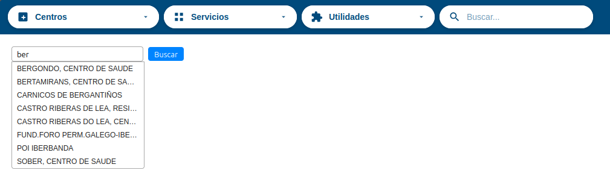
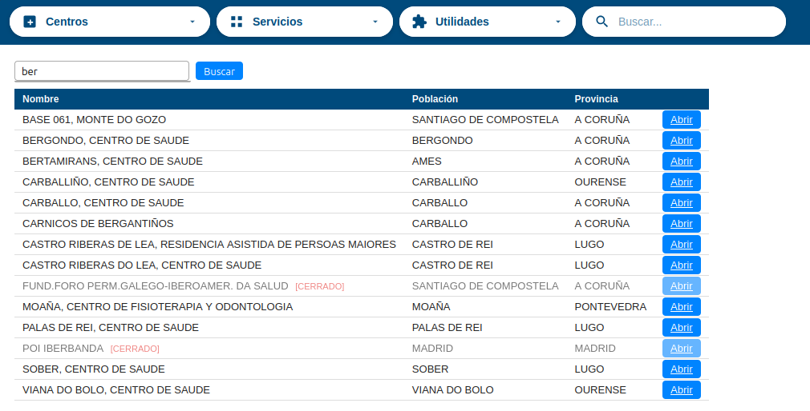
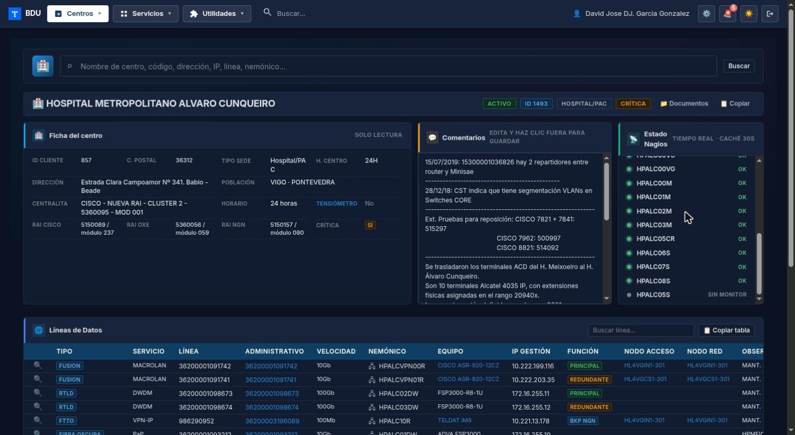
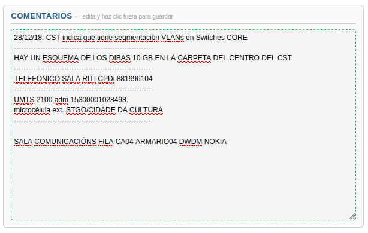
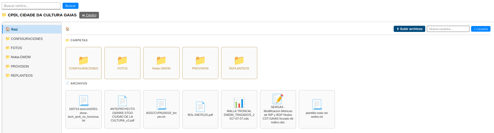
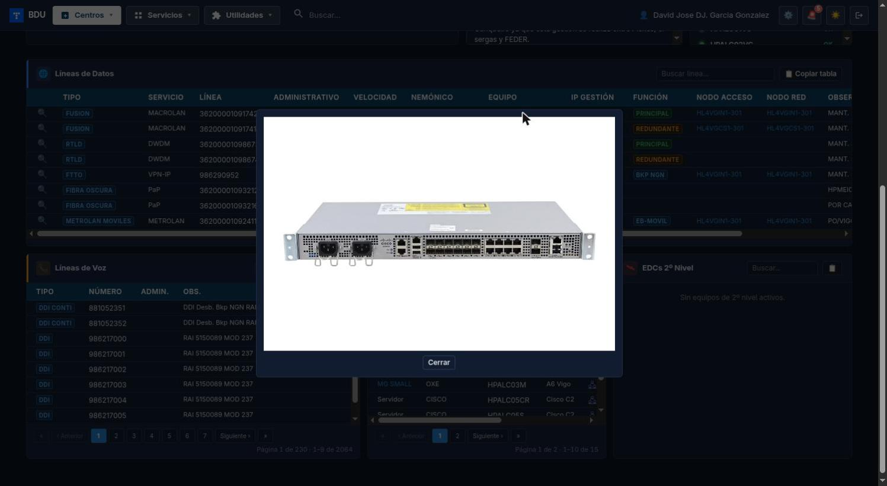

# Manual de Usuario: Módulo Centros

| Campo       | Valor                          |
|-------------|--------------------------------|
| **Módulo**  | Centros                        |
| **Versión** | 1.6                            |
| **Fecha**   | Abril 2026                     |
| **Para**    | Operadores CGE SERGAS          |

---

## Índice

1. [Cómo accedemos al módulo](#1-cómo-accedemos-al-módulo)
2. [Buscar un centro](#2-buscar-un-centro)
3. [Leer la ficha del centro](#3-leer-la-ficha-del-centro)
4. [Copiar datos del centro al portapapeles](#4-copiar-datos-del-centro-al-portapapeles)
5. [Ver el estado Nagios](#5-ver-el-estado-nagios)
6. [Editar comentarios](#6-editar-comentarios)
7. [Ver la documentación del centro](#7-ver-la-documentación-del-centro)
8. [Ver el detalle de una línea de datos](#8-ver-el-detalle-de-una-línea-de-datos)
9. [Ver la imagen de un equipo](#9-ver-la-imagen-de-un-equipo)
10. [Consultar el tensiómetro (DCT)](#10-consultar-el-tensiómetro-dct)

---

## 1. Cómo accedemos al módulo

1. Abrimos la **Web BDU** en el navegador.
2. En el menú lateral pulsamos **Centros**.
3. Se muestra la pantalla del buscador de centros.

---

## 2. Buscar un centro

Podemos buscar un centro de dos formas: por **autocompletado** o por **búsqueda libre**.

### 2.1. Autocompletado (recomendado)

1. Empezamos a escribir el nombre del centro en el campo de búsqueda.
2. Cuando llevemos al menos **2 caracteres**, aparece una lista de sugerencias debajo del campo.
3. Pulsamos sobre el centro que buscamos.
4. Se abre directamente la ficha de ese centro.

### 2.2. Búsqueda libre

1. Escribimos en el campo de búsqueda cualquiera de estos datos:
   - Nombre del centro.
   - Dirección.
   - ID de cliente.
   - Número de línea (datos o voz).
   - Administrativo.
   - Nemónico de equipo.
2. Pulsamos **Enter** o el botón de buscar.
3. Si hay un único resultado, se abre la ficha directamente.
4. Si hay varios resultados, aparece una tabla con las columnas:
   - **Nombre** del centro.
   - **Población**.
   - **Provincia**.
   - Botón **Abrir** para acceder a la ficha.
5. Los centros cerrados aparecen con la etiqueta **[CERRADO]** y en tono apagado.

> **Nota:** la búsqueda muestra un máximo de **50 resultados**. Si no encontramos lo que buscamos, probamos con un término más específico.

---

## 3. Leer la ficha del centro

Una vez abierto un centro, la ficha se divide en varias secciones.

### 3.1. Datos del centro (bloque izquierdo)

Toda la información básica del centro organizada en filas:

- **ID Cliente** — código identificador del cliente.
- **Dirección, C. Postal, Población, Provincia** — ubicación del centro.
- **Coordenadas** — si están disponibles, incluyen un enlace a Google Maps.
- **Cerrado** — indica si el centro está cerrado (casilla de solo lectura).
- **Crítica** — indica si es una sede crítica (casilla de solo lectura).
- **Tensiómetro** — indica si tiene dispositivo de tensión (casilla de solo lectura + enlace).
- **H. Centro** — horario del centro.
- **Horario** — tipo de horario asignado.
- **Centralita** — tipo de centralita (CISCO / OXE).
- **Tipo Sede** — clasificación de la sede.
- **Switch** — fabricante del switch.
- **RAI / Módulo** — identificadores RAI y módulo para CISCO, OXE y NGN.
- **Documentación** — enlace para ver los documentos del centro.

### 3.2. Tablas de líneas y equipos

Debajo de la ficha aparecen las tablas con los elementos activos del centro:

- **Líneas de datos** — tabla principal con todas las líneas de datos activas.
- **Líneas de voz** — tabla con las líneas de voz activas.
- **Equipos de voz** — tabla con los equipos de voz activos.
- **Equipos de 2.º nivel** — tabla con los EDCs de segundo nivel activos.

Cada tabla tiene:

- Un **buscador** para filtrar filas escribiendo cualquier texto.
- **Paginación** con información de página actual y total.
- Un botón **Copiar tabla** para copiar las filas visibles al portapapeles.

En las tablas de **Líneas de datos** y **Equipos de voz** aparece además un icono 🖧 junto al nemónico/IP de los equipos con IP de gestión: lo pulsamos para abrir una **terminal SSH directamente en el navegador** sin tener que usar PuTTY. Ver el manual independiente [`WebSSH2/manual_webssh2.md`](../WebSSH2/manual_webssh2.md) para el detalle.

---

## 4. Copiar datos del centro al portapapeles

1. En la ficha del centro localizamos el botón de copiar (icono junto al nombre del centro).
2. Lo pulsamos.
3. Se copia al portapapeles un texto con el formato:
   *Nombre — Horario — Dirección — CP — Población — Provincia*.
4. El icono cambia brevemente a un check verde para confirmar.
5. Pegamos el texto donde lo necesitemos con **Ctrl+V**.

> **Uso típico:** pegar rápidamente los datos del centro en un correo o incidencia.

### Copiar una tabla completa

1. En cualquiera de las tablas (líneas de datos, líneas de voz, equipos de voz, equipos de 2.º nivel) pulsamos **Copiar tabla**.
2. Se copian al portapapeles todas las filas visibles en formato tabla con bordes.
3. Aparece un aviso confirmando la copia.
4. Pegamos con **Ctrl+V** en un correo o documento manteniendo el formato de tabla.

---

## 5. Ver el estado Nagios

El bloque de **Estado Nagios** aparece en la parte derecha de la ficha. Muestra el estado de monitorización de todos los equipos del centro.

Cada equipo aparece con un indicador de color:

| Color    | Significado                                      |
|----------|--------------------------------------------------|
| Verde    | El equipo está **activo (UP)** en Nagios.        |
| Rojo     | El equipo está **caído (DOWN)** en Nagios.       |
| Gris     | El equipo **no está monitorizado** en Nagios.    |

> **Nota:** los datos de Nagios se actualizan automáticamente cada **30 segundos**. No hace falta recargar la página.

---

## 6. Editar comentarios

1. En la ficha del centro localizamos el bloque **Comentarios** (parte central).
2. Pulsamos dentro del área de texto.
3. Escribimos o modificamos el texto.
4. Al pulsar fuera del campo (o cambiar a otra zona), los comentarios se guardan automáticamente.
5. Durante el guardado vemos indicadores visuales:
   - **Borde azul** — se está guardando.
   - **Borde verde** — guardado correctamente.
   - **Borde rojo** — error al guardar (lo intentamos de nuevo).

> **Importante:** no necesitamos pulsar ningún botón. El guardado es automático al salir del campo.

---

## 7. Ver la documentación del centro

1. En la ficha del centro pulsamos el enlace **Documentación** del bloque de datos.
2. Se abre el gestor de documentos del centro con:
   - Un **panel izquierdo** con el árbol de carpetas (CONFIGURACIONES, FOTOS, MANTENIMIENTO, PROVISION, REPLANTEOS, OTROS).
   - Un **panel derecho** con el contenido de la carpeta seleccionada.

### 7.1. Navegar por las carpetas

1. Pulsamos en una carpeta del panel izquierdo para ver su contenido.
2. Usamos las migas de pan (breadcrumb) en la parte superior para volver a carpetas anteriores.

### 7.2. Ver un archivo

Pulsamos sobre el archivo que queramos ver. Según el tipo:

- **Imágenes** (jpg, png, gif) — se muestran directamente en pantalla.
- **PDF** — se abre un visor de PDF en el navegador.
- **Texto** — se muestra el contenido en formato texto.
- **Otros formatos** — se ofrece un botón de descarga.

### 7.3. Subir un archivo

1. Pulsamos el botón de subir archivo (botón azul).
2. Seleccionamos el archivo de nuestro equipo.
3. El archivo se sube automáticamente a la carpeta actual.

---

## 8. Ver el detalle de una línea de datos

1. En la tabla de **Líneas de datos** localizamos la línea.
2. Pulsamos el botón de la **lupa** (columna *Detalle*) de esa línea.
3. Se abre una ventana emergente con toda la información detallada:
   - **Datos de la línea**: ID, tipo, número, administrativo, servicio, velocidad, función, tipo de acceso, OLT, nodos de acceso y red.
   - **Observaciones de la línea** (si las hay).
   - **Datos del equipo**: ID, modelo, IOS, nemónicos, IPs, número de serie, si es gestionable.
   - **Routing y WAN**: Red WAN, routing WAN y routing LAN.
   - **VLANs**: estado de las 7 VLANs del equipo (Datos, Voz, RFID, MESI, Electro, Retinómetro, Ecógrafo) con indicador de activa/inactiva.
   - **Switch cliente**: si tiene switch de cliente e IP del switch.
   - **Observaciones del equipo** (si las hay).
4. Para cerrar la ventana pulsamos **Cerrar**, hacemos clic fuera o pulsamos **Escape**.

### 8.1. Enlaces útiles en la tabla de líneas

- **Administrativo** — pulsamos para abrir las pruebas de Telefónica (ETXLAN) de esa línea.
- **Nemónico** — pulsamos para abrir una conexión SSH al equipo.
- **Nodo Acceso / Nodo Red** — pulsamos para ver todos los circuitos de ese nodo en el módulo Consultas.

---

## 9. Ver la imagen de un equipo

1. En las tablas de líneas de datos, equipos de voz o equipos de 2.º nivel localizamos la columna **Equipo** o **Modelo**.
2. Si el modelo tiene imagen disponible, aparece como un enlace.
3. Pulsamos sobre el nombre del modelo.
4. Se abre una ventana con la fotografía del equipo a tamaño grande.
5. Para cerrar pulsamos fuera de la imagen o **Escape**.

---

## 10. Consultar el tensiómetro (DCT)

Si el centro tiene un dispositivo de control de tensión (tensiómetro), podemos consultar sus datos:

1. En la ficha del centro buscamos el campo **Tensiómetro** del bloque de datos.
2. Si la casilla está marcada, pulsamos sobre el enlace **Tensiómetro**.
3. Se abre una ventana emergente con los datos del dispositivo:
   - **ICC** — número de ICC del dispositivo.
   - **Número Largo** — número de teléfono largo.
   - **Extensión** — extensión corta.
4. Para cerrar pulsamos **Cerrar**, hacemos clic fuera o pulsamos **Escape**.

---

## Resumen de atajos y consejos

| Acción                          | Cómo lo hacemos                                          |
|---------------------------------|----------------------------------------------------------|
| Buscar un centro                | Escribir en el buscador (mínimo 2 caracteres).           |
| Copiar datos del centro         | Botón de copiar junto al nombre.                         |
| Copiar tabla completa           | Botón **Copiar tabla** debajo de cada tabla.             |
| Guardar comentarios             | Se guarda automáticamente al salir del campo.            |
| Abrir detalle de línea          | Botón lupa en la tabla de líneas de datos.               |
| Ver imagen de equipo            | Clic en el nombre del modelo (si es enlace).             |
| Ver tensiómetro                 | Clic en enlace **Tensiómetro** de la ficha.              |
| Cerrar ventanas emergentes      | Botón **Cerrar**, clic fuera o tecla **Escape**.         |
| Abrir conexión SSH a equipo     | Clic en el nemónico del equipo.                          |
| Ver circuitos de un nodo        | Clic en el nombre del nodo de acceso o red.              |

---

*Manual para operadores CGE SERGAS. Versión 1.6 — Abril 2026.*
