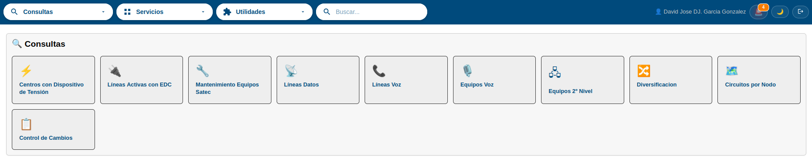
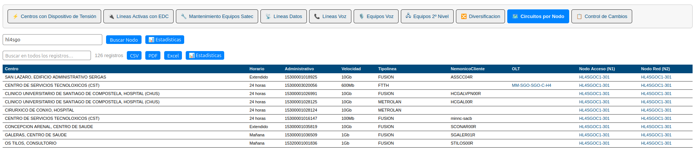
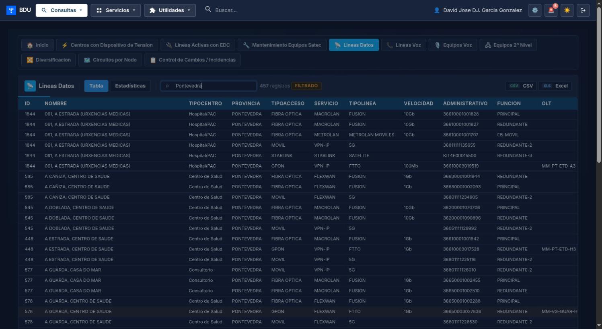
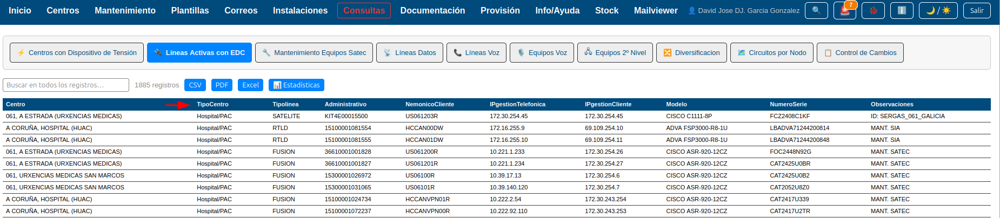
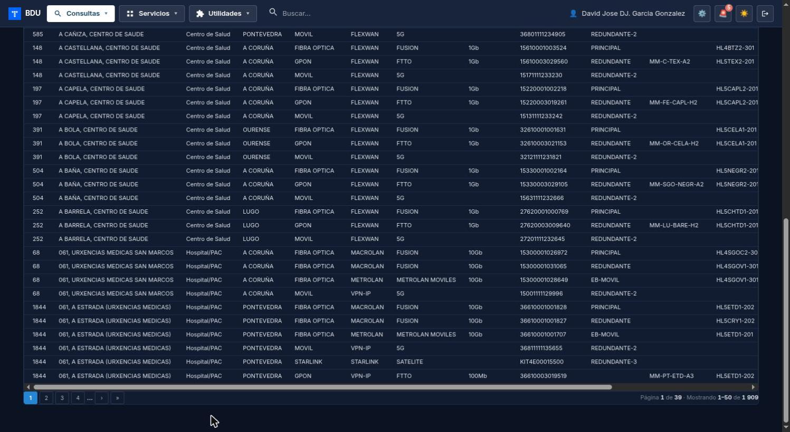
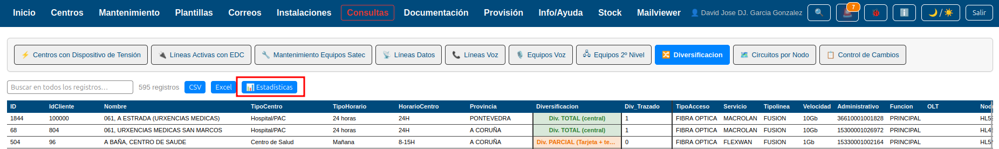
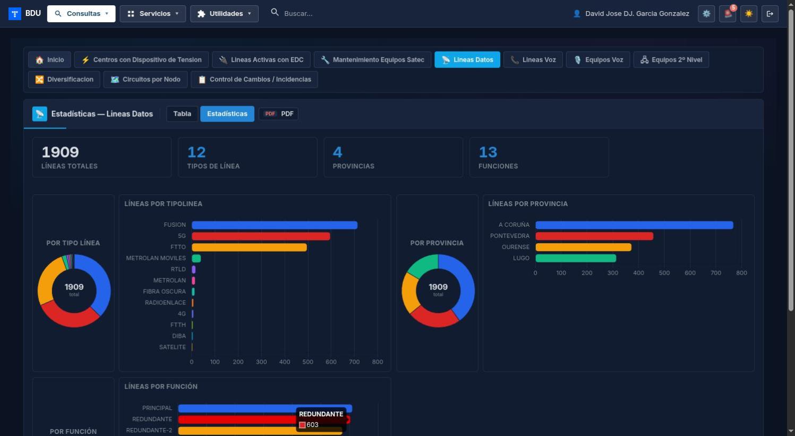
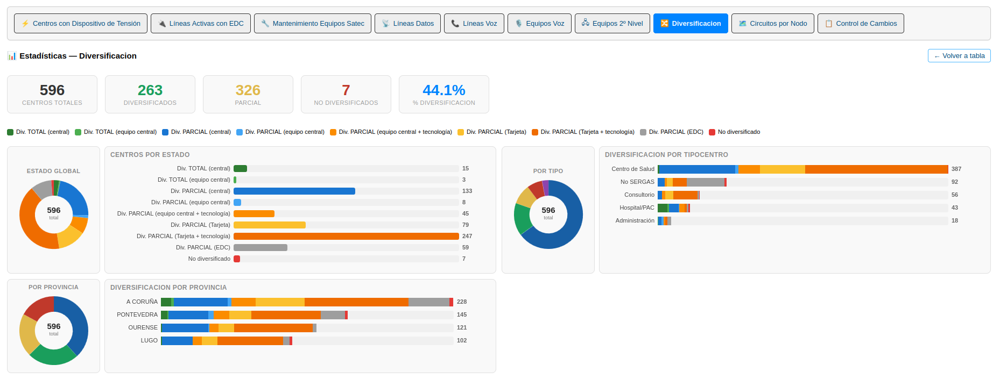
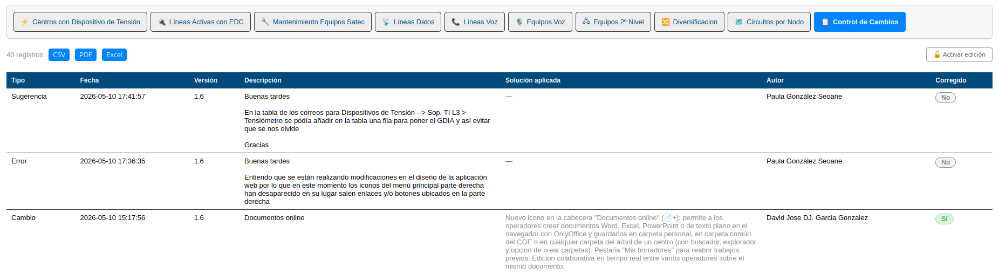
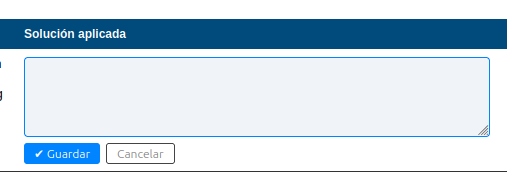

# Manual de Usuario: Módulo Consultas

| Campo       | Valor                          |
|-------------|--------------------------------|
| **Módulo**  | Consultas                      |
| **Versión** | 1.6                            |
| **Fecha**   | Abril 2026                     |
| **Para**    | Operadores CGE SERGAS          |

---

## Índice

1. [Cómo accedemos al módulo](#1-cómo-accedemos-al-módulo)
2. [Seleccionar una consulta](#2-seleccionar-una-consulta)
3. [Usar el buscador](#3-usar-el-buscador)
4. [Ordenar columnas](#4-ordenar-columnas)
5. [Navegar por las páginas](#5-navegar-por-las-páginas)
6. [Exportar datos (CSV, PDF, Excel)](#6-exportar-datos-csv-pdf-excel)
7. [Ver estadísticas de una consulta](#7-ver-estadísticas-de-una-consulta)
8. [Control de Cambios](#8-control-de-cambios)

---

## 1. Cómo accedemos al módulo

1. Abrimos la **Web BDU** en el navegador.
2. En el menú lateral pulsamos **Consultas**.
3. Aparece la pantalla principal con tarjetas grandes, una por cada consulta disponible.

---

## 2. Seleccionar una consulta

1. En la pantalla principal pulsamos sobre la tarjeta de la consulta que necesitemos.
2. Las consultas disponibles son:

| Consulta                             | Qué muestra                                                    |
|--------------------------------------|----------------------------------------------------------------|
| Centros con Dispositivo de Tensión   | Centros que tienen tensiómetro (DCT).                          |
| Líneas Activas con EDC               | Líneas de datos activas con su equipo.                         |
| Mantenimiento Equipos Satec          | Equipos Teldat, Cisco y Fortigate para mantenimiento.          |
| Líneas Datos                         | Todas las líneas de datos activas de centros abiertos.         |
| Líneas Voz                           | Todas las líneas de voz activas.                               |
| Equipos Voz                          | Todos los equipos de voz activos.                              |
| Equipos 2.º Nivel                    | Todos los EDCs de segundo nivel activos.                       |
| Diversificación                      | Estado de diversificación de cada centro.                      |
| Circuitos por Nodo                   | Líneas que pasan por un nodo concreto.                         |
| Control de Cambios                   | Registro de cambios e incidencias.                             |

3. Una vez seleccionada, la tabla de resultados se muestra con todos los datos.
4. En la parte superior aparece una barra de pestañas para cambiar rápidamente entre consultas sin volver al menú.

### 2.1. Caso especial: Circuitos por Nodo

Esta consulta requiere un paso adicional:

1. Al seleccionarla aparece un campo de búsqueda.
2. Escribimos el nombre del nodo (mínimo 3 caracteres).
3. Pulsamos **Enter** o **Buscar**.
4. Se muestran todas las líneas que pasan por ese nodo.
5. Los nombres de nodo en los resultados son enlaces: pulsamos sobre ellos para ver los circuitos de otro nodo.

---

## 3. Usar el buscador

1. En la barra de herramientas de cualquier consulta localizamos el campo de **búsqueda** (a la izquierda).
2. Escribimos el texto que queramos buscar (mínimo **3 caracteres**).
3. La tabla se filtra automáticamente, mostrando solo las filas que contengan ese texto en cualquier columna.
4. El campo se resalta en azul cuando hay un filtro activo.
5. Para limpiar la búsqueda pulsamos la **X** junto al campo.

> **Nota:** la búsqueda se realiza en todas las columnas a la vez. Por ejemplo, si escribimos "Pontevedra", encuentra tanto centros en esa provincia como cualquier otro campo que contenga ese texto.

---

## 4. Ordenar columnas

1. Pulsamos en la cabecera de cualquier columna de la tabla.
2. Los datos se ordenan de forma ascendente (A-Z o menor a mayor).
3. Pulsamos de nuevo en la misma cabecera para invertir el orden (Z-A o mayor a menor).
4. La ordenación funciona tanto con texto como con números.

---

## 5. Navegar por las páginas

Las consultas muestran **50 registros por página**. Si hay más datos, aparece un paginador en la parte inferior de la tabla.

1. Usamos los botones numerados para ir a una página concreta.
2. Usamos las flechas **<** y **>** para avanzar o retroceder una página.
3. Usamos los botones de principio y fin para ir a la primera o última página.
4. Debajo del paginador vemos la información: *"Página X de Y — mostrando N-M de Total"*.

> **Nota:** si tenemos una búsqueda activa, la paginación se aplica sobre los resultados filtrados.

---

## 6. Exportar datos (CSV, PDF, Excel)

Podemos exportar los datos de cualquier consulta en tres formatos:

1. En la barra de herramientas localizamos los botones **CSV**, **PDF** y **Excel** (a la derecha).
2. Pulsamos el formato que prefiramos:

| Formato   | Uso recomendado                                                    |
|-----------|--------------------------------------------------------------------|
| **CSV**   | Para abrir en cualquier programa de hojas de cálculo.              |
| **PDF**   | Para imprimir o enviar como documento con formato fijo.            |
| **Excel** | Para trabajar con los datos en Excel (formato nativo, con estilos).|

3. El archivo se descarga automáticamente.

> **Nota:** si tenemos una búsqueda activa, se exportan solo los datos filtrados, no todos los registros.

### 6.1. Particularidad de la consulta Diversificación

En la exportación a Excel de esta consulta cada centro aparece en una sola fila, con la columna **Diversificación** coloreada según su estado:

| Estado                                       | Color de fondo  |
|----------------------------------------------|-----------------|
| Div. TOTAL (central)                         | Verde oscuro    |
| Div. TOTAL (equipo central)                  | Verde claro     |
| Div. PARCIAL (central)                       | Azul oscuro     |
| Div. PARCIAL (equipo central)                | Azul claro      |
| Div. PARCIAL (equipo central + tecnología)   | Naranja         |
| Div. PARCIAL (Tarjeta)                       | Amarillo        |
| Div. PARCIAL (Tarjeta + tecnología)          | Naranja oscuro  |
| Div. PARCIAL (EDC)                           | Gris            |
| No diversificado                             | Rojo            |

---

## 7. Ver estadísticas de una consulta

Casi todas las consultas (todas salvo **Control de Cambios**) tienen una vista de estadísticas con KPIs y gráficas resumen.

1. Abrimos la consulta que nos interese.
2. En la barra de herramientas, a la derecha de los botones de exportación, pulsamos **📊 Estadísticas**.
3. Se carga una página con:
   - **KPIs** en la cabecera (totales, distintos, etc., según la consulta).
   - **Donut + barras** por categoría: por tipo, por provincia, por modelo, por nodo, etc.
4. Para volver a la tabla pulsamos **← Volver a tabla** (arriba a la derecha).

> **Nota:** el botón solo aparece si la consulta tiene estadísticas disponibles. En **Control de Cambios** no aparece.

### 7.1. Particularidad de Diversificación

Las estadísticas de Diversificación incluyen además:

- **5 KPIs:** Centros totales, Diversificados, PARCIAL (Tarjeta), No diversificados, % Diversificación.
- **Leyenda con los 9 estados** y sus colores (los mismos que se usan en la tabla y en el Excel).
- **Barras apiladas** por TipoCentro y por Provincia, donde cada segmento representa un estado de diversificación.

---

## 8. Control de Cambios

La consulta **Control de Cambios** tiene funcionalidades adicionales de edición. La usamos para registrar cambios e incidencias y hacer seguimiento de su solución.

### 8.1. Ver el registro de cambios (modo lectura)

1. Seleccionamos **Control de Cambios** en el menú de consultas.
2. Vemos una tabla con las columnas:
   - **Tipo** — tipo de cambio o incidencia.
   - **Fecha** — cuándo se registró.
   - **Versión** — versión afectada.
   - **Descripción** — detalle del cambio.
   - **Solución** — solución aplicada (puede estar vacía si aún no se ha resuelto).
   - **Autor** — quién lo registró.
   - **Corregido** — indicador *Sí* (verde) o *No* (rojo).

### 8.2. Activar el modo editor

Para poder editar la solución o marcar como corregido, necesitamos activar el modo editor:

1. Pulsamos el botón **Activar edición** (en la barra de herramientas).
2. Aparece una ventana pidiendo la contraseña de edición.
3. Introducimos la contraseña y pulsamos **Entrar** (o pulsamos Enter).
4. Si la contraseña es correcta, la página recarga con el modo editor activo.

> **Importante:** si introducimos la contraseña incorrecta 3 veces, el acceso queda bloqueado durante unos minutos.

### 8.3. Editar la solución de un registro

1. Con el modo editor activo pulsamos en la celda **Solución** del registro que queramos editar.
   - Si está vacía, muestra *"Clic para añadir…"* con un icono de lápiz.
2. Se abre un área de texto donde escribimos la solución.
3. Pulsamos **Guardar** para guardar los cambios.
4. Pulsamos **Cancelar** si no queremos guardar.

### 8.4. Marcar un registro como corregido

1. Con el modo editor activo pulsamos sobre la etiqueta **No** (roja) de la columna **Corregido**.
2. La etiqueta cambia automáticamente a **Sí** (verde).
3. Si queremos desmarcar, pulsamos de nuevo en **Sí** y vuelve a **No**.
4. El cambio se guarda automáticamente al pulsar.

### 8.5. Desactivar el modo editor

1. Pulsamos **Desactivar edición** en la barra de herramientas.
2. La página recarga en modo lectura.

---

## Resumen rápido

| Acción                          | Cómo lo hacemos                                       |
|---------------------------------|-------------------------------------------------------|
| Abrir una consulta              | Pulsar la tarjeta o la pestaña.                       |
| Buscar en la tabla              | Escribir en el buscador (mínimo 3 caracteres).        |
| Limpiar búsqueda                | Pulsar la X del buscador.                             |
| Ordenar por columna             | Pulsar la cabecera de la columna.                     |
| Cambiar de página               | Botones del paginador.                                |
| Exportar datos                  | Botones CSV, PDF o Excel.                             |
| Ver estadísticas                | Botón **📊 Estadísticas** en la barra de herramientas.|
| Editar solución                 | Activar editor + pulsar celda Solución.               |
| Marcar como corregido           | Activar editor + pulsar etiqueta No/Sí.               |

---

*Manual para operadores CGE SERGAS. Versión 1.6 — Abril 2026.*
