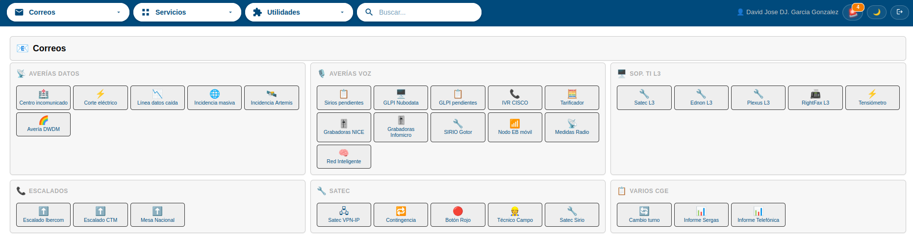
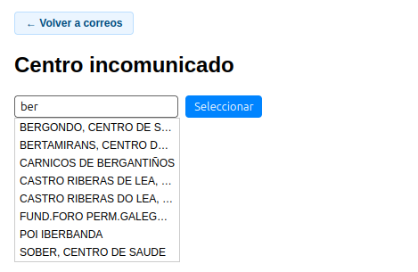
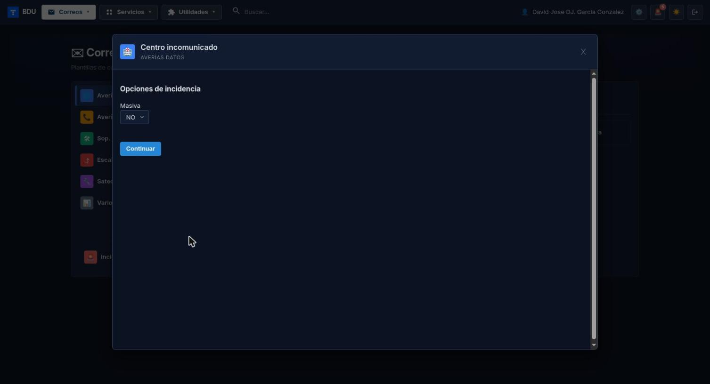
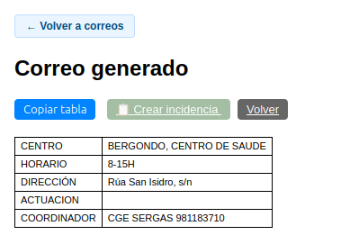
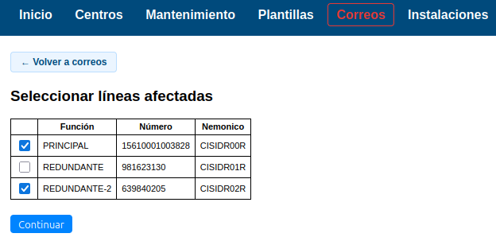
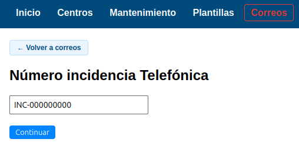
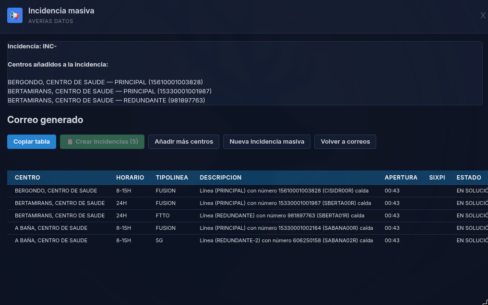
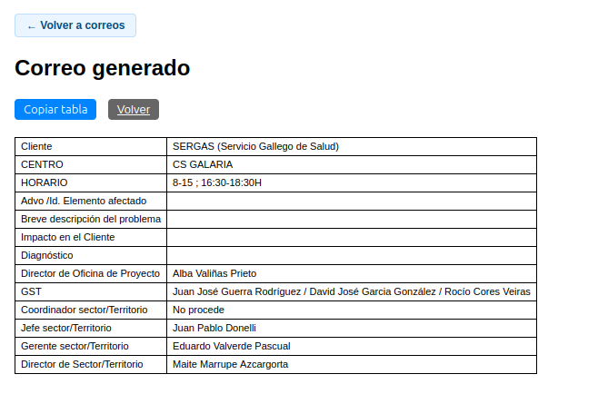
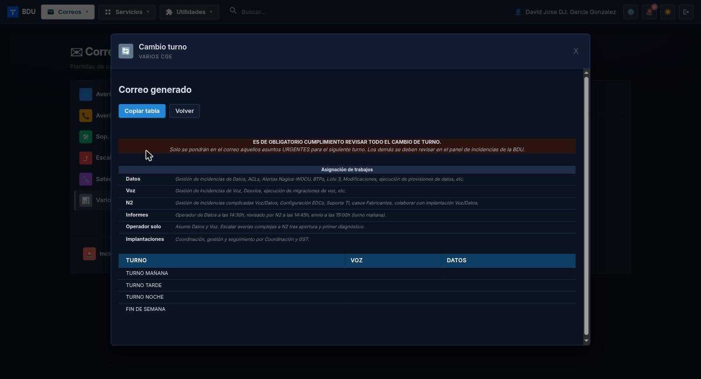
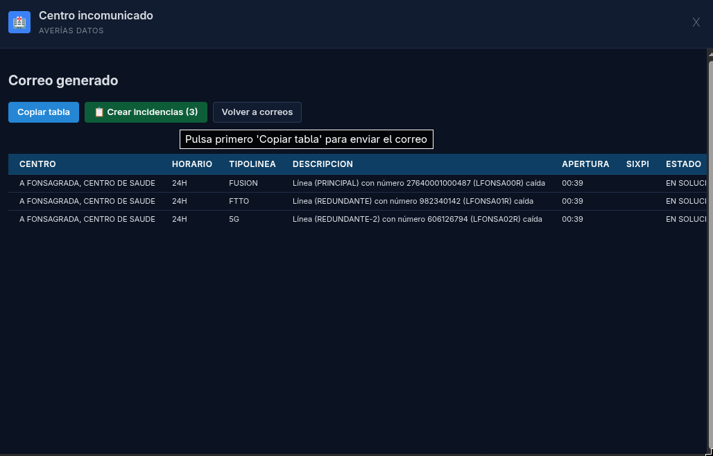

# Manual de Usuario: Módulo Correos

| Campo       | Valor                          |
|-------------|--------------------------------|
| **Módulo**  | Correos                        |
| **Versión** | 2.1                            |
| **Fecha**   | Junio 2026                     |
| **Para**    | Operadores CGE SERGAS          |

---

## Índice

1. [Cómo accedemos al módulo](#1-cómo-accedemos-al-módulo)
2. [Menú de categorías](#2-menú-de-categorías)
3. [Generar un correo con datos de centro](#3-generar-un-correo-con-datos-de-centro)
4. [Generar un correo con selección de líneas](#4-generar-un-correo-con-selección-de-líneas)
5. [Incidencia masiva](#5-incidencia-masiva)
6. [Correos de escalado](#6-correos-de-escalado)
7. [Correos simples (sin centro)](#7-correos-simples-sin-centro)
8. [Cambio de turno y otros correos internos](#8-cambio-de-turno-y-otros-correos-internos)
9. [Crear incidencia desde un correo](#9-crear-incidencia-desde-un-correo)
10. [Tipos de plantillas disponibles](#10-tipos-de-plantillas-disponibles)

---

## 1. Cómo accedemos al módulo

1. Abrimos la **Web BDU** en el navegador.
2. En el menú lateral pulsamos **Correos**.
3. Aparece el menú principal con todas las plantillas de correo organizadas por categorías.

> Para volver al menú principal desde cualquier correo, pulsamos el enlace **"Volver a correos"** que aparece en la parte superior.

---

## 2. Menú de categorías

El menú principal está organizado en **6 categorías**:

| Categoría          | Contenido                                                            |
|--------------------|----------------------------------------------------------------------|
| **Averías Datos**  | Centro incomunicado, Corte eléctrico, Línea caída, Masiva, Artemis, DWDM. |
| **Averías Voz**    | Sirios, GLPI, IVR CISCO, Tarificador, NICE, Infomicro, SIRIO Gotor, Nodo EB, Radio, RI. |
| **Sop. TI L3**     | Satec L3, Ednon L3, Plexus L3, RightFax L3, Tensiómetro.             |
| **Escalados**      | Escalado Ibercom, Escalado CTM, Mesa Nacional.                        |
| **Satec**          | VPN-IP, Contingencia, Botón Rojo, Técnico Campo, Satec Sirio.         |
| **Varios CGE**     | Cambio turno, Informe Sergas, Informe Telefónica.                     |

Cada tarjeta tiene un icono y un nombre descriptivo. Pulsamos sobre la que necesitemos para empezar a generar el correo.

---

## 3. Generar un correo con datos de centro

Es el flujo más habitual. Lo usamos para correos como *"Centro incomunicado"*, *"Línea datos caída"*, escalados, etc.

### 3.1. Buscar el centro

1. Pulsamos sobre la plantilla de correo que necesitemos.
2. Aparece un campo de búsqueda de centros.
3. Empezamos a escribir el nombre del centro (mínimo 2 caracteres).
4. Seleccionamos el centro de la lista de sugerencias.
5. Pulsamos **Buscar** o Enter.

### 3.2. Rellenar los campos del correo

1. Se muestra un formulario con los campos específicos de esa plantilla.
2. Rellenamos los campos necesarios (urgencia, descripción, ticket, etc.).
3. Algunos campos son desplegables (seleccionamos una opción).
4. Otros son campos de texto libre.
5. Pulsamos **Generar correo** (o el botón de enviar).

### 3.3. Copiar la tabla y abrir el correo

1. Se genera la tabla con los datos del centro y los campos que hemos rellenado.
2. Pulsamos **Copiar tabla** para copiarla al portapapeles con formato.
3. Automáticamente se abre el cliente de correo (Outlook, Thunderbird, etc.) con:
   - **Destinatario** (Para) ya relleno.
   - **CC** ya relleno (si aplica).
   - **Asunto** ya relleno con los datos del centro.
   - **Cuerpo** con el texto base del correo.
4. Pegamos la tabla en el cuerpo del correo con **Ctrl+V**.
5. Revisamos el correo y lo enviamos.

> **Importante:** la tabla se copia con formato HTML (bordes, colores de cabecera). Al pegar en el correo se ve como una tabla con formato.

---

## 4. Generar un correo con selección de líneas

Algunas plantillas (como *"Línea datos caída"*) permiten seleccionar líneas específicas del centro.

### 4.1. Buscar el centro

Seguimos los mismos pasos que en la sección anterior.

### 4.2. Seleccionar las líneas afectadas

1. Aparece una tabla con todas las líneas activas del centro.
2. Cada línea muestra: Función, Número, Nemónico.
3. Marcamos las casillas de las líneas afectadas.
4. Pulsamos **Continuar** (o el botón de siguiente paso).

### 4.3. Opciones adicionales

1. Según la plantilla, puede aparecer una pregunta adicional (por ejemplo: *"¿Es incidencia masiva? SI / NO"*).
2. Seleccionamos la opción que corresponda.
3. Se genera la tabla con una fila por cada línea seleccionada.

### 4.4. Copiar y enviar

1. Pulsamos **Copiar tabla** para copiarla al portapapeles.
2. Se abre el cliente de correo automáticamente.
3. Pegamos la tabla con **Ctrl+V** y enviamos.

La tabla generada incluye columnas como: Centro, Horario, Tipo Línea, Descripción, Apertura, Estado, etc.

---

## 5. Incidencia masiva

La plantilla de **Incidencia masiva** permite acumular líneas de varios centros en un único correo.

### 5.1. Introducir el número de incidencia

1. Al seleccionar *"Incidencia masiva"*, lo primero que pide es el **número de incidencia de Telefónica**.
2. Lo escribimos y pulsamos **Continuar**.

### 5.2. Añadir centros y líneas

1. Buscamos el primer centro afectado.
2. Seleccionamos las líneas afectadas de ese centro.
3. Las líneas se añaden a un **panel acumulativo** que muestra todos los centros agregados.
4. Pulsamos **Añadir más centros** para repetir el proceso con otro centro.

### 5.3. Generar el correo

1. Cuando hayamos añadido todos los centros afectados, generamos el correo.
2. La tabla incluye todas las líneas de todos los centros seleccionados.
3. Copiamos la tabla y la enviamos por correo como en los pasos habituales.

### 5.4. Empezar de nuevo

Pulsamos **Nueva incidencia masiva** para limpiar todo y empezar una nueva incidencia masiva desde cero.

---

## 6. Correos de escalado

Los escalados (Ibercom, CTM Zaragoza, Mesa Nacional) incluyen datos corporativos fijos del SERGAS.

### Flujo

1. Seleccionamos la plantilla de escalado.
2. Buscamos y seleccionamos el centro afectado.
3. Rellenamos los campos obligatorios:
   - Administrativo / ID del elemento afectado.
   - Breve descripción del problema.
   - Impacto en el cliente.
   - Diagnóstico.
4. La tabla se genera con datos fijos corporativos (Director de Oficina, GST, Jefe de Sector, etc.) junto con los datos del centro y los campos que hemos rellenado.
5. Copiamos la tabla y enviamos el correo.

---

## 7. Correos simples (sin centro)

Algunas plantillas tienen un centro fijo predefinido o no requieren seleccionar centro. En estos casos:

1. Pulsamos sobre la plantilla.
2. Rellenamos los campos solicitados.
3. Se genera el correo directamente.
4. Copiamos y enviamos.

Ejemplos: plantillas Grabadoras, IVR, Tarificador, etc.

---

## 8. Cambio de turno y otros correos internos

Las plantillas de la categoría **Varios CGE** funcionan de manera especial.

### 8.1. Cambio de turno

1. Pulsamos **Cambio turno** en la categoría *Varios CGE*.
2. Se muestra la plantilla del correo de cambio de turno con formato de tablas.
3. Rellenamos la información correspondiente.
4. Copiamos la tabla con **Copiar tabla** y la pegamos en el correo.

### 8.2. Informe Sergas / Informe Telefónica

1. Pulsamos sobre la plantilla correspondiente.
2. Se muestra el tipo de informe.
3. Generamos el correo y añadimos los adjuntos (existe un enlace a estos correos desde el módulo de Informes).

> Estas plantillas se cargan directamente sin pasar por el buscador de centros.

---

## 9. Crear incidencia desde un correo

Muchas plantillas de correo permiten crear automáticamente una incidencia en la base de datos después de generar el correo.

### Cómo funciona

1. Generamos el correo normalmente (buscar centro, rellenar campos, etc.).
2. Después de copiar la tabla (o abrir el correo), se activa el botón **Crear incidencia**.
   - El botón aparece deshabilitado (gris) hasta que copiemos la tabla o abramos el correo.
3. Pulsamos **Crear incidencia**.
4. Se crea automáticamente una incidencia en el sistema con los datos del correo: centro, tipo de incidencia, subtipo, urgencia, ticket, estado, etc.
5. Nos redirige al módulo de Mantenimiento (sección Incidencias) para ver la incidencia creada.

> **Nota:** el sistema verifica automáticamente si ya existe una incidencia activa para el mismo equipo, evitando duplicados.

> **Importante:** el botón solo se activa después de copiar la tabla o abrir el correo, para asegurar que se ha enviado la comunicación antes de registrar la incidencia.

### Ir y volver entre Correos e Incidencias

Los módulos **Correos** e **Incidencias** están enlazados para movernos rápido entre ellos:

- **Desde Incidencias a Correos:** en la barra superior del módulo Incidencias tenemos el botón **✉ Correos**, que nos trae directamente a este módulo para preparar la comunicación de la avería.
- **Desde Correos a Incidencias:** cuando creamos una incidencia desde un correo (lo visto arriba), al terminar nos lleva automáticamente al módulo Incidencias, con la incidencia ya registrada.

Así, ante una avería podemos enviar el aviso y dejar la incidencia abierta sin salir del flujo.

---

## 10. Tipos de plantillas disponibles

### 10.1. Averías Datos (6 plantillas)

| Plantilla                | Requiere                              | Selección líneas | Incidencia automática |
|--------------------------|---------------------------------------|------------------|-----------------------|
| Centro incomunicado      | Buscar centro                         | Sí               | Sí                    |
| Corte eléctrico          | Buscar centro                         | Sí               | Sí                    |
| Línea datos caída        | Buscar centro                         | Sí               | Sí                    |
| Incidencia masiva        | Nº incidencia + múltiples centros     | Sí               | Sí                    |
| Incidencia Artemis       | Nº incidencia                         | No               | Sí                    |
| Avería DWDM              | Buscar centro                         | No               | No                    |

### 10.2. Averías Voz (11 plantillas)

| Plantilla                | Requiere         |
|--------------------------|------------------|
| Sirios pendientes        | Carga directa.   |
| GLPI Nubodata            | Buscar centro.   |
| GLPI pendientes          | Carga directa.   |
| IVR CISCO                | Carga directa.   |
| Tarificador              | Carga directa.   |
| Grabadoras NICE          | Carga directa.   |
| Grabadoras Infomicro     | Carga directa.   |
| SIRIO Gotor              | Buscar centro.   |
| Nodo EB móvil            | Buscar centro.   |
| Medidas Radio            | Buscar centro.   |
| Red Inteligente          | Buscar centro.   |

### 10.3. Soporte TI L3, Escalados, Satec y Varios CGE

Cada una tiene sus plantillas específicas. El flujo es siempre el mismo:

1. Seleccionamos la plantilla.
2. Buscamos centro (si aplica).
3. Rellenamos campos.
4. Copiamos tabla y abrimos el correo.

---

## Resumen rápido

| Acción                          | Cómo lo hacemos                                              |
|---------------------------------|--------------------------------------------------------------|
| Volver al menú                  | Enlace **"Volver a correos"** en la parte superior.          |
| Buscar centro                   | Escribir nombre (mínimo 2 caracteres) + seleccionar.         |
| Rellenar campos                 | Completar el formulario y pulsar el botón de generar.        |
| Copiar tabla                    | Botón **Copiar tabla** (se copia con formato para correo).   |
| Abrir correo                    | Se abre automáticamente al copiar, o botón **Abrir correo**. |
| Crear incidencia                | Botón **Crear incidencia** (se activa tras copiar tabla).    |
| Incidencia masiva               | Agregar centros uno a uno al panel acumulativo.              |
| Nueva incidencia masiva         | Botón **Nueva incidencia masiva** para empezar de cero.      |

---

*Manual para operadores CGE SERGAS. Versión 2.1 — Junio 2026.*
