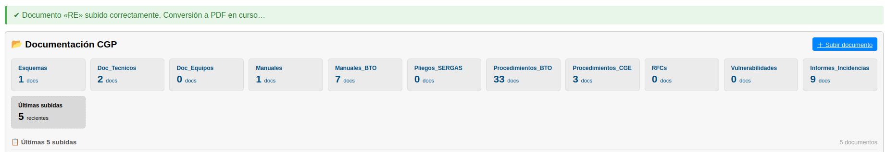

# Manual de Usuario -- Modulo Documentacion

| Campo       | Valor                          |
|-------------|--------------------------------|
| **Modulo**  | Documentacion                  |
| **Version** | 1.5                            |
| **Fecha**   | Abril 2026                     |
| **Para**    | Operadores CGE SERGAS          |

---

## Indice

1. [Acceder al modulo Documentacion](#1-acceder-al-modulo-documentacion)
2. [Navegar por las carpetas](#2-navegar-por-las-carpetas)
3. [Buscar documentos](#3-buscar-documentos)
4. [Subir un documento](#4-subir-un-documento)
5. [Esperar la conversion a PDF](#5-esperar-la-conversion-a-pdf)
6. [Ver un documento PDF](#6-ver-un-documento-pdf)
7. [Descargar un documento](#7-descargar-un-documento)
8. [Eliminar un documento](#8-eliminar-un-documento)

---

## 1. Acceder al modulo Documentacion

1. Abre la aplicacion Web BDU en tu navegador.
2. En el menu lateral, haz clic en **Documentacion**.
3. Aparecera la pantalla principal con las carpetas de documentos y las ultimas subidas.

---

## 2. Navegar por las carpetas

Los documentos estan organizados en carpetas (tipos). Cada carpeta aparece como una tarjeta con su nombre y el numero de documentos que contiene.

1. Haz clic en la tarjeta de la carpeta que quieras explorar.
2. Se mostrara la tabla con los documentos de esa carpeta.
3. La tarjeta seleccionada aparecera resaltada.
4. Para ver los documentos mas recientes de todas las carpetas, haz clic en la tarjeta **"Ultimas subidas"**.

### Filtrar por fecha

Cuando tienes una carpeta seleccionada, puedes filtrar por rango de fechas:

1. Rellena los campos **Desde** y/o **Hasta** con las fechas deseadas.
2. Haz clic en **Filtrar**.
3. Para quitar los filtros, haz clic en **Limpiar**.

---

## 3. Buscar documentos

1. Con una carpeta seleccionada, escribe en el campo de **busqueda** el titulo o nombre del archivo.
2. Haz clic en **Filtrar**.
3. Se mostraran solo los documentos que coincidan con el texto buscado.
4. Para quitar la busqueda, haz clic en **Limpiar**.

---

## 4. Subir un documento

1. Haz clic en el boton **Subir documento** (en la parte superior derecha).
2. Se abrira el formulario de subida con los siguientes campos:

| Campo            | Descripcion                                           | Obligatorio |
|------------------|-------------------------------------------------------|-------------|
| **Titulo**       | Nombre descriptivo del documento                      | Si          |
| **Tipo**         | Carpeta donde se guardara (seleccionar de la lista)   | Si          |
| **Descripcion**  | Descripcion adicional (opcional)                      | No          |
| **Archivo**      | El archivo a subir                                    | Si          |

3. Haz clic en **Seleccionar archivo** y elige el documento de tu equipo.
4. Haz clic en **Subir documento**.

### Formatos y tamano permitidos

| Formatos aceptados                           | Tamano maximo |
|----------------------------------------------|---------------|
| PDF, Word (docx, doc), Excel (xlsx, xls), PowerPoint (pptx, ppt) | 50 MB         |

> **Nota:** Si el formato no esta en la lista o el archivo supera los 50 MB, aparecera un mensaje de error y deberas seleccionar otro archivo.

---

## 5. Esperar la conversion a PDF

Despues de subir un documento, el sistema lo convierte automaticamente a PDF para poder verlo en el navegador. Este proceso puede tardar unos segundos.

### Que veras en la tabla

| Estado              | Significado                                               | Icono         |
|---------------------|-----------------------------------------------------------|---------------|
| **Listo**           | El documento esta disponible para ver                     | Punto verde   |
| **Convirtiendo...** | Se esta generando el PDF (espera unos segundos)           | Rueda girando |
| **Error**           | Hubo un problema en la conversion                         | X roja        |

- Si el archivo ya es un PDF, el estado sera **Listo** inmediatamente.
- Si es un Word, Excel o PowerPoint, el estado sera **Convirtiendo...** durante unos segundos.
- **No necesitas recargar la pagina.** La pantalla se actualizara automaticamente cuando termine la conversion.

> Si el estado queda en "Error", puedes intentar subir el archivo de nuevo. Si el problema persiste, comprueba que el archivo no esta danado.

---

## 6. Ver un documento PDF

1. En la tabla de documentos, busca el documento que quieras ver.
2. Comprueba que su estado sea **Listo** (punto verde).
3. Haz clic en el boton **Ver** (icono de ojo).
4. Se abrira una ventana emergente con el visor de PDF integrado en el navegador.
5. Dentro del visor puedes:
   - Navegar por las paginas del documento
   - Hacer zoom
   - Usar las herramientas del visor PDF del navegador
6. Para cerrar el visor, haz clic en el boton **Cerrar** o pulsa la tecla **Escape**.

> **Nota:** El boton "Ver" solo esta disponible cuando el documento esta en estado "Listo". Si esta "Convirtiendo...", espera a que termine.

---

## 7. Descargar un documento

1. En la tabla de documentos, busca el documento que quieras descargar.
2. Haz clic en el boton **Descargar** (icono de descarga).
3. Aparecera un mensaje de confirmacion preguntando si deseas descargar el archivo.
4. Haz clic en **Aceptar**.
5. El archivo original (en su formato original: docx, xlsx, pdf, etc.) se descargara a tu equipo.

> **Nota:** La descarga siempre es del archivo **original** (no del PDF convertido). Si subiste un Word, descargaras el Word original.

---

## 8. Eliminar un documento

1. En la tabla de documentos, busca el documento que quieras eliminar.
2. Haz clic en el boton **Eliminar** (icono de papelera).
3. Aparecera una ventana de confirmacion mostrando el titulo del documento.
4. Lee la advertencia: **esta accion es irreversible** (se eliminan tanto el archivo original como el PDF).
5. Haz clic en **Eliminar** para confirmar, o en **Cancelar** para volver atras.

> **Importante:** Una vez eliminado, el documento no se puede recuperar. Asegurate de que ya no se necesita antes de eliminarlo.

---

## Resumen rapido

| Accion                    | Como hacerlo                                           |
|---------------------------|--------------------------------------------------------|
| Ver documentos de una carpeta | Clic en la tarjeta de la carpeta                   |
| Ver ultimas subidas       | Clic en la tarjeta "Ultimas subidas"                   |
| Buscar documento          | Escribir en el buscador + Filtrar                      |
| Filtrar por fecha         | Rellenar Desde/Hasta + Filtrar                         |
| Subir documento           | Boton "Subir documento" + rellenar formulario          |
| Ver PDF                   | Boton "Ver" (solo si estado es Listo)                  |
| Descargar original        | Boton "Descargar" + Aceptar                            |
| Eliminar documento        | Boton "Eliminar" + Confirmar                           |
| Cerrar visor PDF          | Boton Cerrar o tecla Escape                            |

---

*Fin del manual -- Modulo Documentacion v1.5*
