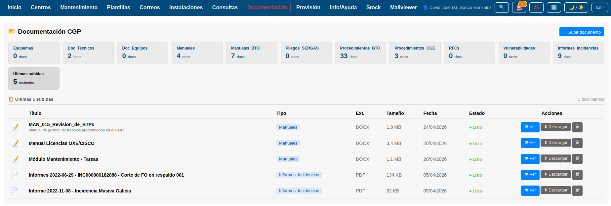
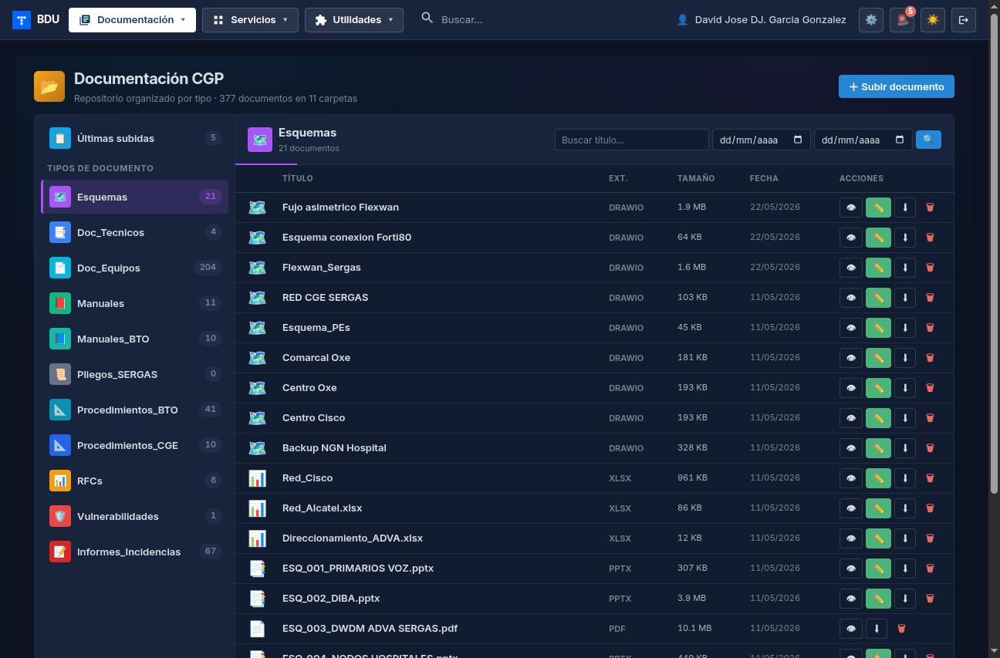
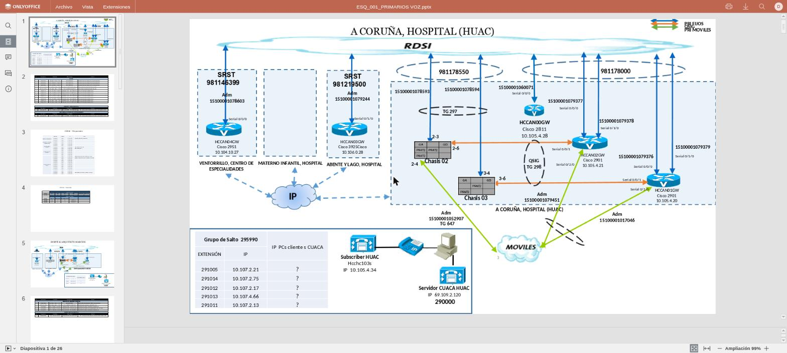
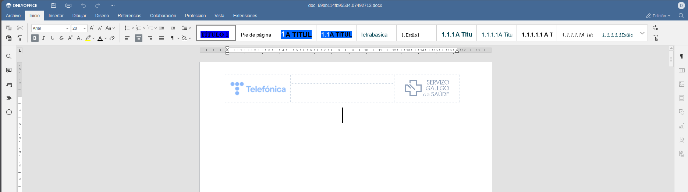
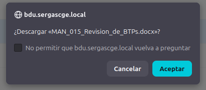
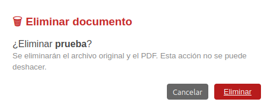

# Manual de Usuario: Módulo Documentación

| Campo       | Valor                          |
|-------------|--------------------------------|
| **Módulo**  | Documentación                  |
| **Versión** | 1.7                            |
| **Fecha**   | Mayo 2026                      |
| **Para**    | Operadores CGE SERGAS          |

---

## Índice

1. [Cómo accedemos al módulo](#1-cómo-accedemos-al-módulo)
2. [Navegar por las carpetas](#2-navegar-por-las-carpetas)
3. [Buscar documentos](#3-buscar-documentos)
4. [Subir un documento](#4-subir-un-documento)
5. [Ver un documento](#5-ver-un-documento)
6. [Editar un documento Office online](#6-editar-un-documento-office-online)
7. [Descargar un documento](#7-descargar-un-documento)
8. [Eliminar un documento](#8-eliminar-un-documento)

---

## 1. Cómo accedemos al módulo

1. Abrimos la **Web BDU** en el navegador.
2. En el menú lateral pulsamos **Documentación**.
3. Aparece la pantalla principal con las carpetas de documentos y las últimas subidas.

---

## 2. Navegar por las carpetas

Los documentos están organizados en carpetas (tipos). Cada carpeta aparece como una tarjeta con su nombre y el número de documentos que contiene.

1. Pulsamos sobre la tarjeta de la carpeta que queramos explorar.
2. Se muestra la tabla con los documentos de esa carpeta.
3. La tarjeta seleccionada aparece resaltada.
4. Para ver los documentos más recientes de todas las carpetas, pulsamos la tarjeta **"Últimas subidas"**.

### 2.1. Filtrar por fecha

Cuando tenemos una carpeta seleccionada podemos filtrar por rango de fechas:

1. Rellenamos los campos **Desde** y/o **Hasta** con las fechas deseadas.
2. Pulsamos **Filtrar**.
3. Para quitar los filtros pulsamos **Limpiar**.

---

## 3. Buscar documentos

1. Con una carpeta seleccionada, escribimos en el campo de **búsqueda** el título o el nombre del archivo.
2. Pulsamos **Filtrar**.
3. Se muestran solo los documentos que coincidan con el texto buscado.
4. Para quitar la búsqueda pulsamos **Limpiar**.

---

## 4. Subir un documento

1. Pulsamos el botón **Subir documento** (en la parte superior derecha).
2. Se abre una ventana (modal) de subida **sin salir del listado**, con los siguientes campos:

| Campo            | Descripción                                           | Obligatorio |
|------------------|-------------------------------------------------------|-------------|
| **Título**       | Nombre descriptivo del documento.                     | Sí          |
| **Tipo**         | Carpeta donde se guardará (seleccionar de la lista).  | Sí          |
| **Descripción**  | Descripción adicional (opcional).                     | No          |
| **Archivo**      | El archivo a subir.                                   | Sí          |

3. Pulsamos **Seleccionar archivo** y elegimos el documento.
4. Pulsamos **Subir documento**.

### 4.1. Formatos y tamaño permitidos

| Formatos aceptados                                                                                              | Tamaño máximo |
|-----------------------------------------------------------------------------------------------------------------|---------------|
| PDF, Word (docx, doc), Excel (xlsx, xls), PowerPoint (pptx, ppt), diagramas draw.io (drawio) y Visio (vsdx).    | 50 MB         |

> **Nota:** si el formato no está en la lista o el archivo supera los 50 MB, aparece un mensaje de error y tenemos que seleccionar otro archivo.

> **Sobre el nombre del archivo:** el documento se guarda en el servidor con el mismo nombre con el que lo subimos. Si ya existía otro archivo con ese nombre en la misma carpeta, el sistema añade un sufijo automático (`_2`, `_3`…) para no sobreescribir el anterior.

---

## 5. Ver un documento

En la tabla de documentos cada fila tiene una columna **Acciones** con varios iconos. Para ver un documento usamos el icono **👁** (ojo). Su comportamiento depende del tipo de fichero:

### 5.1. Documentos PDF

1. Pulsamos el icono **👁** en la fila del documento.
2. Se abre una ventana emergente con el visor de PDF integrado en el navegador.
3. Dentro del visor podemos navegar por las páginas, hacer zoom y usar las herramientas del visor PDF del navegador.
4. Para cerrar pulsamos **Cerrar** o la tecla **Escape**.

### 5.2. Documentos Office (docx, xlsx, pptx, ...)

1. Pulsamos el icono **👁** en la fila del documento.
2. Se abre una **pestaña nueva** con el editor online OnlyOffice **en modo solo lectura**.
3. Podemos navegar por el documento, hacer zoom y consultarlo, pero sin posibilidad de modificarlo. Si queremos editarlo, usamos el botón ✏️ (ver siguiente apartado).
4. Para cerrar simplemente cerramos la pestaña.

### 5.3. Diagramas draw.io (drawio) y Visio (vsdx)

1. Pulsamos el icono **👁** en la fila del diagrama. Su icono en la columna del tipo es **🗺️**.
2. Se abre una **pestaña nueva** con el editor draw.io. Para `.drawio` se abre en modo lectura; para `.vsdx` el editor importa el diagrama Visio y lo muestra (también en lectura).
3. Para cerrar, cerramos la pestaña.

Para más detalles ver el manual [`Drawio/manual_diagramas_drawio.md`](../Drawio/manual_diagramas_drawio.md).

---

## 6. Editar un documento Office online

Para los documentos Office (docx, xlsx, pptx, doc, xls, ppt, odt, ods, odp, rtf, txt, csv) la columna **Acciones** muestra, junto al icono **👁**, un icono **✏️** verde:

1. Pulsamos el icono **✏️** en la fila del documento.
2. Se abre una **pestaña nueva** con el editor online OnlyOffice **en modo edición**.
3. Editamos el documento como en Word/Excel/PowerPoint: añadimos texto, cambiamos celdas, insertamos imágenes, etc.
4. Para guardar:
   - Desde el menú **Archivo → Guardar** del propio editor (guardado inmediato).
   - O simplemente cerrando la pestaña: los cambios se escriben automáticamente sobre el fichero original al cerrar.
5. Si dos personas abrimos el mismo documento a la vez, **vemos los cursores y los cambios en tiempo real** (estilo Google Docs). Cuando ambos cerramos, se guarda **una sola versión consolidada** con los cambios de los dos.

> **Nota:** el icono **✏️** solo aparece para formatos Office y para diagramas `.drawio`. Los PDFs originales no se editan (Community Edition de OnlyOffice no edita PDF). Los Visio `.vsdx` se pueden ver con draw.io pero NO se editan en BDU (para preservar la fidelidad Visio); si queremos modificar uno, lo guardamos *como .drawio* desde el editor y lo subimos a BDU como fichero nuevo.

### 6.1. Editar un diagrama draw.io

Para los `.drawio`, el icono **✏️** abre el editor draw.io en pestaña nueva. Dibujamos como en la aplicación de escritorio (mismas formas, mismos atajos) y guardamos con el icono de disquete o `Ctrl + S`. Los cambios se escriben sobre el `.drawio` original.

A diferencia de OnlyOffice, **draw.io no es colaborativo en tiempo real**: si dos operadores abren y guardan el mismo diagrama a la vez, gana el último que guarde. Conviene avisar al compañero antes de tocar.

---

## 7. Descargar un documento

1. En la tabla de documentos buscamos el que queramos descargar.
2. Pulsamos el botón **Descargar** (icono de descarga).
3. Aparece un mensaje de confirmación preguntando si queremos descargar el archivo.
4. Pulsamos **Aceptar**.
5. El archivo (en su formato original: docx, xlsx, pdf, etc.) se descarga al equipo con su nombre original.

---

## 8. Eliminar un documento

1. En la tabla de documentos buscamos el que queramos eliminar.
2. Pulsamos el botón **Eliminar** (icono de papelera).
3. Aparece una ventana de confirmación con el título del documento.
4. Leemos la advertencia: **esta acción es irreversible**.
5. Pulsamos **Eliminar** para confirmar, o **Cancelar** para volver atrás.

> **Importante:** una vez eliminado, el documento no se puede recuperar. Nos aseguramos de que ya no se necesita antes de eliminarlo.

---

## Resumen rápido

| Acción                            | Cómo lo hacemos                                                          |
|-----------------------------------|--------------------------------------------------------------------------|
| Ver documentos de una carpeta     | Pulsar la tarjeta de la carpeta.                                         |
| Ver últimas subidas               | Pulsar la tarjeta **"Últimas subidas"**.                                 |
| Buscar documento                  | Escribir en el buscador + Filtrar.                                       |
| Filtrar por fecha                 | Rellenar Desde/Hasta + Filtrar.                                          |
| Subir documento                   | Botón **Subir documento** + rellenar formulario.                         |
| Ver PDF                           | Icono **👁** (abre modal interno).                                       |
| Ver Office (docx/xlsx/pptx)       | Icono **👁** (abre OnlyOffice solo lectura en pestaña nueva).            |
| Editar Office                     | Icono **✏️** (abre OnlyOffice modo edición en pestaña nueva).             |
| Ver diagrama drawio o Visio       | Icono **👁** (abre draw.io en pestaña nueva).                            |
| Editar diagrama .drawio           | Icono **✏️** (abre draw.io modo edición). Visio `.vsdx` NO se edita.      |
| Descargar archivo                 | Icono **⬇ Descargar** + Aceptar.                                         |
| Eliminar documento                | Icono **🗑** + Confirmar.                                                 |
| Cerrar visor PDF                  | Botón **Cerrar** o tecla **Escape**.                                     |
| Cerrar editor OnlyOffice          | Cerrar la pestaña (los cambios se guardan automáticamente).              |
| Cerrar editor draw.io             | Guardar (icono disquete o `Ctrl+S`) y cerrar la pestaña.                 |

---

*Manual para operadores CGE SERGAS. Versión 1.8 — Mayo 2026 (integración draw.io).*
