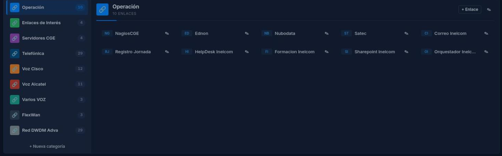
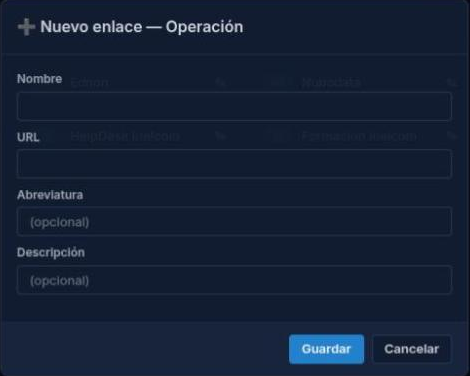
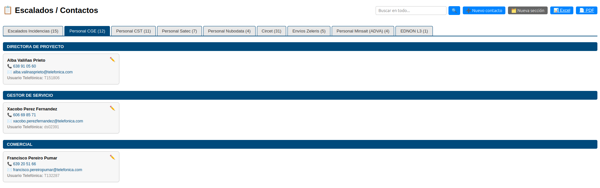
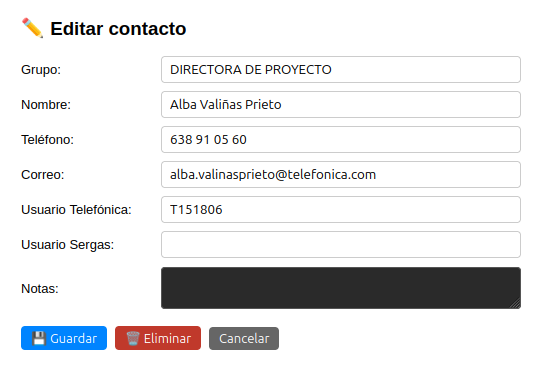
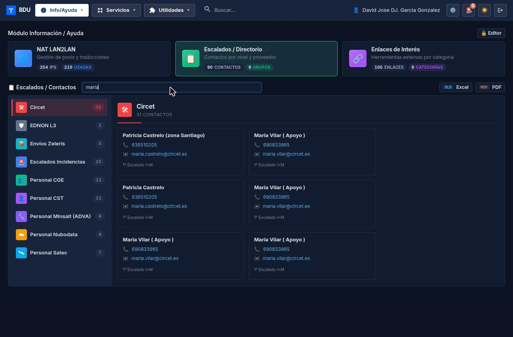
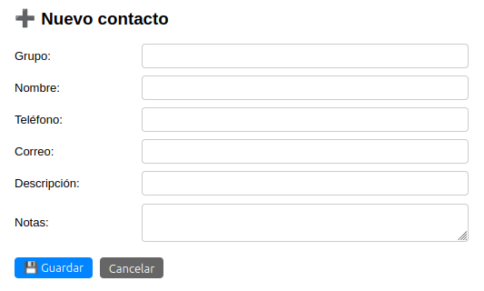
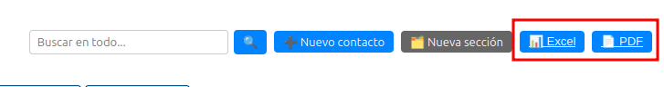
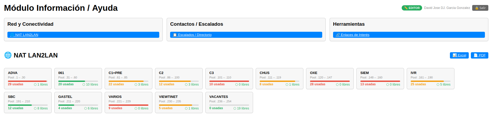
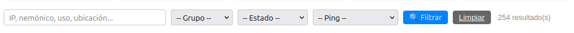
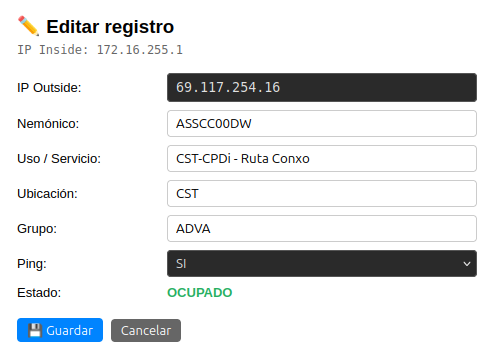

# Manual de Usuario: Módulo Información / Ayuda

| Campo       | Valor                          |
|-------------|--------------------------------|
| **Módulo**  | Información / Ayuda            |
| **Versión** | 2.1                            |
| **Fecha**   | Junio 2026                     |
| **Para**    | Operadores CGE SERGAS          |

---

## Índice

1. [Cómo accedemos al módulo](#1-cómo-accedemos-al-módulo)
2. [Panel principal](#2-panel-principal)
3. [Activar el modo editor](#3-activar-el-modo-editor)
4. [Enlaces de interés](#4-enlaces-de-interés)
5. [Escalados / Directorio de contactos](#5-escalados--directorio-de-contactos)
6. [NAT / LAN2LAN](#6-nat--lan2lan)

---

## 1. Cómo accedemos al módulo

1. Abrimos la **Web BDU** en el navegador.
2. En el menú lateral pulsamos **Información** (o **Ayuda**).
3. Aparece el panel principal con tres secciones disponibles.

---

## 2. Panel principal

El panel principal muestra tres bloques de acceso rápido:

| Bloque                      | Qué contiene                                          |
|-----------------------------|-------------------------------------------------------|
| **Red y Conectividad**      | Tabla NAT LAN2LAN.                                    |
| **Contactos / Escalados**   | Directorio de contactos y escalados.                  |
| **Herramientas**            | Enlaces de interés.                                   |

Pulsamos sobre cualquiera de los tres bloques para acceder a esa sección.

En la cabecera vemos:

- El título **"Módulo Información / Ayuda"**.
- Un botón **Editor** para activar el modo de edición (ver [sección 3](#3-activar-el-modo-editor)).

---

## 3. Activar el modo editor

El modo editor permite crear, modificar y eliminar datos en las tres secciones (enlaces, escalados y NAT). Está protegido por contraseña.

### 3.1. Activar

1. Pulsamos el botón **Editor** en la cabecera.
2. Aparece una ventana pidiendo la contraseña.
3. Introducimos la contraseña y pulsamos **Entrar** (o Enter).
4. Si es correcta, la página recarga con el modo editor activo.
5. Vemos una etiqueta **EDITOR** junto a nuestro nombre de usuario.

> **Atención:** si introducimos la contraseña incorrecta **3 veces seguidas**, el acceso queda bloqueado durante **5 minutos**.

### 3.2. Desactivar

1. Pulsamos el botón **Salir** que aparece junto a la etiqueta EDITOR.
2. La página recarga en modo lectura.

---

## 4. Enlaces de interés

### 4.1. Ver los enlaces

1. Desde el panel principal pulsamos **Herramientas** (o **Enlaces de interés**).
2. Los enlaces están organizados por **categorías** (bloques de colores).
3. Cada enlace muestra:
   - Una abreviatura o punto de color.
   - El nombre del enlace (pulsamos para abrirlo en una nueva pestaña).
4. Las primeras 3 categorías aparecen en la fila superior; el resto debajo.

### 4.2. Crear un enlace nuevo (modo editor)

1. Activamos el modo editor (ver [sección 3](#3-activar-el-modo-editor)).
2. En la categoría donde queramos añadir el enlace pulsamos el botón **+** (añadir enlace).
3. Se abre una ventana con los campos:
   - **Nombre** (obligatorio) — texto que se muestra.
   - **URL** (obligatorio) — dirección web del enlace.
   - **Abreviatura** — texto corto para el badge (opcional).
   - **Descripción** — descripción adicional (opcional).
4. Pulsamos **Guardar**.

### 4.3. Editar un enlace (modo editor)

1. Pulsamos el botón de editar (icono de lápiz) junto al enlace.
2. Se abre la ventana con los datos actuales.
3. Modificamos lo que necesitemos.
4. Pulsamos **Guardar**.

### 4.4. Eliminar un enlace (modo editor)

1. Abrimos la ventana de edición del enlace.
2. Pulsamos el botón **Eliminar** (rojo, en la parte inferior).
3. El enlace se elimina.

### 4.5. Crear una categoría nueva (modo editor)

1. Pulsamos el botón para crear una nueva categoría.
2. Introducimos el **nombre** de la categoría.
3. Opcionalmente, elegimos un **color** con el selector.
4. Pulsamos **Guardar**.

### 4.6. Editar o eliminar una categoría (modo editor)

1. Pulsamos el botón de editar categoría (junto al nombre de la categoría).
2. Modificamos el nombre o el color.
3. Para eliminar, pulsamos **Eliminar**.

> **Atención:** al eliminar una categoría se eliminan **todos los enlaces** que contiene. El sistema pide confirmación antes de proceder.

---

## 5. Escalados / Directorio de contactos

### 5.1. Navegar por las pestañas

1. Desde el panel principal pulsamos **Contactos / Escalados**.
2. Aparece una barra de **pestañas** con las secciones disponibles:
   - Escalados Incidencias.
   - Personal CGE.
   - Personal CST.
   - Personal Satec.
   - Personal Nubodata.
   - Circet.
   - Envíos Zeleris.
   - Personal Minsait.
   - EDNON L3.
3. Cada pestaña muestra un **contador** con el número de contactos.
4. Pulsamos sobre una pestaña para ver los contactos de esa sección.

### 5.2. Ver los contactos

Los contactos se muestran como **tarjetas** agrupadas por grupos dentro de cada sección.

Cada tarjeta muestra:

- **Nombre**.
- **Teléfono** (pulsamos para llamar).
- **Correo** (pulsamos para enviar email).
- **Campos extra** (varían según la sección, por ejemplo: *"Descripción"*, *"Usuario Telefónica"*, *"DNI/Matrícula"*…).
- **Notas** (si las hay).

### 5.3. Buscar un contacto

1. Escribimos en el campo de **búsqueda** (parte superior).
2. Pulsamos **Buscar** o Enter.
3. Se busca en nombre, teléfono, correo y campos extra de **todas las secciones**.
4. Los resultados se muestran agrupados por sección.
5. Para limpiar la búsqueda pulsamos **Limpiar**.

### 5.4. Crear un contacto nuevo (modo editor)

1. Activamos el modo editor.
2. Pulsamos el botón **Nuevo contacto**.
3. Se abre una ventana con los campos:
   - **Grupo** — subgrupo dentro de la sección.
   - **Nombre** (obligatorio).
   - **Teléfono**.
   - **Correo**.
   - **Campos extra** (las etiquetas cambian según la sección).
   - **Notas**.
4. Pulsamos **Guardar**.

### 5.5. Editar un contacto (modo editor)

1. Pulsamos el botón de editar en la tarjeta del contacto.
2. Modificamos los campos que necesitemos.
3. Pulsamos **Guardar**.

### 5.6. Eliminar un contacto (modo editor)

1. Abrimos la ventana de edición del contacto.
2. Pulsamos **Eliminar**.
3. Confirmamos la eliminación.

### 5.7. Crear una nueva sección (modo editor)

1. Pulsamos el botón **Nueva sección**.
2. Introducimos el nombre de la nueva sección.
3. Pulsamos **Crear**.
4. La nueva sección aparece como una pestaña adicional.

### 5.8. Exportar contactos

Podemos exportar los contactos de la sección activa en dos formatos:

1. Pulsamos el botón **Excel** para descargar en formato Excel (`.xlsx`).
2. Pulsamos el botón **PDF** para descargar en formato PDF.

El archivo descargado incluye solo los contactos de la sección seleccionada.

---

## 6. NAT / LAN2LAN

### 6.1. Ver la tabla NAT

1. Desde el panel principal pulsamos **Red y Conectividad** (o **NAT LAN2LAN**).
2. En la parte superior aparecen las **tarjetas de rangos** con:
   - Nombre del grupo.
   - Rango de IPs (inicio - fin).
   - Barra de progreso (uso del rango).
   - Estadísticas: IPs usadas / libres.

3. Debajo se muestra la tabla con todos los registros NAT:

| Columna        | Qué muestra                                    |
|----------------|------------------------------------------------|
| IP Inside      | IP interna.                                    |
| IP Outside     | IP externa (puede estar vacía si está libre).  |
| Nemónico       | Nombre del equipo asociado.                    |
| Uso/Servicio   | Para qué se usa esta IP.                       |
| Ubicación      | Dónde está el equipo.                          |
| Grupo          | Grupo al que pertenece.                        |
| Ping           | Si responde a ping (SÍ/NO).                    |
| Estado         | Estado actual (OCUPADO/LIBRE/COMPROBAR).       |

### Colores de estado

| Estado       | Color    | Significado                                    |
|--------------|----------|------------------------------------------------|
| OCUPADO      | Verde    | IP en uso, con ping activo.                    |
| LIBRE        | Sin color| IP disponible (sin IP Outside).                |
| COMPROBAR    | Rojo     | Tiene IP Outside pero no responde al ping.     |

### Colores de ping

| Ping | Color   |
|------|---------|
| SÍ   | Verde   |
| NO   | Rojo    |
| N/D  | Neutro  |

### 6.2. Filtrar registros

1. Usamos los campos de filtro en la parte superior de la tabla:
   - **Buscar** — texto libre (busca en IP, nemónico, uso, ubicación).
   - **Grupo** — seleccionamos un grupo específico.
   - **Estado** — filtra por OCUPADO, LIBRE o COMPROBAR.
   - **Ping** — filtra por SÍ o NO.
2. Pulsamos **Filtrar**.
3. Para quitar los filtros pulsamos **Limpiar**.

### 6.3. Editar un registro NAT (modo editor)

1. Activamos el modo editor (ver [sección 3](#3-activar-el-modo-editor)).
2. En la tabla pulsamos el botón **Editar** del registro.
3. Se abre una ventana con los datos del registro:
   - **IP Inside** — solo lectura (no se puede modificar).
   - **IP Outside** — editable.
   - **Nemónico** — editable.
   - **Uso/Servicio** — editable.
   - **Ubicación** — editable.
   - **Grupo** — editable.
   - **Ping** — seleccionar SÍ o NO.
   - **Estado** — se calcula automáticamente:
     * Si quitamos la IP Outside → estado pasa a **LIBRE**.
     * Si ponemos IP Outside y Ping = SÍ → estado pasa a **OCUPADO**.
     * Si ponemos IP Outside y Ping = NO → estado pasa a **COMPROBAR**.
4. Pulsamos **Guardar**.

> **Nota:** no hace falta elegir el estado manualmente. El sistema lo calcula automáticamente según los valores de IP Outside y Ping.

### 6.4. Exportar tabla NAT

Podemos exportar los datos de la tabla NAT (respetando los filtros activos):

1. Pulsamos el botón **Excel** para descargar en formato Excel (`.xlsx`).
2. Pulsamos el botón **PDF** para descargar en formato PDF.

> Los filtros aplicados se mantienen en la exportación. Si tenemos un filtro de grupo activo, solo se exportan los registros de ese grupo.

---

## Resumen rápido

| Acción                          | Cómo lo hacemos                                          |
|---------------------------------|----------------------------------------------------------|
| Activar modo editor             | Botón **Editor** + contraseña.                           |
| Desactivar modo editor          | Botón **Salir**.                                         |
| Ver enlaces                     | Panel principal → Herramientas.                          |
| Crear/editar enlace             | Modo editor + botón **+** / lápiz.                       |
| Ver contactos                   | Panel principal → Contactos → pestaña de sección.        |
| Buscar contacto                 | Campo de búsqueda (busca en todas las secciones).        |
| Crear contacto                  | Modo editor + **Nuevo contacto**.                        |
| Crear nueva sección             | Modo editor + **Nueva sección**.                         |
| Exportar contactos              | Botones Excel / PDF.                                     |
| Ver tabla NAT                   | Panel principal → Red y Conectividad.                    |
| Filtrar tabla NAT               | Campos de filtro + Filtrar.                              |
| Editar registro NAT             | Modo editor + botón **Editar** en la fila.               |
| Exportar tabla NAT              | Botones Excel / PDF.                                     |

---

*Manual para operadores CGE SERGAS. Versión 2.1 — Junio 2026.*
