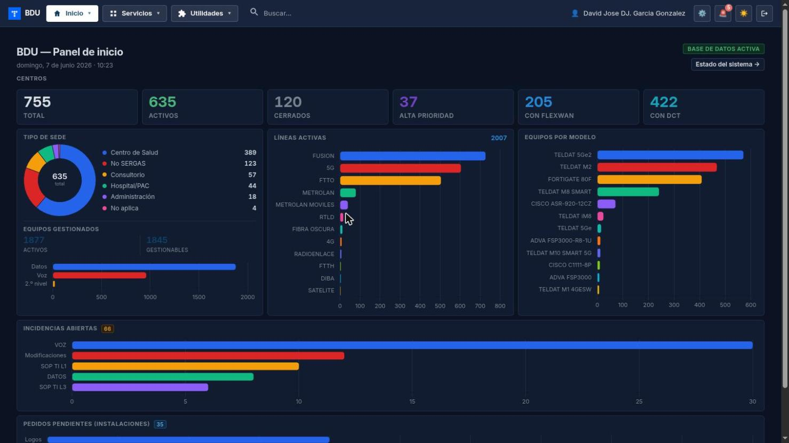
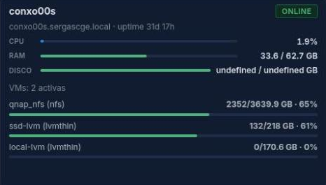
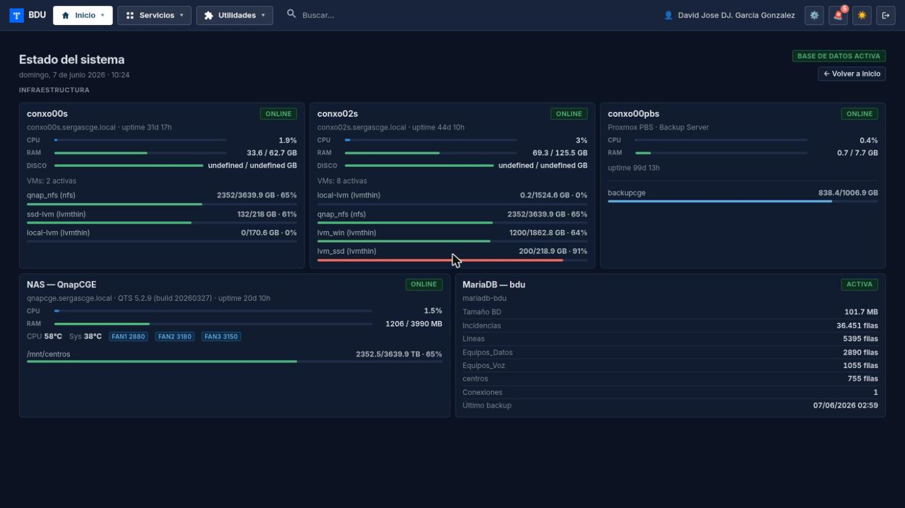
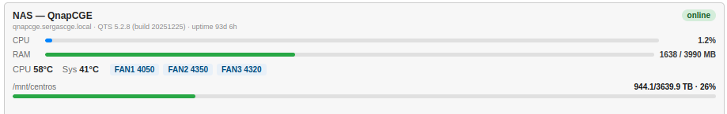
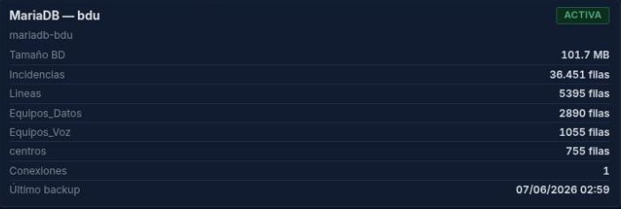

# Manual de Usuario: Módulo Inicio (Panel de Control)

| Campo       | Valor                          |
|-------------|--------------------------------|
| **Módulo**  | Inicio                         |
| **Versión** | 1.6                            |
| **Fecha**   | Abril 2026                     |
| **Para**    | Operadores CGE SERGAS          |

---

## Índice

1. [Cómo accedemos al panel de inicio](#1-cómo-accedemos-al-panel-de-inicio)
2. [Barra superior](#2-barra-superior)
3. [KPIs de centros](#3-kpis-de-centros)
4. [Tipo de sede (gráfico)](#4-tipo-de-sede-gráfico)
5. [Equipos gestionados](#5-equipos-gestionados)
6. [Líneas activas](#6-líneas-activas)
7. [Equipos por modelo](#7-equipos-por-modelo)
8. [Incidencias abiertas](#8-incidencias-abiertas)
9. [Pedidos pendientes de instalaciones](#9-pedidos-pendientes-de-instalaciones)
10. [Infraestructura](#10-infraestructura)

---

## 1. Cómo accedemos al panel de inicio

1. Abrimos la **Web BDU** en el navegador.
2. El panel de inicio es la **primera pantalla** que aparece al acceder a la aplicación.
3. También podemos volver a él en cualquier momento pulsando **Inicio** en el menú superior.

> **Nota:** los datos del panel se actualizan automáticamente cada **2 minutos**. No hace falta recargar la página manualmente.

---

## 2. Barra superior

En la parte superior del panel vemos:

- **Título:** *"BDU — Panel de inicio"*.
- **Fecha y hora:** se actualiza automáticamente con cada recarga de datos.
- **Estado de la base de datos:** una etiqueta que indica si la conexión a la BD funciona correctamente.

---

## 3. KPIs de centros

La primera sección muestra **6 tarjetas** con los indicadores clave de los centros:

| Tarjeta              | Qué indica                                                  |
|----------------------|-------------------------------------------------------------|
| **Total**            | Número total de centros registrados en la base de datos.    |
| **Activos**          | Centros que están abiertos y operativos.                    |
| **Cerrados**         | Centros que han sido cerrados.                              |
| **Alta prioridad**   | Centros marcados como sede crítica.                         |
| **Con FlexWAN**      | Centros que tienen el servicio FlexWAN activo.              |
| **Con DCT**          | Centros que tienen dispositivo de control de tensión.       |

---

## 4. Tipo de sede (gráfico)

En la columna izquierda aparece un **gráfico de anillo (donut)** que muestra la distribución de centros por tipo de sede.

- El gráfico usa colores diferentes para cada tipo de sede.
- En el centro del anillo se muestra el **total de centros activos**.
- Debajo del gráfico hay una **leyenda** con el nombre de cada tipo, su color y su número.

---

## 5. Equipos gestionados

Debajo del gráfico de tipo de sede se muestra la sección de **equipos gestionados**:

- **Equipos datos activos** — número total de equipos de datos en servicio.
- **Gestionables** — cuántos de esos equipos son gestionables remotamente.
- **Equipos voz activos** — número total de equipos de voz en servicio.
- **Equipos 2.º Nivel** — número total de equipos de 2.º nivel en servicio.

Cada indicador se muestra con una **barra de progreso** para ver de un vistazo la proporción.

---

## 6. Líneas activas

La columna central muestra las **líneas activas** de la red:

- En la parte superior, un **badge** con el total de líneas activas.
- Debajo, una lista de **barras** donde cada barra representa un tipo de línea.
- Cada barra muestra:
  - El nombre del tipo de línea.
  - El número de líneas activas de ese tipo.
  - La proporción respecto al total (barra de color).

---

## 7. Equipos por modelo

La columna derecha muestra los **12 modelos de equipo más frecuentes**:

- Lista de barras, una por cada modelo.
- Cada barra muestra el nombre del modelo y el número de unidades activas.
- Ordenados de mayor a menor.

---

## 8. Incidencias abiertas

La sección de **incidencias abiertas** muestra tarjetas con las incidencias que están actualmente sin resolver:

- **Total** de incidencias abiertas.
- Desglose por **tipo de incidencia**, cada uno con su tarjeta y barra de progreso.

Esto nos permite ver rápidamente si hay incidencias acumuladas y de qué tipo son.

---

## 9. Pedidos pendientes de instalaciones

Esta sección muestra los **pedidos de instalación** que están pendientes de realizarse:

| Tarjeta    | Qué indica                                            |
|------------|-------------------------------------------------------|
| **LOGOS**  | Pedidos pendientes de instalación de datos (LOGOS).   |
| **BJ**     | Pedidos pendientes de instalación de voz (BJ).        |
| **ATLAS**  | Pedidos pendientes de órdenes ATLAS.                  |

Cada tarjeta muestra el número de pedidos pendientes.

---

## 10. Infraestructura

La sección inferior muestra el estado en tiempo real de los servidores y sistemas que soportan la aplicación BDU. Útil para saber si hay algún problema en la infraestructura.

### 10.1. Servidores Proxmox (PVE)

Se muestran **dos nodos** de servidor Proxmox. Para cada nodo vemos:

| Indicador             | Qué significa                                           |
|-----------------------|---------------------------------------------------------|
| **CPU**               | Porcentaje de uso del procesador.                       |
| **RAM**               | Memoria usada / total (en GB) y porcentaje.             |
| **Disco**             | Espacio en disco usado / total y porcentaje.            |
| **VMs activas**       | Máquinas virtuales que están funcionando.               |
| **VMs paradas**       | Máquinas virtuales apagadas.                            |
| **Contenedores**      | Contenedores LXC activos y parados.                     |
| **Storage pools**     | Almacenamiento: nombre, tipo, uso y porcentaje.         |

Las barras de progreso cambian de color según el nivel de uso:

- **Verde** — uso normal.
- **Amarillo** — uso alto (atención).
- **Rojo** — uso crítico (posible problema).

### 10.2. Servidor de backups (PBS)

Muestra el estado del servidor de copias de seguridad Proxmox Backup Server:

| Indicador        | Qué significa                                |
|------------------|----------------------------------------------|
| **CPU**          | Porcentaje de uso del procesador.            |
| **RAM**          | Memoria usada / total y porcentaje.          |
| **Datastores**   | Almacenes de backup con espacio usado/total. |

### 10.3. NAS (almacenamiento en red)

Muestra el estado del NAS QNAP:

| Indicador          | Qué significa                                      |
|--------------------|----------------------------------------------------|
| **CPU**            | Porcentaje de uso del procesador.                  |
| **RAM**            | Memoria usada / total (en MB) y porcentaje.        |
| **Temp. CPU**      | Temperatura del procesador.                        |
| **Temp. Sistema**  | Temperatura general del sistema.                   |
| **Ventiladores**   | Velocidad de los ventiladores (RPM).               |
| **Volúmenes**      | Espacio usado / total de cada volumen montado.     |

### 10.4. Base de datos MariaDB

Muestra estadísticas de la base de datos de la aplicación:

| Indicador          | Qué significa                                           |
|--------------------|---------------------------------------------------------|
| **Tamaño**         | Espacio total que ocupa la base de datos (en MB).       |
| **Tablas**         | Número de tablas en la base de datos.                   |
| **Conexiones**     | Número de conexiones activas.                           |
| **Último backup**  | Fecha y hora de la última copia de seguridad.           |

---

## Guía de interpretación de colores

### Barras de infraestructura

| Color      | Rango de uso    | Significado                            |
|------------|-----------------|----------------------------------------|
| Verde      | 0% — 60%        | Todo funciona con normalidad.          |
| Amarillo   | 60% — 80%       | Uso alto, a vigilar.                   |
| Rojo       | Mayor de 80%    | Uso crítico, posible problema.         |

### Temperaturas

| Color      | Significado                                          |
|------------|------------------------------------------------------|
| Normal     | Temperatura dentro del rango esperado.               |
| Amarillo   | Temperatura elevada (atención).                      |
| Rojo       | Temperatura crítica (posible problema de hardware).  |

---

## Resumen rápido

| Sección                 | Qué muestra                                       |
|-------------------------|---------------------------------------------------|
| KPIs Centros            | Total, activos, cerrados, críticos, FlexWAN, DCT. |
| Tipo de sede            | Distribución gráfica por tipo de sede.            |
| Equipos gestionados     | Equipos activos, gestionables, con IP, con switch.|
| Líneas activas          | Total y desglose por tipo de línea.               |
| Equipos por modelo      | Los 12 modelos más frecuentes.                    |
| Incidencias abiertas    | Total y desglose por tipo.                        |
| Pedidos pendientes      | LOGOS, BJ, ATLAS.                                 |
| Infraestructura         | Estado de servidores, NAS y base de datos.        |

> **Recuerda:** todo el panel se actualiza automáticamente cada 2 minutos. Si necesitamos datos al momento, podemos recargar la página manualmente con **F5**.

---

*Manual para operadores CGE SERGAS. Versión 1.6 — Abril 2026.*
