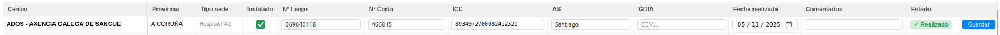

# Manual de Usuario: Proyecto Dispositivos de Control de Tensión (DCT)

| Campo        | Valor                                |
|--------------|--------------------------------------|
| **Módulo**   | Instalaciones — Proyectos            |
| **Proyecto** | Dispositivos de Control de Tensión / Tensiómetros |
| **Versión**  | 2.1                                  |
| **Fecha**    | Junio 2026                           |
| **Para**     | Operadores CGE SERGAS                |

---

## Índice

1. [Para qué sirve este proyecto](#1-para-qué-sirve-este-proyecto)
2. [Cómo accedemos al proyecto](#2-cómo-accedemos-al-proyecto)
3. [La pantalla principal](#3-la-pantalla-principal)
4. [Filtrar la tabla](#4-filtrar-la-tabla)
5. [Rellenar los datos de un tensiómetro](#5-rellenar-los-datos-de-un-tensiómetro)
6. [Cuándo se considera un centro "realizado"](#6-cuándo-se-considera-un-centro-realizado)
7. [Estadísticas](#7-estadísticas)
8. [Dudas frecuentes](#8-dudas-frecuentes)

---

## 1. Para qué sirve este proyecto

El proyecto **Dispositivos de Control de Tensión (DCT)** registra la instalación física de los **tensiómetros** (DCT) en cada centro SERGAS. Cuando se instala un DCT en un centro, lo damos de alta en este proyecto con su número largo, su número corto y su ICC, además de la fecha en que se hizo la instalación.

Cuando todos los centros estén equipados, el proyecto se cerrará y dejará de aparecer como proyecto activo.

> **Nota:** la **operativa diaria del DCT** (recepción de SMS, alertas de corte, test #016#, estadísticas de incidencias eléctricas) se gestiona en otro submódulo: **Mantenimiento → Preventivo → DCT**, con su propio manual (`manual_dct_v2.md`). Este manual cubre solo el **proyecto de despliegue** (alta de los dispositivos).

---

## 2. Cómo accedemos al proyecto

1. Abrimos la **Web BDU** en el navegador.
2. En el menú superior pulsamos **Instalaciones**.
3. En la parte superior, abrimos la pestaña **Proyectos**.
4. En la categoría **Provisión**, pulsamos la tarjeta **Dispositivos de Control de Tensión / Tensiómetros**.

---

## 3. La pantalla principal

Una vez dentro vemos tres zonas:

### 3.1. Barra de progreso

En la parte superior aparece un resumen del proyecto:

| Indicador        | Qué significa                                                       |
|------------------|---------------------------------------------------------------------|
| **Total**        | Cuántos centros hay en el proyecto.                                 |
| **Realizados**   | Centros con el DCT ya instalado y todos los datos rellenados.       |
| **Pendientes**   | Centros que aún no están marcados como realizados.                  |
| **% de avance**  | Porcentaje de centros realizados sobre el total.                    |

### 3.2. Filtros

Encima de la tabla tenemos:

- **Búsqueda** — por nombre de centro, área sanitaria o GDIA.
- **Provincia** — selector de provincia.
- **Estado** — *Realizado* o *Pendiente*.

### 3.3. Tabla de centros

Una fila por centro. Las columnas editables aparecen en cada fila como inputs y un botón **Guardar** al final de la fila.

---

## 4. Filtrar la tabla

Combinamos los filtros según necesitemos:

- Para **avanzar con los pendientes**: filtramos **Estado = Pendiente** y elegimos una provincia.
- Para **revisar los ya realizados** (auditoría): **Estado = Realizado**.
- Para localizar un centro concreto: lo escribimos en el buscador.

---

## 5. Rellenar los datos de un tensiómetro

Cada fila de la tabla tiene los siguientes campos editables:

| Campo                | Descripción                                          |
|----------------------|------------------------------------------------------|
| **Instalado**        | Casilla para marcar si el DCT está instalado.        |
| **N. Largo**         | Número largo del dispositivo.                        |
| **N. Corto**         | Extensión corta del dispositivo.                     |
| **ICC**              | Número ICC del dispositivo.                          |
| **Área sanitaria**   | Área sanitaria del centro.                           |
| **GDIA**             | Código GDIA.                                         |
| **Fecha realizada**  | Fecha en que se instaló el DCT.                      |
| **Comentarios**      | Observaciones libres.                                |

### Pasos

1. Localizamos el centro en la tabla (con el buscador o los filtros).
2. Marcamos la casilla **Instalado** y rellenamos **N. Largo**, **N. Corto** e **ICC**.
3. Si es necesario, completamos **Área sanitaria**, **GDIA**, **Fecha realizada** y **Comentarios**.
4. Pulsamos el botón **Guardar** de esa fila.
5. Los contadores de la barra de progreso se actualizan automáticamente.

---

## 6. Cuándo se considera un centro "realizado"

Un centro pasa a estado **Realizado** cuando cumple **las cuatro condiciones**:

- ✅ Casilla **Instalado** marcada.
- ✅ **N. Largo** rellenado.
- ✅ **N. Corto** rellenado.
- ✅ **ICC** rellenado.

Si falta cualquiera de los cuatro, el centro sigue como **Pendiente** aunque hayamos pulsado Guardar.

> **Tip:** si un centro queda incompleto (por ejemplo nos falta el ICC en el momento de la instalación), guardamos lo que tengamos y el centro se queda en *Pendiente* hasta que completemos los datos.

---

## 7. Estadísticas

Pulsamos el botón **📊 Estadísticas** en la cabecera. Se abre una página con:

| Gráfica                     | Qué muestra                                                |
|-----------------------------|------------------------------------------------------------|
| **Progreso por semana**     | Cuántos DCTs se han instalado cada semana.                 |
| **Progreso por mes**        | Acumulado mensual.                                         |
| **Distribución por provincia** | Centros realizados / pendientes por cada provincia (proporcional). |
| **Distribución por tipo de sede** | Reparto del avance por tipo de centro (CS, PAC, Hospital…). |

Volvemos al listado pulsando el botón de regreso de la cabecera.

---

## 8. Dudas frecuentes

### Marcamos *Instalado* pero el centro sigue en Pendiente

Necesitamos las **cuatro condiciones** simultáneamente: Instalado **+** N. Largo **+** N. Corto **+** ICC. Si falta uno, sigue en Pendiente.

### El número largo o ICC ya existe en otro centro

El sistema suele permitirlo (los dispositivos se reasignan a veces) pero conviene revisarlo. Si el dispositivo se ha movido de centro, antes de darlo de alta en el centro nuevo deberíamos quitarlo del antiguo.

### Un centro debería estar en el proyecto y no aparece

- Comprobamos en el detalle del centro (módulo Centros) que tiene **Área Sanitaria** asignada.
- Si no está dado de alta en el proyecto, avisamos al administrador para que lo añada a la lista.

### ¿Cuándo se cierra este proyecto?

Cuando el porcentaje de avance llegue al 100% y todos los centros estén realizados. En ese momento, el proyecto pasará a la categoría de **finalizados** (solo consulta) y este manual se archivará.

### Relación con el submódulo DCT de Mantenimiento

- **Aquí (este manual)**: registramos la **instalación física** del DCT (alta).
- **Mantenimiento → Preventivo → DCT**: gestionamos la **operativa diaria** (SMS de cortes, alertas, tests).

Cuando damos de alta un DCT aquí, los datos (`dctNumero`, `dctExt`, `dctICC`) quedan disponibles para el submódulo operativo y este puede empezar a recibir SMS del DCT.

---

*Manual para operadores CGE SERGAS. Proyecto DCT v1.0 — Abril 2026.*
