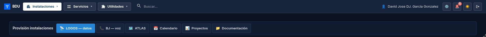
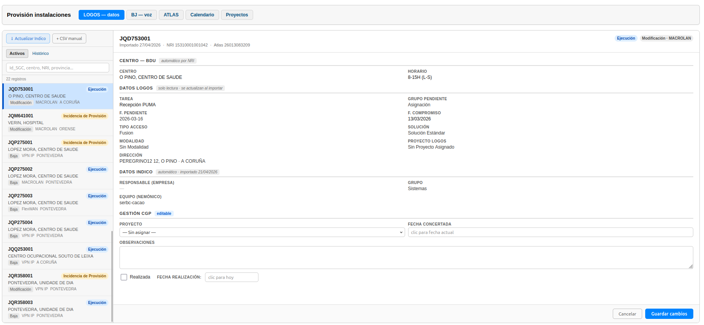
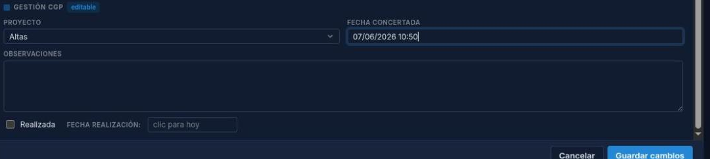
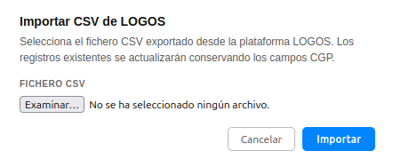
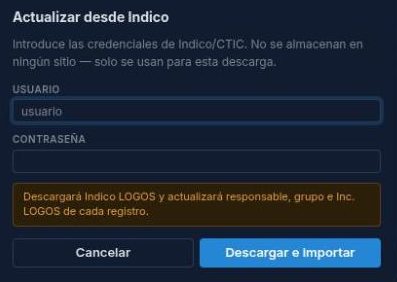
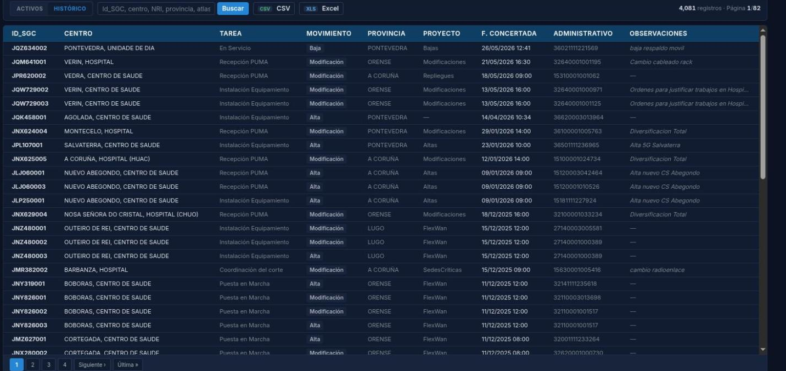
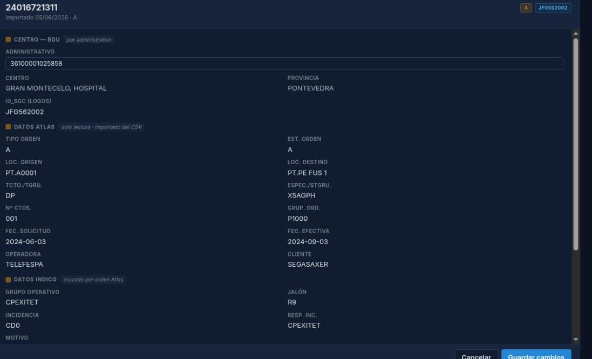
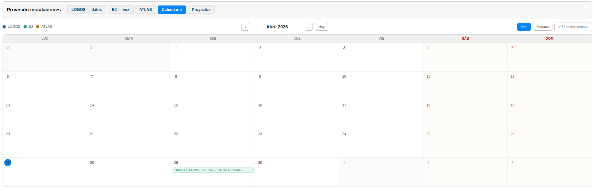
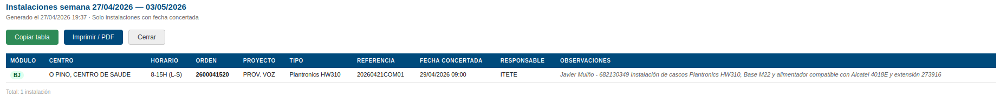
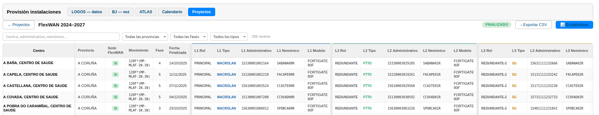

# Manual de Usuario: Módulo Instalaciones

| Campo       | Valor                          |
|-------------|--------------------------------|
| **Módulo**  | Instalaciones                  |
| **Versión** | 2.1                            |
| **Fecha**   | Junio 2026                     |
| **Para**    | Operadores CGE SERGAS          |

---

## Índice

1. [Cómo accedemos al módulo](#1-cómo-accedemos-al-módulo)
2. [Pestaña LOGOS (instalaciones de datos)](#2-pestaña-logos-instalaciones-de-datos)
3. [Pestaña BJ (instalaciones de voz)](#3-pestaña-bj-instalaciones-de-voz)
4. [Pestaña ATLAS (órdenes de acceso)](#4-pestaña-atlas-órdenes-de-acceso)
5. [Pestaña Calendario](#5-pestaña-calendario)
6. [Pestaña Proyectos](#6-pestaña-proyectos)

---

## 1. Cómo accedemos al módulo

1. Abrimos la **Web BDU** en el navegador.
2. En el menú lateral pulsamos **Instalaciones**.
3. Aparece la pestaña LOGOS por defecto.
4. Usamos las **pestañas** de la parte superior para cambiar entre LOGOS, BJ, ATLAS, Calendario y Proyectos.

---

## 2. Pestaña LOGOS (instalaciones de datos)

### 2.1. Vista de instalaciones activas

La pantalla se divide en dos paneles:

- **Panel izquierdo (sidebar):** lista de tarjetas con las instalaciones activas.
- **Panel derecho (detalle):** información completa de la instalación seleccionada.

#### Buscar una instalación

1. Escribimos en el campo de **búsqueda** de la sidebar.
2. Las tarjetas se filtran en tiempo real mientras escribimos.
3. El contador muestra cuántas instalaciones coinciden.

#### Seleccionar una instalación

1. Pulsamos sobre una tarjeta de la sidebar.
2. La tarjeta se resalta y el detalle se carga en el panel derecho.

Cada tarjeta muestra:

- **ID SGC** — identificador del pedido.
- **Centro** — nombre del centro.
- **Badges de estado** — etiquetas de color indicando estado, si tiene cita, etc.
- Las tarjetas que **ya no aparecen en el último CSV de LOGOS** se muestran con un estilo diferente ("No en LOGOS").

#### Ver el detalle de una instalación

El panel de detalle se divide en secciones:

| Sección             | Contenido                                                  |
|---------------------|-------------------------------------------------------------|
| **Cabecera**        | ID SGC, fecha de importación, NRI, orden Atlas, badges.     |
| **Centro — BDU**    | Nombre del centro y su horario (datos automáticos de la BDU). |
| **Datos LOGOS**     | Tarea, grupo pendiente, fecha, estado, etc. (solo lectura). |
| **Datos Indico**    | Responsable, grupo, incidencias LOGOS (solo lectura).       |
| **Gestión CGE**     | Campos editables: proyecto, fecha concertada, observaciones, realizada. |

#### Editar los campos de Gestión CGE

1. En la sección **Gestión CGE** del detalle:
   - **Proyecto** — seleccionamos de la lista desplegable.
   - **Fecha concertada** — pulsamos en el campo y se rellena automáticamente con la fecha y hora actual (podemos modificarla).
   - **Observaciones** — escribimos texto libre.
   - **Realizada** — marcamos la casilla cuando la instalación se haya completado.
2. Pulsamos **Guardar cambios**.
3. Si marcamos *"Realizada"*, se registra automáticamente la fecha de realización.

### 2.2. Importar CSV de LOGOS

1. Pulsamos el botón **CSV manual** (en la parte superior de la sidebar).
2. Se abre una ventana emergente.
3. Seleccionamos el archivo CSV exportado desde LOGOS.
4. Pulsamos **Importar**.
5. El sistema procesa el archivo y muestra un resumen:
   - Registros nuevos.
   - Registros actualizados.
   - Registros desaparecidos (ya no están en el CSV).
   - Errores (si los hay).

### 2.3. Actualizar desde Indico

1. Pulsamos el botón **Actualizar Indico** (en la parte superior de la sidebar).
2. Se abre una ventana pidiendo credenciales de Indico.
3. Introducimos nuestro usuario y contraseña de Indico.
4. Pulsamos **Actualizar**.
5. El sistema descarga los datos actualizados de Indico y los cruza con los registros LOGOS.

> **Nota:** las credenciales de Indico **no se guardan** en el sistema; solo se usan para esa descarga puntual.

### 2.4. Vista de histórico

1. Cambiamos a la vista **Histórico** (botón en la sidebar).
2. Se muestra una tabla paginada con todas las instalaciones finalizadas.
3. Usamos el buscador para filtrar por ID SGC, población, provincia, administrativo, etc.
4. Navegamos por las páginas (50 registros por página).
5. Pulsamos **Exportar CSV** para descargar el histórico.

---

## 3. Pestaña BJ (instalaciones de voz)

### 3.1. Vista de pedidos activos

La pantalla tiene el mismo formato split que LOGOS:

- **Sidebar** con tarjetas de pedidos BJ activos.
- **Panel de detalle** a la derecha.

Cada tarjeta muestra: número de pedido, centro, MIDAS, BJ y área sanitaria.

#### Buscar un pedido

Escribimos en el campo de búsqueda de la sidebar para filtrar.

#### Ver el detalle de un pedido

1. Pulsamos sobre una tarjeta para ver el detalle.
2. El detalle incluye:

| Sección          | Contenido                                                      |
|------------------|----------------------------------------------------------------|
| **Cabecera**     | Número de pedido, badges (Finalizado, Cita, Activo, En tuberías). |
| **Centro — BDU** | Centro con autocompletado, horario y centralita automáticos.   |
| **Referencias**  | Pedido, MIDAS, BJ, empresa, motivo.                            |
| **Fechas**       | Fecha entrada, fecha coordinada, fecha finalizado, casilla Finalizado. |
| **Observaciones**| Texto libre.                                                   |
| **Tuberías**     | Datos de tuberías BJ (solo lectura, si existen).               |

#### Editar campos

1. Modificamos los campos que necesitemos (fechas, observaciones, etc.).
2. Para las fechas: pulsamos en el campo vacío y se rellena con la fecha actual.
3. Marcamos **Finalizado** cuando el pedido esté completado.
4. Pulsamos **Guardar**.

### 3.2. Crear un nuevo pedido BJ

1. Pulsamos el botón **Nuevo pedido** (en la parte superior de la sidebar).
2. Se abre el formulario de detalle vacío.
3. Buscamos y seleccionamos el **centro** con el autocompletado (el horario y la centralita se rellenan automáticamente).
4. Rellenamos los campos: pedido, MIDAS, BJ, área sanitaria, motivo, empresa, fechas, observaciones.
5. Pulsamos **Crear**.

### 3.3. Ver las tuberías BJ

1. Pulsamos el botón **Tuberías** (en la parte superior de la sidebar).
2. Se abre una ventana con la tabla de tuberías BJ.
3. Columnas: petición, tipo obra, tipo orden, módulo, RAI, estado, jalón, descripción, responsable.
4. Tenemos los botones:
   - **Copiar tabla** — copia la tabla al portapapeles.
   - **Cerrar** — cierra la ventana.

### 3.4. Actualizar tuberías desde Indico

1. Pulsamos el botón **Actualizar tuberías**.
2. Introducimos nuestras credenciales de Indico.
3. Pulsamos **Actualizar**.
4. Los datos de tuberías se descargan y actualizan automáticamente.

### 3.5. Vista de histórico BJ

1. Cambiamos a la vista **Histórico**.
2. Tabla paginada con búsqueda por pedido, MIDAS, BJ, centro, área, motivo, empresa.
3. Exportación CSV disponible.

---

## 4. Pestaña ATLAS (órdenes de acceso)

### 4.1. Vista de órdenes activas

Mismo formato split (sidebar + detalle) que LOGOS y BJ.

Las tarjetas muestran: orden Atlas, tipo de orden, badges de estado.

#### Ver el detalle de una orden

| Sección          | Contenido                                                          |
|------------------|--------------------------------------------------------------------|
| **Cabecera**     | Orden Atlas, badges (Realizada, estado, ID SGC si hay).            |
| **Centro — BDU** | Administrativo editable; al guardar, el centro se recalcula.       |
| **Datos ATLAS**  | Tipo orden, estado, origen, destino, fechas, etc. (solo lectura).  |
| **Datos Indico** | Grupo operativo, jalón, incidencia (cruzado por orden Atlas).      |
| **Gestión CGE**  | Proyecto, fecha concertada, observaciones, realizada (editable).   |

#### Editar los campos

1. Modificamos los campos editables (proyecto, fecha concertada, observaciones, realizada).
2. Si necesitamos cambiar el **administrativo**, escribimos el nuevo número y al guardar se recalcula automáticamente el centro asociado.
3. Pulsamos **Guardar**.

### 4.2. Importar CSV(s) de ATLAS

1. Pulsamos el botón **Importar CSV(s)**.
2. Se abre una ventana de selección de archivos.
3. Podemos seleccionar **uno o varios archivos** a la vez (formatos: `.xls`, `.csv`, `.htm`, `.html`).
4. Pulsamos **Importar**.
5. El sistema procesa los archivos, cruza datos con LOGOS y con la BDU, y muestra un resumen.

### 4.3. Vista de histórico ATLAS

1. Cambiamos a la vista **Histórico**.
2. Tabla paginada con búsqueda y exportación CSV.

---

## 5. Pestaña Calendario

El calendario muestra las **instalaciones programadas** (con fecha concertada) de los tres módulos (LOGOS, BJ, ATLAS) en una única vista.

### 5.1. Vista mensual

1. Pulsamos la pestaña **Calendario**.
2. Por defecto se muestra la vista de **mes**.
3. Cada día del calendario muestra los eventos programados como botones de colores:
   - **Azul** — instalaciones LOGOS.
   - **Verde** — instalaciones BJ.
   - **Ámbar** — órdenes ATLAS.
4. Si un día tiene muchos eventos, aparece un botón **"+N más"** para ver todos.
5. Pasamos el ratón por encima de un evento para ver un **tooltip** con los detalles (centro, orden, proyecto, responsable, observaciones).

### 5.2. Vista semanal

1. Pulsamos el botón para cambiar a vista de **semana**.
2. Se muestra una tabla con las columnas: Fecha, Hora, Módulo, Orden, Centro, Proyecto, Responsable.
3. Los eventos aparecen ordenados cronológicamente.

### 5.3. Navegar entre periodos

- **Anterior** — ir al mes/semana anterior.
- **Siguiente** — ir al mes/semana siguiente.
- **Hoy** — volver al periodo actual.

### 5.4. Exportar semana

1. Pulsamos el botón **Exportar semana**.
2. Se abre una nueva ventana con una tabla imprimible de la semana.
3. Columnas: Módulo, Centro, Horario, Orden, Proyecto, Tipo, Referencia, Fecha concertada, Responsable, Observaciones.
4. Tenemos los botones:
   - **Copiar tabla** — copia la tabla al portapapeles.
   - **Imprimir/PDF** — abre el diálogo de impresión del navegador (podemos guardar como PDF).
   - **Cerrar** — cierra la ventana.

---

## 6. Pestaña Proyectos

La pestaña Proyectos muestra los proyectos de despliegue del SERGAS. Al pulsar aparece una pantalla de selección con tarjetas de proyectos agrupados en dos categorías: **Provisión** y **Mantenimiento**.

### 6.1. Proyectos finalizados (solo consulta)

Estos proyectos ya están completados y se pueden consultar pero no editar:

| Proyecto                              | Descripción                              |
|---------------------------------------|------------------------------------------|
| **FlexWAN 2024-2027**                 | 206 centros, migración FlexWAN.          |
| **Upgrades Sedes 2024-2027**          | 349 sedes, actualización de equipos.     |
| **Upgrades Sedes Críticas 2024-2027** | 30 sedes críticas.                       |
| **Renovación Terminales ALE20**       | 250 centros, 1.703 extensiones.          |

Para cada proyecto podemos:

1. **Ver la tabla** — pulsamos el proyecto para ver la tabla completa.
2. **Filtrar** — usamos los filtros disponibles (búsqueda, provincia, fase, tipo de línea, etc.) para encontrar un centro concreto.
3. **Ver estadísticas** — pulsamos el botón de estadísticas para ver gráficas de progreso (donuts y barras).
4. **Exportar** — descargamos los datos en formato CSV.

### 6.2. Proyectos activos (manuales separados)

Los proyectos activos tienen **manual propio** porque se editan, evolucionan y, cuando finalicen, dejarán de formar parte de la operación habitual. Cada uno mantiene su documentación específica:

| Proyecto                                              | Manual independiente                                  |
|-------------------------------------------------------|-------------------------------------------------------|
| **Dispositivos de Control de Tensión / Tensiómetros** | [`manual_dct_proyecto.md`](./manual_dct_proyecto.md)  |
| **Unificación FILTRO_LAN_SEDE**                       | [`manual_unificacion_acls.md`](./manual_unificacion_acls.md) |

---

## 7. Resumen rápido

| Acción                              | Cómo lo hacemos                                         |
|-------------------------------------|---------------------------------------------------------|
| Buscar instalación (LOGOS/BJ/ATLAS) | Escribimos en el buscador de la sidebar.                |
| Ver detalle                         | Pulsamos la tarjeta de la sidebar.                      |
| Editar campos CGE                   | Modificamos campos del panel detalle + Guardar.         |
| Importar CSV (LOGOS)                | Botón "CSV manual" + seleccionar archivo.               |
| Importar CSV(s) (ATLAS)             | Botón "Importar CSV(s)" + seleccionar archivos.         |
| Actualizar Indico                   | Botón "Actualizar Indico" + credenciales.               |
| Crear nuevo pedido BJ               | Botón "Nuevo pedido" en la sidebar de BJ.               |
| Ver tuberías BJ                     | Botón "Tuberías" en la sidebar de BJ.                   |
| Ver histórico                       | Cambiar a vista "Histórico" en cualquier pestaña.       |
| Exportar CSV histórico              | Botón "Exportar CSV" en la vista de histórico.          |
| Ver calendario                      | Pestaña Calendario + elegir vista mes o semana.         |
| Exportar semana                     | Botón "Exportar semana" en el calendario.               |
| Ver proyectos finalizados           | Pestaña Proyectos + seleccionar proyecto.               |
| Editar tensiómetro / DCT            | Ver `manual_dct_proyecto.md`.                           |
| Aplicar estándar ACL FILTRO_LAN_SEDE| Ver `manual_unificacion_acls.md`.                       |
| Marcar fecha concertada             | Pulsamos en campo vacío (se rellena con fecha actual).  |

---

*Manual para operadores CGE SERGAS. Versión 2.1 — Junio 2026.*
