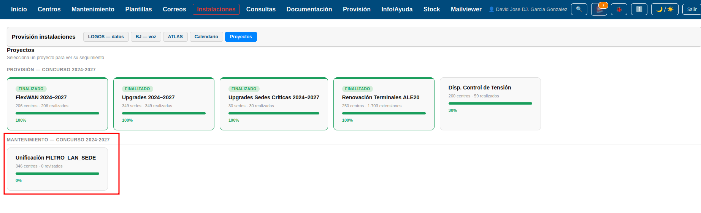
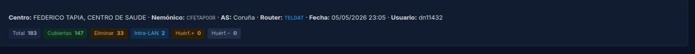
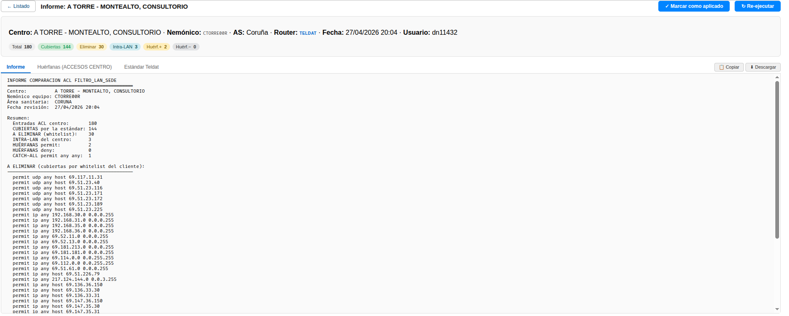
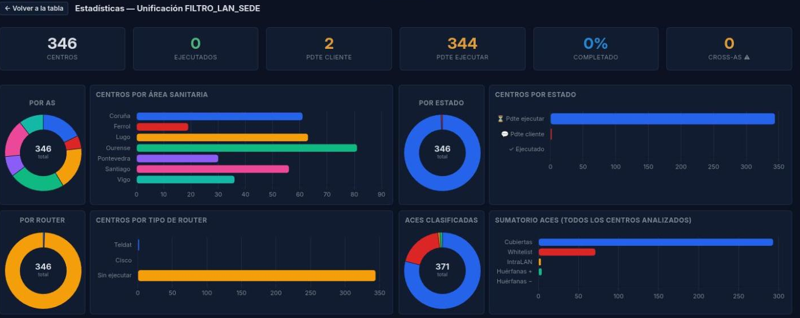

# Manual de Usuario -- Proyecto Unificacion FILTRO_LAN_SEDE

| Campo       | Valor                          |
|-------------|--------------------------------|
| **Módulo**  | Logos BJ -- Proyectos          |
| **Proyecto**| Unificacion FILTRO_LAN_SEDE    |
| **Versión** | 1.0                            |
| **Fecha**   | Abril 2026                     |
| **Para**    | Operadores CGE SERGAS          |

---

## Indice

1. [Para que sirve este proyecto](#1-para-que-sirve-este-proyecto)
2. [Acceder al proyecto](#2-acceder-al-proyecto)
3. [La pantalla principal](#3-la-pantalla-principal)
4. [Filtrar la tabla](#4-filtrar-la-tabla)
5. [Ejecutar el comparador en un centro](#5-ejecutar-el-comparador-en-un-centro)
6. [Interpretar el informe](#6-interpretar-el-informe)
7. [Aplicar el estándar al router y cerrar el centro](#7-aplicar-el-estandar-al-router-y-cerrar-el-centro)
8. [Re-ejecutar un centro](#8-re-ejecutar-un-centro)
9. [Exportar a Excel](#9-exportar-a-excel)
10. [Exportar a ZIP](#10-exportar-a-zip)
11. [Estadisticas](#11-estadisticas)
12. [Dudas frecuentes](#12-dudas-frecuentes)

---

## 1. Para que sirve este proyecto

Todos los routers de los centros SERGAS tienen una **lista de control de
acceso** llamada `FILTRO_LAN_SEDE`. Esa lista decide que tráfico se permite
salir de la red del centro hacia el exterior.

Con los anos, esa lista se ha ido ensuciando: cada centro tiene la suya con
entradas viejas, repetidas u obsoletas. El objetivo del proyecto es **dejar
todos los centros con la misma lista limpia y estandarizada**, más un pequeño
bloque propio del centro cuando haga falta.

La aplicación lo automatiza:
- **Lee** la configuración actual del router del centro.
- **Compara** entrada por entrada contra el estandar.
- **Clasifica** cada línea (cubierta, eliminar, mantener, sospechosa, etc.).
- **Genera** la lista estándar lista para aplicar al router.
- Te permite **marcar el centro** cuando ya se ha aplicado.

Hay **346 centros** en el proyecto.

---

## 2. Acceder al proyecto

1. Abre la aplicación **Web BDU** en tu navegador.
2. En el menu lateral, haz clic en **Logos BJ**.
3. En la parte superior, abre la pestana **Proyectos**.
4. En la categoría **Mantenimiento**, haz clic en la tarjeta
   **Unificacion FILTRO_LAN_SEDE**.

---

## 3. La pantalla principal

Una vez dentro veras una pagina con tres zonas:

### 3.1 Cabecera

- A la izquierda, el boton **<- Proyectos** para volver.
- En el centro, el título del proyecto.
- A la derecha, el boton **Estadisticas** (ver seccion 11).

### 3.2 Indicadores (KPIs)

Justo debajo de la cabecera tienes 4 números grandes y una barra de progreso:

| Indicador | Que significa |
|-----------|---------------|
| **Total** | Cuantos centros tiene el proyecto en total. |
| **Ejecutados** | Centros donde el estándar ya se ha aplicado al router. |
| **Pdte cliente** | Centros con el informe ya generado, esperando que el cliente / técnico lo aplique al router. |
| **Pdte ejecutar** | Centros sin procesar todavia. |

La **barra de progreso** muestra el porcentaje de centros ya **Ejecutados**
sobre el total.

### 3.3 Filtros y acciones

Una barra con:
- Buscador libre (escribes nombre de centro o nemonico).
- Selector de **Area Sanitaria**.
- Selector de **Estado**.
- Selector de **Tipo router** (Teldat o Cisco).
- Contador de centros que cumplen los filtros.
- Boton **Exportar Excel**.
- Boton **Exportar ZIP**.
- Boton **Marcar seleccionados como aplicados** (solo aparece cuando hay
  centros marcados con checkbox).

### 3.4 Tabla de centros

Una fila por centro. Las columnas son:

| Columna | Que muestra |
|---------|-------------|
| **Centro** | Nombre del centro. |
| **Area Sanitaria** | A que AS pertenece (Santiago, Coruna...). |
| **Tipo sede** | Categoría de la sede (CS, PAC, Hospital...). |
| **Nemonico** | Identificador corto del router. |
| **Router** | Teldat o Cisco. Vacio si aun no se ha ejecutado. |
| **ACEs** | Número total de entradas en la ACL del centro. |
| **OK** | Cuantas están ya cubiertas por el estandar. |
| **WL** | Cuantas se pueden eliminar (whitelist). |
| **IntraLAN** | Tráfico interno del centro (siempre se mantiene). |
| **Huerf. +** | Permits huerfanos (candidatas a revisar). |
| **Huerf. -** | Denys huerfanos. |
| **⚠ AS** | Anomalias Cross-AS detectadas (en rojo). |
| **Fecha** | Cuando se ejecuto el comparador. |
| **Estado** | El estado actual del centro. |
| (acciones) | Botones de la fila (ver siguiente apartado). |

### 3.5 Botones de cada fila

Dependiendo del estado del centro veras unos u otros botones:

| Estado | Botones disponibles |
|--------|---------------------|
| **Pdte ejecutar** ⏳ | **▶** (azul) -- Ejecutar comparador |
| **Pdte cliente** 💬 | Checkbox + **📄** (verde) Ver informe + **↻** (naranja) Re-ejecutar |
| **Ejecutado** ✓ | **📄** (verde) Ver informe + **↻** (naranja) Re-ejecutar |

---

## 4. Filtrar la tabla

Puedes combinar varios filtros a la vez. Conforme tecleas o cambias un
desplegable, la tabla y los contadores se actualizan al instante.

**Casos tipicos:**
- Para revisar solo los centros que ya tienen informe esperando aplicar al
  router: filtra **Estado = Pdte cliente**.
- Para empezar a procesar centros pendientes de un area concreta: filtra
  **Estado = Pdte ejecutar** y **AS = (la que toque)**.
- Para localizar centros con anomalias: ordena visualmente por la columna
  ⚠ AS o exporta a Excel y filtra alli.

> **Importante:** los botones **Exportar Excel** y **Exportar ZIP** descargan
> solo los centros que cumplen los filtros activos en ese momento.

---

## 5. Ejecutar el comparador en un centro

Cuando un centro esta en estado **Pdte ejecutar**, su fila tiene un boton
**▶ azul**. Al pulsarlo:

1. La aplicación busca automáticamente la **última configuración del router**
   en el NAS del centro.
2. Lee la ACL FILTRO_LAN_SEDE.
3. La compara contra el estándar y la whitelist.
4. Genera 3 ficheros de salida y los guarda en el NAS.
5. Te lleva directamente al **visor del informe** (sin tener que recargar).
6. El estado del centro pasa automáticamente a **Pdte cliente**.

**Si no encuentra la configuración en el NAS,** la aplicación abre la pagina
en **modo manual** y te muestra un cuadro de texto. Pega ahí el `show running-config`
del router y pulsa **Procesar**.

---

## 6. Interpretar el informe

El visor tiene **3 pestanas**:

### 6.1 Pestana Informe

Texto completo con el desglose de la ACL del centro:
- Resumen con totales (cuantas cubiertas, cuantas a eliminar, etc.).
- Cada entrada original del centro etiquetada con su clasificacion.
- Bloque final destacando las **anomalias Cross-AS** si las hay.

**Categorías posibles:**

| Categoría | Que significa | Que hacer |
|-----------|--------------|-----------|
| **CUBIERTA** | El estándar ya tiene una entrada equivalente o más amplia. | Eliminar del centro -- desaparece al aplicar el estandar. |
| **ELIMINAR** (whitelist) | Coincide exactamente con la lista blanca de "se puede borrar". | Eliminar -- desaparece al aplicar el estandar. |
| **INTRA_LAN** | Tráfico interno del propio centro. | Mantener siempre. El estándar la conserva. |
| **CATCH_ALL** | Es el `deny ip any any` o `permit ip any any` final. | Se reemplaza por el del estandar. |
| **HUERFANA** | No esta cubierta por nada. | Revisar caso a caso. Suele ir al bloque ACCESOS CENTRO. |
| **Cross-AS** ⚠ | Apunta a IPs de otra Area Sanitaria. | Sospechosa -- probablemente obsoleta. Confirmar con el cliente antes de eliminar. |

### 6.2 Pestana Huerfanas

Aquí están **solo las huerfanas**, en formato listo para pegar en el bloque
**ACCESOS CENTRO** del estandar. Es la lista que tienes que **revisar con
el cliente** antes de aplicar.

### 6.3 Pestana Estándar Teldat

La ACL estándar generada para el centro, en sintaxis **Teldat**, lista para
copiar y pegar en el router. Si el centro tuviera Cisco, igualmente se genera
en Teldat (sintaxis principal del proyecto) y el técnico la traduce o usa la
herramienta de traductor que esta en el módulo **Plantillas**.

Caracteristicas de la ACL generada:
- Esta numerada por **bloques** con espacio para crecer (B1: entries 10-1000,
  B2: 1010-2000, etc.).
- La primera y última entry de cada bloque llevan una `description`
  identificativa entre comillas: `description "INI SAMBA AREA SANITARIA"`,
  `description "FIN SAMBA AREA SANITARIA"`.

### 6.4 Botones del visor

En cada pestana, arriba a la derecha:
- **Copiar** -- Copia el contenido al portapapeles.
- **Descargar** -- Baja un fichero `.txt`.

Y arriba en la cabecera del visor:
- **✓ Marcar como aplicado** (solo aparece si el centro esta en Pdte cliente).

---

## 7. Aplicar el estándar al router y cerrar el centro

El paso de aplicar la ACL al router lo hace el **técnico de campo o de
intervencion** (tipicamente fuera de la aplicación). Una vez aplicado:

### 7.1 Cerrar un centro individual

1. Entra en el visor de ese centro (boton 📄 verde de su fila).
2. Pulsa **✓ Marcar como aplicado** en la cabecera.
3. Confirma. El centro pasa a **Ejecutado**.

### 7.2 Cerrar varios centros a la vez

1. En la tabla principal, filtra por **Estado = Pdte cliente**.
2. Marca los checkboxes de los centros que quieres cerrar.
3. Aparece el boton **✓ Marcar seleccionados como aplicados (N)** en la barra
   de filtros (con el número de seleccionados entre parentesis).
4. Pulsalo. Confirma.
5. Todos los centros seleccionados pasan a **Ejecutado** y la pagina se recarga.

> El campo **Usuario** de cada fila se rellena automáticamente con tu LDAP
> al marcar como aplicado.

---

## 8. Re-ejecutar un centro

A veces hace falta volver a pasar el comparador a un centro ya procesado:
- Se actualizo el estándar o la whitelist.
- El cliente pidio una segunda revision.
- Hubo un cambio en el router del centro.

Pulsa el boton **↻ naranja** en la fila del centro. Vuelve a arrancar el
proceso completo (descrito en la seccion 5) y sobreescribe los ficheros
generados.

---

## 9. Exportar a Excel

El boton **⬇ Exportar Excel** en la barra de filtros descarga un fichero
`.xlsx` con **solo la tabla** del listado.

- Respeta los **filtros activos**: si filtras por Lugo + Pdte cliente, solo
  saldran esos centros.
- El Excel tiene la cabecera azul, auto-filtro activado y la primera fila
  congelada.
- Nombre del fichero:
  `unificacion_filtro_lan_sede_AAAAMMDD_HHMM.xlsx`.

Util para enviar al cliente, llevar a una reunion, hacer cuentas aparte,
generar tu propio listado por AS, etc.

---

## 10. Exportar a ZIP

El boton **⬇ Exportar ZIP** descarga un paquete completo con:
- `listado.csv` -- la tabla de los centros filtrados, en CSV.
- Una carpeta por cada centro **que ya tiene informe** (Pdte cliente o
  Ejecutado), conteniendo sus tres ficheros:
  - `<nemonico>_informe.txt`
  - `<nemonico>_huerfanas.txt`
  - `<nemonico>_estandar_teldat.txt`

También respeta los filtros activos. Util para enviar al cliente todo el
trabajo de un area sanitaria de una sola vez.

---

## 11. Estadisticas

Pulsa el boton **📊 Estadisticas** en la cabecera. Se abre una pagina con:

### 11.1 Indicadores

Los mismos KPIs que el listado, con dos extras:
- **% Completado** -- porcentaje de centros ejecutados.
- **Cross-AS ⚠** -- total de anomalias Cross-AS detectadas en todos los
  centros procesados.

### 11.2 Gráficas

Cuatro pares de **donut + barras**, uno al lado del otro:

| Gráfica | Que muestra |
|---------|-------------|
| **Por AS** | Reparto de centros entre las 7 areas sanitarias. |
| **Por estado** | Cuantos centros en cada estado (pdte ejecutar / pdte cliente / ejecutado). |
| **Por router** | Cuantos centros Teldat vs Cisco vs sin ejecutar. |
| **ACEs clasificadas** | Sumatorio de las 5 categorías en todos los centros: Cubiertas, Whitelist, IntraLAN, Huerfanas+, Huerfanas-. |

Volver al listado: boton **<- Volver a la tabla** arriba a la izquierda.

---

## 12. Dudas frecuentes

### Al pulsar ▶ aparece pagina en blanco
La aplicación no encontro la configuración del router en el NAS. Avisa al
técnico responsable o usa el modo manual pegando el `show run` del router.

### Un centro debería estar en el proyecto y no aparece
- Comprueba en el detalle del centro (módulo Centros) que tiene **Area
  Sanitaria** asignada.
- Si no esta dado de alta en el proyecto, avisa al administrador para que
  lo anada a la lista.

### El comparador me marca como ELIMINAR una entrada que el cliente quiere conservar
La entrada esta en la whitelist `aces_permitidas_eliminar.txt`. Si el cliente
discrepa, comunicalo para que se revise el contenido de la whitelist y, si
procede, se quite esa linea.

### Una entrada SAMBA aparece como CUBIERTA pero al aplicar el estándar se rompe el tráfico
**No debería ocurrir** -- el comparador esta diseñado para no tapar entradas
SAMBA con whitelists genericas. Si pasa, avisa al equipo de desarrollo con el
nombre del centro y la entrada concreta.

### Hay muchas anomalias Cross-AS en un centro
Suele ser señal de que el centro tuvo en su día conexiones que ya no
existen, o bien que cambio de AS y quedaron entradas viejas. **Revisar con
el cliente antes de descartar nada.**

### ¿Puedo dar marcha atrás tras marcar un centro como aplicado?
Si te equivocas, pulsa **↻ Re-ejecutar** y volvera a generar el informe. El
estado quedara de nuevo en **Pdte cliente** hasta que se vuelva a aplicar.

### ¿Quien ve los ficheros del NAS?
Cualquier usuario autorizado puede acceder al NAS por SMB. Los ficheros
generados están en:
`/mnt/centros/tareas/unificacion_acls/<area>/<nemonico>/`.

### ¿Cada cuanto se debe revisar el estándar y la whitelist?
Cuando aparezcan muchas huerfanas iguales en centros del mismo AS, es señal
de que esa entrada debería incorporarse al bloque del AS en el estandar.
Comunicalo para actualizar los catalogos.

---

## Soporte

Cualquier incidencia o sugerencia, abrelo en el sistema de tickets habitual
o contacta con el equipo del CGE SERGAS.
