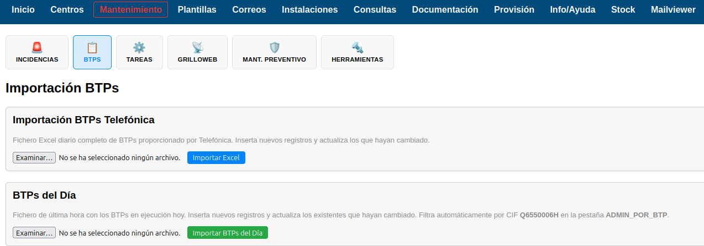
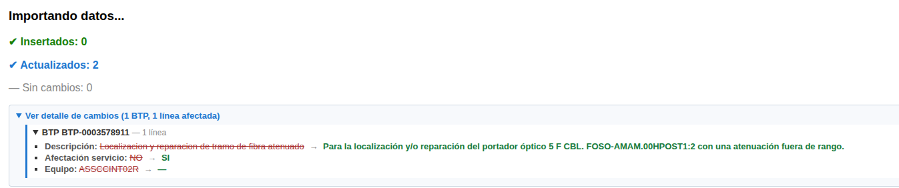
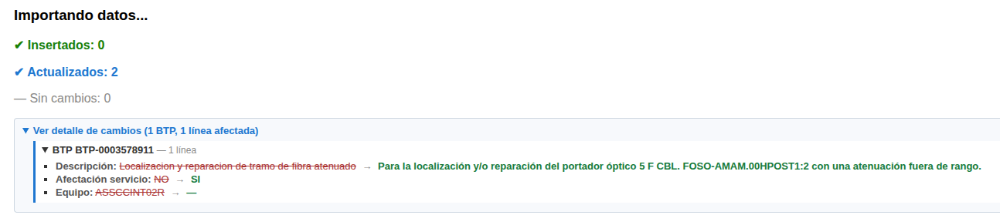
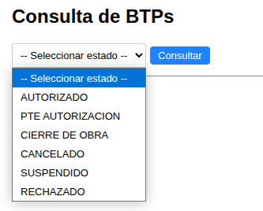
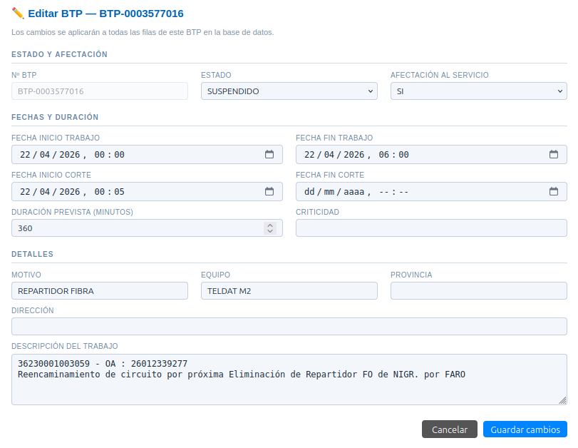
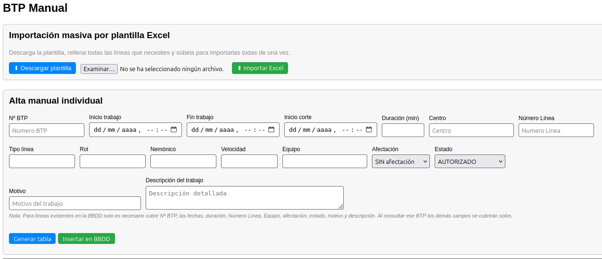
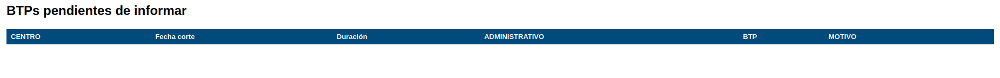

# Manual de Usuario: Módulo BTPs

| Campo       | Valor                              |
|-------------|------------------------------------|
| **Módulo**  | Mantenimiento > BTPs               |
| **Versión** | 1.6                                |
| **Fecha**   | Abril 2026                         |
| **Para**    | Operadores CGE SERGAS              |

---

## Indice

1. [Descripción general](#1-descripción-general)
2. [Importar BTPs desde Excel](#2-importar-btps-desde-excel)
3. [Consulta por estado](#3-consulta-por-estado)
4. [Consulta por número de BTP](#4-consulta-por-número-de-btp)
5. [BTP Manual](#5-btp-manual)
6. [BTPs Pendientes](#6-btps-pendientes)
7. [Revisión diaria](#7-revisión-diaria)
8. [Resumen del flujo típico del operador](#8-resumen-del-flujo-típico-del-operador)

---

## 1. Descripción general

El módulo **BTPs** permite gestionar los **Boletines de Trabajo Programados** en la red de Telefónica para SERGAS: importarlos desde los ficheros Excel que envía Telefónica, consultarlos por estado o por número, dar de alta BTPs manuales, y controlar cuáles están pendientes de informar al cliente.

### 1.1. Conceptos básicos para nuevas incorporaciones

- **BTP (Boletín de Trabajo Programado):** ventana de tiempo en la que se va a realizar un trabajo planificado sobre la red (un corte, una actuación, una migración, etc.). Cada BTP tiene un número único, una franja horaria y puede afectar a una o muchas líneas a la vez.
- **Línea:** identificador del circuito o servicio afectado (administrativo, número de línea o id interno). Un mismo BTP puede arrastrar 1, 10 o 100 líneas si el trabajo afecta a varias sedes o circuitos.
- **Estado del BTP:** indica en qué fase está. Los valores posibles son `AUTORIZADO`, `PTE AUTORIZACIÓN`, `CIERRE DE OBRA`, `CANCELADO`, `SUSPENDIDO` y `RECHAZADO`.
- **Afectación al servicio:** indica si el trabajo cortará o no el servicio al usuario final (`SI` / `NO`). Influye en el color del botón de copiar y en el asunto del correo al cliente.
- **Informado al cliente:** marca interna que indica que ya se ha enviado el correo de aviso al cliente sobre ese BTP. Una vez informado, la fila del BTP cambia a verde claro en las consultas.

### 1.2. Cómo acceder al módulo

1. En el menú lateral de BDU, pulsa **Mantenimiento**.
2. Pulsa la tarjeta **BTPs**. Se desplegará un acordeón con todas las opciones del módulo: *Importación BTPs, Consulta Estado, Consulta Nº BTP, BTP Manual, BTPs Pendientes* y el botón morado *Revisión diaria*.

---

## 2. Importar BTPs desde Excel

Desde el menú de Mantenimiento, pulsa la tarjeta **BTPs** y selecciona **Importación BTPs**.

Verás dos paneles de importación. Cada uno está pensado para un tipo de fichero distinto:

### 2.1. Importar Excel completo de Telefónica

Este método se usa con el **fichero Excel diario completo** que envía Telefónica con todos los BTPs activos. Inserta los BTPs nuevos y **actualiza** los que ya existían si han cambiado (cambio de estado, fechas, motivo, etc.).

1. Pulsa **Seleccionar archivo** y elige el fichero `.xlsx` de Telefónica.
2. Pulsa **Importar**.
3. Espera a que se procese. Al terminar verás un resumen con:
   - Registros **insertados** (BTPs nuevos que no existían).
   - Registros **actualizados** (ya existían pero tenían cambios).
   - Registros **sin cambios** (ya estaban al día).

### 2.2. Importar BTPs del Día

Este método se usa con el **fichero de última hora** con los BTPs en ejecución hoy (pestaña `ADMIN_POR_BTP`, filtrado automáticamente por CIF de SERGAS `Q6550006H`). Inserta los BTPs nuevos y **actualiza** los que ya existían si han cambiado (estado, fechas, duración, equipo, afectación, motivo o descripción).

1. Pulsa **Seleccionar archivo** y elige el fichero `.xlsx`.
2. Pulsa **Importar BTPs del Día**.
3. Al terminar verás un resumen con:
   - Registros **insertados**.
   - Registros **actualizados**.
   - Registros **sin cambios**.
   - Registros **ignorados** (de otro CIF, no son de SERGAS).
   - **Errores** (si los hubiera).

> **Diferencia entre las dos vías:** ambas insertan y actualizan; lo que cambia es el **fichero de origen** (la primera consume el Excel completo de Telefónica, la segunda la pestaña `ADMIN_POR_BTP` del fichero diario de última hora) y el **conjunto de columnas** que aporta cada uno.

### 2.3. Detalle de cambios tras la importación

Tanto en la importación del Excel completo como en la de BTPs del Día (y también en la importación masiva manual de la sección 5.1), justo debajo del resumen de contadores aparece un bloque plegable:

> ▶ **Ver detalle de cambios** (N BTPs, M líneas afectadas)

Pulsa sobre él para desplegarlo. Verás un sub-bloque por cada BTP modificado, y dentro de él la lista de campos que han cambiado, con el formato:

> **Estado:** AUTORIZADO → CANCELADO
> **Fecha inicio corte:** 22/04/2026 08:00 → 23/04/2026 09:30

Si un mismo cambio afecta a todas las líneas del BTP (por ejemplo, un cambio de estado que arrastra a las 100 líneas del boletín), se muestra **una sola vez** para no duplicar información.

Este detalle te permite confirmar exactamente qué se ha actualizado en cada importación, sin tener que adivinar qué BTPs han sido tocados.

---

## 3. Consulta por estado

Desde el menú BTPs, selecciona **Consulta Estado**.

### 3.1. Buscar BTPs por estado

1. Selecciona un **estado** en el desplegable:
   - AUTORIZADO
   - PTE AUTORIZACIÓN
   - CIERRE DE OBRA
   - CANCELADO
   - SUSPENDIDO
   - RECHAZADO
2. Pulsa **Consultar**.
3. Se mostrará la tabla con todos los BTPs en ese estado.

### 3.2. Buscar dentro de los resultados

Encima de la tabla hay un **campo de búsqueda**. Escribe cualquier dato (centro, BTP, motivo, nemónico, administrativo, etc.) y pulsa **Buscar**. La tabla se filtrará por filas que contengan ese texto.

Para volver a ver todos los resultados pulsa **Limpiar**.

### 3.3. Navegar por páginas

- La tabla muestra **50 registros por página**.
- Si hay más, en la parte inferior aparece un paginador con los números de página y enlaces *Anterior / Siguiente*.

### 3.4. Cambiar el estado de un BTP

1. En la columna **ESTADO** de cada fila verás un desplegable con el estado actual.
2. Selecciona el nuevo estado.
3. La fila desaparecerá con una animación suave (porque ya no pertenece al estado que estás consultando).

> **Importante:** el cambio de estado se aplica a **todas las líneas del BTP** en la base de datos, no solo a la fila que has tocado. Es decir, si un BTP tiene 100 líneas, las 100 cambian de estado a la vez.

### 3.5. Exportar resultados (CSV / PDF / Excel)

Los botones **CSV**, **PDF** y **Excel** **solo aparecen una vez has seleccionado un estado** y pulsado *Consultar*. Antes de eso, en la fila de filtro solo verás el botón *Consultar*.

Una vez tengas la tabla cargada con un estado:

1. Pulsa el formato deseado (**CSV**, **PDF** o **Excel**).
2. Se descargará el fichero con todos los BTPs de ese estado (no se aplica el filtro del buscador a la exportación).

### 3.6. Colores de las filas

- **Fila con fondo verde claro:** BTP ya informado al cliente.
- **Fila con fondo amarillo claro:** BTP `AUTORIZADO` pero pendiente de informar.

---

## 4. Consulta por número de BTP

Desde el menú BTPs, selecciona **Consulta Nº BTP**.

### 4.1. Buscar un BTP

1. Escribe el **número de BTP** en el campo de búsqueda (mínimo 2 caracteres).
2. Aparecerá un **desplegable de sugerencias** con los BTPs que coinciden.
3. Pulsa sobre el BTP deseado o sigue escribiendo y pulsa **Consultar**.
4. Se mostrará la tabla con todas las líneas afectadas por ese BTP.

### 4.2. Copiar tabla e informar al cliente

Sobre la tabla hay un único botón grande:

- **"Copiar tabla e informar"** si el BTP aún no se ha informado.
- **"✔ Ya informado — Volver a copiar"** si ya se había marcado como informado.

El botón cambia de color según la afectación del BTP:

- **Rojo** si el BTP tiene afectación al servicio.
- **Azul** si no la tiene.

Al pulsarlo:

1. La tabla se copia al portapapeles.
2. El BTP se marca automáticamente como **informado al cliente** (las filas pasarán a verde claro al recargar).
3. Se abre tu cliente de correo con un mensaje preparado:
   - **Para:** soporte.comunicacions@sergas.es; soporte.voz@sergas.es
   - **CC:** cgp.sergas@telefonica.com, Evolucion.Comunicacions@sergas.es, Coordinacion.Rede@sergas.es, etc.
   - **Asunto:** "SERGAS Trabajos Programados - {fecha} - {nº BTP} (CON/SIN afectación)"
4. **Pega** la tabla con `Ctrl+V` en el cuerpo del correo y envía.

### 4.3. Cambiar el estado de un BTP en esta vista

En cada fila también puedes cambiar el estado desde el desplegable de la columna **ESTADO**, igual que en la consulta por estado.

> **Diferencia con la consulta por estado:** aquí la fila **no desaparece** al cambiar el estado (porque sigues mirando el mismo BTP). El cambio se aplica a todas las filas del BTP.

### 4.4. Editar un BTP en el modal

1. Pulsa el **icono del lápiz** (✏️) en la columna de la izquierda de la fila que quieras modificar.
2. Se abrirá una ventana modal con los campos editables agrupados en tres bloques:
   - **Estado y Afectación:** Estado, Afectación al servicio.
   - **Fechas y Duración:** Fecha inicio/fin trabajo, Fecha inicio/fin corte, Duración prevista (min), Criticidad.
   - **Detalles:** Motivo, Equipo, Provincia, Dirección, Descripción del trabajo.
3. El número de BTP aparece en gris y **no se puede modificar**.
4. Modifica los campos necesarios y pulsa **Guardar cambios**.
5. La página se recargará con los datos actualizados.

> **Importante:** los cambios del modal se aplican a **todas las filas de ese BTP** en la base de datos, no solo a la fila desde la que abriste el lápiz. Esto se indica también dentro del propio modal.

---

## 5. BTP Manual

Desde el menú BTPs, selecciona **BTP Manual**.

Esta vista tiene **dos secciones**: importación masiva por plantilla Excel y alta individual por formulario.

### 5.1. Importación masiva por plantilla

Útil cuando tienes que dar de alta varios BTPs a la vez que no vienen del Excel de Telefónica (por ejemplo, BTPs internos del CGE).

1. Pulsa **⬇ Descargar plantilla** para obtener un fichero Excel con el formato correcto.
2. Rellena la plantilla con los datos de los BTPs (una fila por BTP/línea).
   - Los campos **Afectación** (`SI` / `NO`) y **Estado** tienen desplegables predefinidos en el Excel.
3. Pulsa **Seleccionar archivo** y elige la plantilla rellenada.
4. Pulsa **⬆ Importar Excel**.
5. Verás el mismo resumen que en las importaciones del apartado 2 (insertados, actualizados, sin cambios), incluyendo el detalle plegable de cambios si has actualizado BTPs existentes.

### 5.2. Alta individual (formulario)

1. Rellena los campos del formulario:
   - **Nº BTP**, **Inicio trabajo**, **Fin trabajo**, **Inicio corte**, **Duración (min)**.
   - **Centro**, **Número Línea**, **Tipo línea**, **Rol**, **Nemónico**, **Velocidad**, **Equipo**.
   - **Afectación** (`CON afectación` / `SIN afectación`), **Estado**.
   - **Motivo**, **Descripción del trabajo**.
2. Tienes **dos botones**:
   - **Generar tabla:** muestra una vista previa del BTP en formato tabla, igual que la consulta por número (sin guardar nada en BD aún).
   - **Insertar en BBDD:** guarda el BTP en la base de datos. Antes de insertar **te pedirá confirmación** mediante un diálogo.

> **Atajo para líneas ya existentes en BDU:** si la línea (Número Línea) ya está dada de alta, **solo necesitas cubrir** Nº BTP, las fechas, duración, número de línea, equipo, afectación, estado, motivo y descripción. Centro, tipo de línea, rol, nemónico y velocidad se rellenarán solos al consultar el BTP después.

### 5.3. Si el BTP ya existe en BD

Si pulsas **Insertar en BBDD** y el número de BTP ya está dado de alta, verás un mensaje:

> *El BTP {número} ya existe en la base de datos.*

Debajo aparece un botón **Consultar ese BTP** que te lleva directamente a la vista de "Consulta por Nº BTP" para que lo revises o lo edites desde el modal de edición (apartado 4.4).

### 5.4. Copiar y enviar desde la vista previa

Tras pulsar **Generar tabla**, debajo del formulario aparece la tabla con un botón **Copiar tabla** (rojo o azul según la afectación seleccionada). Funciona igual que en la consulta por número: copia la tabla al portapapeles y abre el cliente de correo con el mensaje preparado.

---

## 6. BTPs Pendientes

Desde el menú BTPs, selecciona **BTPs Pendientes**.

Esta vista muestra todos los BTPs con estado **AUTORIZADO** que aún **no se han informado al cliente**. Es la "bandeja" de trabajo del operador para asegurarse de que ningún BTP sale al servicio sin avisar al cliente.

- La tabla muestra: **Centro**, **Fecha de corte**, **Duración**, **Administrativo**, **BTP**, **Motivo**.
- Las filas están ordenadas por **fecha de corte ascendente** (los más próximos primero).
- Todas las filas aparecen con fondo amarillo claro (color "pendiente").
- Pulsa el botón **Abrir** de cada fila para ir directamente a la consulta por número de ese BTP, donde podrás copiarlo, informarlo y enviar el correo (apartado 4.2).

---

## 7. Revisión diaria

Dentro del acordeón de BTPs, junto a las opciones del módulo, hay un **botón morado** llamado **Revisión diaria**.

Al pulsarlo se abre tu cliente de correo con un mensaje predefinido pensado para el envío diario al CGP de Telefónica:

- **Para:** cgp.sergas@telefonica.com.
- **Asunto:** incluye automáticamente la fecha del día.
- **Cuerpo:** plantilla de revisión diaria de BTPs ya redactada, lista para revisar y enviar.

No es necesario rellenar nada manualmente: solo revisar el contenido y pulsar enviar en el cliente de correo.

---

## 8. Resumen del flujo típico del operador

Para una nueva incorporación, el flujo del día a día con BTPs suele ser:

1. **Por la mañana:** importar el Excel completo de Telefónica desde *Importación BTPs* (sección 2.1) y luego, a lo largo del día, los ficheros *BTPs del Día* (sección 2.2) según vayan llegando. Revisar el detalle plegable de cambios para confirmar qué BTPs se han modificado (sección 2.3).
2. **Revisar pendientes de informar:** entrar en *BTPs Pendientes* (sección 6) y, por cada BTP pendiente, pulsar *Abrir* → *Copiar tabla e informar* → enviar el correo al cliente (sección 4.2).
3. **Cambios puntuales:** si Telefónica notifica un cambio de estado o de fecha de un BTP concreto, buscar el BTP en *Consulta Nº BTP* (sección 4.1) y editarlo desde el modal del lápiz (sección 4.4) o desde el desplegable de estado.
4. **Altas internas:** si el CGE necesita programar un BTP propio, darlo de alta desde *BTP Manual* (sección 5).
5. **Cierre del día:** enviar la *Revisión diaria* (sección 7).

---

*Manual para operadores CGE SERGAS. Versión 1.6 — Abril 2026.*
