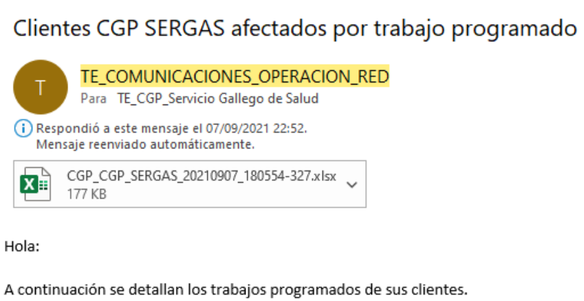
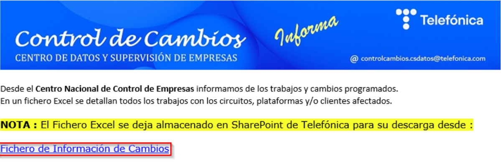
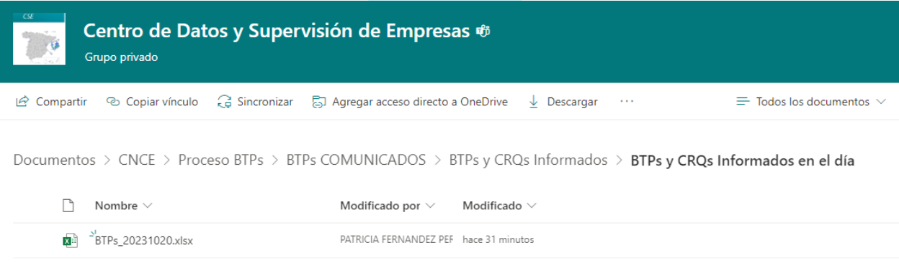
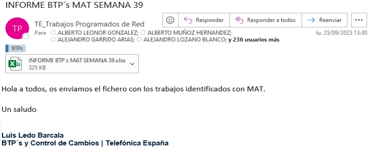
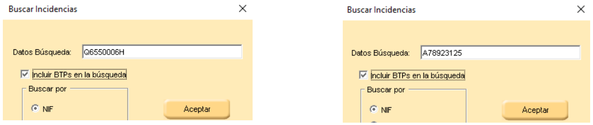
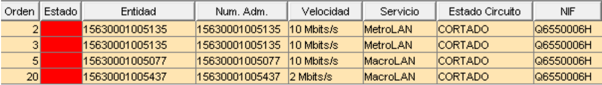
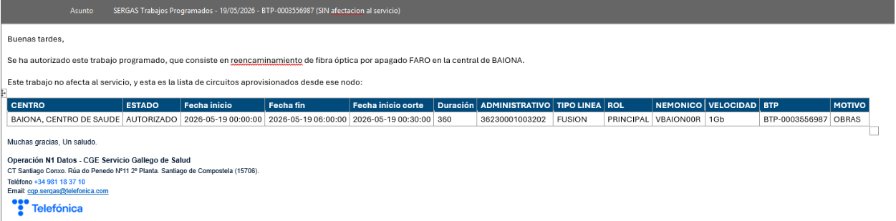

# Manual de Usuario: Módulo BTPs (BORRADOR v1.7)

| Campo       | Valor                                |
|-------------|--------------------------------------|
| **Módulo**  | Mantenimiento > BTPs                 |
| **Versión** | 1.7 (borrador, fusión con MAN_015)   |
| **Fecha**   | Abril 2026                           |
| **Para**    | Operadores CGE SERGAS                |

> **NOTA**: borrador de fusión del manual v1.6 actual con `MAN_015_Revision_de_BTPs.docx`. Antes de sustituir el manual oficial, revisamos contenido y formato.

---

## Índice

1. [Para qué sirve este módulo](#1-para-qué-sirve-este-módulo)
2. [Conceptos básicos](#2-conceptos-básicos)
3. [Cómo accedemos al módulo](#3-cómo-accedemos-al-módulo)
4. [Visión global del ciclo de BTPs](#4-visión-global-del-ciclo-de-btps)

### Procedimiento diario y semanal

5. [Tarea 1 — Correo TE_Grillo Comunicaciones (10:00 / 18:00 / 23:00)](#5-tarea-1--correo-te_grillo-comunicaciones)
6. [Tarea 2 — Correo Control de Cambios (13:00)](#6-tarea-2--correo-control-de-cambios)
7. [Tarea 3 — Correo TE_Trabajos Programados de Red (lunes)](#7-tarea-3--correo-te_trabajos-programados-de-red)
8. [Tarea 4 — Revisión diaria en SAFI](#8-tarea-4--revisión-diaria-en-safi)
9. [Tarea 5 — Reporte a SERGAS informando los trabajos](#9-tarea-5--reporte-a-sergas-informando-los-trabajos)
10. [Cierre de turno — Revisión diaria](#10-cierre-de-turno--revisión-diaria)

### El día del BTP

11. [Turno de tarde](#11-turno-de-tarde)
12. [Turno de noche](#12-turno-de-noche)
13. [Pasos obligatorios en TODOS los BTPs](#13-pasos-obligatorios-en-todos-los-btps)

### Otras consultas y herramientas

14. [Consulta por estado](#14-consulta-por-estado)
15. [BTPs Pendientes](#15-btps-pendientes)
16. [Dudas frecuentes](#16-dudas-frecuentes)

---

## 1. Para qué sirve este módulo

El módulo **BTPs** nos permite gestionar los **Boletines de Trabajo Programados** de Telefónica que afectan al SERGAS: importarlos, consultarlos, dar de alta BTPs manuales, copiar la tabla para informar al cliente y controlar cuáles están pendientes de informar.

El uso real del módulo se hace **junto con un procedimiento operativo diario** que combina correos externos, una plataforma corporativa (**SAFI**) y la propia web BDU. Este manual describe el flujo completo en orden cronológico.

> **Cumplimiento obligatorio.** Es de **OBLIGATORIO CUMPLIMIENTO** llevar a rajatabla todos los puntos descritos.

---

## 2. Conceptos básicos

- **BTP (Boletín de Trabajo Programado):** ventana de tiempo en la que se realiza un trabajo planificado sobre la red (corte, actuación, migración, etc.). Cada BTP tiene un número único, una franja horaria y puede afectar a una o muchas líneas a la vez.
- **Línea afectada:** identificador del circuito o servicio (administrativo, número de línea o ID interno). Un mismo BTP puede arrastrar 1, 10 o 100 líneas.
- **Estado del BTP:** indica en qué fase está. Valores: `AUTORIZADO`, `PTE AUTORIZACIÓN`, `CIERRE DE OBRA`, `CANCELADO`, `SUSPENDIDO`, `RECHAZADO`.
- **Afectación al servicio:** si el trabajo cortará o no el servicio (`SI` / `NO`). Influye en el color del botón de copiar y en el asunto del correo al cliente.
- **Informado al cliente:** marca interna que indica que ya se ha enviado el correo de aviso al cliente. Las filas pasan a verde claro.
- **CIFs SERGAS en SAFI:** `Q6550006H` y `A78923125` (los dos administrativos del cliente).

---

## 3. Cómo accedemos al módulo

1. Abrimos la **Web BDU** en el navegador.
2. En la barra superior pulsamos **Mantenimiento**.
3. Pulsamos la tarjeta **BTPs**. Se despliega un acordeón con todas las opciones del módulo: *Importación BTPs, Consulta Estado, Consulta Nº BTP, BTP Manual, BTPs Pendientes* y el botón morado *Revisión diaria*.

> **Atajo:** podemos llegar directamente con `?m=mantenimiento&sub=btps` añadido al final de la URL de BDU.

---

## 4. Visión global del ciclo de BTPs

Existen **tres correos** y **una revisión diaria en SAFI** que tratamos de lunes a viernes en el turno de tarde, además de la revisión final el día del BTP.

| # | Cuándo | De dónde / qué | Resultado en BDU |
|---|---|---|---|
| 1 | Diario 10:00 / 18:00 / 23:00 | Correo de **TE_Grillo Comunicaciones** con Excel adjunto | **Importación BTPs Telefónica** |
| 2 | Diario 13:00 | Correo de **controlcambios.csdatos@telefonica.com** con enlace SharePoint | **BTPs del Día** |
| 3 | Lunes | Correo de **trabajosprogramadosdered@telefonica.com** con BTPs nacionales semanales | Alta manual de los nuevos BTPs |
| 4 | Diario | Revisión en **SAFI** (`http://safi.sdr.tesa:9080/safi/`) | Alta de BTPs nuevos vía **BTP Manual** |
| 5 | Diario | Reporte por correo a **SERGAS** con la afectación | Plantilla desde **Consulta Nº BTP** |
| – | Día del BTP | Turnos tarde y noche revisan iGri / monitorización / CNCE | Cambios de estado en BDU |

Al final de cada tarea (1, 2, 3, 4) **enviamos un correo `##INTERNO##`** a `cgp.sergas@telefonica.com` indicando que se ha realizado la comprobación.

---

## 5. Tarea 1 — Correo TE_Grillo Comunicaciones

Recibimos un correo de **TE_Grillo Comunicaciones** a las **10:00 horas** con un Excel adjunto con los datos de los nuevos BTPs. Si hay modificaciones, recibimos otro a las **18:00** y otro a las **23:00**.

### 5.1. Importar el Excel en BDU (Importación BTPs Telefónica)

Esta importación se usa con el **Excel diario completo** que envía Telefónica con todos los BTPs activos. Inserta los nuevos y **actualiza** los existentes si han cambiado (estado, fechas, motivo, etc.).

1. Descargamos el Excel adjunto al correo.
2. En la BDU vamos a **Mantenimiento → BTPs → Importación BTPs**.
3. En el panel **Importación BTPs Telefónica**, pulsamos **Seleccionar archivo** y elegimos el `.xlsx`.
4. Pulsamos **Importar**.
5. Esperamos a que termine. Vemos un resumen con:
   - **Insertados** (BTPs nuevos).
   - **Actualizados** (existían pero cambiaron).
   - **Sin cambios** (estaban al día).

> **Columnas clave del Excel**: la **columna H** es el número de BTP (lo usamos para consultar en BDU) y la **columna I** es el estado (importante para detectar `RECHAZADO`, `AUTORIZADO` o `PENDIENTE`).

### 5.2. Detalle de cambios tras la importación

Justo debajo del resumen aparece un bloque plegable:

> ▶ **Ver detalle de cambios** (N BTPs, M líneas afectadas)

Lo desplegamos para ver un sub-bloque por cada BTP modificado con la lista de campos que cambiaron:

> **Estado:** AUTORIZADO → CANCELADO
> **Fecha inicio corte:** 22/04/2026 08:00 → 23/04/2026 09:30

Si un cambio afecta a todas las líneas del BTP, se muestra **una sola vez** para no duplicar.

### 5.3. Cierre de la tarea

Enviamos un correo **`##INTERNO##`** a `cgp.sergas@telefonica.com` indicando que se ha hecho la comprobación y se ha integrado el Excel en la BDU.

---

## 6. Tarea 2 — Correo Control de Cambios

Recibimos a las **13:00 horas** un correo de `controlcambios.csdatos@telefonica.com` con las modificaciones que hayan podido surgir en los BTPs previstos para ese mismo día.

### 6.1. Acceder al SharePoint y descargar el Excel

1. En el correo veremos un enlace **Fichero de Información de Cambios**. Lo pulsamos.
2. Nos pedirá el correo de Telefónica y las credenciales **EDOMUS**.
3. Accedemos al **SharePoint** con el Excel compartido.
4. Descargamos el Excel de la carpeta compartida.

### 6.2. Importar el Excel en BDU (BTPs del Día)

Esta importación se usa con el **fichero de última hora** con los BTPs en ejecución hoy (pestaña `ADMIN_POR_BTP`, filtrado por CIF de SERGAS `Q6550006H`).

1. En la BDU vamos a **Mantenimiento → BTPs → Importación BTPs**.
2. En el panel **BTPs del Día**, pulsamos **Seleccionar archivo** y elegimos el Excel descargado.
3. Pulsamos **Importar BTPs del Día**.
4. Vemos el resumen con: **Insertados**, **Actualizados**, **Sin cambios**, **Ignorados** (otros CIF) y **Errores**.

> **Diferencia con la importación de la Tarea 1**: ambas insertan y actualizan; lo que cambia es el **fichero de origen** (la primera consume el Excel diario completo, esta consume la pestaña `ADMIN_POR_BTP` del fichero de última hora) y las **columnas** que aporta cada uno.

Tras la importación aparece el mismo bloque desplegable de detalle de cambios visto en la [sección 5.2](#52-detalle-de-cambios-tras-la-importación).

### 6.3. Revisar el Excel manualmente y contrastar con BDU

Antes de cerrar la tarea, revisamos el Excel en busca de información que pueda no estar bien integrada:

1. **Filtramos por las provincias de Galicia**: *Ourense, A Coruña, Pontevedra, Lugo* en **todas las pestañas** del Excel.
2. La pestaña más relevante suele ser **RED FUSIÓN**, pero no debemos saltarnos las demás (`PLTA.EXT`, `ENERGIA`...): pueden incluir BTPs no informados debidamente, como mantenimientos eléctricos de la central de Conxo.
3. Contrastamos con los BTPs ya documentados en la BDU. Si hay modificaciones, las aplicamos y avisamos al cliente reenviando el correo correspondiente con las novedades.

### 6.4. Cierre de la tarea

Reenviamos el correo recibido añadiendo en el asunto **`##INTERNO##`** a `cgp.sergas@telefonica.com`, indicando que se ha realizado la comprobación.

---

## 7. Tarea 3 — Correo TE_Trabajos Programados de Red

Los **lunes** recibimos un correo de `trabajosprogramadosdered@telefonica.com` con la previsión de BTPs por semanas a nivel nacional.

### 7.1. Filtrar el Excel por provincias gallegas

1. Abrimos el Excel adjunto.
2. Pulsamos **Ctrl + Shift + L** sobre la línea **D [Provincia]** para activar el filtro.
3. Filtramos por las **4 provincias de Galicia**: *Pontevedra, A Coruña, Ourense, Lugo*.
4. Pulsamos **Aceptar**.

### 7.2. Documentar los BTPs nuevos en la BDU (BTP Manual)

El Excel **no tiene información cruzable** con la BDU directamente, así que la revisión es manual:

1. Una vez filtradas las provincias gallegas, miramos qué BTPs ya tenemos documentados en la BDU para no duplicarlos.
2. Los **BTPs nuevos** los damos de alta con la **importación masiva** de **BTP Manual** (ver detalle a continuación).

#### Importación masiva por plantilla (BTP Manual)

Útil para los BTPs que no vienen del Excel de Telefónica integrable.

1. Vamos a **Mantenimiento → BTPs → BTP Manual**.
2. En el panel de **importación masiva**, pulsamos **⬇ Descargar plantilla** para obtener un Excel con el formato correcto.
3. Rellenamos la plantilla con los datos de los BTPs (una fila por BTP/línea). Los campos **Afectación** (`SI`/`NO`) y **Estado** tienen desplegables predefinidos en el Excel.
4. Pulsamos **Seleccionar archivo** y elegimos la plantilla rellenada.
5. Pulsamos **⬆ Importar Excel**.
6. Vemos el resumen igual que en las importaciones de las tareas 1 y 2.

### 7.3. Cierre de la tarea

Reenviamos el correo recibido añadiendo en el asunto **`##INTERNO##`** a `cgp.sergas@telefonica.com`.

---

## 8. Tarea 4 — Revisión diaria en SAFI

Tarea **diaria** de revisión en la plataforma **SAFI** de los BTPs afectados para el SERGAS.

### 8.1. Abrir SAFI y buscar los CIFs del SERGAS

1. Abrimos http://safi.sdr.tesa:9080/safi/ con el usuario **`PRUEBAS`**.
2. Con el botón de búsqueda, buscamos los CIFs **`Q6550006H`** y **`A78923125`** marcando la opción **"Incluir BTPs"**.

3. Para el CIF del SERGAS revisamos la parte inferior de la ventana, donde aparecen los BTPs asociados.
4. Podemos **ordenar** los BTPs y añadir o quitar criterios con los botones de la barra de herramientas.

### 8.2. Pasar los BTPs nuevos a la BDU

Copiamos cada BTP de SAFI (clic derecho) y lo buscamos en la BDU. Tendremos dos casos:

| Caso | Acción |
|---|---|
| El BTP **ya está** en la BDU | Lo actualizamos si es necesario. |
| El BTP **NO está** en la BDU | Lo damos de alta. |

#### Sacar la lista de afectación de un BTP en SAFI

1. Pulsamos el botón **Lista Priorizada** o el de la página de libreta para ver la lista filtrable.
2. Filtramos por las líneas del SERGAS.
3. Copiamos toda la lista y la **pegamos en un Excel nuevo** con el formato necesario.

#### Dar de alta el BTP en BDU

Tenemos dos opciones, según convenga:

**A) Importación masiva** (varios BTPs a la vez): vamos a **BTP Manual**, descargamos la plantilla, rellenamos con los datos del BTP y los administrativos afectados, y la importamos como en la [sección 7.2](#72-documentar-los-btps-nuevos-en-la-bdu-btp-manual).

**B) Alta individual** (un BTP suelto): vamos a **Mantenimiento → BTPs → BTP Manual** y rellenamos el formulario:

1. Rellenamos los campos:
   - **Nº BTP**, **Inicio trabajo**, **Fin trabajo**, **Inicio corte**, **Duración (min)**.
   - **Centro**, **Número Línea**, **Tipo línea**, **Rol**, **Nemónico**, **Velocidad**, **Equipo**.
   - **Afectación** (`CON afectación` / `SIN afectación`), **Estado**.
   - **Motivo**, **Descripción del trabajo**.
2. Tenemos **dos botones**:
   - **Generar tabla**: vista previa del BTP en formato tabla, sin guardar nada.
   - **Insertar en BBDD**: guarda el BTP. Pide confirmación.

> **Atajo para líneas ya existentes en BDU**: si la línea (Número Línea) ya está dada de alta, **solo necesitamos cubrir** Nº BTP, las fechas, duración, número de línea, equipo, afectación, estado, motivo y descripción. Centro, tipo de línea, rol, nemónico y velocidad se rellenan solos al consultar el BTP después.

> Si pulsamos **Insertar en BBDD** y el BTP ya estaba dado de alta, vemos *"El BTP {número} ya existe en la base de datos"* y un botón **Consultar ese BTP** que nos lleva directamente a la consulta por número.

### 8.3. Cierre de la tarea — correo "Revisión diaria"

Como en cada tarea diaria, informamos al final con un correo. BDU tiene una plantilla — ver [sección 10](#10-cierre-de-turno--revisión-diaria).

---

## 9. Tarea 5 — Reporte a SERGAS informando los trabajos

Cuando ya tenemos revisada la **afectación**, los **centros afectados** y la **fecha de ejecución**, enviamos un correo a **SERGAS** con esa información.

### 9.1. Buscar el BTP en Consulta por Nº BTP

1. Vamos a **Mantenimiento → BTPs → Consulta Nº BTP**.
2. Escribimos el **número de BTP** (mínimo 2 caracteres).
3. Aparece un **desplegable de sugerencias**. Pulsamos sobre el deseado o seguimos escribiendo y pulsamos **Consultar**.
4. Se muestra la tabla con todas las líneas afectadas por ese BTP.

### 9.2. Copiar tabla e informar al cliente

Sobre la tabla hay un único botón grande:

- **"Copiar tabla e informar"** si el BTP aún no se ha informado.
- **"✔ Ya informado — Volver a copiar"** si ya se había marcado como informado.

El botón cambia de color según la afectación:

- **Rojo** si el BTP tiene afectación al servicio.
- **Azul** si no la tiene.

Al pulsarlo:

1. La tabla se copia al portapapeles.
2. El BTP se marca automáticamente como **informado al cliente** (las filas pasan a verde claro al recargar).
3. Se abre el cliente de correo con el mensaje preparado:
   - **Para:** `soporte.comunicacions@sergas.es; soporte.voz@sergas.es`
   - **CC:** `cgp.sergas@telefonica.com, Evolucion.Comunicacions@sergas.es, Coordinacion.Rede@sergas.es`, etc.
   - **Asunto:** *"SERGAS Trabajos Programados - {fecha} - {nº BTP} (CON/SIN afectación)"*
4. **Pegamos** la tabla con `Ctrl+V` en el cuerpo del correo.
5. **Corregimos el detalle de los trabajos** para que se entienda y resumimos en el campo **MOTIVO** lo más claro posible.

### 9.3. Editar el BTP si necesitamos retoques (modal)

Si tenemos que ajustar fechas, motivo, etc. antes de informar:

1. Pulsamos el **icono del lápiz** (✏️) en la columna izquierda de la fila.
2. Se abre un modal con los campos editables agrupados en tres bloques:
   - **Estado y Afectación**: Estado, Afectación al servicio.
   - **Fechas y Duración**: Fecha inicio/fin trabajo, Fecha inicio/fin corte, Duración prevista (min), Criticidad.
   - **Detalles**: Motivo, Equipo, Provincia, Dirección, Descripción del trabajo.
3. El número de BTP aparece en gris y **no se puede modificar**.
4. Modificamos los campos necesarios y pulsamos **Guardar cambios**.

> **Importante:** los cambios del modal se aplican a **todas las filas de ese BTP** en la base de datos, no solo a la fila desde donde abrimos el lápiz.

También podemos cambiar el estado directamente desde el desplegable de la columna **ESTADO** de cualquier fila. La fila no desaparece (seguimos mirando el mismo BTP) pero el cambio se aplica a todas las filas del BTP.

### 9.4. Buenas prácticas en el correo

- El **MOTIVO** debe ser claro y resumido — es la información en la que se fija el cliente.
- En el cuerpo, un breve resumen de **lo que se va a realizar y el porqué**. **No copiar la información directamente de SAFI o iGRI** — los clientes no tienen por qué entender la jerga interna de Telefónica.
- Si tenemos dudas sobre los trabajos, **consultamos con N2 o llamamos a las unidades operativas responsables** antes de enviar.

---

## 10. Cierre de turno — Revisión diaria

Dentro del acordeón de BTPs hay un **botón morado** llamado **Revisión diaria**.

Al pulsarlo se abre el cliente de correo con un mensaje predefinido pensado para el envío diario al CGP de Telefónica:

- **Para:** `cgp.sergas@telefonica.com`.
- **Asunto:** incluye automáticamente la fecha del día.
- **Cuerpo:** plantilla de revisión diaria de BTPs ya redactada.

No hace falta rellenar nada manualmente: solo revisamos el contenido y enviamos.

---

## 11. Turno de tarde

El día en que se ejecuta un trabajo programado, el turno de tarde revisa en **iGri** los BTPs que se ejecutarán esa noche y comprueba que siguen `AUTORIZADO`, así como sus anotaciones.

| Estado al revisar       | Acción                                                                                  |
|-------------------------|-----------------------------------------------------------------------------------------|
| Sigue **`AUTORIZADO`**  | Lo dejamos reflejado en el **correo de cambio de turno**, en el apartado correspondiente. |
| Pasó a **`RECHAZADO`** / **`CANCELADO`** / **`POSPUESTO`** | Enviamos correo a **SERGAS** informando del nuevo estado y modificamos el estado en la BDU. Avisamos al operador de la noche por correo o cambio de turno. |

---

## 12. Turno de noche

El operador del turno de noche revisa **TODOS los trabajos programados** para esa noche para poder informar al cliente debidamente.

### 12.1. Antes del comienzo

- Comprobamos por última vez en iGri que el BTP sigue `AUTORIZADO`. Si hay notas de cancelación o aplazamiento, **avisamos a SERGAS por correo** antes de la ventana.
- **Enviamos el correo de "comienzan los trabajos"** a SERGAS.

### 12.2. Durante la ejecución

- Comprobamos la **afectación** mirando los routers o las **alarmas sobre los circuitos en la monitorización WOCU**.
- Para líneas fuera de nuestra monitorización (**DIBAs y troncales**), consultamos en **GEISER** el cese de la alarma y preguntamos a **SERGAS** si pueden confirmar la recuperación.

### 12.3. Cierre del turno (07:00)

A las **07:00** debe haberse enviado el correo según el estado del trabajo: en observación, finalizado, cancelado, etc.

### 12.4. Si hay incidencias o más afectación de la prevista

1. **Llamar al grupo responsable del BTP**.
2. Desde el **CNCE** se habilita una **Webex** y un **Chat de seguimiento** donde se va informando de los trabajos: https://cnce.es.telefonica/. Allí podemos indicar más afectación o preguntar si todavía están realizando trabajos.

> **Importante**: si las incidencias caen sobre líneas **dentro de la afectación inicial del BTP**, los CEx **NO deben abrir avería**. Lo denuncian en Webex / Chat / teléfono del CNCE para que el CNCE avise a la unidad ejecutora.

> **Pero** si la incidencia es **fuera de la afectación del BTP**, sí se gestiona como incidencia normal.

---

## 13. Pasos obligatorios en TODOS los BTPs

Resumen del checklist mínimo que se cumple en cada BTP:

1. **A la hora de comienzo**: revisamos en **iGri** notas de cancelación o aplazamiento. Si todo sigue, **informamos a SERGAS por correo** del comienzo de los trabajos sobre cualquier BTP con administrativos del SERGAS, tenga o no afectación.
2. **Conectarnos al chat del CNCE**: https://cnce.es.telefonica/.
3. **Monitorizar y comprobar el servicio afectado** en WOCU / routers.
4. **Informar en el chat del CNCE** la afectación del BTP (aunque sea la prevista). Sacamos un recorte y lo pegamos en el calendario para justificar el trabajo.
5. **Comprobar que el servicio recupera** e informar a SERGAS de la finalización del trabajo y de la recuperación.

> **Recordatorio:** si caen circuitos **fuera de la afectación**, abrimos incidencia normal (no es una caída del BTP).

---

## 14. Consulta por estado

Vista de uso puntual cuando queremos sacar todos los BTPs en un estado concreto (por ejemplo, todos los `AUTORIZADO` para revisar pendientes manualmente, o todos los `RECHAZADO` para auditoría).

Desde **Mantenimiento → BTPs → Consulta Estado**.

### 14.1. Buscar BTPs por estado

1. Seleccionamos un **estado** en el desplegable: AUTORIZADO, PTE AUTORIZACIÓN, CIERRE DE OBRA, CANCELADO, SUSPENDIDO o RECHAZADO.
2. Pulsamos **Consultar**.
3. Vemos la tabla con todos los BTPs en ese estado.

### 14.2. Buscar dentro de los resultados

Encima de la tabla hay un **campo de búsqueda**. Escribimos cualquier dato (centro, BTP, motivo, nemónico, administrativo, etc.) y pulsamos **Buscar**. Para limpiar pulsamos **Limpiar**.

### 14.3. Navegar por páginas

La tabla muestra **50 registros por página**. Si hay más, abajo aparece el paginador con los números y los enlaces *Anterior / Siguiente*.

### 14.4. Cambiar el estado de un BTP

1. En la columna **ESTADO** de cada fila hay un desplegable con el estado actual.
2. Seleccionamos el nuevo estado.
3. La fila desaparece con una animación suave (ya no pertenece al estado consultado).

> **Importante:** el cambio de estado se aplica a **todas las líneas del BTP** en la base de datos, no solo a la fila tocada.

### 14.5. Exportar resultados

Los botones **CSV**, **PDF** y **Excel** **solo aparecen tras seleccionar un estado** y pulsar *Consultar*.

1. Pulsamos el formato deseado.
2. Se descarga el fichero con todos los BTPs de ese estado (no se aplica el filtro del buscador a la exportación).

### 14.6. Colores de las filas

- **Verde claro:** BTP ya informado al cliente.
- **Amarillo claro:** BTP `AUTORIZADO` pendiente de informar.

---

## 15. BTPs Pendientes

Vista de bandeja diaria. Desde **Mantenimiento → BTPs → BTPs Pendientes**.

Muestra todos los BTPs con estado **AUTORIZADO** que aún **no se han informado al cliente**. Es la "bandeja" del operador para asegurar que ningún BTP sale a producción sin avisar.

- La tabla muestra: **Centro**, **Fecha de corte**, **Duración**, **Administrativo**, **BTP**, **Motivo**.
- Las filas están ordenadas por **fecha de corte ascendente** (los más próximos primero).
- Todas las filas aparecen con fondo **amarillo claro** (color "pendiente").
- Pulsamos **Abrir** en cada fila para ir a la consulta por número de ese BTP, donde podemos copiarlo, informarlo y enviar el correo (ver [sección 9.2](#92-copiar-tabla-e-informar-al-cliente)).

---

## 16. Dudas frecuentes

**¿Por qué hay dos importaciones distintas?**
Porque vienen de dos correos distintos: el de TE_Grillo manda el Excel **completo** del día, y el de Control de Cambios manda solo las **modificaciones** de última hora con la pestaña `ADMIN_POR_BTP`. Las dos importaciones tienen el mismo comportamiento (insertar + actualizar), pero esperan ficheros distintos.

**¿Qué pasa si me equivoco al importar y subo el Excel del día equivocado?**
Si los BTPs son los mismos números, la BDU los actualiza con los datos del Excel nuevo. Si son distintos, se añaden como nuevos. No hay deshacer — corregimos volviendo a importar el Excel correcto.

**¿Puedo cambiar el motivo o las fechas de un BTP ya informado?**
Sí, desde el modal del lápiz (sección 9.3). Si los cambios afectan al cliente, **reenviamos** el correo a SERGAS con la novedad.

**¿Por qué algunas filas de la consulta por estado están en verde?**
Porque ya hemos pulsado *"Copiar tabla e informar"* sobre ese BTP — está marcado como informado al cliente.

**¿La importación masiva de BTP Manual reemplaza datos existentes?**
Sí: si el número de BTP ya existe en la BDU, se actualiza con los datos del fichero. Si no existe, se inserta como nuevo. Igual que las otras importaciones.

**Si un BTP se cancela durante el turno de noche, ¿qué hago?**
1. Cambiamos el estado en BDU desde *Consulta por Nº BTP* o desde el modal del lápiz.
2. Enviamos un correo a SERGAS informando de la cancelación.
3. Lo dejamos reflejado en el correo de cambio de turno.

---

*Manual para operadores CGE SERGAS. Versión 1.7 BORRADOR — Abril 2026.*
