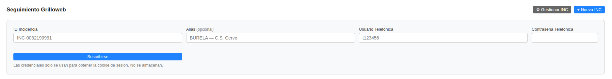
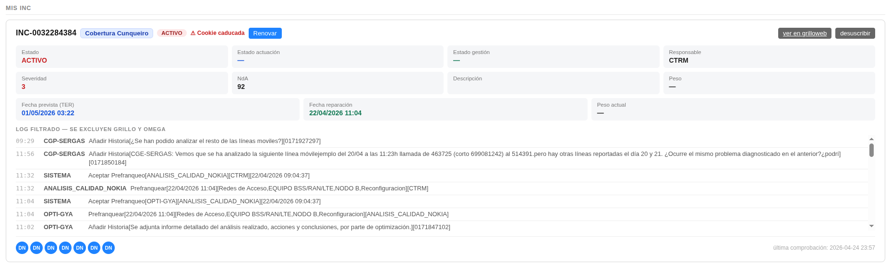
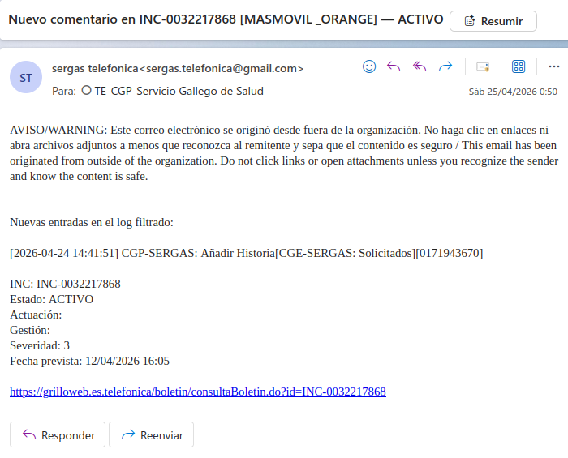

# Manual de Usuario: Módulo Grilloweb

| Campo       | Valor                                |
|-------------|--------------------------------------|
| **Módulo**  | Grilloweb (dentro de Mantenimiento)  |
| **Versión** | 2.1                                  |
| **Fecha**   | Junio 2026                           |
| **Para**    | Operadores CGE SERGAS                |

---

## Índice

1. [Para qué sirve este módulo](#1-para-qué-sirve-este-módulo)
2. [Acceder al módulo](#2-acceder-al-módulo)
3. [La pantalla principal](#3-la-pantalla-principal)
4. [Suscribirse a una INC](#4-suscribirse-a-una-inc)
5. [El campo Alias](#5-el-campo-alias)
6. [La tarjeta de Mis INC en detalle](#6-la-tarjeta-de-mis-inc-en-detalle)
7. [Banner de INC raíz](#7-banner-de-inc-raíz)
8. [Cookie caducada y cómo renovarla](#8-cookie-caducada-y-cómo-renovarla)
9. [Notificaciones por correo](#9-notificaciones-por-correo)
10. [Desuscribirse de una INC](#10-desuscribirse-de-una-inc)
11. [Gestionar INC: eliminar el seguimiento para todos](#11-gestionar-inc-eliminar-el-seguimiento-para-todos)
12. [Cómo se actualiza la información](#12-cómo-se-actualiza-la-información)
13. [Dudas frecuentes](#13-dudas-frecuentes)

---

## 1. Para qué sirve este módulo

El módulo **Grilloweb** permite hacer seguimiento centralizado de las **incidencias de Telefónica (INC)** desde la BDU, sin tener que entrar al portal Grilloweb una y otra vez. Cada vez que un operador se suscribe a una INC, la aplicación:

- Consulta automáticamente el portal Grilloweb cada pocos minutos.
- Detecta cambios de estado, de actuación, de gestión, fechas previstas y nuevos comentarios en el log.
- Envía un **correo de aviso** al CGP cuando hay cambios.
- Mantiene una vista compartida por todo el equipo: lo que ve un operador lo ven los demás.

De esta forma, varios operadores pueden seguir las mismas incidencias sin duplicar trabajo, y todos están al día sin tener que refrescar manualmente el portal.

---

## 2. Acceder al módulo

1. Abre la aplicación **Web BDU** en tu navegador.
2. En la barra superior, pulsa **Mantenimiento**.
3. En el panel de Mantenimiento, pulsa la tarjeta **Grilloweb**.

> **Nota:** También puedes entrar directamente con `?m=mantenimiento&sub=grilloweb` añadido al final de la URL de BDU.

---

## 3. La pantalla principal

Al entrar verás tres zonas de arriba abajo:

### 3.1. Barra superior

Contiene el título **Seguimiento Grilloweb** y dos botones:

| Botón | Para qué sirve |
|---|---|
| ⚙ **Gestionar INC** | Abre el panel para **eliminar** el seguimiento de una INC (afecta a todo el equipo). |
| ➕ **Nueva INC** | Abre el formulario para **suscribirte** a una INC nueva. |

### 3.2. INC en seguimiento por el equipo

Lista de incidencias que **otros compañeros** ya están siguiendo y a las que **tú aún no estás suscrito**. Junto a cada una verás los avatares de los seguidores actuales y un botón **Suscribirme** que te une al seguimiento sin pedir credenciales (ver [sección 4.2](#42-opción-2-unirse-a-una-inc-del-equipo)).

Si esta sección no aparece, es que no hay ninguna INC del equipo a la que puedas unirte.

### 3.3. Mis INC

Lista de incidencias **a las que tú estás suscrito**. Cada INC se muestra como una tarjeta grande con todos los datos relevantes (ver [sección 6](#6-la-tarjeta-de-mis-inc-en-detalle)).

Si todavía no sigues ninguna INC, verás un mensaje invitando a pulsar **Nueva INC** o a unirte a una del equipo.

---

## 4. Suscribirse a una INC

Hay dos formas de empezar a seguir una INC.

### 4.1. Opción 1: nueva INC (con credenciales)

Úsala cuando la INC **no esté siendo seguida por nadie** todavía. Necesitas tu usuario y contraseña de Telefónica para que la BDU pueda acceder al boletín.

1. Pulsa **➕ Nueva INC** en la barra superior.
2. Se desplegará un formulario con cuatro campos:

   | Campo | Obligatorio | Descripción |
   |---|---|---|
   | **ID Incidencia** | Sí | Número de la INC en formato `INC-XXXXXXXXXX` (ejemplo: `INC-0032190991`). |
   | **Alias** | No | Texto corto opcional para identificar la INC de un vistazo (máximo 60 caracteres). Ver [sección 5](#5-el-campo-alias). |
   | **Usuario Telefónica** | Sí | Tu usuario de Telefónica (ejemplo: `t123456`). |
   | **Contraseña Telefónica** | Sí | Tu contraseña de Telefónica. |

3. Pulsa **Suscribirse**.
4. La aplicación inicia sesión en Grilloweb, descarga el boletín y guarda los datos en BDU.
5. Si todo va bien, la INC aparece en **Mis INC**.

> **Seguridad:** La contraseña de Telefónica solo se utiliza para obtener la cookie de sesión (SiteMinder). **No se almacena** en la base de datos. Lo único que se guarda es la cookie cifrada, que sirve para refrescar el boletín automáticamente.

#### Si la INC tiene una "Raíz"

Cuando la INC que acabas de crear es una incidencia hija de otra (por ejemplo, una caída masiva), la aplicación detecta la **INC raíz** y te pregunta si también quieres suscribirte a ella. Acepta si quieres ver el trabajo "real" (el que se gestiona en la raíz). Ver [sección 7](#7-banner-de-inc-raíz).

### 4.2. Opción 2: unirse a una INC del equipo

Úsala cuando la INC **ya está siendo seguida por otro compañero**. No hace falta meter credenciales: la BDU reutiliza la cookie que ya tiene.

1. Mira la sección **INC en seguimiento por el equipo** de la pantalla principal.
2. Localiza la INC y pulsa el botón **Suscribirme**.
3. La INC pasa a tu lista de **Mis INC** al instante.

> Si la cookie del seguimiento ha caducado, la BDU te pedirá las credenciales para renovarla. Ver [sección 8](#8-cookie-caducada-y-cómo-renovarla).

---

## 5. El campo Alias

El **alias** es un texto corto opcional que se asocia a la INC para que **todos los operadores** la identifiquen de un vistazo (por ejemplo: `BURELA — C.S. Cervo`, `MASMOVIL/ORANGE`, `Cobertura Cunqueiro`).

### Características

- **Compartido por todo el equipo:** si lo defines tú, lo ven los demás. Si lo cambias, también.
- **Opcional:** puedes dejar el campo vacío.
- **Hasta 60 caracteres.**
- Aparece como un **chip azul** junto al ID de la INC en las tres listas (Mis INC, INC del equipo y panel Gestionar INC).
- Se incluye **entre corchetes en el asunto** de los correos automáticos.

### Cómo definirlo o cambiarlo

El alias **solo se edita al suscribirse** a la INC:

- **Al crear la INC** (Opción 1): rellena el campo **Alias** del formulario.
- **Al unirte a una INC ya seguida** (Opción 2): si quieres ponerle alias o cambiar el actual, vuelve a pulsar **➕ Nueva INC** introduciendo el ID de esa INC, escribe el nuevo alias y pulsa Suscribirse. El alias se sobrescribe (necesitas tus credenciales si la cookie está caducada; si no, basta con el ID y el alias).

> **Truco:** si solo quieres **cambiar** el alias y la cookie está válida, escribe el ID de la INC + el alias nuevo y deja en blanco el resto del formulario. La aplicación detectará que ya estás suscrito y solo aplicará el alias.

> **Cuidado:** si dejas el campo Alias **vacío** al re-suscribirte, el alias **NO se borra**: se conserva el que hubiera. Para borrarlo del todo se necesita acceder a la BBDD (pídelo al administrador).

---

## 6. La tarjeta de Mis INC en detalle

Cada INC de tu lista se muestra como una tarjeta con varias secciones:

### 6.1. Cabecera

- **ID de la INC** (`INC-XXXXXXXXXX`).
- **Chip azul con el alias** (si lo tiene).
- **Badge de estado**: verde si está activa, gris si está retenida, rojo si está cerrada.
- **Badge de estado de actuación**: por ejemplo "En Curso" en azul.
- A la derecha:
  - **ver en grilloweb** → enlace directo al boletín en el portal de Telefónica.
  - **desuscribir** → te quita a ti del seguimiento (la INC sigue activa para los demás).

### 6.2. Métricas (3 filas de tarjetas pequeñas)

| Fila | Datos |
|---|---|
| Primera | Estado · Estado actuación · Estado gestión · Responsable |
| Segunda | Severidad · NdA · Descripción · Peso |
| Tercera | Fecha prevista (TER) · Fecha reparación · Peso actual |

Si un dato no está disponible, se muestra un guion `—`.

### 6.3. Cod. Sistema

Si la INC tiene un código de sistema asociado (por ejemplo, datos del CMDB), aparece en una franja gris debajo de las métricas.

### 6.4. Log filtrado

Lista cronológica de actuaciones registradas en el boletín. **Se excluyen** las entradas automáticas de los sistemas `GRILLO` y `OMEGA` (son ruido de polling). Cada línea muestra:

- **Hora** (HH:MM).
- **Quién** la hizo (con color por sistema: INTERFACES, PENELOPE, CNSI, ZXBLTUS, SAFI, otros).
- **Mensaje**.

Las líneas más recientes aparecen arriba.

### 6.5. Pie de tarjeta

- **Avatares circulares** con las iniciales de los operadores que están suscritos a la INC. Pasa el ratón por encima para ver el nombre completo (LDAP).
- **Última comprobación**: fecha y hora del último refresco automático contra Grilloweb.

---

## 7. Banner de INC raíz

Cuando una INC es **hija de otra** (típico en incidencias masivas), aparece en la parte superior de la tarjeta un **banner amarillo** que indica:

> **Raíz: INC-XXXXXXXXXX — el trabajo se gestiona en esa INC**

Si **no estás suscrito** a la INC raíz, junto al banner aparecerá un botón **Seguir raíz**. Pulsándolo te suscribes a la raíz sin pedirte credenciales (igual que la opción "Suscribirme" del equipo).

> **Recomendación:** si trabajas con la hija conviene seguir también la raíz, porque normalmente Telefónica solo actualiza la raíz cuando hay incidencias masivas y la hija puede quedarse sin novedades.

---

## 8. Cookie caducada y cómo renovarla

La cookie de sesión que la BDU usa para acceder al portal Grilloweb caduca pasado un tiempo. Cuando esto ocurre:

- En la tarjeta de la INC aparece la marca **⚠ Cookie caducada** y un botón **Renovar**.
- El sistema **no sigue refrescando** la INC hasta que se renueve la cookie.
- Si la INC tenía cambios pendientes, te llegará un correo titulado `Cookie caducada — INC-XXXXXXXXXX [alias]` para avisarte.

### Cómo renovar

1. Pulsa el botón **Renovar** en la tarjeta de la INC.
2. Se abre el formulario de Nueva INC con el ID ya rellenado.
3. Mete tu **usuario y contraseña de Telefónica**.
4. Pulsa **Suscribirse**.
5. La aplicación obtiene una cookie nueva y reanuda el seguimiento.

> Solo hace falta renovar **una vez por INC**: la cookie nueva la usan todos los operadores suscritos.

---

## 9. Notificaciones por correo

Cuando el sistema detecta cambios en una INC, envía automáticamente un correo a **cgp.sergas@telefonica.com**. Los tipos de aviso son:

| Asunto | Cuándo se envía |
|---|---|
| `Cambio en INC-XXXXXXXXXX [alias] — <descripción>` | Cambia algún campo: estado, actuación, gestión, responsable, severidad, NdA o fechas. |
| `Nuevo comentario en INC-XXXXXXXXXX [alias] — <descripción>` | Aparece un nuevo log en el procedimiento (excluyendo GRILLO y OMEGA). |
| `Cookie caducada — INC-XXXXXXXXXX [alias]` | La cookie de la INC ha expirado y hay que renovarla. |

El **alias** aparece entre corchetes solo si está definido. El cuerpo del correo incluye:

- Lista de cambios en formato `Campo: valor anterior → valor nuevo`.
- Datos resumidos: estado, actuación, gestión, severidad, fecha prevista.
- Enlace directo al boletín de Grilloweb.

> **Nota:** el correo va al buzón general del CGP, no a tu correo personal.

---

## 10. Desuscribirse de una INC

Si ya no quieres seguir recibiendo avisos de una INC concreta:

1. En **Mis INC**, localiza la tarjeta.
2. Pulsa el botón **desuscribir** (esquina superior derecha de la tarjeta).
3. Confirma en el aviso emergente.
4. La INC desaparece de tu lista personal.

> **Importante:** desuscribirte solo te afecta a ti. La INC sigue activa para el resto de operadores que la sigan. Si eras el **último** seguidor, la INC se marca como inactiva y desaparece de la sección "INC en seguimiento por el equipo".

---

## 11. Gestionar INC: eliminar el seguimiento para todos

A veces conviene que una INC desaparezca de las listas de **todo el equipo** (por ejemplo, una INC ya cerrada y resuelta, o una de prueba). Para eso está el panel **Gestionar INC**.

1. Pulsa el botón **⚙ Gestionar INC** en la barra superior.
2. Se desplegará una lista con **todas las INC activas** (las tuyas y las del equipo).
3. Cada fila muestra el ID, alias, badge de estado, descripción, avatares de seguidores y un botón **Eliminar seguimiento**.
4. Pulsa **Eliminar seguimiento** en la INC que quieras quitar.
5. Confirma el aviso emergente.
6. La INC desaparece de **todas las listas de todos los operadores**.

> **Importante:**
> - Los **datos históricos se conservan** en la base de datos. Solo desaparecen las listas y los seguidores.
> - Si vuelves a suscribirte a esa INC más tarde, recupera los datos previos (alias, log, estado).
> - Esta acción **no se confirma con el resto del equipo**: úsala con criterio.

---

## 12. Cómo se actualiza la información

La BDU sondea Grilloweb en segundo plano para mantener los datos al día sin que tengas que hacer nada.

| Concepto | Frecuencia |
|---|---|
| El navegador dispara una comprobación silenciosa | Cada **30 segundos** mientras tienes la pantalla abierta. |
| El servidor refresca cada INC contra Grilloweb | Como mucho **1 vez cada 5 minutos** por INC. |
| Cantidad de INC procesadas por tick | Hasta **3 INCs** por cada disparo. |
| Refresco de las listas en pantalla | Cada **5 minutos** automáticamente. |

> **En la práctica:** los cambios tardan **unos pocos minutos** desde que se reflejan en el portal Grilloweb hasta que aparecen en BDU y/o llegan por correo. Si trabajas sobre una INC y necesitas ver el último estado *ya*, recarga la página o pulsa **ver en grilloweb** para ir directamente al boletín.

---

## 13. Dudas frecuentes

**¿Si me desuscribo se pierden los datos?**
No. Los datos se conservan. Solo dejas de recibir avisos.

**¿Quién recibe los correos?**
Todos van al buzón compartido `cgp.sergas@telefonica.com`. No se envían correos personales.

**¿Puedo editar el alias sin volver a meter usuario y contraseña?**
Sí, siempre que la **cookie esté válida** (sin la marca de "Cookie caducada"). Pulsa Nueva INC, mete el ID y el alias nuevo, y deja vacíos los campos de credenciales.

**¿Puedo borrar el alias del todo?**
No desde el formulario: si dejas vacío el campo, no se modifica. Para vaciar el alias hay que actualizarlo a través de la BBDD; pídelo al administrador.

**¿Por qué a veces tardo en ver un cambio?**
Porque el polling refresca cada INC como mucho 1 vez cada 5 minutos, y solo procesa 3 INCs por tick. Si hay muchas INC en seguimiento, el ciclo es más largo.

**Si pulso "Eliminar seguimiento", ¿se cierra la INC en Telefónica?**
**NO.** La INC sigue activa en Grilloweb. La acción solo afecta a la BDU: deja de hacer seguimiento y la oculta de las listas.

**No me suscribo bien y dice "Login fallido".**
Comprueba que la **contraseña de Telefónica** es correcta y no ha caducado. Si lo es y sigue fallando, prueba a entrar manualmente al portal Grilloweb desde el navegador para verificar el acceso; a veces SiteMinder bloquea cuentas tras varios intentos fallidos.

**¿Qué pasa si dos operadores ponen alias distintos a la misma INC?**
Gana el **último** que lo haya puesto. El alias es compartido, no personal: ponedlo de acuerdo en grupo si hace falta.

---

*Manual para operadores CGE SERGAS. Versión 2.1 — Junio 2026.*
