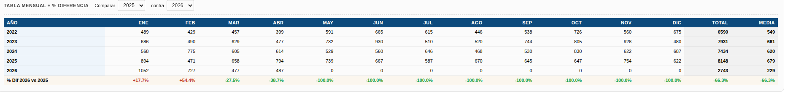
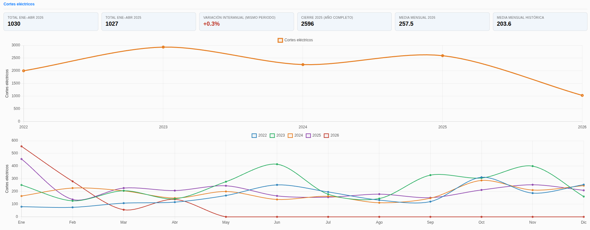
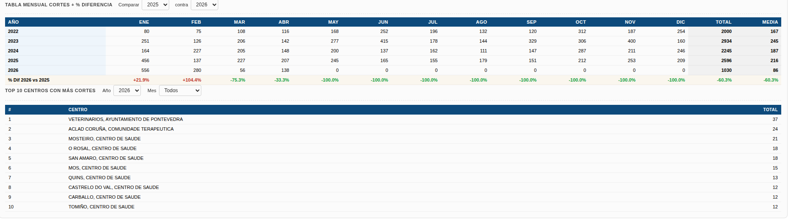
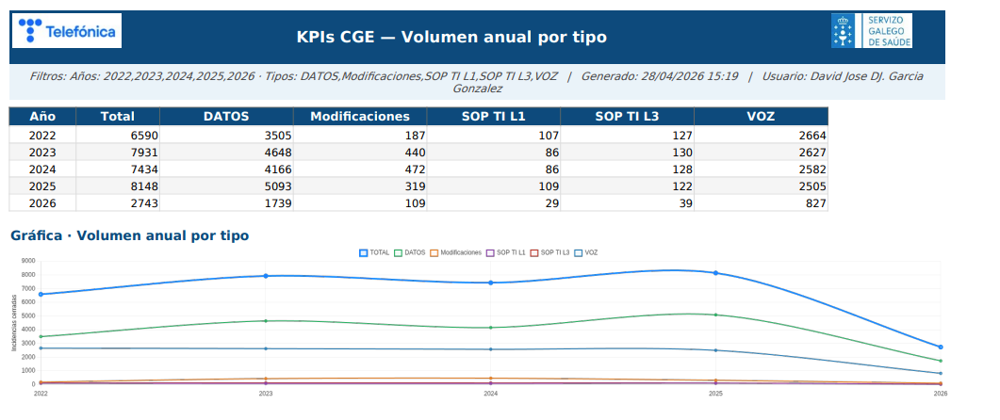

# Manual de Usuario: Módulo KPIs CGE

| Campo       | Valor                                          |
|-------------|------------------------------------------------|
| **Módulo**  | Mantenimiento > Herramientas > KPIs CGE        |
| **Versión** | 2.1                                            |
| **Fecha**   | Junio 2026                                     |
| **Para**    | Operadores y administradores CGE SERGAS        |

---

## Índice

1. [Para qué sirve este módulo](#1-para-qué-sirve-este-módulo)
2. [Cómo accedemos al módulo](#2-cómo-accedemos-al-módulo)
3. [Filtros globales](#3-filtros-globales)
4. [Bloque 1 · Volumen anual por tipo](#4-bloque-1--volumen-anual-por-tipo)
5. [Bloque 2 · Evolución mensual comparada por año](#5-bloque-2--evolución-mensual-comparada-por-año)
6. [Bloque 3 · Top subtipos y centros](#6-bloque-3--top-subtipos-y-centros)
7. [Bloque 4 · Evolución por año de los subtipos TOP](#7-bloque-4--evolución-por-año-de-los-subtipos-top)
8. [Bloque 5 · Totales y tendencia interanual](#8-bloque-5--totales-y-tendencia-interanual)
9. [Bloque 6 · Cortes eléctricos](#9-bloque-6--cortes-eléctricos)
10. [Exportar datos](#10-exportar-datos)
11. [Acceso restringido](#11-acceso-restringido)
12. [Diferencias con los otros módulos KPIs](#12-diferencias-con-los-otros-módulos-kpis)

---

## 1. Para qué sirve este módulo

El módulo **KPIs CGE** es un dashboard analítico de **volumen y tendencias** de incidencias cerradas sobre toda la planta del CGE SERGAS. A diferencia de KPIs Inelcom y KPIs Nubodata —que miden cumplimiento de SLA—, este módulo se centra en **cuántas incidencias hay, cómo evolucionan y dónde se concentran**.

Está pensado para apoyar reuniones de seguimiento, informes mensuales y análisis comparativo entre años.

> **Nota importante:** los datos anteriores a **2022** son residuales de la importación histórica desde Excel y se descartan automáticamente del dashboard. Todas las gráficas y tablas comienzan en 2022.

---

## 2. Cómo accedemos al módulo

1. Abrimos la **Web BDU** en el navegador.
2. En la barra superior pulsamos **Mantenimiento**.
3. Pulsamos la tarjeta **Herramientas** y, en el acordeón, elegimos **KPIs CGE**.

> **Atajo:** también podemos llegar directamente con `?m=mantenimiento&sub=kpis_cge` añadido al final de la URL.

---

## 3. Filtros globales

En la cabecera del dashboard tenemos tres filtros que afectan a **todos los bloques** (excepto los selectores propios de cada bloque):

| Filtro             | Comportamiento                                                                          |
|--------------------|-----------------------------------------------------------------------------------------|
| **Años** (chips)   | Multiselección. Pulsamos los años que queremos incluir o excluir.                       |
| **Tipos** (chips)  | Multiselección. Tipos de incidencia: VOZ, DATOS, Modificaciones, SOP TI L1, SOP TI L3.  |
| **Área sanitaria** | Selector único. *— Todas —* o una de las 7 áreas SERGAS.                                |

Junto a los filtros se encuentran los botones **📊 Excel** y **🔴 PDF** para exportar el dashboard completo (ver [sección 10](#10-exportar-datos)).

---

## 4. Bloque 1 · Volumen anual por tipo

Gráfica de líneas que muestra la **evolución anual** de las incidencias cerradas:

- Una línea **TOTAL** (azul, gruesa) con el total del año.
- Una línea por cada **tipo** de incidencia (VOZ, DATOS, Modificaciones, SOP TI L1, SOP TI L3).
- Eje X: años. Eje Y: número de incidencias cerradas.

Nos permite ver de un vistazo si el volumen total ha subido o bajado y qué tipo está tirando del crecimiento.

---

## 5. Bloque 2 · Evolución mensual comparada por año

### 5.1. Gráfica de líneas

- Una línea por cada año seleccionado.
- Eje X: meses (Ene–Dic). Eje Y: número de incidencias.

Sirve para comparar la **estacionalidad** (qué meses tienen más incidencias) entre años distintos.

### 5.2. Tabla pivot mensual y % diferencia

Debajo de la gráfica, una **tabla pivot** muestra los mismos datos en formato numérico:

- Filas: años.
- Columnas: 12 meses + **Total anual** + **Media mensual**.

Al final de la tabla aparece la **fila de "% Diferencia"** que compara dos años a elegir:

1. En el desplegable **Comparar** elegimos el año A (base).
2. En el desplegable **contra** elegimos el año B (a comparar).
3. La fila amarilla muestra `(B − A) / A × 100` para cada mes y para los totales.
4. Los porcentajes aparecen en **rojo** si el valor sube (más incidencias) y en **verde** si baja.

Por defecto se comparan el último año con el penúltimo de los seleccionados.

---

## 6. Bloque 3 · Top subtipos y centros

Este bloque resume **dónde y de qué tipo** se concentran las incidencias en un año y tipo concretos.

### 6.1. Controles propios del bloque

| Control | Descripción                                                                       |
|---------|-----------------------------------------------------------------------------------|
| **Año** | Año a analizar (por defecto, el último año filtrado en los filtros globales).     |
| **Tipo**| Filtro de tipo de incidencia o *"Todos los tipos"*.                               |
| **Top** | Cuántos subtipos mostrar: 5, 10 o 15.                                             |

### 6.2. Tablas y gráfica

- **Tabla "Top subtipos"** (izquierda): los N subtipos más frecuentes, con total y porcentaje.
- **Tabla "Top 10 centros"** (derecha): los 10 centros con más incidencias del año/tipo elegido.
- **Gráfica de barras horizontales** (debajo): visualización de los subtipos con su volumen.

Cuando cambiamos cualquiera de los selectores (año, tipo o top), las dos tablas y la gráfica se actualizan a la vez.

---

## 7. Bloque 4 · Evolución por año de los subtipos TOP

Gráfica de líneas que muestra **cómo han evolucionado los subtipos más frecuentes** a lo largo de los años seleccionados:

- Una línea por cada subtipo del Top N (los mismos del bloque anterior).
- Eje X: años. Eje Y: número de incidencias.

Usa los mismos selectores **Tipo** y **Top** del bloque anterior. Útil para detectar subtipos que están aumentando o disminuyendo de forma sostenida.

---

## 8. Bloque 5 · Totales y tendencia interanual

Bloque de **6 KPI tiles** con cifras agregadas y la variación interanual. Útil para enseñar de un vistazo cómo va el año en curso respecto al anterior.

| KPI                           | Significado                                                                       |
|-------------------------------|-----------------------------------------------------------------------------------|
| **Total ENE–MES AÑO**         | Total acumulado del año en curso, hasta el mes actual (YTD).                      |
| **Total ENE–MES AÑO ANT.**    | Total del mismo periodo del año anterior (mismas semanas).                        |
| **Variación interanual**      | `(Actual − Anterior) / Anterior × 100`. Verde si baja, rojo si sube.              |
| **Cierre AÑO ANT.**           | Total completo del año anterior (12 meses), como referencia.                      |
| **Media mensual AÑO**         | Media de incidencias por mes del año en curso.                                    |
| **Media mensual histórica**   | Media de las medias anuales de los años anteriores.                               |

> **Nota:** la *"Variación interanual"* compara siempre **el mismo periodo** (no compara 4 meses contra 12, sino 4 contra 4). Cuando el año en curso termina, pasa a comparar cierres completos automáticamente.

---

## 9. Bloque 6 · Cortes eléctricos

Análisis específico de **incidencias de DATOS** cuyo comentario menciona un **corte eléctrico** que ha afectado al cliente. La detección se hace automáticamente a partir del campo de comentario de la incidencia.

### 9.1. KPIs y gráficas

Estructura idéntica al bloque anterior:

- **6 KPI tiles**: total YTD actual, total YTD anterior, variación interanual, cierre año anterior, media mensual actual y media histórica.
- **Gráfica anual**: total de cortes por año (una sola línea).
- **Gráfica mensual comparada**: una línea por cada año seleccionado, eje X de Ene a Dic.

### 9.2. Tabla pivot y Top centros con selector

- **Tabla pivot mensual** con los mismos selectores **Comparar/contra** del bloque 2.
- **Tabla Top 10 centros** con los centros que más cortes eléctricos han sufrido.
  - Selector **Año**: año concreto a analizar (por defecto, el año actual).
  - Selector **Mes**: *"Todos"* o un mes concreto (Enero–Diciembre).
  - El Top se recalcula al instante con los filtros elegidos.

Útil para detectar centros con problemas crónicos de suministro eléctrico que requieren actuación específica.

---

## 10. Exportar datos

En la cabecera del dashboard tenemos dos botones de exportación:

| Botón        | Resultado                                                                                  |
|--------------|--------------------------------------------------------------------------------------------|
| **📊 Excel** | Descarga un fichero `.xlsx` con varias hojas (una por bloque) y las gráficas embebidas.    |
| **🔴 PDF**   | Descarga un `.pdf` generado a partir del Excel (logos en cada página).                     |

**Pasos:**

1. Ajustamos los filtros globales y los selectores de cada bloque al estado deseado.
2. Pulsamos **📊 Excel** o **🔴 PDF**.
3. El navegador captura las imágenes de las gráficas en pantalla y las envía al servidor junto con los filtros.
4. Se abre una pestaña nueva con la descarga.

**Hojas que contiene el Excel exportado:**

| Hoja                      | Contenido                                                  |
|---------------------------|------------------------------------------------------------|
| Volumen anual             | Tabla años × tipos + gráfica del bloque 1.                 |
| Mensual                   | Tabla pivot años × meses + gráfica del bloque 2.           |
| Subtipos TOP              | Tabla Top N subtipos + Top 10 centros + gráfica de barras. |
| Evolución subtipos        | Gráfica del bloque 4 (hoja propia).                        |
| Centros y resumen         | Top 10 centros del bloque 3 + bloque resumen.              |
| Cortes mensual            | Tabla pivot cortes + gráfica mensual del bloque 6.         |
| Cortes anual              | Gráfica anual de cortes (hoja propia).                     |
| Cortes top                | Tabla Top 10 centros con cortes (año y mes elegidos).      |

> **Nota:** las gráficas que aparecen en el PDF son **exactamente las que se ven en pantalla**. Si queremos un PDF con un filtro o una comparación distintos, primero ajustamos el dashboard y después exportamos.

---

## 11. Acceso restringido

Como en KPIs Inelcom y KPIs Nubodata, el módulo está **restringido a determinados usuarios** según su grupo en el directorio Active Directory. Los operadores cuya cuenta pertenece a la unidad organizativa `UO_usuarios_dominio` no pueden entrar y verán la pantalla de **🔒 Acceso restringido**.

Si nos corresponde el acceso pero no entramos, debemos contactar con el administrador del sistema.

---

## 12. Diferencias con los otros módulos KPIs

| Aspecto             | KPIs Inelcom              | KPIs Nubodata               | **KPIs CGE**                          |
|---------------------|---------------------------|-----------------------------|---------------------------------------|
| Qué mide            | Cumplimiento SLA          | Cumplimiento SLA tricolor   | **Volumen y tendencias**              |
| Período por defecto | Semana anterior           | Semana anterior             | **Todos los años** (multiselección)   |
| Origen de datos     | Incidencias BDU           | Incidencias GLPI            | **Incidencias BDU** desde 2022        |
| Acceso              | Restringido por OU        | Restringido por OU          | **Restringido por OU**                |
| Estructura          | 4 bloques de SLA          | 1 bloque tricolor           | **6 bloques analíticos**              |
| Exportación         | Excel + PDF (logos)       | Excel + PDF (logos)         | **Excel + PDF (logos + 6 gráficas)**  |

---

*Manual para operadores y administradores CGE SERGAS. Versión 2.1 — Junio 2026.*
