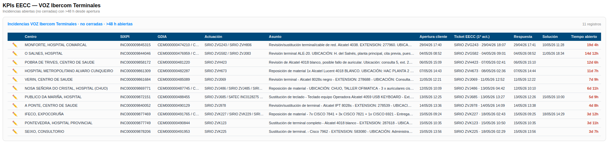
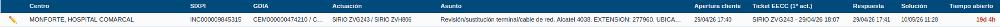
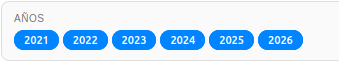
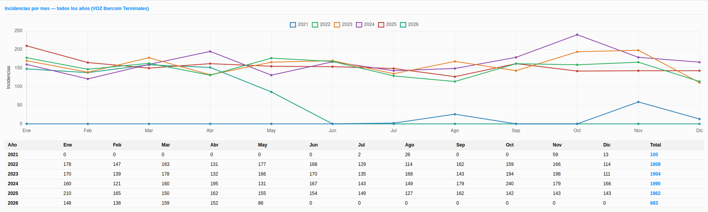
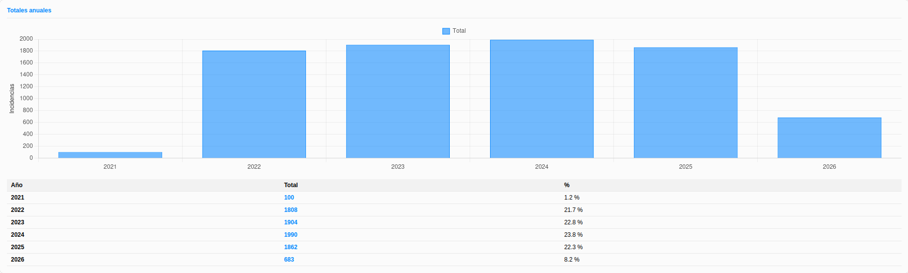
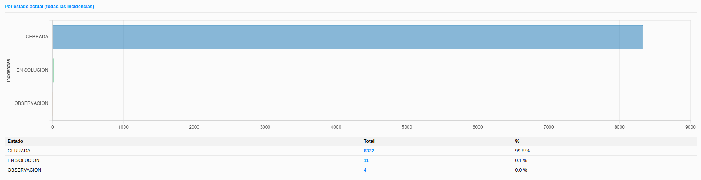

# Manual de Usuario: Módulo KPIs EECC

| Campo       | Valor                                          |
|-------------|------------------------------------------------|
| **Módulo**  | Mantenimiento > Herramientas > KPIs EECC       |
| **Versión** | 2.1                                            |
| **Fecha**   | Mayo 2026                                      |
| **Para**    | Operadores CGE SERGAS                          |

---

## Índice

1. [Para qué sirve este módulo](#1-para-qué-sirve-este-módulo)
2. [Cómo accedemos al módulo](#2-cómo-accedemos-al-módulo)
3. [Tabla de incidencias abiertas con más de 48 h](#3-tabla-de-incidencias-abiertas-con-más-de-48-h)
4. [Filtrar por años](#4-filtrar-por-años)
5. [Leer las gráficas históricas](#5-leer-las-gráficas-históricas)
6. [Acceso restringido](#6-acceso-restringido)
7. [Diferencias con otros KPIs](#7-diferencias-con-otros-kpis)

---

## 1. Para qué sirve este módulo

El módulo **KPIs EECC** muestra las incidencias gestionadas por la **EECC (Empresa Colaboradora)** sobre material **Ibercom**. Se centra en incidencias **VOZ** con subtipo **IBERCOM TERMINALES**.

Tiene dos partes:

1. **Tabla de seguimiento operativo**: las incidencias **abiertas** (no cerradas) que llevan **más de 48 horas** desde su apertura y que tienen abierta una **actuación SIRIO** (es el ticket que se abre a la EECC).
2. **Histórico y gráficas**: volumen mensual y anual de incidencias VOZ Ibercom Terminales y reparto por estado actual.

> **Importante:** solo aparecen en la tabla las incidencias que tienen al menos una actuación de tipo **SIRIO** registrada. Si una incidencia VOZ Ibercom Terminales no tiene SIRIO, no se considera entregada a la EECC y no se lista.

---

## 2. Cómo accedemos al módulo

1. Abrimos la **Web BDU** en el navegador.
2. En la barra superior pulsamos **Mantenimiento**.
3. Pulsamos la tarjeta **Herramientas** y, en el acordeón, elegimos **📞 KPIs EECC**.

> **Atajo:** también podemos llegar directamente con `?m=mantenimiento&sub=kpis_eecc` añadido al final de la URL.

---

## 3. Tabla de incidencias abiertas con más de 48 h

Es la sección principal. Lista todas las incidencias VOZ Ibercom Terminales que cumplen las tres condiciones a la vez:

- **No están CERRADAS**.
- **Apertura cliente ≥ 48 h** atrás respecto al momento de cargar la página.
- Tienen al menos **una actuación SIRIO** registrada.

El contador de la cabecera del bloque indica cuántas incidencias hay en ese momento.

### 3.1. Columnas de la tabla

| Columna                | Contenido                                                                                  |
|------------------------|--------------------------------------------------------------------------------------------|
| **✏️**                 | Enlace para abrir la incidencia en modo edición (módulo Incidencias).                       |
| **Centro**             | Nombre del centro afectado.                                                                |
| **SIXPI**              | Ticket del cliente (SIXPI / ITSM).                                                         |
| **GDIA**               | Tickets GDIA asociados, separados por `/`. Si hay más de uno se ven al pasar el ratón.     |
| **Actuación**          | Todas las actuaciones registradas en `TIPO TICKET`, separadas por `/`.                     |
| **Asunto**             | Texto del asunto de la incidencia.                                                         |
| **Apertura cliente**   | Fecha y hora en que el cliente abrió la incidencia.                                        |
| **Ticket EECC (1ª act.)** | Ticket SIRIO abierto a la EECC y su fecha de apertura.                                  |
| **Respuesta**          | Fecha y hora de la primera respuesta al cliente, si la hay.                                |
| **Solución**           | Fecha y hora de la solución, si la hay (todavía no CERRADA).                               |
| **Tiempo abierto**     | Cuánto lleva abierta la incidencia desde **Apertura cliente** hasta ahora (en días y horas).|

### 3.2. Resaltado en rojo en "Ticket EECC"

La columna **Ticket EECC** muestra primero el tipo de la actuación y luego el ticket. Lo esperado es que sea **SIRIO**. Si la primera actuación registrada no es SIRIO (por ejemplo `REC`, `BOL`, `CAR`, etc.), la celda se resalta en **rojo** con un *tooltip* que avisa del tipo real.

### 3.3. Acciones desde la tabla

- Pulsando el icono **✏️** abrimos la incidencia en el módulo **Mantenimiento > Incidencias** para editarla, añadir actuaciones, cerrar, etc.
- Las celdas largas (Centro, GDIA, Actuación, Asunto) se recortan con `…` y muestran el texto completo al pasar el ratón.

---

## 4. Filtrar por años

Debajo de la tabla aparece la zona de **histórico y gráficas**. Antes de los bloques hay un filtro con un **chip por cada año** que tiene incidencias VOZ Ibercom Terminales registradas.

Reglas:

- Por defecto todos los chips están **activados** (azul).
- Al pulsar un chip lo desactivamos o lo activamos.
- Si dejamos **ninguno** activo el sistema vuelve a mostrarlos todos automáticamente.
- Al cambiar la selección las **tres gráficas** se recalculan.

> El filtro de años **solo afecta a las gráficas históricas**. La tabla de la sección 3 siempre muestra el estado actual.

---

## 5. Leer las gráficas históricas

### 5.1. Incidencias por mes — todos los años

Una línea por año con el número de incidencias VOZ Ibercom Terminales **abiertas en cada mes** (según `Apertura cliente`).

Debajo de la gráfica tenemos una **tabla pivote** con el desglose mensual y el total anual.

### 5.2. Totales anuales

Una barra por año con el **total acumulado** de incidencias. Debajo, una tabla con el total y el **porcentaje** que representa cada año sobre la suma de los años filtrados.

### 5.3. Por estado actual (todas las incidencias)

Barras horizontales con el reparto de **todas las incidencias** (no solo las filtradas por año) según su **estado actual**: `CERRADA`, `EN SOLUCION`, `OBSERVACION`, `PTE CONFIRMACION`, etc. Es la foto global del subtipo.

> Este bloque **ignora el filtro de años** porque su objetivo es la foto del estado vivo del subtipo en su conjunto.

---

## 6. Acceso restringido

El módulo **KPIs EECC** está restringido por unidad organizativa de Active Directory. Las cuentas que pertenecen a `UO_usuarios_dominio` no pueden entrar y ven la pantalla de **🔒 Acceso restringido**.

Si nos corresponde el acceso pero no entramos, debemos contactar con el administrador del sistema.

---

## 7. Diferencias con otros KPIs

| Aspecto                  | KPIs Inelcom            | KPIs Nubodata                       | **KPIs EECC**                                     |
|--------------------------|-------------------------|-------------------------------------|---------------------------------------------------|
| Contrato / Subtipo       | Inelcom                 | Material No Ibercom                 | **VOZ Ibercom Terminales**                        |
| Ticket de referencia     | —                       | GLPI                                | **SIRIO** (ticket a la EECC)                      |
| Foco                     | Cumplimiento de SLA     | Cumplimiento de SLA tricolor        | **Seguimiento operativo** de las abiertas         |
| Umbral del listado       | —                       | 24 h y 48 h laborables              | **>48 h desde apertura cliente** (horas naturales)|
| Histórico                | Tendencia del período   | Tendencia del período               | **Mensual + anual + por estado**                  |
| Tabla principal          | (no aplica)             | Solo modales de detalle             | **Tabla persistente en la página principal**      |

---

*Manual para operadores CGE SERGAS. Versión 2.1 — Junio 2026.*
