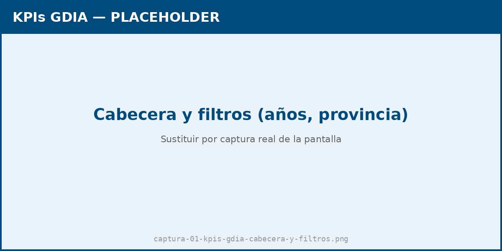
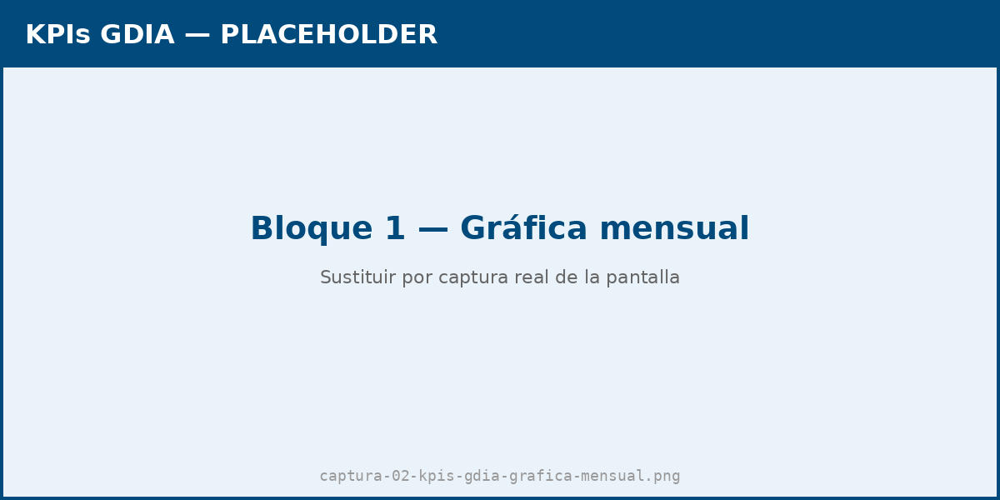
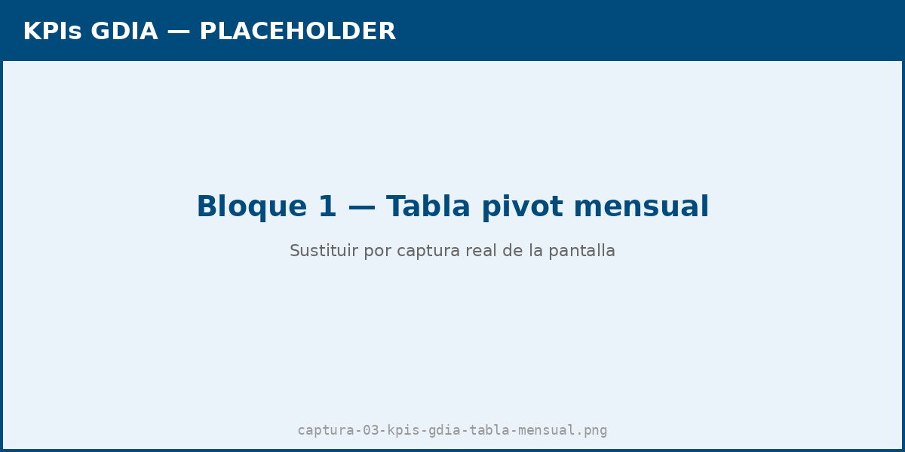
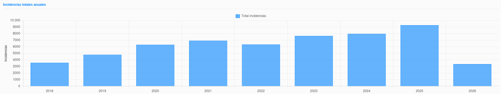
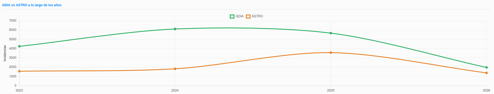
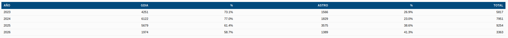
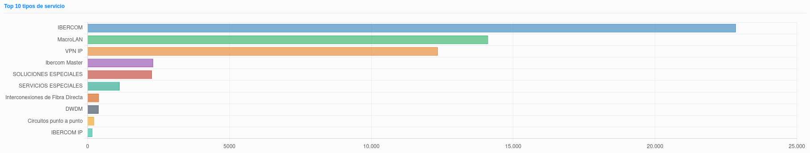
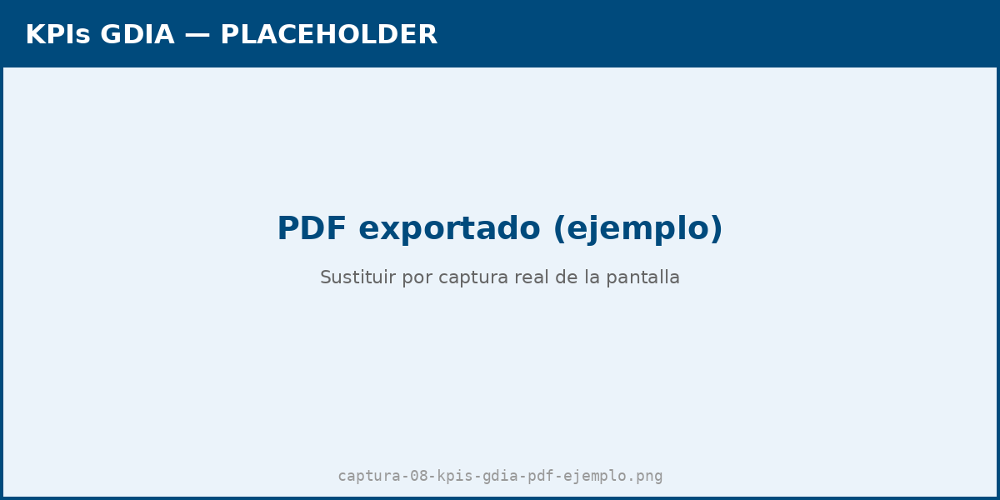

# Manual de Usuario: Módulo KPIs GDIA

| Campo       | Valor                                          |
|-------------|------------------------------------------------|
| **Módulo**  | Mantenimiento > Herramientas > KPIs GDIA       |
| **Versión** | 2.1                                            |
| **Fecha**   | Mayo 2026                                      |
| **Para**    | Operadores y administradores CGE SERGAS        |

---

## Índice

1. [Para qué sirve este módulo](#1-para-qué-sirve-este-módulo)
2. [Cómo accedemos al módulo](#2-cómo-accedemos-al-módulo)
3. [Filtros globales](#3-filtros-globales)
4. [Bloque 1 · Incidencias por mes (todos los años)](#4-bloque-1--incidencias-por-mes-todos-los-años)
5. [Bloque 2 · Incidencias totales anuales](#5-bloque-2--incidencias-totales-anuales)
6. [Bloque 3 · GDIA vs ASTRO a lo largo de los años](#6-bloque-3--gdia-vs-astro-a-lo-largo-de-los-años)
7. [Bloque 4 · Top 10 tipos de servicio](#7-bloque-4--top-10-tipos-de-servicio)
8. [Exportar datos](#8-exportar-datos)
9. [Acceso restringido](#9-acceso-restringido)
10. [Origen de los datos y diferencias con KPIs CGE](#10-origen-de-los-datos-y-diferencias-con-kpis-cge)

---

## 1. Para qué sirve este módulo

El módulo **KPIs GDIA** es un dashboard analítico de **incidencias internas** del cliente (las que el cliente ha levantado en sus sistemas de ticketing), cargadas desde el histórico Excel `Incremento_actividad_2025_v2.xlsx`.

Cubre tres etapas de exportación del cliente:

- **Vantive** (2018 → marzo 2023): herramienta antigua del cliente.
- **GDIA** (marzo 2023 → mayo 2025): herramienta intermedia.
- **ARGONAUTA / CEM** (mayo 2025 → actual): herramienta moderna.

A diferencia de **KPIs CGE** —que mide las incidencias que gestiona el centro de gestión sobre la tabla `Incidencias`—, **KPIs GDIA** mide el **volumen completo levantado por el cliente** sobre la tabla `Incidencias_Internas_Informes`.

Está pensado para análisis de tendencia histórica, comparativas anuales y para entender la evolución del reparto entre los sistemas GDIA y ASTRO.

> **Nota:** los datos se incluyen desde **2018**. La importación es **manual** (one-off), se carga desde un Excel proporcionado por el cliente; no hay sincronización en tiempo real con la herramienta del cliente.

---

## 2. Cómo accedemos al módulo

1. Abrimos la **Web BDU** en el navegador.
2. En la barra superior pulsamos **Mantenimiento**.
3. Pulsamos la tarjeta **Herramientas** y, en el acordeón, elegimos **KPIs GDIA**.

> **Atajo:** también podemos llegar directamente con `?m=mantenimiento&sub=kpis_gdia` añadido al final de la URL.

---

## 3. Filtros globales

En la cabecera del dashboard tenemos dos filtros que afectan a **todos los bloques**:

| Filtro             | Comportamiento                                                                          |
|--------------------|-----------------------------------------------------------------------------------------|
| **Años** (chips)   | Multiselección. Pulsamos los años que queremos incluir o excluir. Por defecto, todos.   |
| **Provincia**      | Selector único. *— Todas —* o una de las cuatro provincias gallegas (A Coruña, Lugo, Ourense, Pontevedra). |

> **Atención al filtro "Provincia":** la provincia solo está rellena en las filas modernas (GDIA y ARGONAUTA, desde marzo de 2023). En las filas Vantive (2018-marzo 2023) la provincia es nula, por lo que **al elegir una provincia las filas Vantive quedan automáticamente fuera del cálculo**. Para ver el histórico completo, dejamos el filtro en *— Todas —*.

Junto a los filtros se encuentran los botones **📊 Excel** y **🔴 PDF** para exportar el dashboard completo (ver [sección 8](#8-exportar-datos)).

---

## 4. Bloque 1 · Incidencias por mes (todos los años)

### 4.1. Gráfica de líneas

- Una línea por cada año seleccionado.
- Eje X: meses (Ene–Dic). Eje Y: número de incidencias.

Sirve para comparar la **estacionalidad** (qué meses concentran más actividad) entre años.

### 4.2. Tabla pivot

Debajo de la gráfica, una tabla pivot muestra los mismos datos en formato numérico:

- Filas: años.
- Columnas: 12 meses + **Total anual** + **Media mensual**.

> **La media del año en curso no se desvirtúa.** La columna *Media* divide el total entre **el último mes con dato**, no entre 12. Si estamos a abril de 2026 y solo tenemos datos de enero a abril, la media se calcula con divisor 4. Así no se penaliza el año en curso ni se ven medias artificialmente bajas.

---

## 5. Bloque 2 · Incidencias totales anuales

Vista resumida del **volumen total** por año.

- **Gráfica de barras**: una barra por año, X = años, Y = total de incidencias.
- **Tabla**: año / Total / **%** (peso del año sobre el total acumulado de los años seleccionados).

Sirve para ver de un vistazo la curva de actividad histórica completa.

---

## 6. Bloque 3 · GDIA vs ASTRO a lo largo de los años

Compara dos sistemas de gestión modernos del cliente:

- **GDIA**: incidencias levantadas en la herramienta intermedia (marzo 2023 →).
- **ASTRO**: incidencias levantadas en la herramienta moderna ARGONAUTA (mayo 2025 →).

> Este bloque **excluye** las filas Vantive y los sistemas residuales (Triaje, ARTE), porque solo tiene sentido comparar GDIA vs ASTRO. Además, **omite automáticamente los años con suma 0** (los anteriores a 2023 no aparecen, porque ASTRO aún no existía).

### 6.1. Gráfica de líneas

- Línea **GDIA** (verde) y línea **ASTRO** (naranja).
- Eje X: años. Eje Y: incidencias.

Útil para ver el ritmo al que ASTRO está absorbiendo la actividad que antes llevaba GDIA.

### 6.2. Tabla

| Columna   | Significado                                                  |
|-----------|--------------------------------------------------------------|
| **Año**   | Año del agregado.                                            |
| **GDIA**  | Incidencias levantadas como GDIA ese año.                    |
| **%**     | Porcentaje GDIA sobre el total del año (GDIA + ASTRO).       |
| **ASTRO** | Incidencias levantadas como ASTRO ese año.                   |
| **%**     | Porcentaje ASTRO sobre el total del año.                     |
| **Total** | Suma de las dos columnas.                                    |

---

## 7. Bloque 4 · Top 10 tipos de servicio

Ranking de los **10 tipos de servicio** con más incidencias dentro del periodo seleccionado.

- **Gráfica de barras horizontales**: 10 barras = 10 etiquetas (sin solapes).
- **Tabla**: # / Tipo de servicio / Total / **%** (sobre el total de los 10).

Tipos habituales: `VPN IP`, `MacroLAN`, `IBERCOM`, `Soluciones Especiales`, `LAN VPN`, etc.

> Si quisiéramos ver un servicio que no está en el Top 10, ajustamos los filtros (años o provincia) para acotar el rango y volver a verlo.

---

## 8. Exportar datos

En la cabecera del dashboard tenemos dos botones de exportación:

| Botón        | Resultado                                                                                   |
|--------------|---------------------------------------------------------------------------------------------|
| **📊 Excel** | Descarga un fichero `.xlsx` con cuatro hojas (una por bloque) y las gráficas embebidas.     |
| **🔴 PDF**   | Descarga un `.pdf` generado a partir del Excel (logos en cada página).                      |

**Pasos:**

1. Ajustamos los filtros globales al estado deseado.
2. Pulsamos **📊 Excel** o **🔴 PDF**.
3. El navegador captura las imágenes de las gráficas en pantalla y las envía al servidor junto con los filtros.
4. Se abre una pestaña nueva con la descarga.

**Hojas que contiene el Excel exportado:**

| Hoja              | Contenido                                                              |
|-------------------|------------------------------------------------------------------------|
| Mensual           | Tabla pivot años × meses + Total + Media + gráfica de líneas.          |
| Anual             | Tabla año / Total / % + gráfica de barras.                             |
| GDIA vs ASTRO     | Tabla año / GDIA / % / ASTRO / % / Total + gráfica de líneas.          |
| Tipos servicio    | Top 10 con # / Servicio / Total / % + gráfica de barras horizontales.  |

> Las cuatro hojas tienen exactamente la misma cabecera y el mismo ancho (A4 horizontal), con los logos de Telefónica y SERGAS alineados a las esquinas y el título centrado entre ambos. Las gráficas que aparecen en el PDF son **exactamente las que se ven en pantalla** en ese momento.

---

## 9. Acceso restringido

Como en el resto de módulos KPIs (Inelcom, Nubodata y CGE), el módulo está **restringido a determinados usuarios** según su grupo en el directorio Active Directory. Los operadores cuya cuenta pertenece a la unidad organizativa `UO_usuarios_dominio` no pueden entrar y verán la pantalla de **🔒 Acceso restringido**.

Si nos corresponde el acceso pero no entramos, contactamos con el administrador del sistema.

---

## 10. Origen de los datos y diferencias con KPIs CGE

### 10.1. ¿De dónde salen los datos?

Los datos vienen de un **Excel histórico** que el cliente nos ha proporcionado, no de un sistema en línea. El Excel mezcla en una misma pestaña tres formatos de exportación distintos:

- **Vantive** (formato antiguo, 2018 a marzo 2023).
- **GDIA** (formato intermedio, marzo 2023 a mayo 2025).
- **ARGONAUTA / CEM** (formato moderno, mayo 2025 en adelante).

La importación se hace **a mano** mediante un script Python (`generar_sql.py`) que detecta el formato de cada fila y genera el SQL de carga. Cada vez que el cliente nos manda un Excel actualizado, hay que regenerar el SQL y recargar la tabla `Incidencias_Internas_Informes`.

> A futuro está previsto un módulo de **importación web** que reemplace este flujo para los nuevos exports CEM (formato actual).

### 10.2. KPIs GDIA vs KPIs CGE — ¿cuál uso?

| Aspecto         | **KPIs CGE**                          | **KPIs GDIA**                                         |
|-----------------|---------------------------------------|-------------------------------------------------------|
| Tabla origen    | `Incidencias` (gestionadas por el CGE)| `Incidencias_Internas_Informes` (importadas)          |
| Qué mide        | Volumen y tendencias de gestión       | Volumen completo levantado por el cliente            |
| Periodo         | 2022 → presente                       | 2018 → presente                                       |
| Bloques         | 6 (incluye cortes eléctricos, áreas)  | **4** (mensual, anual, GDIA vs ASTRO, tipos servicio) |
| Filtro de área  | Áreas sanitarias (id de FK)           | **Provincia** (texto libre)                           |
| Frecuencia      | En tiempo real (SQL directo)          | Carga manual desde Excel                              |

Como regla práctica:

- Si la pregunta es **"¿cómo va el CGE este mes/año?"** → KPIs CGE.
- Si la pregunta es **"¿cómo ha evolucionado el volumen total del cliente desde 2018?"** o **"¿cómo se reparte entre GDIA y ASTRO?"** → KPIs GDIA.

---

*Manual para operadores y administradores CGE SERGAS. Versión 2.1 — Junio 2026.*
