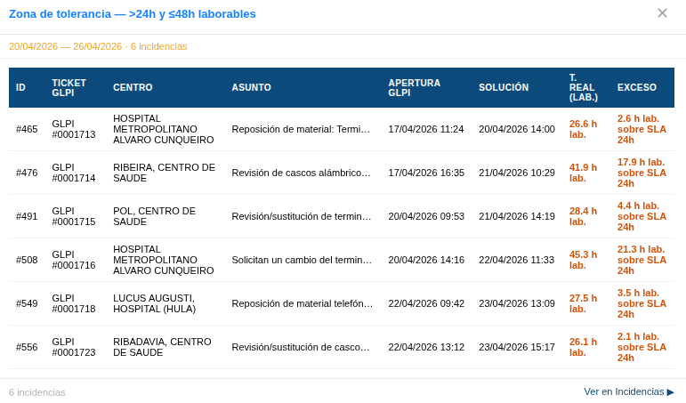

# Manual de Usuario: Módulo KPIs Nubodata

| Campo       | Valor                                          |
|-------------|------------------------------------------------|
| **Módulo**  | Mantenimiento > Herramientas > KPIs Nubodata   |
| **Versión** | 1.6                                            |
| **Fecha**   | Abril 2026                                     |
| **Para**    | Operadores CGE SERGAS                          |

---

## Índice

1. [Para qué sirve este módulo](#1-para-qué-sirve-este-módulo)
2. [Cómo accedemos al módulo](#2-cómo-accedemos-al-módulo)
3. [Seleccionar período](#3-seleccionar-período)
4. [Leer los indicadores](#4-leer-los-indicadores)
5. [Ver detalle de incidencias](#5-ver-detalle-de-incidencias)
6. [Exportar datos](#6-exportar-datos)
7. [Acceso restringido](#7-acceso-restringido)
8. [Diferencias con KPIs Inelcom](#8-diferencias-con-kpis-inelcom)

---

## 1. Para qué sirve este módulo

El módulo **KPIs Nubodata** muestra el cumplimiento del SLA del contrato **Nubodata** (Material No Ibercom). Mide el **tiempo de resolución** de cada incidencia desde su apertura en GLPI hasta la solución, expresado en **horas laborables** (excluye sábados y domingos).

Tres zonas tricolor con umbrales fijos:

| Zona | Color | Tiempo de resolución |
|------|-------|----------------------|
| Dentro de SLA       | 🟢 Verde   | **≤ 24 h laborables**            |
| Zona de tolerancia  | 🟠 Naranja | **>24 h y ≤48 h laborables**     |
| Fuera de límite     | 🔴 Rojo    | **>48 h laborables**             |

El **% de cumplimiento** que aparece en la cabecera del bloque mide cuántas incidencias se han resuelto en **≤48 horas laborables** sobre el total.

---

## 2. Cómo accedemos al módulo

1. Abrimos la **Web BDU** en el navegador.
2. En la barra superior pulsamos **Mantenimiento**.
3. Pulsamos la tarjeta **Herramientas** y, en el acordeón, elegimos **KPIs Nubodata**.

> **Atajo:** también podemos llegar directamente con `?m=mantenimiento&sub=kpis_nubodata` añadido al final de la URL.

---

## 3. Seleccionar período

En la parte superior tenemos los botones de período:

| Botón                | Período que muestra                                       |
|----------------------|-----------------------------------------------------------|
| **Semana**           | Semana anterior completa (lunes a domingo). Activo por defecto. |
| **Mes**              | Mes anterior completo. Despliega un selector con todos los meses disponibles para elegir otro. |
| **Año**              | Año anterior completo. Despliega un selector con los años disponibles para elegir otro. |
| **📅 Fecha concreta**| Rango personalizado de fechas mediante panel desplegable. |

### 3.1. Elegir un mes o un año concreto

- Al pulsar **Mes** aparece un desplegable con los meses disponibles. Lo cambiamos y los datos se recalculan al instante.
- Igual con **Año**: aparece un desplegable con los años disponibles.

### 3.2. Rango de fechas personalizado

1. Pulsamos **📅 Fecha concreta**.
2. Se despliega un panel con **Desde** y **Hasta**.
3. Elegimos las fechas.
4. Pulsamos **Aplicar**.

---

## 4. Leer los indicadores

El dashboard muestra un **único bloque** con la donut tricolor, las filas detalle y la gráfica de tendencia.

### 4.1. Gráfica donut tricolor

La donut representa la distribución de las incidencias del período en sus tres zonas:

- 🟢 **≤24 h lab.** — verde
- 🟠 **>24 h ≤48 h lab.** — naranja
- 🔴 **>48 h lab.** — rojo

A su derecha vemos la leyenda con los mismos códigos de color.

### 4.2. Filas detalle

Debajo de la leyenda aparecen las filas con los conteos exactos:

| Fila                       | Significado                                                            |
|----------------------------|------------------------------------------------------------------------|
| 🟢 **Dentro de SLA**       | Incidencias resueltas en ≤24 h laborables.                             |
| 🟠 **Zona tolerancia**     | Resueltas en >24 h y ≤48 h laborables.                                 |
| 🔴 **Fuera de límite**     | Resueltas en >48 h laborables (incumplimiento).                        |
| ⚠️ **Sin fecha de solución**| Incidencias sin fecha de solución registrada (no entran en el cálculo).|
| **Total incidencias**      | Suma de las tres zonas + las "sin fecha".                              |

Las tres primeras filas son **clickables**: abren el modal con el detalle de las incidencias de esa zona ([sección 5](#5-ver-detalle-de-incidencias)). La fila *"Sin fecha de solución"* es solo informativa y no es clickable.

### 4.3. Porcentaje de cumplimiento

Justo debajo de las filas vemos:

> **% cumplimiento (≤48 h lab.)** — *valor* — *badge*

El badge cambia de color según el cumplimiento global:

| Color del badge | Significado                          |
|-----------------|--------------------------------------|
| **Verde**       | SLA cumplido (buen rendimiento).     |
| **Naranja**     | SLA cerca del límite.                |
| **Rojo**        | SLA incumplido.                      |

### 4.4. Gráfica de tendencia

Debajo del bloque hay una gráfica de barras que muestra la **evolución del cumplimiento** dentro del período seleccionado (por días, semanas o meses según el período activo).

---

## 5. Ver detalle de incidencias

1. Pulsamos sobre una de las filas clickables (Verde, Naranja o Rojo).
2. Se abre un **modal** con la tabla de las incidencias de esa zona.
3. La tabla del modal muestra estas columnas:

| Columna              | Contenido                                                                      |
|----------------------|--------------------------------------------------------------------------------|
| **ID**               | Identificador interno de la incidencia BDU.                                    |
| **Ticket GLPI**      | Número de ticket en GLPI.                                                      |
| **Centro**           | Centro afectado.                                                               |
| **Asunto**           | Texto resumen de la incidencia.                                                |
| **Apertura GLPI**    | Fecha y hora de apertura del ticket en GLPI.                                   |
| **Solución**         | Fecha y hora de solución (puede estar vacía si la incidencia no se cerró).     |
| **T. real (lab.)**   | Tiempo de resolución medido en **horas laborables**.                           |
| **Exceso**           | Cuánto se superó el umbral de la zona (solo en zonas naranja y rojo).          |

4. Cerramos el modal pulsando **✕** o haciendo clic fuera.
5. En el pie del modal tenemos un enlace **Ver en Incidencias ▶** para abrir el listado completo.

---

## 6. Exportar datos

En la barra superior tenemos dos botones de exportación:

| Botón        | Resultado                                                              |
|--------------|------------------------------------------------------------------------|
| **📊 Excel** | Descarga un fichero `.xlsx` con los datos del período seleccionado.    |
| **🔴 PDF**   | Descarga un `.pdf` con las tablas de KPIs y la cabecera con logos.     |

Pasos:

1. Ajustamos el período al estado deseado.
2. Pulsamos el botón del formato (**📊 Excel** o **🔴 PDF**).
3. El fichero se descarga automáticamente.

---

## 7. Acceso restringido

El módulo **KPIs Nubodata** está restringido por unidad organizativa de Active Directory. Las cuentas que pertenecen a `UO_usuarios_dominio` no pueden entrar y ven la pantalla de **🔒 Acceso restringido**.

Si nos corresponde el acceso pero no entramos, debemos contactar con el administrador del sistema.

---

## 8. Diferencias con KPIs Inelcom

| Aspecto                    | KPIs Inelcom                              | KPIs Nubodata                                |
|----------------------------|-------------------------------------------|----------------------------------------------|
| Contrato                   | Inelcom                                   | Nubodata (Material No Ibercom)               |
| Indicadores                | 4 bloques (T.Resp, T.Reg, T.Sol, T.N1)    | 1 bloque tricolor (resolución GLPI)          |
| Origen de datos            | Incidencias BDU                           | Incidencias GLPI                             |
| Cálculo del tiempo         | Horas naturales                           | **Horas laborables** (sin sábados ni domingos)|
| Umbrales                   | Por tipo y por urgencia                   | Fijos: 24 h y 48 h laborables                |
| Estructura del dashboard   | 4 bloques con múltiples filas             | 1 bloque principal con donut tricolor        |

---

*Manual para operadores CGE SERGAS. Versión 1.6 — Abril 2026.*
