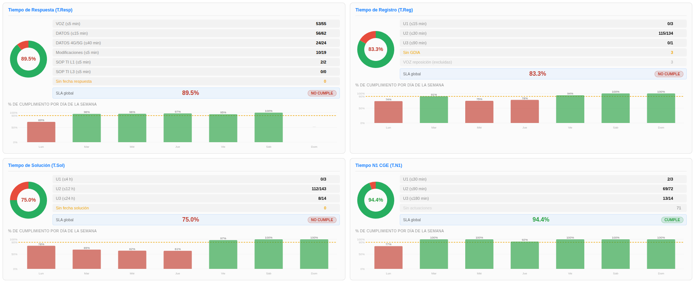
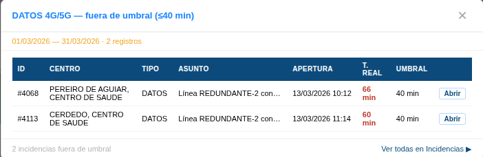

# Manual de Usuario: Módulo KPIs Inelcom

| Campo       | Valor                                          |
|-------------|------------------------------------------------|
| **Módulo**  | Mantenimiento > Herramientas > KPIs Inelcom    |
| **Versión** | 1.6                                            |
| **Fecha**   | Abril 2026                                     |
| **Para**    | Operadores CGE SERGAS                          |

---

## Índice

1. [Para qué sirve este módulo](#1-para-qué-sirve-este-módulo)
2. [Cómo accedemos al módulo](#2-cómo-accedemos-al-módulo)
3. [Seleccionar período](#3-seleccionar-período)
4. [Leer los indicadores](#4-leer-los-indicadores)
5. [Ver detalle de incidencias](#5-ver-detalle-de-incidencias)
6. [Exportar datos](#6-exportar-datos)
7. [Interpretación de colores](#7-interpretación-de-colores)
8. [Acceso restringido](#8-acceso-restringido)

---

## 1. Para qué sirve este módulo

El módulo **KPIs Inelcom** muestra un dashboard con los indicadores de cumplimiento de SLA del contrato **Inelcom**, calculados sobre las incidencias **cerradas** del período seleccionado. Nos permite:

- Ver el rendimiento global y por tipo de incidencia.
- Detectar incidencias **fuera de umbral** abriendo el modal de detalle.
- **Exportar** los datos en Excel o PDF para informes y reuniones de seguimiento.

El dashboard se compone de **4 bloques** correspondientes a los cuatro tiempos del SLA: **T.Resp**, **T.Reg**, **T.Sol** y **T.N1**.

---

## 2. Cómo accedemos al módulo

1. Abrimos la **Web BDU** en el navegador.
2. En la barra superior pulsamos **Mantenimiento**.
3. Pulsamos la tarjeta **Herramientas** y, en el acordeón, elegimos **KPIs Inelcom**.

> **Atajo:** también podemos llegar directamente con `?m=mantenimiento&sub=kpis` añadido al final de la URL.

---

## 3. Seleccionar período

En la parte superior tenemos los botones de período:

| Botón                 | Período que muestra                                                     |
|-----------------------|-------------------------------------------------------------------------|
| **Semana**            | Semana anterior completa (lunes a domingo). Activo por defecto.         |
| **Mes**               | Mes anterior completo. Despliega un selector con todos los meses para elegir otro. |
| **Año**               | Año anterior completo. Despliega un selector con los años disponibles.  |
| **📅 Fecha concreta** | Rango personalizado de fechas mediante panel desplegable.               |

Al cambiar de período, los datos del dashboard se actualizan automáticamente.

### 3.1. Elegir un mes o un año concreto

- Al pulsar **Mes** aparece un desplegable con los meses disponibles (no solo el mes anterior). Lo cambiamos y los datos se recalculan al instante.
- Igual con **Año**: el desplegable nos permite elegir cualquier año, no solo el anterior.

### 3.2. Rango de fechas personalizado

1. Pulsamos **📅 Fecha concreta**.
2. Se despliega un panel con dos campos: **Desde** y **Hasta**.
3. Elegimos las fechas.
4. Pulsamos **Aplicar**.

---

## 4. Leer los indicadores

El dashboard se distribuye en una cuadrícula de **4 bloques KPI**. Cada bloque tiene la misma estructura: una donut con el % de cumplimiento, varias filas detalle y una gráfica de tendencia.

### 4.1. Bloque T.Resp — Tiempo de Respuesta

Mide cuánto tardamos en responder al cliente desde que se abre la incidencia.

| Tipo de incidencia        | Umbral máximo |
|---------------------------|---------------|
| VOZ                       | 5 minutos     |
| DATOS                     | 15 minutos    |
| DATOS 4G/5G               | 40 minutos    |
| Modificaciones            | 5 minutos     |
| SOP TI L1                 | 5 minutos     |
| SOP TI L3                 | 5 minutos     |
| ⚠️ Sin fecha de respuesta | (aviso)       |

Cada fila muestra el número de incidencias **fuera de umbral** y es clickable para abrir el modal con el detalle.

### 4.2. Bloque T.Reg — Tiempo de Registro

Mide cuánto tardamos en registrar el GDIA desde la apertura de la incidencia.

| Urgencia                              | Umbral máximo |
|---------------------------------------|---------------|
| U1                                    | 15 minutos    |
| U2                                    | 30 minutos    |
| U3                                    | 90 minutos    |
| ⚠️ Sin GDIA                           | (aviso)       |
| ℹ️ VOZ reposición (excluidas)         | (informativo) |

> **Importante:** las incidencias de **VOZ con reposición** (`SI/AP`) están **excluidas del cálculo del SLA** porque la GDIA se abre adrede al día siguiente. La fila aparece en azul con el contador de incidencias afectadas, y **es clickable** para ver el detalle.

### 4.3. Bloque T.Sol — Tiempo de Solución

Mide cuánto tardamos en resolver la incidencia.

| Urgencia                              | Umbral máximo |
|---------------------------------------|---------------|
| U1                                    | 4 horas       |
| U2                                    | 12 horas      |
| U3                                    | 24 horas      |
| ⚠️ Sin fecha de solución              | (aviso)       |

### 4.4. Bloque T.N1 — Tiempo N1 CGE

Mide cuánto tarda el primer nivel del CGE en actuar sobre la incidencia.

| Urgencia                | Umbral máximo |
|-------------------------|---------------|
| U1                      | 30 minutos    |
| U2                      | 90 minutos    |
| U3                      | 180 minutos   |
| Sin actuaciones         | (informativo) |

> **Nota:** la fila *"Sin actuaciones"* del bloque T.N1 es solo informativa y **no es clickable** (no abre modal).

### 4.5. Donut, SLA global y tendencia

En cada bloque vemos:

- **Donut Chart.js** con el porcentaje de cumplimiento global del bloque.
- **SLA global** + **badge** con el porcentaje y el color de cumplimiento (ver [sección 7](#7-interpretación-de-colores)).
- **Gráfica de tendencia** debajo, con la evolución dentro del período (por días, semanas o meses según el período activo).

---

## 5. Ver detalle de incidencias

1. Pulsamos sobre cualquier **fila clickable** de un bloque (las que muestran el contador a la derecha y el texto *"ver ▶"*).
2. Se abre un **modal** con la lista de incidencias de esa fila.
3. La tabla del modal muestra:

| Columna       | Contenido                                              |
|---------------|--------------------------------------------------------|
| **ID**        | Identificador interno de la incidencia.                |
| **Centro**    | Centro afectado.                                       |
| **Tipo**      | Tipo de incidencia.                                    |
| **Asunto**    | Texto resumen.                                         |
| **Apertura**  | Fecha y hora de apertura.                              |
| **T. real**   | Tiempo real medido en la métrica del bloque.           |
| **Umbral**    | Umbral máximo permitido para ese tipo / urgencia.      |
| (acción)      | Enlace **editar** que abre la incidencia en su módulo. |

4. Cerramos el modal pulsando **✕** o haciendo clic fuera.
5. En el pie del modal tenemos el enlace **Ver todas en Incidencias ▶** para abrir el listado completo.

---

## 6. Exportar datos

En la barra superior tenemos dos botones de exportación:

| Botón        | Resultado                                                                |
|--------------|--------------------------------------------------------------------------|
| **📊 Excel** | Descarga un fichero `.xlsx` con todos los datos del período seleccionado.|
| **🔴 PDF**   | Descarga un `.pdf` con las tablas de KPIs y la cabecera con logos.       |

Pasos:

1. Ajustamos el período al estado deseado.
2. Pulsamos el botón del formato (**📊 Excel** o **🔴 PDF**).
3. El fichero se descarga automáticamente.

---

## 7. Interpretación de colores

| Color del badge / donut | Significado                            |
|-------------------------|----------------------------------------|
| **Verde**               | SLA cumplido (buen rendimiento).       |
| **Naranja**             | SLA cerca del límite.                  |
| **Rojo**                | SLA incumplido.                        |

---

## 8. Acceso restringido

El módulo **KPIs Inelcom** está restringido por unidad organizativa de Active Directory. Las cuentas que pertenecen a `UO_usuarios_dominio` no pueden entrar y ven la pantalla de **🔒 Acceso restringido**.

Si nos corresponde el acceso pero no entramos, debemos contactar con el administrador del sistema.

---

*Manual para operadores CGE SERGAS. Versión 1.6 — Abril 2026.*
