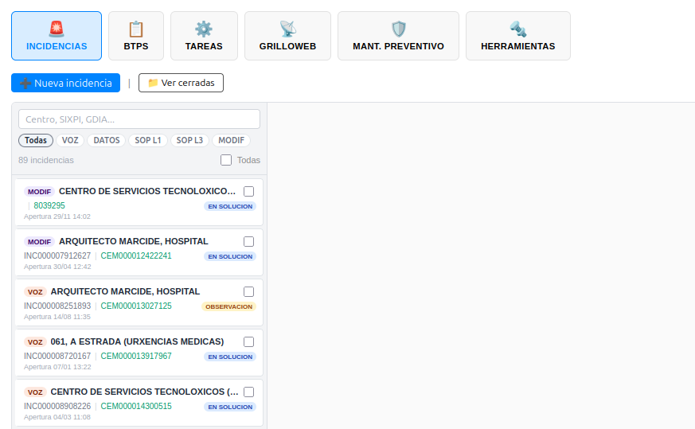
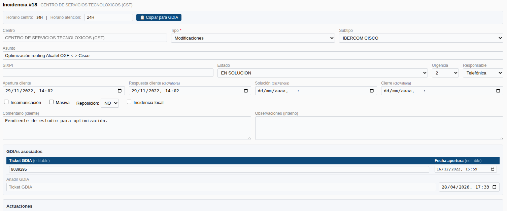
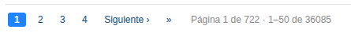

# Manual de Usuario: Módulo Incidencias

| Campo       | Valor                              |
|-------------|------------------------------------|
| **Módulo**  | Mantenimiento > Incidencias        |
| **Versión** | 2.1                                |
| **Fecha**   | Junio 2026                         |
| **Para**    | Operadores CGE SERGAS              |

---

## Índice

1. [Para qué sirve este módulo](#1-para-qué-sirve-este-módulo)
2. [Cómo accedemos al módulo](#2-cómo-accedemos-al-módulo)
3. [La pantalla principal](#3-la-pantalla-principal)
4. [Crear una nueva incidencia](#4-crear-una-nueva-incidencia)
5. [Editar una incidencia](#5-editar-una-incidencia)
6. [Edición masiva](#6-edición-masiva)
7. [Ver incidencias cerradas](#7-ver-incidencias-cerradas)
8. [Resumen del flujo habitual](#8-resumen-del-flujo-habitual)

---

## 1. Para qué sirve este módulo

El módulo **Incidencias** nos permite gestionar las incidencias de red del CGE: crearlas, editarlas, cerrarlas, aplicar cambios masivos sobre varias a la vez y consultar el histórico de cerradas.

La pantalla principal tiene **dos zonas**:

- **Sidebar** (izquierda): tarjetas con las incidencias activas.
- **Panel de detalle** (derecha): vacío hasta que pulsamos una tarjeta o **➕ Nueva incidencia**, donde se carga el formulario sin recargar la página.

Los datos se guardan en la tabla `Incidencias` con sus tablas relacionadas (`Incidencias_Internas` para los GDIAs e `Incidencias_Acciones` para las actuaciones).

---

## 2. Cómo accedemos al módulo

1. Abrimos la **Web BDU** en el navegador.
2. En la barra superior pulsamos **Mantenimiento**.
3. Pulsamos la tarjeta **Incidencias** y, en el acordeón, elegimos **Incidencias**.

> **Atajo:** también podemos llegar directamente con `?m=mantenimiento&sub=incidencias` añadido al final de la URL.

---

## 3. La pantalla principal

Al entrar vemos la barra superior con los botones de acción y, debajo, la zona dividida en sidebar + panel de detalle.

### 3.1. Barra superior

| Botón                                  | Para qué sirve                                                  |
|----------------------------------------|------------------------------------------------------------------|
| **➕ Nueva incidencia**                | Carga el formulario de creación en el panel de detalle.          |
| **📁 Ver cerradas**                    | Cambia a la vista en tabla de incidencias cerradas.              |
| **✏️ Editar N seleccionadas**          | Aparece cuando hay incidencias marcadas. Abre el modal masivo.   |

### 3.2. Sidebar de incidencias activas

Cada tarjeta muestra:

- **Tipo** (etiqueta de color: VOZ, DATOS, L1, L3, MODIF).
- **Centro**.
- **SIXPI** (ticket del cliente).
- **GDIA** (ticket interno).
- **Última actuación**.
- **Hora** de apertura.

Las incidencias **VOZ o DATOS sin GDIA** se resaltan en rojo claro para que no pasen desapercibidas.

#### Filtros y búsqueda

Encima de la lista tenemos:

- **Botones de filtro por tipo**: *Todas · VOZ · DATOS · SOP L1 · SOP L3 · MODIF*. Al pulsar uno solo se muestran las incidencias de ese tipo.
- **Campo de búsqueda**: filtra en tiempo real por centro, SIXPI o GDIA.
- **Contador** de incidencias visibles.
- Casilla **"Todas"** para seleccionar todas las visibles de golpe.

---

## 4. Crear una nueva incidencia

1. Pulsamos **➕ Nueva incidencia** en la barra superior.
2. El panel de detalle carga el formulario de creación.

### 4.1. Centro y horario

1. Escribimos el nombre del centro en el buscador. Aparecen sugerencias.
2. Seleccionamos el centro. Se rellena automáticamente el **Horario centro**.
3. Si necesitamos un horario distinto, modificamos el campo **Horario atención**.

### 4.2. Tipo y subtipo

1. Seleccionamos el **Tipo de incidencia**: *VOZ · DATOS · SOP TI L1 · SOP TI L3 · Modificaciones*.
2. El desplegable de **Subtipo** se actualiza automáticamente con las opciones disponibles para ese tipo.

### 4.3. Modo línea (solo DATOS)

Si el tipo es **DATOS**, aparece un selector adicional:

- **Sobre línea**: elegimos una o varias líneas del centro. Se creará **una incidencia por cada línea**.
- **General (sin línea)**: incidencia general sin asociar a una línea concreta.

### 4.4. GDIA

- Si elegimos **líneas**, podemos optar por:
  - **Un GDIA para todas las líneas**: un solo ticket GDIA.
  - **GDIA por línea**: un ticket GDIA distinto por línea.
- Si no hay líneas (VOZ u otros tipos), rellenamos el GDIA general.
- En cualquier caso introducimos **ticket** + **fecha** del GDIA.

### 4.5. Resto de campos

| Campo                    | Descripción                                                          |
|--------------------------|----------------------------------------------------------------------|
| Asunto                   | Texto libre. Para DATOS sobre línea se autogenera con el nemónico.   |
| SIXPI                    | Ticket del cliente.                                                  |
| Estado                   | EN SOLUCION (por defecto), OBSERVACION, PTE CONFIRMACION. *(El estado CERRADA solo está disponible al editar una incidencia, no al crearla)*. |
| Urgencia                 | 1, 2 o 3.                                                            |
| Responsable              | Telefónica (T) o Cliente (C).                                        |
| Fecha apertura cliente   | **Obligatoria**. Fecha en que el cliente abrió la incidencia.        |
| Fecha respuesta cliente  | Hacemos clic en el campo para poner la fecha y hora actual.          |
| Incomunicación           | Casilla para marcar el centro como incomunicado (solo DATOS).        |
| Masiva                   | Casilla para marcar incidencia masiva (solo DATOS).                  |
| Reposición               | NO / SI / AP (solo VOZ).                                             |
| Incidencia local         | Casilla para marcar incidencia local.                                |

> **Estados sin tildes:** los estados se muestran tal y como están en la base de datos: `EN SOLUCION`, `OBSERVACION`, `PTE CONFIRMACION`, `CERRADA`. No tiene tildes a propósito (compatibilidad con sistemas externos que las consumen).

### 4.6. Actuaciones

1. Pulsamos **+ Actuación** para añadir una fila.
2. Seleccionamos el **tipo** de actuación en el desplegable.
3. Introducimos el **ticket** y la **fecha**.
4. Para añadir más, pulsamos **+ Actuación** de nuevo.
5. Para eliminar una, pulsamos el botón **✕** de esa fila.

### 4.7. Comentarios

- **Comentario**: información para el cliente (lo verá en correos).
- **Observaciones**: notas internas del operador.

### 4.8. Guardar

1. Revisamos todos los datos.
2. Pulsamos **💾 Guardar**.
3. Si hay errores de validación, aparecen mensajes en rojo arriba indicando qué falta.
4. Si todo es correcto, se crea la incidencia y volvemos a la lista.

> **Líneas duplicadas:** si intentamos crear una incidencia DATOS sobre una línea que ya tiene otra incidencia activa con el mismo nemónico, esa línea se omite automáticamente y se nos avisa.

---

## 5. Editar una incidencia

1. Pulsamos sobre una **tarjeta** del sidebar (incidencias abiertas) o sobre el icono **✏️** de cualquier fila (incidencias cerradas).
2. El panel de detalle carga el formulario de edición con todos los datos.

### 5.1. Diferencias con la creación

- El **centro no se puede cambiar**.
- El **tipo y subtipo sí son editables**.
- Aparecen los campos de fecha **Solución** y **Cierre** (clic = ahora).
- Los **GDIAs existentes** se muestran en una tabla editable (modificamos ticket y fecha).
- Las **actuaciones existentes** son editables (ticket y fecha; el tipo no se puede cambiar).
- Podemos **añadir un nuevo GDIA** o una **nueva actuación** al final del formulario.

### 5.2. Copiar para GDIA

1. Pulsamos el botón **📋 Copiar para GDIA** en la cabecera.
2. Se copia al portapapeles la información formateada del centro (centro + horario + asunto + SIXPI).
3. Aparece brevemente el aviso **✓ Copiado**.
4. Pegamos esa información donde la necesitemos al abrir el GDIA en el sistema de Telefónica.

### 5.3. Validaciones al guardar

El sistema valida la **cadena de fechas**:

- La fecha de respuesta no puede ser anterior a la de apertura.
- La fecha del GDIA no puede ser anterior a la de apertura.
- La fecha de solución debe ser posterior a apertura, respuesta y GDIAs.
- La fecha de cierre debe ser posterior a todas las demás.

Y los campos obligatorios según el estado:

| Estado                              | Campos obligatorios                                    |
|-------------------------------------|--------------------------------------------------------|
| **CERRADA**                         | apertura, respuesta, solución, cierre                  |
| **OBSERVACION** o **PTE CONFIRMACION** | apertura, respuesta, solución                          |
| **EN SOLUCION**                     | apertura                                               |

Y siempre: **Urgencia** y **Responsable**.

### 5.4. Guardar cambios

1. Pulsamos **💾 Guardar cambios**.
2. Si hay errores, se muestran arriba.
3. Si todo es correcto, se guardan los cambios y volvemos a la lista (o a la vista de cerradas si entramos desde ahí).

---

## 6. Edición masiva

Cuando necesitamos aplicar un mismo cambio a varias incidencias a la vez (cerrarlas en bloque, añadir una actuación común, etc.):

### 6.1. Seleccionar incidencias

1. Marcamos la **casilla** de la esquina superior izquierda de cada tarjeta.
2. O pulsamos la casilla **"Todas"** del sidebar para seleccionar todas las visibles del filtro actual.
3. El botón **✏️ Editar N seleccionadas** muestra el contador en tiempo real.

### 6.2. Aplicar la acción masiva

1. Con incidencias seleccionadas, pulsamos **✏️ Editar N seleccionadas**.
2. Se abre un modal con todos los campos modificables. **Solo se aplicará lo que rellenemos**: los campos vacíos y los selectores que dejemos en `-- Sin cambiar --` se ignoran.
3. Campos disponibles:
   - **Estado**, **Urgencia**, **Responsable**.
   - **Apertura cliente**, **Respuesta cliente**, **Fecha solución**, **Fecha cierre** (clic = ahora).
   - **Añadir GDIA**: ticket + fecha.
   - **Añadir actuación**: tipo + ticket + fecha.
   - **Comentario cliente** (sobreescribe el existente).
   - **Observaciones internas** (se añaden al final de las existentes).
   - **Incomunicado**, **Masiva**, **Local**, **Reposición** (VOZ).
4. Pulsamos **💾 Aplicar a seleccionadas**.
5. Confirmamos el aviso emergente.
6. La página recarga con el mensaje *"N incidencias actualizadas correctamente"*.

> **Cerrar en bloque:** si elegimos estado **CERRADA**, debemos rellenar obligatoriamente las fechas de **Apertura**, **Respuesta**, **Solución** y **Cierre** en el modal masivo. Para **OBSERVACION** o **PTE CONFIRMACION** se exigen **Apertura**, **Respuesta** y **Solución**.

> **Validación de coherencia temporal:** antes de aplicar nada, el sistema comprueba fila a fila que las fechas resultantes (las del form sobre las que ya tuviera cada incidencia) cumplen el orden lógico **apertura ≤ respuesta ≤ GDIA ≤ actuaciones ≤ solución ≤ cierre**. Si alguna incidencia incumple el orden, **no se aplica ningún cambio del lote** y se muestra una lista con las incidencias problemáticas (INC #Id y ticket cliente) y el motivo. Corregimos lo que sobre y volvemos a intentar. Es un comportamiento *todo o nada* para evitar dejar incidencias en estado inconsistente.

> **Observaciones masivas:** se concatenan al final de las que ya tuviera cada incidencia (no las sobreescriben). El **comentario cliente**, en cambio, sí sobreescribe.

---

## 7. Ver incidencias cerradas

Pulsamos **📁 Ver cerradas** en la barra superior. Se carga una vista en tabla con las incidencias cerradas.

### 7.1. Vista por defecto: año en curso

Por motivos de rendimiento (la base de datos tiene **más de 35 000 incidencias cerradas históricas**), la vista por defecto solo carga las cerradas **del año en curso** además de todas las activas.

Junto al contador aparece la nota:

> *N registros · mostrando 2026 · **Ver histórico completo***

### 7.2. Ver histórico completo

Pulsamos **Ver histórico completo** para cargar también las cerradas de años anteriores. Cuando estamos en histórico, el enlace cambia a **Volver al año en curso**.

### 7.3. Filtros y búsqueda

- **Botones de filtro por tipo**: *Todas · VOZ · DATOS · SOP L1 · SOP L3 · MODIF*.
- **Buscador**: encuentra texto en cualquiera de estos campos: centro, SIXPI, GDIA, actuación, asunto, comentario, observaciones, responsable, tipo y subtipo.
- Tras escribir, pulsamos **Buscar**. El botón **✕** limpia el filtro.

### 7.4. Paginación

La tabla se pagina de **50 en 50** registros. En la parte inferior tenemos:

- Enlaces **«** · **‹ Anterior** · números de página · **Siguiente ›** · **»**.
- Texto *"Página N de M · X–Y de Z"*.

Los filtros y la búsqueda se mantienen al cambiar de página.

### 7.5. Editar una cerrada

Pulsamos el icono **✏️** de la primera columna de la fila. Se carga el formulario de edición igual que con las activas. Tras guardar, volvemos a la vista de cerradas.

---

## 8. Resumen del flujo habitual

1. Llega aviso de incidencia (correo, llamada, alerta Nagios).
2. **Crear** la incidencia con los datos del centro, tipo, GDIA, etc. ([sección 4](#4-crear-una-nueva-incidencia)).
3. Gestionar la incidencia: añadir actuaciones, modificar estado conforme avanza ([sección 5](#5-editar-una-incidencia)).
4. **Copiar para GDIA** cuando necesitemos abrir un ticket interno ([sección 5.2](#52-copiar-para-gdia)).
5. Cuando se resuelva, ponemos estado **CERRADA** con todas las fechas obligatorias. Al guardar saldrá un aviso recordando que **revisemos bien todos los datos** (fechas, responsable, flags, comentarios) porque **en breve se eliminará la opción de editar incidencias cerradas**. Aplica tanto al cierre individual como al masivo.
6. Para actualizaciones en bloque (cierre masivo, actuación común…), usamos la **edición masiva** ([sección 6](#6-edición-masiva)).
7. Si necesitamos consultar incidencias antiguas, vamos a [Ver cerradas](#7-ver-incidencias-cerradas) y, si hace falta, activamos el **histórico completo**.

---

*Manual para operadores CGE SERGAS. Versión 2.1 — Junio 2026.*
