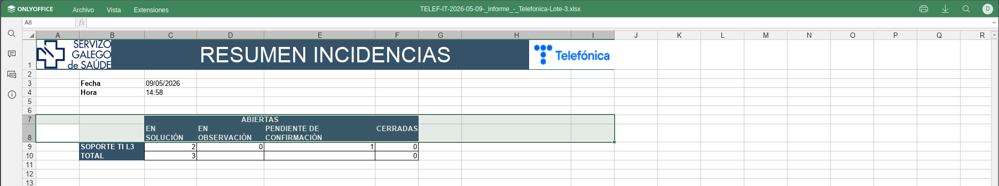
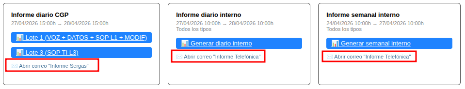

# Manual de Usuario: Módulo Informes

| Campo       | Valor                              |
|-------------|------------------------------------|
| **Módulo**  | Mantenimiento > Informes CGP       |
| **Versión** | 1.6                                |
| **Fecha**   | Abril 2026                         |
| **Para**    | Operadores CGE SERGAS              |

---

## Índice

1. [Para qué sirve este módulo](#1-para-qué-sirve-este-módulo)
2. [Cómo accedemos al módulo](#2-cómo-accedemos-al-módulo)
3. [La pantalla principal](#3-la-pantalla-principal)
4. [Tipos de informe disponibles](#4-tipos-de-informe-disponibles)
5. [Generar un informe](#5-generar-un-informe)
6. [Visualizar y descargar informes (online, Excel y PDF)](#6-visualizar-y-descargar-informes-online-excel-y-pdf)
7. [Enlaces a correos del CGP](#7-enlaces-a-correos-del-cgp)
8. [Resumen del flujo habitual](#8-resumen-del-flujo-habitual)

---

## 1. Para qué sirve este módulo

El módulo **Informes** genera los informes diarios y semanales de incidencias en formato **Excel (.xlsx)** y, automáticamente, también en **PDF**. Los informes se generan en segundo plano: pulsamos el botón y podemos seguir trabajando mientras la página comprueba el estado y muestra el enlace de descarga cuando está listo.

Hay **5 tipos** de informe agrupados en 4 tarjetas:

- **Informe diario CGP** (con dos botones: Lote 1 y Lote 3).
- **Informe diario interno**.
- **Informe semanal interno**.
- **Semanal SERGAS** (CSV, sin PDF).

Cada tarjeta lleva además un **enlace a la plantilla de correo** correspondiente para enviar el informe al destinatario sin tener que copiar y pegar.

---

## 2. Cómo accedemos al módulo

1. Abrimos la **Web BDU** en el navegador.
2. En la barra superior pulsamos **Mantenimiento**.
3. Pulsamos la tarjeta **Incidencias** y, en el acordeón, elegimos **Informes CGP**.

> **Atajo:** también podemos llegar directamente con `?m=mantenimiento&sub=informes` añadido al final de la URL.

---

## 3. La pantalla principal

Al entrar vemos cuatro zonas, de arriba abajo:

### 3.1. Mensajes de estado

Justo debajo del título aparecen, según el momento:

- **⏳ Generando** *…nombre del informe…* — un job está activo. La página se recarga automáticamente cada 8 segundos.
- **✅ Informe generado** — el último informe terminó correctamente.
- **❌ Error al generar el informe** — el último intento falló (con el motivo).

### 3.2. Tarjetas de generación

Una tarjeta por tipo, con la **fecha y hora de corte** del rango que cubrirá el informe y los botones para lanzarlo.

### 3.3. Resumen "Abiertas ahora"

Tabla pequeña con el conteo de incidencias **no cerradas** por tipo y por estado:

| Tipo            | Sol. | Obs. | Pte. | Total |
|-----------------|------|------|------|-------|
| VOZ             | …    | …    | …    | …     |
| DATOS           | …    | …    | …    | …     |
| Modificaciones  | …    | …    | …    | …     |
| SOP TI L1       | …    | …    | …    | …     |
| SOP TI L3       | …    | …    | …    | …     |

Donde *Sol.* = `EN SOLUCION`, *Obs.* = `OBSERVACION`, *Pte.* = `PTE CONFIRMACION`.

### 3.4. Últimos informes generados

Tabla con los archivos generados durante el **mes en curso**, ordenados por fecha de generación descendente. Por cada archivo: tipo, nombre del fichero, fecha de generación, tamaño y los iconos de descarga.

---

## 4. Tipos de informe disponibles

### 4.1. Informe diario CGP (Lote 1 y Lote 3)

- **Corte**: ayer 15:00h → hoy 15:00h.
- **Lote 1**: incluye **VOZ**, **DATOS**, **SOP TI L1** y **MODIFICACIONES**.
- **Lote 3**: incluye solo **SOP TI L3**.
- **Formato**: Excel (`.xlsx`) basado en plantilla CGP + PDF automático.
- **Carpeta**: `/mnt/documentacion/Informes/informe_diario_cgp/{año}/{mes}/`.

### 4.2. Informe diario interno

- **Corte**: ayer 10:00h → hoy 10:00h.
- **Contenido**: los 5 tipos de incidencia (VOZ, DATOS, SOP TI L1, SOP TI L3, Modificaciones).
- **Formato**: Excel + PDF.
- **Carpeta**: `informe_diario_interno/{año}/{mes}/`.

### 4.3. Informe semanal interno

- **Corte**: viernes 10:00h → lunes siguiente 10:00h.
- **Contenido**: los 5 tipos.
- **Formato**: Excel + PDF.
- **Carpeta**: `informe_semanal_interno/{año}/{mes}/`.

### 4.4. Semanal SERGAS (CSV)

- **Corte**: viernes 15:00h → viernes siguiente 15:00h.
- **Contenido**: 4 ficheros `.csv` separados (VOZ, DATOS, SOP L1, SOP L3). Modificaciones **no se incluye**.
- **Formato**: CSV con separador `;` y codificación UTF-8 con BOM (para que Excel lo abra correctamente con tildes).
- **Carpeta**: `informe_semanal_sergas/{año}/semana_NN/`.

---

## 5. Generar un informe

1. Localizamos la tarjeta del informe que queremos generar.
2. Verificamos que la **fecha de corte** mostrada es la correcta.
3. Pulsamos el botón **📊 Generar…** (o **📊 Lote 1 / Lote 3** en el caso del CGP, o **📄 Generar CSVs Sergas** para el de SERGAS).
4. La página recarga y muestra el aviso *"⏳ Generando: …"* mientras el informe se prepara.
5. Mientras tanto podemos seguir trabajando en otras pestañas: la página se refresca sola cada 8 segundos y avisa cuando termina.

> **Importante:** mientras hay un job activo, los botones de generación de **todas** las tarjetas se deshabilitan a *"⏳ Generando..."*. Solo se puede tener un informe en preparación a la vez. Los enlaces a correos siguen disponibles.

> **Si el informe falla**: aparece un aviso rojo con el mensaje del error. En ese caso volvemos a pulsar el botón para reintentarlo.

---

## 6. Visualizar y descargar informes (online, Excel y PDF)

Los informes generados se listan en la tabla **"Últimos informes generados (mes actual)"** al final de la pantalla. Por cada fila tenemos hasta tres iconos en la columna **Desc.**:

| Icono   | Para qué sirve                                                                                |
|---------|-----------------------------------------------------------------------------------------------|
| **👁**  | **Abrir online en OnlyOffice** (solo lectura, pestaña nueva). Solo aparece para xlsx y csv.   |
| **📊**  | Descargar el Excel (`.xlsx`).                                                                 |
| **📄**  | Descargar el CSV (en lugar del 📊, solo aparece para SERGAS).                                  |
| **🔴**  | Descargar el PDF (solo aparece si el PDF se generó correctamente).                            |

### 6.1. Visualizar online sin descargar (icono 👁)

1. Pulsamos el icono **👁** de la fila del informe.
2. Se abre una **pestaña nueva** con el editor online OnlyOffice mostrando el Excel o CSV en modo solo lectura.
3. Podemos navegar por las hojas, hacer zoom y revisar el contenido sin tener que descargar nada ni abrir Excel en el equipo.
4. Cuando terminamos, cerramos la pestaña.

> **Nota:** los PDFs siguen descargándose con su icono **🔴** (la edición de PDF no está disponible en la versión Community de OnlyOffice).

### 6.2. Descargar el fichero

Pulsamos el icono **📊** (xlsx), **📄** (csv) o **🔴** (pdf) y el navegador descarga el fichero. La descarga se sirve desde un endpoint propio (`download.php`) que verifica que la ruta esté dentro de `/mnt/documentacion`, así que no podemos descargar nada fuera de la carpeta de informes.

> **Cómo se genera el PDF**: una vez creado el `.xlsx`, el sistema lo convierte a PDF con LibreOffice en modo *headless*. El PDF queda en la subcarpeta `pdf/` junto al Excel.

---

## 7. Enlaces a correos del CGP

Cada tarjeta de informe lleva un enlace **✉️** que abre directamente la plantilla de correo correspondiente en el módulo **Correos**, ya pre-rellenada para que solo tengamos que adjuntar el informe y enviar.

| Tarjeta                 | Enlace a correo                            |
|-------------------------|--------------------------------------------|
| Informe diario CGP      | **✉️ Abrir correo "Informe Sergas"**       |
| Informe diario interno  | **✉️ Abrir correo "Informe Telefónica"**   |
| Informe semanal interno | **✉️ Abrir correo "Informe Telefónica"**   |
| Semanal SERGAS (CSV)    | (sin enlace; los CSV se envían a parte)    |

**Flujo habitual** al cerrar el día:

1. Generamos el informe correspondiente y descargamos el `.xlsx` y/o el PDF.
2. Pulsamos el enlace **✉️** de la misma tarjeta.
3. Se abre la plantilla de correo en una pestaña nueva, lista para enviar.
4. Adjuntamos el informe descargado y enviamos.

---

## 8. Resumen del flujo habitual

Para una nueva incorporación, el día a día con Informes suele ser:

1. **Por la mañana** (antes de las 10:00): generamos los **Diarios CGP Lote 1 y Lote 3**, descargamos el PDF, pulsamos **✉️ Abrir correo "Informe Sergas"** y lo enviamos.
2. **A continuación**: generamos el **Diario interno**, descargamos el PDF, pulsamos **✉️ Abrir correo "Informe Telefónica"** y lo enviamos al equipo interno.
3. **Cada lunes** por la mañana: generamos el **Semanal interno** y lo enviamos por la plantilla "Informe Telefónica".
4. **Cada viernes** después de las 15:00: generamos el **Semanal SERGAS (CSV)** y enviamos los 4 ficheros al destinatario habitual.
5. Si necesitamos **reenviar** un informe ya generado, lo descargamos desde la tabla *"Últimos informes generados"* sin tener que regenerarlo.

---

*Manual para operadores CGE SERGAS. Versión 1.6 — Abril 2026.*
