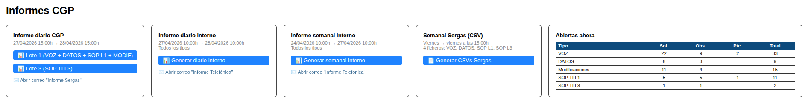
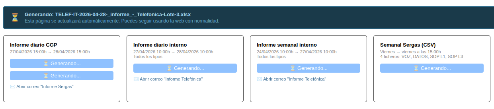
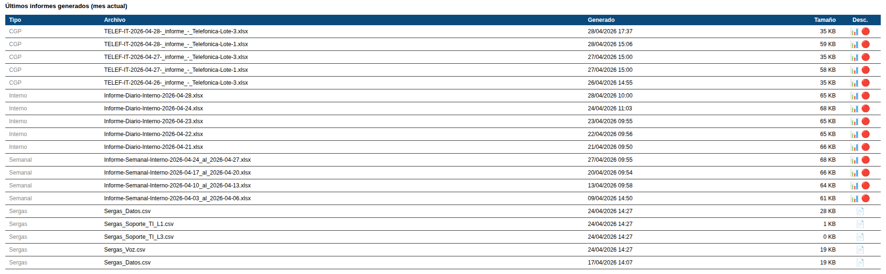

# Manual de Usuario: Módulo Informes

| Campo       | Valor                              |
|-------------|------------------------------------|
| **Módulo**  | Mantenimiento > Informes CGP       |
| **Versión** | 1.5                                |
| **Fecha**   | Abril 2026                         |
| **Para**    | Operadores CGE SERGAS              |

---

## 1. Descripción general

El módulo Informes permite generar informes de incidencias en formato Excel y CSV. Hay **5 tipos** de informes: dos diarios CGP (Lote 1 y Lote 3), uno diario interno, uno semanal interno y uno semanal para SERGAS. Los informes se generan en segundo plano y se descargan cuando están listos.

---

## 2. Panel principal

Al entrar en Informes verás:

- Un **resumen de incidencias abiertas** por tipo y estado.
- **Tarjetas** para cada tipo de informe, con la fecha y hora de corte.
- **Historial** de archivos generados anteriormente para cada tipo.

---

## 3. Tipos de informes disponibles

### 3.1. Informe Diario CGP Lote 1

- **Corte:** Desde ayer a las 15:00h hasta hoy a las 15:00h.
- **Contenido:** Incidencias de VOZ, DATOS, SOPORTE TI (L1) y MODIFICACIONES.
- **Formato:** Excel (.xlsx) basado en plantilla CGP.

### 3.2. Informe Diario CGP Lote 3

- **Corte:** Mismo período que Lote 1 (ayer 15:00h - hoy 15:00h).
- **Contenido:** Solo incluye SOP TI L3.
- **Formato:** Excel (.xlsx).

### 3.3. Informe Diario Interno

- **Corte:** Mismo período que los diarios CGP.
- **Contenido:** Los 5 tipos: VOZ, DATOS, SOP TI L1, SOP TI L3, Modificaciones.
- **Formato:** Excel (.xlsx).

### 3.4. Informe Semanal Interno

- **Corte:** Desde el viernes a las 10:00h hasta el lunes siguiente a las 10:00h.
- **Contenido:** Los 5 tipos de incidencia.
- **Formato:** Excel (.xlsx) con hojas por tipo.

### 3.5. Informe Semanal SERGAS

- **Corte:** Mismo período que el semanal interno.
- **Contenido:** Múltiples ficheros, uno por tipo de incidencia.
- **Formato:** CSV.

---

## 4. Generar un informe

1. Localiza la tarjeta del informe que quieres generar.
2. Verifica que la **fecha de corte** mostrada es la correcta.
3. Pulsa el botón **Generar** de esa tarjeta.
4. Se mostrará un **indicador de progreso** mientras el informe se genera en segundo plano.
5. Cuando esté listo, aparecerá un **enlace de descarga**.
6. Pulsa el enlace para descargar el fichero.

> **Nota:** El proceso de generación puede tardar unos segundos. No cierres la página mientras se genera.

---

## 5. Descargar informes anteriores

- Debajo de cada tarjeta de informe verás el **historial** de los últimos archivos generados.
- Pulsa sobre cualquier fichero del historial para descargarlo directamente.

---

## 6. Estructura de los informes Excel

Los informes en formato Excel contienen:

- **Hoja RESUMEN**: datos agrupados por tipo de incidencia con totales.
- **Hojas individuales**: una hoja por cada tipo de incidencia con el detalle completo.

Los informes semanales SERGAS generan ficheros CSV separados (uno por tipo).

---

## 7. Errores

- Si ocurre un error durante la generación, se mostrará un **mensaje de error** en lugar del enlace de descarga.
- En ese caso, puedes intentar generar el informe de nuevo.

---

*Manual para operadores CGE SERGAS. Versión 1.5 — Abril 2026.*
