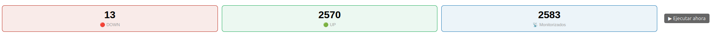
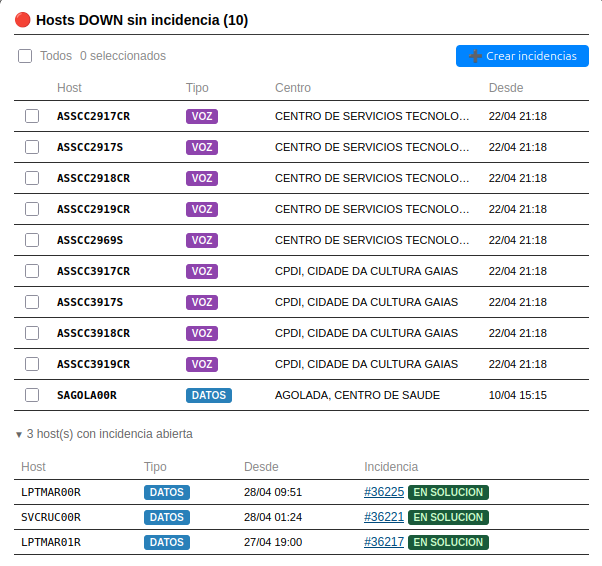
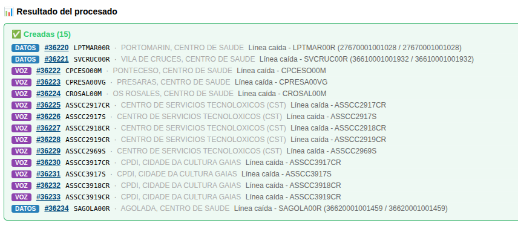
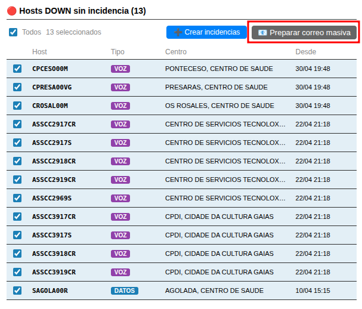
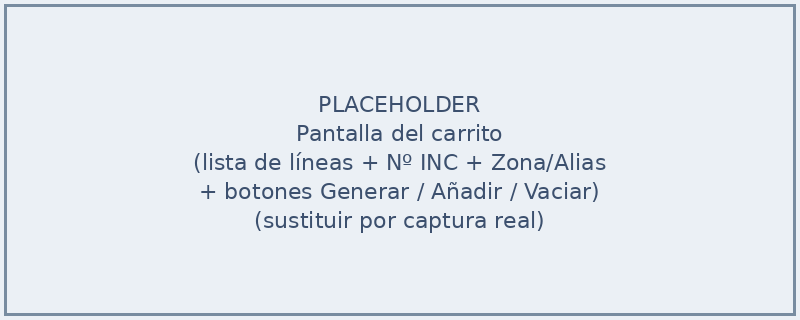
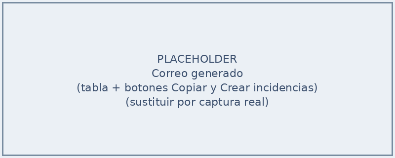
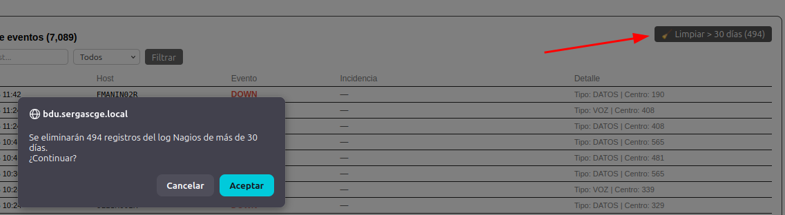
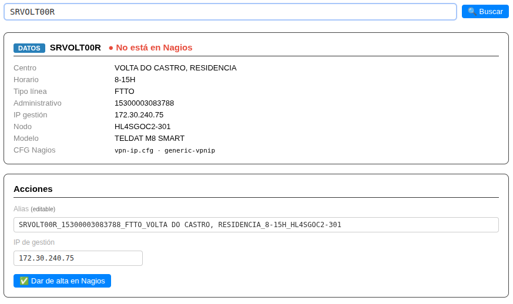
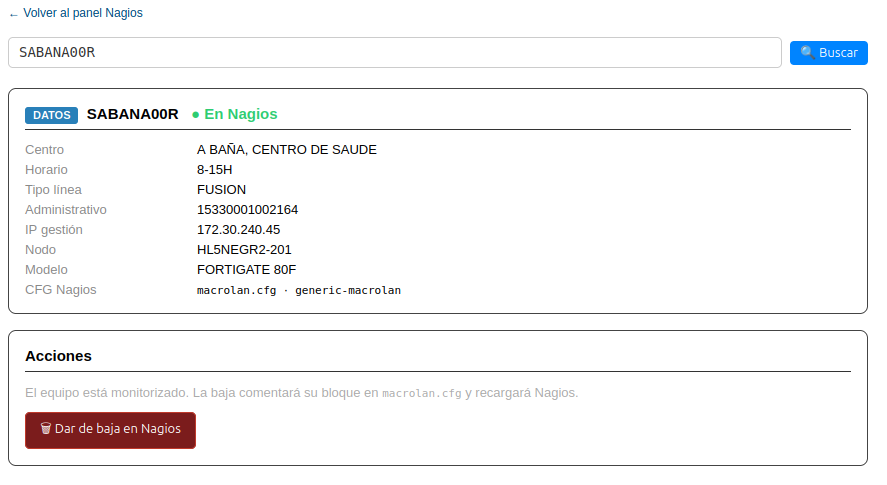

# Manual de Usuario: Módulo Nagios

| Campo       | Valor                              |
|-------------|------------------------------------|
| **Módulo**  | Mantenimiento > Nagios             |
| **Versión** | 2.1                                |
| **Fecha**   | Abril 2026                         |
| **Para**    | Operadores CGE SERGAS              |

---

## Índice

1. [Para qué sirve este módulo](#1-para-qué-sirve-este-módulo)
2. [Cómo accedemos al módulo](#2-cómo-accedemos-al-módulo)
3. [La pantalla principal](#3-la-pantalla-principal)
4. [Hosts DOWN y creación de incidencias](#4-hosts-down-y-creación-de-incidencias)
5. [Log de eventos](#5-log-de-eventos)
6. [Planta Nagios: alta y baja de equipos](#6-planta-nagios-alta-y-baja-de-equipos)
7. [Tipos de línea y ficheros de configuración](#7-tipos-de-línea-y-ficheros-de-configuración)
8. [Resumen del flujo habitual](#8-resumen-del-flujo-habitual)

---

## 1. Para qué sirve este módulo

El módulo **Nagios** integra la BDU con la plataforma de monitorización Nagios del CGE SERGAS. Nos permite hacer dos cosas:

- **Vigilar** los equipos de la red SERGAS y abrir incidencias automáticamente cuando se caen.
- **Gestionar la planta** Nagios: dar de alta o de baja equipos en la monitorización sin necesidad de tocar el servidor.

En segundo plano, un proceso (el *worker*) consulta Nagios **cada 3 minutos**, refresca la lista de hosts caídos y registra los eventos en el log.

---

## 2. Cómo accedemos al módulo

1. Abrimos la **Web BDU** en el navegador.
2. En la barra superior pulsamos **Mantenimiento**.
3. Pulsamos la tarjeta **Incidencias** y, en el acordeón que se despliega, elegimos:
   - **Nagios** para entrar en la pantalla principal de monitorización.
   - **Planta Nagios** para dar de alta o de baja un equipo.

> **Atajo:** también podemos llegar directamente con `?m=mantenimiento&sub=nagios` o `?m=mantenimiento&sub=nagios&action=planta` añadidos al final de la URL.

---

## 3. La pantalla principal

Al entrar vemos cuatro zonas, de arriba abajo:

### 3.1. Barra de estadísticas

Tres píldoras con el resumen del estado actual:

| Píldora                | Qué cuenta                                                               |
|------------------------|--------------------------------------------------------------------------|
| 🔴 **DOWN**            | Hosts caídos detectados por el último ciclo del worker.                  |
| 🟢 **UP**              | Hosts disponibles (Monitorizados − DOWN).                                |
| 📡 **Monitorizados**   | Total de hosts dados de alta en Nagios (ver [sección 6](#6-planta-nagios-alta-y-baja-de-equipos)). |

A la derecha tenemos el botón **▶ Ejecutar ahora** para forzar una pasada del worker sin esperar al cron.

Justo debajo aparece la **fecha de última ejecución** del worker y el periodo del cron (cada 3 minutos).

> **Aviso de worker sin ejecutar:** si todavía no ha pasado ningún ciclo del worker desde que se reinició el servicio, vemos un mensaje naranja recordándonos que pulsemos **▶ Ejecutar ahora** para tener datos.

### 3.2. Hosts DOWN sin incidencia

Tabla a la izquierda con los equipos caídos que **aún no tienen incidencia abierta**. Es la zona accionable: desde aquí podemos crear incidencias en lote (ver [sección 4](#4-hosts-down-y-creación-de-incidencias)).

Columnas: **Host · Tipo (DATOS/VOZ) · Centro · Desde** (fecha y hora del corte detectado).

### 3.3. Hosts DOWN con incidencia abierta

Si algún host caído ya tiene incidencia abierta, aparece un bloque colapsable debajo:

> ▶ **N host(s) con incidencia abierta**

Al pulsarlo se despliega la tabla con esos hosts y el enlace directo a la incidencia vinculada. Estos hosts **no son accionables** desde el panel (su incidencia ya existe), pero sirven de control.

### 3.4. Log de eventos

Panel de la derecha con el histórico de DOWN, RECOVERY y ERROR. Lo describimos en la [sección 5](#5-log-de-eventos).

---

## 4. Hosts DOWN y creación de incidencias

Cuando vemos hosts en la tabla **Hosts DOWN sin incidencia**, podemos crear las incidencias correspondientes en un solo paso.

### 4.1. Seleccionar hosts

- Marcamos los hosts uno a uno con la casilla de la izquierda, **o** pulsamos la casilla **Todos** de la barra de herramientas para seleccionarlos en bloque.
- También podemos hacer **clic en cualquier punto de la fila** para alternar la selección.
- A la derecha de la barra vemos el contador "**N seleccionados**", que se actualiza en tiempo real.
- El botón **➕ Crear incidencias** permanece deshabilitado hasta que haya al menos un host marcado.

### 4.2. Crear las incidencias

1. Pulsamos **➕ Crear incidencias**.
2. Confirmamos el aviso: *"¿Crear incidencias para N hosts? Se omitirán los que ya tengan incidencia abierta."*

3. La página recarga y, en la parte superior, aparece el **resultado del procesado** dividido en tres bloques:

| Bloque              | Significado                                                              |
|---------------------|--------------------------------------------------------------------------|
| ✅ **Creadas**      | Incidencias nuevas, con enlace directo a cada una (`#id`).               |
| ⚠️ **Duplicadas**   | Hosts que ya tenían una incidencia abierta vinculada (no se creó otra). |
| ❌ **Errores**      | Hosts que no se han podido procesar (con el motivo concreto).            |

> **Cómo se evita duplicar incidencias:** la BDU comprueba antes de crear si el host ya tiene una incidencia abierta vinculada por marca interna `[NAGIOS:HOST]`, por la tabla de tracking o por coincidencia de asunto. Si encuentra una, vincula el host a esa incidencia y no crea otra nueva.

### 4.3. Cuando un host se recupera

No tenemos que hacer nada especial: en el siguiente ciclo del worker, si Nagios reporta el host como UP, la BDU añade automáticamente una nota `[NAGIOS RECOVERY]` en las observaciones de la incidencia y limpia el tracking.

> **Importante:** la recuperación **no cierra** la incidencia. Somos nosotros quienes decidimos cerrarla desde el módulo de Incidencias cuando confirmemos que el problema está resuelto.

### 4.4. Preparar correo de incidencia masiva

Cuando una avería tira muchos hosts a la vez (masiva grande en una zona) lo habitual es enviar un correo de **incidencia masiva** a SERGAS además de abrir las incidencias en BDU. El módulo Nagios genera ese correo automáticamente con los hosts ya marcados, evitándonos meterlos uno a uno en el módulo de Correos.

1. Marcamos los hosts afectados igual que para crear incidencias (sección 4.1).
2. Pulsamos el botón **📧 Preparar correo masiva** que aparece junto a "➕ Crear incidencias".
3. Confirmamos el aviso: *"¿Preparar correo de incidencia masiva con N hosts? Se omitirán los equipos de voz (la plantilla es para datos)."*

4. Llegamos a la pantalla del **carrito** del correo:

   - Lista de las líneas que se han cargado a partir de los hosts seleccionados (centro, función, número de línea, nemónico).
   - Aviso si se omitieron hosts de voz o no encontrados en BD.
   - Dos campos opcionales:
     - **Número incidencia Telefónica**: si lo conocemos lo metemos (`INC-XXXXXXXXX`); si no, lo dejamos vacío.
     - **Zona / Alias**: texto libre que se añade al asunto entre corchetes (p.ej. `PROVINCIA LUGO`). Útil cuando enviamos varios correos en la misma jornada y queremos distinguirlos en bandejas.
   - Botones **➕ Añadir otro centro** (para sumar líneas de un centro adicional, igual que en la plantilla manual de Correos) y **🗑 Vaciar y volver**.

5. Pulsamos **Generar correo**. Aparece la **tabla de líneas** lista para copiar.

6. Pulsamos **📋 Copiar tabla y abrir correo**:
   - La tabla se copia al portapapeles (con formato).
   - Se abre el cliente de correo con el destinatario, CC, asunto y cuerpo ya rellenos.
   - Pegamos la tabla en el cuerpo del correo (donde dice `(PEGAR TABLA AQUÍ)`) y enviamos.

7. (Opcional) Una vez copiada la tabla, el botón **➕ Crear incidencias** se activa. Lo pulsamos para abrir las incidencias en BDU sin tener que volver al panel principal de Nagios.

> **Por qué se hace todo desde Nagios:** así no necesitamos volver al panel para pulsar "Crear incidencias" después de enviar el correo (al volver perderíamos la selección). Desde la misma pantalla del correo masivo enviamos a Telefónica y abrimos las incidencias en BDU.

> **Variantes del cuerpo del correo:** si rellenamos el número de incidencia, el cuerpo dice "*posible avería masiva en la red de Telefónica con número INC-XXXXX*". Si lo dejamos vacío, dice "*estamos determinando la causa raíz; comunicaremos el número en cuanto se genere la incidencia*".

---

## 5. Log de eventos

Panel a la derecha de la pantalla principal. Muestra el histórico de eventos en orden cronológico inverso (lo más reciente arriba), paginado de **25 en 25** registros.

### 5.1. Tipos de evento

| Evento       | Color    | Significado                                                  |
|--------------|----------|--------------------------------------------------------------|
| **DOWN**     | Rojo     | El equipo se ha detectado caído.                             |
| **RECOVERY** | Verde    | El equipo ha vuelto a estar disponible (UP) tras una caída.  |
| **ERROR**    | Naranja  | Hubo un fallo al consultar Nagios o al procesar el evento.   |

Cada fila incluye **fecha y hora · host · evento · incidencia vinculada (si la hay) · detalle**. Al pulsar el `#id` de la incidencia abrimos directamente la edición de esa incidencia.

### 5.2. Filtros

Encima de la tabla tenemos:

- **Filtrar host…**: cuadro de texto para acotar por nemónico (admite búsqueda parcial).
- **Selector de evento**: *Todos · DOWN · RECOVERY · ERROR*.
- Pulsamos **Filtrar** para aplicar.
- El botón **✕** (a la derecha) limpia los filtros.

### 5.3. Paginación

Si hay más de 25 eventos, en la parte inferior aparecen los enlaces de paginación. Mantienen el filtro activo al cambiar de página.

### 5.4. Limpiar registros antiguos

A la derecha del título del log encontramos el botón **🧹 Limpiar > 30 días (N)**, donde *N* es el número de registros con fecha anterior a hace 30 días.

1. Si hay registros antiguos, el botón está activo y nos muestra cuántos se van a borrar.
2. Pulsamos el botón.
3. Confirmamos el aviso emergente.
4. Los eventos con más de 30 días se eliminan del log de Nagios.

> **Importante:** la limpieza solo afecta al log de Nagios (`Nagios_Log`). **No** borra incidencias ni tracking de hosts. Es un mantenimiento opcional para no acumular ruido histórico.

---

## 6. Planta Nagios: alta y baja de equipos

La gestión de planta nos permite añadir o retirar equipos de la monitorización Nagios sin necesidad de tocar los ficheros del servidor.

### 6.1. Buscar un equipo

1. Desde el menú accedemos a **Planta Nagios** (o pulsamos **🔧 Gestión de planta Nagios** desde la pantalla principal).
2. Escribimos el **nemónico** del equipo en el campo de búsqueda (por ejemplo, `SABANA00R`).
3. Pulsamos **🔍 Buscar**.

Si encontramos el equipo, aparece su **ficha** con todos los datos: origen (DATOS o VOZ), centro, horario, tipo de línea, administrativo, IP de gestión, nodo, modelo, fichero CFG y plantilla de Nagios que se usaría.

Bajo el nemónico vemos un indicador:

- **● En Nagios** (verde) → el equipo ya está dado de alta.
- **● No está en Nagios** (rojo) → el equipo no está monitorizado.

### 6.2. Dar de alta un equipo

Si el equipo **no está** en Nagios, debajo de la ficha aparece el formulario de alta con dos campos editables:

| Campo            | Cómo viene rellenado                                                                  |
|------------------|---------------------------------------------------------------------------------------|
| **Alias**        | Calculado automáticamente según el tipo de línea (ver [sección 7](#7-tipos-de-línea-y-ficheros-de-configuración)). |
| **IP de gestión**| La IP que tiene el equipo en BDU.                                                     |

1. Revisamos el alias y la IP, y los ajustamos si hace falta.
2. Pulsamos **✅ Dar de alta en Nagios**.
3. Confirmamos el aviso emergente.
4. La BDU escribe el bloque del host en el fichero CFG correspondiente (con el hostgroup de la sede y los `parents` calculados automáticamente) y recarga Nagios.
5. En unos segundos vemos el resultado debajo del botón:
   - **Verde** si el alta se completó correctamente.
   - **Rojo** si hubo algún error (con el motivo).
6. El enlace **🔄 Verificar estado** vuelve a cargar la ficha para confirmar que el equipo aparece como **● En Nagios**.

### 6.3. Dar de baja un equipo

Si el equipo **ya está** en Nagios, en su lugar aparece el botón **🗑 Dar de baja en Nagios**.

1. Pulsamos el botón.
2. Confirmamos el aviso emergente.
3. La BDU **comenta** el bloque del host en su fichero CFG (no lo borra) y recarga Nagios.
4. El equipo deja de monitorizarse de inmediato.

> **Por qué se comenta y no se borra:** así podemos restaurar la configuración fácilmente si la baja fue temporal o se hizo por error. Para reactivarlo basta con descomentar el bloque en el servidor o volver a darlo de alta desde la web.

> **Importante:** dar de baja deja al equipo **sin supervisión**. Solo lo hacemos si el equipo ha sido retirado de la red o si nos consta que ya no necesita monitorización.

---

## 7. Tipos de línea y ficheros de configuración

Cuando damos de alta un equipo, la BDU elige el fichero CFG y la plantilla en función del **tipo de línea** del equipo:

| Tipo de línea           | Fichero CFG     | Plantilla            |
|-------------------------|-----------------|----------------------|
| MACROLAN                | `macrolan.cfg`  | `generic-macrolan`   |
| FUSIÓN                  | `macrolan.cfg`  | `generic-macrolan`   |
| RADIOENLACE             | `macrolan.cfg`  | `generic-macrolan`   |
| FTTH                    | `vpn-ip.cfg`    | `generic-vpnip`      |
| FTTO                    | `vpn-ip.cfg`    | `generic-vpnip`      |
| 4G                      | `4g.cfg`        | `generic-4g`         |
| 5G                      | `4g.cfg`        | `generic-4g`         |
| RTLD (DWDM)             | `dwdm.cfg`      | `generic-dwdm`       |
| DIBA                    | `diba.cfg`      | `generic-diba`       |
| OXE (centralita Alcatel)| `alcatel.cfg`   | `generic-alcatel`    |
| CISCO (centralita)      | `cisco.cfg`     | `generic-cisco`      |
| Cualquier otro tipo     | `router.cfg`    | `generic-router`     |

> **Por qué importa:** el fichero CFG y la plantilla determinan el icono que vemos en el mapa de Nagios, los intervalos de chequeo y los hostgroups a los que pertenece el host. No tenemos que decidirlo nosotros: la ficha del equipo ya nos muestra qué se va a usar antes de confirmar el alta.

---

## 8. Resumen del flujo habitual

Para una nueva incorporación, el día a día con el módulo Nagios suele ser:

1. **Vigilancia continua**: cada vez que entramos al panel, comprobamos la barra de estadísticas y la tabla **Hosts DOWN sin incidencia**.
2. **Crear incidencias**: si hay hosts caídos sin incidencia, los seleccionamos y pulsamos **➕ Crear incidencias** ([sección 4.2](#42-crear-las-incidencias)). Si la avería es **masiva** y queremos enviar también el correo a Telefónica, usamos **📧 Preparar correo masiva** ([sección 4.4](#44-preparar-correo-de-incidencia-masiva)).
3. **Investigar el log**: cuando queremos contexto histórico (cuántas veces ha caído un host, si ha habido recoveries recientes, errores de monitorización), filtramos el [log de eventos](#5-log-de-eventos).
4. **Cerrar incidencias**: cuando un host se recupera, recibimos automáticamente la nota `[NAGIOS RECOVERY]` en la incidencia. Confirmamos el cierre desde el módulo de Incidencias.
5. **Mantenimiento del log**: de vez en cuando pulsamos **🧹 Limpiar > 30 días** para no acumular eventos viejos.
6. **Altas y bajas de planta**: cuando provisión nos avisa de un equipo nuevo o retirado, vamos a [Planta Nagios](#6-planta-nagios-alta-y-baja-de-equipos) y damos el alta o la baja.

---

*Manual para operadores CGE SERGAS. Versión 2.1 — Junio 2026.*
