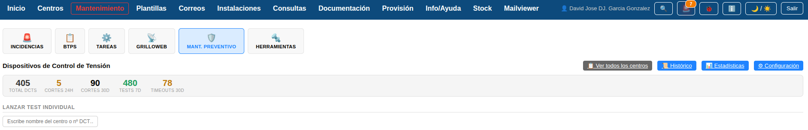
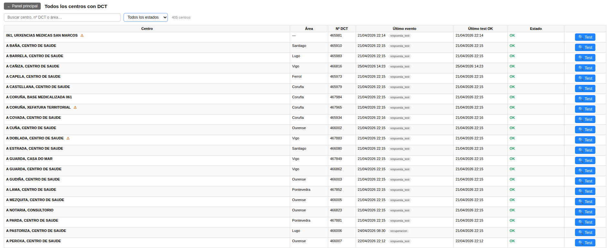
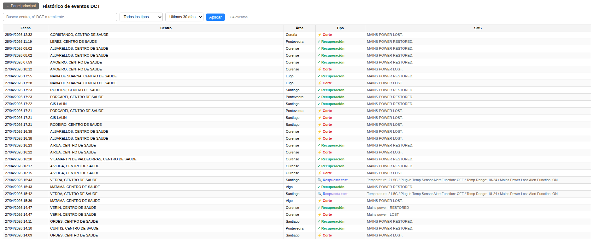
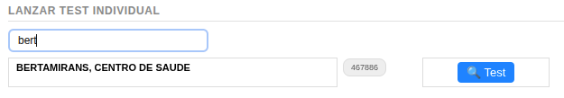
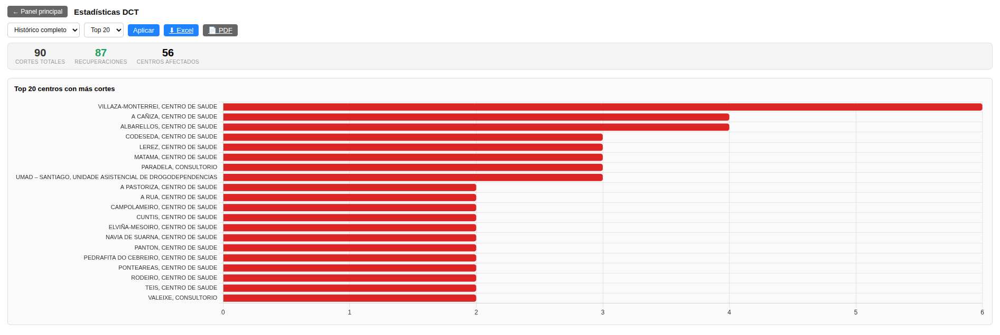
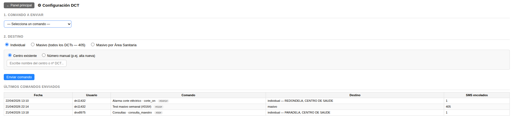

# Manual de Usuario: Submódulo DCT

| Campo       | Valor                                                   |
|-------------|---------------------------------------------------------|
| **Módulo**  | Mantenimiento > Preventivo > DCT                        |
| **Versión** | 1.6                                                     |
| **Fecha**   | Abril 2026                                              |
| **Para**    | Operadores CGE SERGAS                                   |

---

## Índice

1. [Para qué sirve este submódulo](#1-para-qué-sirve-este-submódulo)
2. [Cómo accedemos al submódulo](#2-cómo-accedemos-al-submódulo)
3. [Panel principal](#3-panel-principal)
4. [Listado de centros](#4-listado-de-centros)
5. [Histórico de eventos](#5-histórico-de-eventos)
6. [Lanzar un test individual](#6-lanzar-un-test-individual)
7. [Test DCT Masivo (tarea semanal)](#7-test-dct-masivo-tarea-semanal)
8. [Estadísticas](#8-estadísticas)
9. [Configuración (envío de comandos)](#9-configuración-envío-de-comandos)
10. [Correos automáticos de alerta](#10-correos-automáticos-de-alerta)
11. [Resumen rápido de botones](#11-resumen-rápido-de-botones)
12. [Preguntas frecuentes](#12-preguntas-frecuentes)

---

## 1. Para qué sirve este submódulo

Los **Dispositivos de Control de Tensión (DCT)** son aparatos instalados en los centros de salud que vigilan el suministro eléctrico. Cuando hay un corte de luz el DCT envía un SMS; cuando vuelve la luz envía otro avisando.

Este submódulo:

- Recibe automáticamente los SMS desde los **~405 DCTs** del parque SERGAS.
- Registra cada corte y cada recuperación en base de datos.
- Envía un correo al CGP cada vez que detecta un corte o una recuperación.
- Nos permite consultar al DCT su estado (temperatura, alarmas) lanzando un **test #016#**.
- Genera estadísticas por provincia, área sanitaria, mes y top de centros con más cortes.
- Exporta informes profesionales en Excel o PDF para enviar al cliente.

No tenemos que hacer nada para que funcione: los SMS se procesan solos y los correos se envían solos. Entramos aquí solo cuando queremos consultar información o lanzar tests.

---

## 2. Cómo accedemos al submódulo

1. Abrimos la **Web BDU** en el navegador.
2. En la barra superior pulsamos **Mantenimiento**.
3. Pulsamos la tarjeta **Preventivo** y seleccionamos **DCT · Dispositivos de Control de Tensión**.

> **Atajo:** también podemos llegar directamente con `?m=mantenimiento&sub=preventivo&proyecto=dct` añadido al final de la URL.

---

## 3. Panel principal

Al entrar vemos cuatro zonas, de arriba abajo:

### 3.1. Barra superior con accesos

| Botón                    | A dónde lleva                                                            |
|--------------------------|--------------------------------------------------------------------------|
| **📋 Ver todos los centros** | Listado completo de los ~405 DCTs con filtros.                          |
| **📜 Histórico**         | Todos los eventos con filtros avanzados y paginación.                    |
| **📊 Estadísticas**      | Gráficas y KPIs, con los botones para exportar el informe al cliente.    |
| **⚙ Configuración**      | Catálogo de comandos SMS y formulario de envío.                          |

### 3.2. KPIs del parque

Cinco tarjetas resumen en la cabecera:

| Tarjeta                | Qué cuenta                                                                          |
|------------------------|-------------------------------------------------------------------------------------|
| **Total DCTs**         | Cuántos DCTs hay operativos en el parque.                                           |
| **Cortes 24h**         | Cuántos cortes se han registrado en las últimas 24 horas.                           |
| **Cortes 30d**         | Cuántos en los últimos 30 días.                                                     |
| **Tests 7d**           | Cuántos tests se han lanzado esta semana.                                           |
| **Timeouts 30d**       | Cuántos tests no respondieron a tiempo (ver [sección 6](#6-lanzar-un-test-individual)). |

### 3.3. Buscador para lanzar test individual

Debajo de los KPIs hay un campo de texto. Escribimos el nombre del centro o el nº DCT y se autocompleta. Pulsamos sobre un resultado y aparece el botón **🔍 Lanzar #016#**. Más detalle en la [sección 6](#6-lanzar-un-test-individual).

### 3.4. Últimos eventos

Tabla con los **50 eventos más recientes** del parque, con columnas:

| Columna  | Significado                                                                                  |
|----------|----------------------------------------------------------------------------------------------|
| Fecha    | Cuándo llegó el SMS.                                                                         |
| Centro   | Nombre del centro.                                                                           |
| Tipo     | ⚡ Corte · ✓ Recuperación · 🔍 Respuesta test · 🌡 Alerta temp · 📶 Alerta GSM · — Desconocido. |
| SMS      | Vista previa del texto recibido (al pasar el ratón vemos el completo).                       |

---

## 4. Listado de centros

Pulsamos **📋 Ver todos los centros** desde el panel principal. Vemos los ~405 DCTs en una tabla con:

- Filtro por **Área Sanitaria**.
- Filtro por **Provincia**.
- **Buscador** libre (nombre de centro o nº DCT).
- Filtro por **estado del último evento** (OK / corte pendiente de recuperación / sin eventos aún).

Cada fila tiene enlaces al historial de ese centro y al buscador del panel principal (para lanzarle un test).

---

## 5. Histórico de eventos

Pulsamos **📜 Histórico** desde el panel principal. Vemos **todos los eventos** (no solo los 50 últimos) con:

- Filtro por **tipo** (corte, recuperación, respuesta test, alerta GSM, alerta temp, desconocido).
- Filtro por **centro**.
- Filtro por **rango de fechas**.
- **Paginación**.

Útil para:

- Repasar la actividad de un centro concreto.
- Confirmar si un corte fue reportado y cuánto duró hasta el restore.
- Auditar qué tests han ido bien y cuáles han fallado.

---

## 6. Lanzar un test individual

Un *"test"* consiste en enviar el SMS **#016#** al DCT. El DCT responde con un mensaje que incluye las temperaturas (interna y externa), los rangos de alarma y si tiene activada la alerta de corte eléctrico.

### 6.1. Cómo lo lanzamos

1. En el panel principal, escribimos el centro en el buscador.
2. Pulsamos sobre el resultado del autocompletado.
3. Aparece el botón **🔍 Lanzar #016#**. Lo pulsamos.
4. Se envía el SMS y se crea un test en estado **pendiente**.

### 6.2. Cómo vemos la respuesta

- La respuesta del DCT llega por SMS en unos segundos (hasta 1–2 minutos según la cobertura).
- El evento aparece en **Últimos eventos** como tipo **🔍 Respuesta test**.
- En la lista de tests (Tareas → Test DCT) podemos ver la asociación con el test pendiente y los valores extraídos.

### 6.3. Si el DCT no responde

Si pasan **7 minutos** sin respuesta, el test se marca automáticamente como **timeout** la próxima vez que entremos a cualquier panel de tests.

Posibles causas:

- DCT apagado o sin cobertura.
- SIM del DCT de baja.
- DCT físicamente dañado.

Desde el detalle del lote podemos pulsar **🔍 Reintentar** para volver a lanzar #016# al mismo centro.

---

## 7. Test DCT Masivo (tarea semanal)

El **Test Masivo** se lanza desde **Mantenimiento → Tareas → Test DCT** (no desde aquí). Envía #016# a los ~405 DCTs para verificar la salud de todo el parque. Tarda **~5 horas** porque los SMS salen en lotes de 20 cada 10 minutos para no saturar la red o el módem.

Para el detalle completo consultamos el manual del módulo **Tareas**.

---

## 8. Estadísticas

Pulsamos **📊 Estadísticas** desde el panel principal.

### 8.1. Filtros

Arriba tenemos dos desplegables:

- **Rango**: Últimos 30 días / 90 días / 1 año / Histórico completo.
- **Top**: cuántos centros mostrar en el gráfico de top (10 / 20 / 50 / 100).

Pulsamos **Aplicar** para refrescar.

### 8.2. Gráficas

- **Top N centros con más cortes** (barras horizontales).
- **Cortes por Provincia** (donut + tabla).
- **Cortes por Área Sanitaria** (donut + tabla).
- **Cortes por mes (últimos 12)** (barras).

### 8.3. KPIs

| KPI                  | Significado                                                                          |
|----------------------|--------------------------------------------------------------------------------------|
| **Cortes totales**   | Número real de incidencias eléctricas en el rango seleccionado (ver nota técnica).   |
| **Recuperaciones**   | SMS de RESTORED recibidos.                                                           |
| **Centros afectados**| Cuántos centros han tenido al menos una incidencia.                                  |

> **Nota técnica importante:** un "corte" no equivale siempre a recibir el SMS LOST. Muchos DCTs no logran enviarlo porque al cortarse la luz del centro la batería del DCT no aguanta, o la torre GSM Movistar de la zona también se queda sin luz. En esos casos solo llega el SMS RESTORED cuando vuelve la electricidad. El KPI cuenta cada incidencia real (`MAX(LOST, RESTORED)` por centro) aunque solo llegue uno de los dos SMS.

### 8.4. Exportar informe

Junto al filtro tenemos dos botones:

- **⬇ Excel**: descarga un fichero `.xlsx` con dos hojas (*Resumen Visual* con logos y gráficas + *Detalle* con tablas).
- **📄 PDF**: lo mismo pero convertido a PDF automáticamente.

Usa el rango y top seleccionados en los filtros. Apto para enviar al cliente.

---

## 9. Configuración (envío de comandos)

Pulsamos **⚙ Configuración** desde el panel principal.

### 9.1. Catálogo de comandos

Vemos la lista de comandos SMS soportados por el DD5241 con:

- **Código** (por ejemplo `#016#`).
- **Nombre** y **descripción**.
- Qué respuesta esperar.

### 9.2. Formulario de envío

Por cada comando podemos elegir el destino:

| Destino           | Descripción                                                              |
|-------------------|--------------------------------------------------------------------------|
| **Individual**    | Selector de centro. Envía el comando solo a ese DCT.                     |
| **Masivo por AS** | Selector de Área Sanitaria. Envía a todos los DCTs activos de esa área.  |
| **Masivo total**  | A los ~405 DCTs (requiere confirmación tecleando `MASIVO`).              |
| **Manual**        | Introducimos un número de teléfono arbitrario (para depuración).         |

### 9.3. Auditoría

Todo envío queda registrado en la tabla `DCT_Comandos` con fecha, usuario LDAP, comando, destino y número de centros afectados.

---

## 10. Correos automáticos de alerta

Cada vez que se detecta un **corte** o una **recuperación** se envía un correo automático a:

- **Destino**: `cgp.sergas@telefonica.com`
- **Asunto**:
  - `CORTE SUMINISTRO ELECTRICO - <NOMBRE CENTRO>` si es corte.
  - `SUMINISTRO ELECTRICO RESTAURADO - <NOMBRE CENTRO>` si es recuperación.
- **Cuerpo**: fecha, número remitente del DCT y el texto SMS recibido.

No hay configuración a cambiar — funciona en cuanto entra un SMS válido. Si en algún momento necesitamos modificar el destinatario, hay que editar el fichero `lib/correo.php` (pedir al equipo técnico).

---

## 11. Resumen rápido de botones

| Botón                       | ¿Dónde?                  | ¿Qué hace?                                                  |
|-----------------------------|--------------------------|-------------------------------------------------------------|
| **📋 Ver todos los centros**| Panel principal          | Abre el listado de ~405 DCTs con filtros.                   |
| **📜 Histórico**            | Panel principal          | Todos los eventos con filtros y paginación.                 |
| **📊 Estadísticas**         | Panel principal          | Gráficas y KPIs, con botones de exportación.                |
| **⚙ Configuración**         | Panel principal          | Catálogo de comandos y formulario de envío.                 |
| **🔍 Lanzar #016#**         | Resultado del buscador   | Envía test al DCT seleccionado.                             |
| **Aplicar**                 | Estadísticas             | Refresca las gráficas con los filtros activos.              |
| **⬇ Excel**                 | Estadísticas             | Descarga el informe en `.xlsx`.                             |
| **📄 PDF**                  | Estadísticas             | Descarga el informe en PDF.                                 |
| **🔍 Reintentar**           | Detalle de lote masivo   | Relanza #016# a un DCT que falló.                           |

---

## 12. Preguntas frecuentes

### ¿Por qué hay DCTs que solo envían el RESTORED y no el LOST?

Porque cuando se corta la luz en el centro, la batería interna del DCT no siempre aguanta lo suficiente para mandar el SMS, o la torre de móvil Movistar de la zona también se queda sin electricidad y no hay red para enviar. Es un comportamiento conocido y esperado.

### ¿Y si recibimos solo el LOST y nunca el RESTORED?

Puede indicar que el dispositivo se ha averiado o si probamos con un TEST y responde, que el SMS se ha perdido en algún punto del camino.

### ¿Cuánto tarda el informe en Excel / PDF?

Entre 5 y 30 segundos según el rango seleccionado (histórico completo tarda más). Si pasa más de 1 minuto sin respuesta, revisamos con el equipo técnico — suele ser el convertidor de PDF atascado.

### ¿Podemos enviar un SMS distinto a #016# a un DCT?

Sí, desde **⚙ Configuración**. Están todos los comandos del catálogo soportado por el DD5241. Si falta alguno, hay que ampliar `lib/comandos.php` (pedir al equipo técnico).

### ¿Quién recibe los correos?

Los correos automáticos de alerta se envían a `cgp.sergas@telefonica.com`. Si no los vemos, o el sms no ha llegado al servidor o se ha quedado bloqueado, contactar con el equipo técnico si se dejan de recibir correos.

---

*Manual para operadores CGE SERGAS. Versión 1.6 — Abril 2026.*
