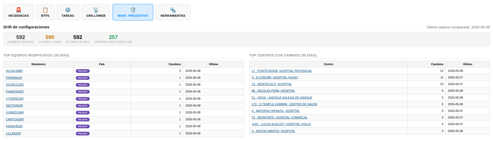
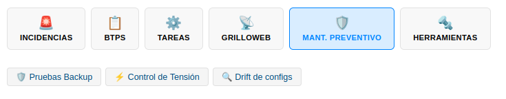
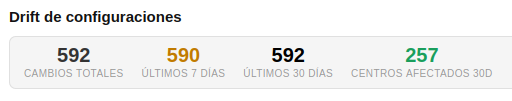
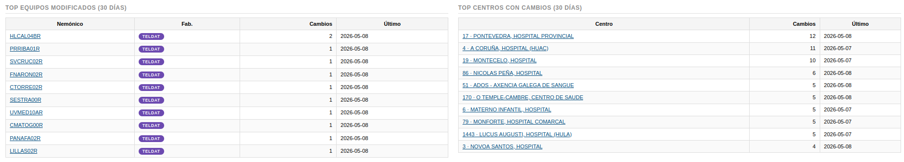
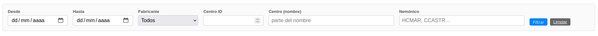
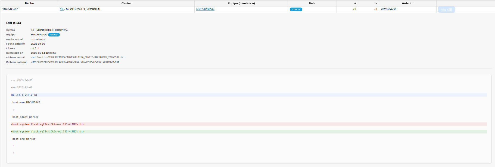
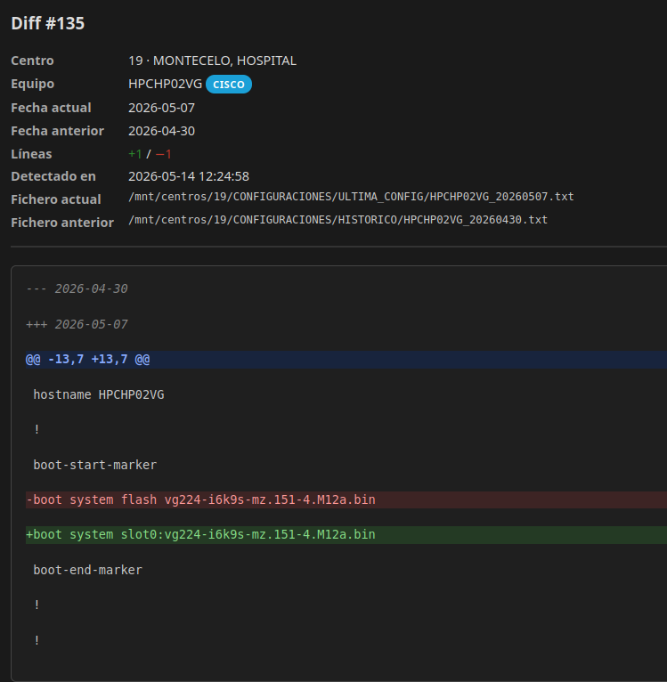
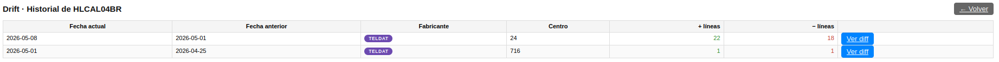

# Manual de Usuario: Submódulo Drift de configuraciones

| Campo       | Valor                                                   |
|-------------|---------------------------------------------------------|
| **Módulo**  | Mantenimiento > Preventivo > Drift de configuraciones   |
| **Versión** | 2.1                                                     |
| **Fecha**   | Mayo 2026                                               |
| **Para**    | Operadores CGE SERGAS                                   |

---

## Índice

1. [Para qué sirve este submódulo](#1-para-qué-sirve-este-submódulo)
2. [Cómo accedemos al submódulo](#2-cómo-accedemos-al-submódulo)
3. [Panel principal](#3-panel-principal)
4. [Filtrar la lista de cambios](#4-filtrar-la-lista-de-cambios)
5. [Ver el detalle de un cambio (diff)](#5-ver-el-detalle-de-un-cambio-diff)
6. [Consultar el historial de un equipo](#6-consultar-el-historial-de-un-equipo)
7. [Preguntas frecuentes](#7-preguntas-frecuentes)

---

## 1. Para qué sirve este submódulo

Cada viernes el sistema recoge automáticamente la configuración de todos los routers que mantenemos. El **Drift de configuraciones** compara la captura de este viernes con la del viernes anterior y nos avisa de qué equipos han cambiado.

Con esta herramienta:

- Vemos rápidamente qué centros se han tocado en la última semana.
- Sabemos quién o qué se ha modificado en cada router (el diff línea a línea).
- Tenemos un historial completo de cambios por equipo, conservado sin fecha de caducidad.
- Filtramos por fabricante, por centro, por nemónico o por rango de fechas.

No tenemos que hacer nada para que se actualice: el cron del domingo lo prepara solo. Entramos aquí para consultar.



---

## 2. Cómo accedemos al submódulo

1. Abrimos la **Web BDU** en el navegador.
2. En la barra superior pulsamos **Mantenimiento**.
3. Pulsamos la tarjeta **Mant. Preventivo** y seleccionamos **🔍 Drift de configs**.

> **Atajo:** también podemos llegar directamente con `?m=mantenimiento&sub=preventivo&proyecto=drift` añadido al final de la URL.



---

## 3. Panel principal

Al entrar vemos cuatro zonas, de arriba abajo:

### 3.1. KPIs en cabecera

Cuatro contadores resumen del estado:

| KPI                    | Significado                                                          |
|------------------------|----------------------------------------------------------------------|
| **Cambios totales**    | Todas las filas registradas desde que arrancó el comparador.         |
| **Últimos 7 días**     | Cambios detectados en la semana actual.                              |
| **Últimos 30 días**    | Cambios detectados en el último mes.                                 |
| **Centros afectados 30d** | Cuántos centros distintos han tenido al menos un cambio.          |



### 3.2. Tops últimos 30 días

Dos tablas pequeñas en paralelo:

- **Top equipos modificados**: los nemónicos que más cambios acumulan. Pulsando uno entramos en su historial.
- **Top centros con cambios**: los centros con más equipos modificados. Pulsando un centro la lista se filtra automáticamente por él.



### 3.3. Formulario de filtros

Un bloque con los criterios de búsqueda. Lo vemos en el siguiente apartado.

### 3.4. Tabla paginada de cambios

Lista todos los cambios que cumplen los filtros, en grupos de 50. Cada fila representa un cambio detectado en un equipo concreto entre dos viernes consecutivos.

---

## 4. Filtrar la lista de cambios

Encima de la tabla tenemos un formulario con seis criterios:

| Filtro         | Para qué sirve                                                                                |
|----------------|-----------------------------------------------------------------------------------------------|
| **Desde**      | Solo cambios cuya fecha actual sea igual o posterior a la indicada.                           |
| **Hasta**      | Solo cambios cuya fecha actual sea igual o anterior a la indicada.                            |
| **Fabricante** | Filtra por Cisco, Teldat, Juniper o Desconocido.                                              |
| **Centro ID**  | Filtra por un identificador de centro concreto (número).                                      |
| **Centro (nombre)** | Busca centros cuyo nombre contiene el texto introducido (parcial).                       |
| **Nemónico**   | Busca nemónicos de equipos que contienen el texto (parcial, p. ej. `HCMAR`).                  |

### Pasos para filtrar

1. Rellenamos los campos que nos interesen (pueden quedar vacíos los que no apliquen).
2. Pulsamos **Filtrar**.
3. La página se recarga mostrando solo los resultados que coinciden.
4. Para empezar de cero, pulsamos **Limpiar**.



> **Truco:** los filtros se reflejan en la URL. Podemos guardar como favorito una búsqueda concreta (por ejemplo "todos los Teldat con cambio esta semana") y volver a ella con un clic.

---

## 5. Ver el detalle de un cambio (diff)

En cada fila de la tabla aparece a la derecha un botón azul **Ver diff**.

### Modo inline (recomendado)

1. Pulsamos **Ver diff** con un clic normal.
2. Justo debajo de esa fila se despliega un panel con:
   - Datos del cambio (centro, equipo, fechas, líneas añadidas y borradas, ruta de los ficheros).
   - El diff coloreado: **verde** lo nuevo, **rojo** lo eliminado, **azul** las cabeceras de bloque.
3. Pulsamos otra vez el mismo botón para cerrarlo. Si pulsamos en otro **Ver diff**, se cierra el anterior automáticamente y se abre el nuevo.



### Modo pestaña nueva

Si queremos comparar varios diffs a la vez:

1. Pulsamos **Ver diff** manteniendo **Ctrl** (Windows/Linux) o **Cmd** (Mac).
2. El diff se abre en una pestaña aparte.
3. Podemos abrir tantos como necesitemos.

La pestaña nueva respeta el modo claro u oscuro que tengamos activado en el BDU.



### Cómo leer el diff

```diff
--- 2026-05-01     ← fecha del fichero anterior
+++ 2026-05-08     ← fecha del fichero actual
@@ -2758,7 +2758,7 @@
   entry 100 default
   entry 100 permit
-  entry 100 destination address 69.162.228.10 255.255.255.255    ← lo que había
+  entry 100 destination address 69.162.228.7  255.255.255.255    ← lo que hay ahora
   entry 110 default
```

- Las líneas que empiezan por `-` (rojo) son las que existían antes y ya no.
- Las líneas que empiezan por `+` (verde) son las que aparecen ahora.
- Las líneas sin prefijo son contexto: no han cambiado, se muestran para que veamos *dónde* ocurrió el cambio.
- `@@ -X,Y +A,B @@` es la cabecera de bloque: indica número de línea del fichero anterior y del actual.

---

## 6. Consultar el historial de un equipo

Cada nemónico (columna **Equipo**) es un enlace. Si lo pulsamos llegamos al **historial** de ese equipo concreto, con todos sus cambios desde que existe el comparador.



Desde el historial podemos abrir el diff de cada cambio (mismo botón **Ver diff** que en el panel principal). Esto es útil para auditar la evolución de un equipo concreto o reconstruir cuándo se aplicó una modificación.

Para volver al panel principal pulsamos **← Volver** en la cabecera.

---

## 7. Preguntas frecuentes

### ¿Cada cuánto se actualiza?

Una vez por semana, los domingos a las 06:00. La comparación se hace contra la captura del viernes anterior.

### ¿Por qué hay equipos que aparecen como cambiados aunque no recordemos haberlos tocado?

Lo más habitual es que se trate de un cambio aplicado durante esa semana por mantenimiento normal (ACLs, NAT, DNS, sustituciones), por algún proyecto en curso (Unificación FILTRO_LAN_SEDE, migraciones), o por la propia aplicación de una plantilla del BDU. Si vemos un cambio que no nos cuadra, podemos abrir el diff y revisar exactamente qué se modificó.

### ¿Por qué un equipo no aparece nunca aunque exista?

Posibles motivos:

- El equipo no está siendo capturado por el worker del viernes (no se gestiona vía SSH o falla la captura).
- El equipo solo tiene capturas en `ULTIMA_CONFIG/` pero ninguna previa en `HISTORICO/` (primera semana en producción → no hay anterior con el que comparar).
- El fichero capturado no tiene los marcadores esperados (Cisco `Building configuration…`, Teldat `log-command-errors`, líneas `set ` para Juniper).

### ¿Cómo sé si un cambio es importante?

Mirar el número de líneas añadidas/borradas (columnas **+** y **−**) da una pista rápida: `+1/-1` suele ser un cambio puntual, `+25/-22` puede ser una reorganización de ACL o una intervención mayor. Abriendo el diff vemos el detalle.

### ¿Se borran los cambios antiguos?

No. Los cambios quedan en el histórico de forma permanente. Cada semana se añaden los nuevos.

### ¿Puedo exportar la lista?

La exportación a CSV/PDF no está en la versión 1.0. Si la necesitas, comunícalo y se valora añadirla.

---

*Manual para operadores CGE SERGAS. Versión 2.1 — Junio 2026.*
