# Manual de Usuario: Pruebas Backup (operativa + técnica + submódulo BDU)

| Campo       | Valor                                                                            |
|-------------|----------------------------------------------------------------------------------|
| **Módulo**  | Mantenimiento > Preventivo > Pruebas Backup                                      |
| **Versión** | 2.0                                                                              |
| **Fecha**   | Mayo 2026                                                                        |
| **Para**    | Operadores CGE SERGAS                                                            |
| **Sustituye a** | `manual_pruebas_backup_v1.md` (sólo uso BDU) + `PRO_009_Procedimiento_Pruebas_Backup.docx` (operativa + técnica). El `.docx` corporativo Telefónica sigue siendo la versión oficial con su Control de Cambios; este `.md` es la versión viva del CGE. |

Manual completo de las **pruebas anuales de backup** del parque SERGAS, de principio a fin: qué acordamos con el centro antes, cómo lo planificamos y registramos en la Web BDU, cómo lo ejecutamos sobre los routers (Cisco / Teldat / FortiGate) y cómo lo cerramos.

---

## Índice

**Parte A — Antes de empezar (operativa)**

1. [Para qué sirve y alcance](#1-para-qué-sirve-y-alcance)
2. [Periodicidad y duración](#2-periodicidad-y-duración)
3. [Acuerdo con el centro](#3-acuerdo-con-el-centro)
4. [Registro en GDIA](#4-registro-en-gdia)
5. [Recomendaciones previas a la prueba](#5-recomendaciones-previas-a-la-prueba)
6. [Marcha atrás](#6-marcha-atrás)

**Parte B — En la Web BDU (submódulo Pruebas Backup)**

7. [Cómo accedemos al submódulo](#7-cómo-accedemos-al-submódulo)
8. [Estructura del ciclo anual](#8-estructura-del-ciclo-anual)
9. [Abrir un nuevo ciclo](#9-abrir-un-nuevo-ciclo)
10. [Pantalla del ciclo en curso](#10-pantalla-del-ciclo-en-curso)
11. [Programar las semanas de una fase](#11-programar-las-semanas-de-una-fase)
12. [Coordinar la prueba con el centro](#12-coordinar-la-prueba-con-el-centro)
13. [Flujo Checklist + Marcar](#13-flujo-checklist--marcar)
14. [Estadísticas y exportación](#14-estadísticas-y-exportación)
15. [Cierre automático del ciclo](#15-cierre-automático-del-ciclo)
16. [Histórico de años anteriores (2021-2025)](#16-histórico-de-años-anteriores-2021-2025)

**Parte C — En los equipos de red (técnica)**

17. [Comprobaciones previas](#17-comprobaciones-previas)
    - [17.1 Accesibilidad entre EDCs (ACL 52 / ACL 150)](#171-accesibilidad-entre-edcs-acl-52--acl-150)
    - [17.2 Routing — exportación de rutas](#172-routing--exportación-de-rutas)
    - [17.3 Routing — importación de rutas](#173-routing--importación-de-rutas)
    - [17.4 Ruta señuelo](#174-ruta-señuelo)
    - [17.5 Estado del protocolo de alta disponibilidad](#175-estado-del-protocolo-de-alta-disponibilidad)
    - [17.6 Respaldos móviles](#176-respaldos-móviles)
18. [Ejecución por escenario](#18-ejecución-por-escenario)
    - [18.1 Sede con doble acceso (2 EDCs) TELDAT/CISCO](#181-sede-con-doble-acceso-2-edcs-teldatcisco)
    - [18.2 Sede con triple acceso (3 EDCs con backup móvil) TELDAT/CISCO](#182-sede-con-triple-acceso-3-edcs-con-backup-móvil-teldatcisco)
    - [18.3 Sede con routers FORTI + 5G](#183-sede-con-routers-forti--5g)

**Parte D — Cierre y FAQ**

19. [Resumen rápido de botones del submódulo](#19-resumen-rápido-de-botones-del-submódulo)
20. [Preguntas frecuentes](#20-preguntas-frecuentes)

**Anexos**

- [Anexo A — Glosario y leyenda](#anexo-a--glosario-y-leyenda)
- [Anexo B — Referencias externas](#anexo-b--referencias-externas)

---

# Parte A — Antes de empezar (operativa)

## 1. Para qué sirve y alcance

Las **pruebas de backup anuales** comprueban que las líneas de respaldo de los centros sanitarios (REDUNDANTE y REDUNDANTE-2) funcionan correctamente: si la línea principal cae, las de respaldo asumen el servicio sin cortes para el centro.

Aplicamos esta prueba en el ámbito CGE SERGAS sobre los servicios **MACROLAN**, **VPN-IP**, **DATAINTERNET** y los respaldos **móviles 4G/5G** + **FORTI + 5G**.

| Tipo de CEx                 | Aplica |
|-----------------------------|--------|
| Proyecto Especial (CGE)     | ✅     |

**Importante:** la prueba del respaldo/backup en escenarios **VPN-IP + Respaldo Móvil + TELDAT + 4G/5G** se realiza también con el automatismo **GENTEST**. Aparte, ejecutamos la prueba manualmente como describe este documento.

> Centros con menos de 3 accesos efectivos (PRINCIPAL + REDUNDANTE + REDUNDANTE-2) **no entran** en el ciclo, salvo que el centro esté marcado como **Crítica** y tenga al menos 2. Las líneas METROLAN, RTLD, DIBA y FIBRA OSCURA no cuentan a estos efectos.

---

## 2. Periodicidad y duración

- **Periodicidad:** una vez al año por centro.
- **Duración estimada:** 20 minutos por centro (los 5 primeros para preparar la ejecución, el resto para realizarla y comprobar).

Si las pruebas, por algún motivo, son distintas a las descritas en este procedimiento, hay que validarlas vía VTO Servicio CEx para darles otra cotización distinta a la estándar.

---

## 3. Acuerdo con el centro

### 3.1. Cuándo no hace falta llamar al centro

Para la prueba del respaldo/backup en **VPN-IP + Respaldo Móvil + TELDAT + 5G** se usa el automatismo **GENTEST**: la prueba es no intrusiva, así que **no hace falta** contactar con el centro para coordinar fecha y horario.

### 3.2. Cuándo sí hay que coordinar

Para el resto de servicios y modalidades, sí necesitamos contactar con el centro para coordinar fecha y horario del corte que implica la prueba de balanceo/backup. Pasamos un fichero de planificación con todas las sedes involucradas.

**Avisamos con al menos 72 horas de antelación** (o lo que tenga definido el cliente por contrato).

### 3.3. Antes de planificar, comprobamos

- Que no haya **trabajos programados** que puedan impactar sobre los backup en ese momento — si cortamos el acceso principal mientras hay un trabajo afectando al respaldo, dejamos al centro incomunicado.
- Que no haya **trabajos programados sobre el acceso principal**: en ese caso ya está funcionando por el respaldo, así que la acción preventiva no sería válida (la infraestructura ya está en una configuración predictiva, no nominal).

### 3.4. Información del fichero de planificación

El fichero de planificación incluye:

- Fecha y hora de inicio del corte (para sedes 24h).
- Fecha y hora de fin del corte (para sedes 24h).
- Administrativo.
- Sede / Cliente.
- Motivo.
- Duración.

---

## 4. Registro en GDIA

### 4.1. Ticket mensual SAC/GDIA

Una vez tengamos acuerdo con el centro sobre fecha y hora, y se inicien las pruebas, dejamos constancia de los trabajos de mantenimiento preventivo registrando un ticket en SAC/GDIA con estos campos:

| Campo                           | Valor                                                                                      |
|---------------------------------|--------------------------------------------------------------------------------------------|
| **Vía**                         | ProActivo por Rutina                                                                       |
| **Síntoma**                     | Actuaciones Preventivas de mantenimiento (si el servicio no lo contempla → "Otros")        |
| **Diagnóstico**                 | EDC – Actuaciones Preventivas de mantenimiento                                             |
| **Descripción Apertura/Cierre** | Pruebas rutinarias de backup                                                               |
| **Cierre**                      | Telefónica – EDC-Router – Pruebas Respaldo                                                 |

**Una sola incidencia, no una por sede.** Abrimos una única incidencia marcada como local justo antes de las pruebas y la cerramos al finalizarlas.

### 4.2. Planificaciones largas (más de un mes)

Si la planificación abarca más de un mes, registramos **una única incidencia por mes**. La abrimos justo antes de la primera prueba del mes y la cerramos justo después de la última prueba planificada para ese mes. Vamos relacionando el bloque de sedes conforme las probamos.

> **Ejemplo:** si el cliente planifica pruebas del día 5 al 25 de cada mes, abrimos la incidencia el día 5 antes de iniciar y la cerramos el día 25 al terminar.

### 4.3. Excel de reporte adjunto

La incidencia debe registrar la información de cada sede probada y el resultado. Para ello adjuntamos en GDIA el siguiente Excel de reporte:

| Administrativo / Tel. Acceso 1 | Administrativo / Tel. Acceso 2 | Cliente | Servicio | Tipo de backup/balanceo | Resultado de prueba | Causa prueba fallida | Nº incidencia (si fallida) |
|---|---|---|---|---|---|---|---|
|   |   |   |   |   | OK / Prueba fallida |   |   |

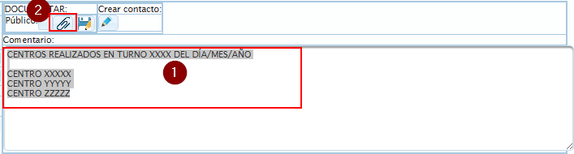
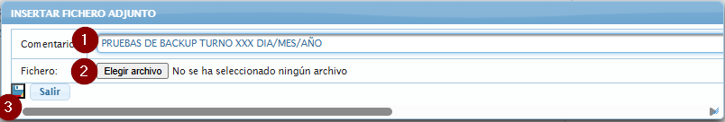

Subimos el Excel a GDIA al cerrar la incidencia del mes.

> La recopilación de los datos es responsabilidad del servicio de operación que ejecuta las pruebas. El Gestor de servicio técnico puede aportar su visión y estudio si el resultado es fallido.

### 4.4. Si el cliente rechaza la prueba

Si un centro o conjunto de sedes no quiere probarse, registramos esta incidencia:

| Campo                           | Valor                                                          |
|---------------------------------|----------------------------------------------------------------|
| **Vía**                         | ProActivo por Rutina                                           |
| **Síntoma**                     | Actuaciones Preventivas de mantenimiento (si no, "Otros")      |
| **Diagnóstico**                 | EDC – Actuaciones Preventivas de mantenimiento                 |
| **Descripción Apertura/Cierre** | Pruebas rutinarias de backup                                   |
| **Cierre**                      | **Cliente** – EDC-Router – Pruebas Respaldo                    |

Se cierra como responsable **Cliente**, indicando lo que el cliente nos traslade, con la fecha del email recibido. **Adjuntamos en GDIA el correo** en el que el cliente declina la prueba.

---

## 5. Recomendaciones previas a la prueba

El CEx es el responsable de asegurar que la información relacionada con los elementos a probar está correctamente registrada y actualizada. Si ha pasado tiempo desde la última verificación, hacemos estas acciones antes de la ejecución para evitar cortes innecesarios al cliente y/o un resultado fallido.

### 5.1. Revisión del parque en LOGOS PT

Comprobamos:

- Correcta asociación de los elementos y accesos que componen la infraestructura de la sede a el/los EDC implicados.
- Datos de los nemónicos.
- Datos de los EDC (Part Number, fabricante…).
- Datos de los accesos.
- Administrativo / teléfono.
- Tecnología y modalidad.
- Datos de direccionamiento IP.

Si detectamos que algún dato no es coherente antes de las pruebas, extraemos del bloque el elemento a probar y lo regularizamos antes de probarlo.

### 5.2. Configuraciones salvadas en GestOpe

Aseguramos que la configuración de los equipos es correcta y está disponible en **GestOpe**. Para equipos con gestión delegada o no estándar, comprobamos que la última configuración está salvada según las especificaciones de cada proyecto o cliente ad-hoc.

### 5.3. OMEGA — deshabilitar apertura de incidencias

Deshabilitamos en **OMEGA** la apertura de incidencias durante la franja horaria de la prueba **si la sede está en horario de apertura**. Si la sede está cerrada, por defecto no abre incidencia, así que no hay que tocar nada.

### 5.4. Preparar configuraciones a aplicar

Recomendamos preparar de antemano las configuraciones que vamos a aplicar sobre cada sede para ejecutar la prueba.

### 5.5. Si no podemos acceder al equipo

Si detectamos algún problema al acceder a los equipos, abrimos incidencia en SAC/GDIA antes de continuar.

---

## 6. Marcha atrás

La prueba dura unos 15-20 minutos. Los 5 primeros están estimados para la preparación.

- **Si a los 15 minutos no hemos podido ejecutar la prueba** por cualquier motivo técnico u operativo, dejamos todos los elementos en su situación inicial y damos la prueba por **nula**.
- **Si la prueba se inicia y durante la ejecución se produce algún fallo**, registramos una incidencia siguiendo el protocolo de gestión de incidencias.

Casos típicos en los que cancelamos y abrimos incidencia:

- Incomunicación por una incidencia mayor que esté afectando al backup en ese momento.
- Incomunicación por un trabajo programado afectando al backup en ese momento.
- Incomunicación por identificación incorrecta por parte del CEx de los elementos de infraestructura implicados.
- Cualquier otro problema no identificado o que traslade el cliente y que degrade el servicio.

---

# Parte B — En la Web BDU (submódulo Pruebas Backup)

El submódulo **Mantenimiento > Preventivo > Pruebas Backup** del Web BDU es donde **planificamos**, **coordinamos fechas con los centros**, **rellenamos el checklist** (transparente vía OnlyOffice) y **marcamos como realizadas** las pruebas del ciclo en curso. Sustituye al antiguo Excel local `\\CGP\Mantenimiento\Datos\Pruebas_Anuales_Backup` (todos los ciclos 2021-2025 se importaron al módulo en mayo 2026).

## 7. Cómo accedemos al submódulo

1. Abrimos la **Web BDU** en el navegador.
2. En la barra superior pulsamos **Mantenimiento**.
3. Pulsamos la tarjeta **Preventivo** y seleccionamos **Pruebas Backup**.

> **Atajo:** también podemos llegar directamente con `?m=mantenimiento&sub=preventivo&proyecto=pruebas_backup` añadido al final de la URL.

---

## 8. Estructura del ciclo anual

Cada año es un **ciclo independiente** con su propio listado de centros. Solo puede haber un ciclo abierto a la vez.

| Estado    | Qué significa                                                                                       |
|-----------|-----------------------------------------------------------------------------------------------------|
| Abierto   | Estamos trabajando en él: podemos coordinar fechas, programar semanas y marcar pruebas realizadas.  |
| Cerrado   | El año está terminado. Lo seguimos viendo en modo lectura, pero no podemos modificar nada.          |

Los centros se reparten en **4 fases** según su horario y criticidad:

| Fase | Nombre        | Centros                          |
|------|---------------|----------------------------------|
| 1    | Mañana        | Horario sólo de mañana.          |
| 2    | Extendido     | Horario extendido.               |
| 3    | 24H           | 24 horas, no críticos.           |
| 4    | Crítica       | 24 horas y marcados como críticos.|

La fase se calcula al abrir el ciclo y queda **fija para todo el año**, aunque el centro cambie de horario después.

---

## 9. Abrir un nuevo ciclo

Cuando entramos al submódulo y todavía no hay ningún ciclo abierto (o el último está cerrado), arriba a la derecha vemos un botón **🔓 Abrir ciclo YYYY**.

1. Pulsamos **🔓 Abrir ciclo YYYY**.
2. Confirmamos en el aviso emergente.
3. El sistema crea el ciclo, calcula los centros y las fases, y nos lleva al ciclo recién abierto.

> No podemos abrir un ciclo si hay otro abierto. Hay que cerrar (o terminar) el actual antes.

> Tampoco podemos reabrir un año que ya existe. Si necesitamos uno cerrado, lo seleccionamos en el desplegable de años para verlo en modo lectura.

---

## 10. Pantalla del ciclo en curso

La pantalla del ciclo tiene 4 zonas, de arriba abajo:

### 10.1. Cabecera

- **Selector de años**: cambiamos rápido entre los ciclos existentes.
- **📊 Estadísticas**: abre la subvista de KPIs y gráficos del año.
- **⬇ Excel**: descarga el listado actual filtrado en xlsx.
- **🔓 Abrir ciclo YYYY+1** (sólo si el año actual está cerrado): inicia el siguiente ciclo.

### 10.2. KPIs del ciclo

Una fila de tarjetas con:

- **Total** de centros del ciclo.
- **Realizados**.
- Por fase, **realizados / total**.
- Una **barra de progreso** con el porcentaje global.

### 10.3. Filtros de la tabla

- **Buscador** libre (nombre del centro, número administrativo o nemónico).
- **Fase**: filtra por una de las 4.
- **Semana**: filtra por semana ISO o "sin asignar".
- **Estado**: pendiente de coordinar / coordinada / realizada.
- Botón **📅 Programar semanas** (sólo si el ciclo está abierto). Ver [sección 11](#11-programar-las-semanas-de-una-fase).

### 10.4. Tabla de centros

| Columna       | Contenido                                                              |
|---------------|------------------------------------------------------------------------|
| Centro        | Nombre + chip ⚠ si es crítico + tipo de centro.                        |
| Horario       | Texto del horario.                                                     |
| Principal     | Servicio, Tipolinea, Administrativo y Nemónico de la línea PRINCIPAL.  |
| Redundante    | Idem para REDUNDANTE.                                                  |
| Redundante-2  | Idem para REDUNDANTE-2 (puede no existir).                             |
| Fase          | 1..4 con color por fase.                                               |
| Sem           | Semana ISO programada (— si aún no asignada).                          |
| F. Coordinada | Fecha y hora pactadas con el centro (editable inline).                 |
| F. Realizada  | Botones **Marcar** y **📋 Checklist** (ver [sección 13](#13-flujo-checklist--marcar)). |
| Usuario       | Quién marcó la prueba como realizada.                                  |

---

## 11. Programar las semanas de una fase

Sirve para repartir los centros de una fase en bloques semanales. Por ejemplo, queremos repartir los **120 centros de Fase 2** en grupos de 10 desde la **semana 14**.

1. Pulsamos **📅 Programar semanas**.
2. Rellenamos:
   - **Fase** (1, 2, 3 o 4).
   - **Centros/semana** (por defecto 10).
   - **Semana inicial** (por defecto la semana ISO actual).
   - Marcamos **Sobrescribir** sólo si queremos pisar las semanas ya asignadas.
3. Pulsamos **Aplicar** y confirmamos.

El sistema reparte los centros por orden alfabético: el primer bloque a la semana inicial, el segundo a +1, etc. Tope duro en la semana 52.

> Por defecto **sólo asigna a centros sin semana**. Si ya programamos antes y queremos reorganizar, tenemos que marcar **Sobrescribir**.

> Tras Aplicar volvemos al mismo año donde estábamos (no nos saca al selector de años).

---

## 12. Coordinar la prueba con el centro

> Antes de llamar al centro, revisa la [Parte A — sección 3](#3-acuerdo-con-el-centro): hace falta avisar con 72 h de antelación y comprobar que no haya trabajos programados que choquen.

Cuando llamamos al centro para concertar la prueba, registramos la fecha y hora pactadas:

1. En la fila del centro, pulsamos en el campo **F. Coordinada**.
2. Elegimos fecha y hora.
3. Se guarda solo. Aparece un botón ✕ para borrar la fecha si la cancelamos.

> El estado de la fila cambia automáticamente a **coordinada** y podemos filtrarla con el desplegable Estado.

---

## 13. Flujo Checklist + Marcar

Cuando vamos a hacer la prueba con el centro **seguimos un flujo en dos pasos para evitar olvidos**: primero abrir el checklist, después marcar como realizada.

### 13.1. Abrir el checklist

1. En la fila del centro, pulsamos **📋 Checklist**.
2. Se nos abre una pestaña nueva con el **checklist en OnlyOffice**, ya con el centro identificado y listo para rellenar.
3. Rellenamos los apartados durante la prueba (firma de quién la hace, líneas probadas, observaciones, etc.).
4. Los cambios se guardan automáticamente cada pocos segundos. Cuando terminemos podemos cerrar la pestaña.

> **El botón Marcar está deshabilitado hasta que pulsamos Checklist por primera vez.** Esto garantiza que la prueba quede documentada antes de cerrarla en BDU.

> Si volvemos otro día, el checklist se conserva con todo lo que hayamos rellenado: el botón **📋 Checklist** abre el mismo fichero del centro, no genera uno nuevo.

> Cada año tiene su propio checklist por centro. El del año pasado queda archivado en el NAS del centro y no se pierde.

> El checklist es el mismo que define el procedimiento corporativo Telefónica PRO_009. Las plantillas para sede de 2 EDC y sede de 3 EDC se ven más adelante en la [sección 18](#18-ejecución-por-escenario) cuando expliquemos cada escenario.

### 13.2. Marcar la prueba como realizada

1. Una vez completado el checklist, en la misma fila pulsamos **Marcar**.
2. Confirmamos en el aviso emergente.
3. La fila pasa a **realizada**, con la fecha y hora actuales y nuestro usuario.

> Si nos equivocamos, podemos pulsar el ✕ junto a la fecha para borrar la marca de realizada (y volver a marcarla más tarde).

### 13.3. ¿Dónde queda el checklist?

Cada centro tiene su propia carpeta en el NAS:

```text
/mnt/centros/<id_centro>/MANTENIMIENTO/Pruebas_Backup/<año>/checklist.xlsx
```

Lo podemos ver también desde el módulo **Centros → Documentación** (pestaña MANTENIMIENTO).

---

## 14. Estadísticas y exportación

### 14.1. Estadísticas (📊)

Pulsamos **📊 Estadísticas** en la cabecera. Vemos:

- Progreso por fase.
- Progreso por semana ISO.
- Top de centros pendientes ordenados por días desde la fecha coordinada.
- Ratio de centros con/sin coordinación.

### 14.2. Exportación a Excel (⬇)

Pulsamos **⬇ Excel**. Descargamos el listado actual con los filtros aplicados (fase, semana, estado, búsqueda).

> El botón Excel **respeta los filtros activos**, así que podemos exportar por ejemplo "todos los centros de Fase 2 de la semana 18 que estén pendientes".

---

## 15. Cierre automático del ciclo

Cuando todos los centros del ciclo están **marcados como realizados**, el sistema **cierra el ciclo automáticamente**:

- El estado pasa a **✓ cerrado** (chip al lado del título).
- Quedan registradas la fecha de cierre y el usuario que marcó la última prueba.
- A partir de ese momento la pantalla pasa a modo lectura: no hay botones Marcar ni edición de fechas.
- Aparece la opción **🔓 Abrir ciclo YYYY+1** para empezar el siguiente año.

> Si el cierre se hizo por equivocación, no se puede reabrir desde la web. Hay que pedir al equipo de desarrollo que vuelva a abrir el año a mano (es excepcional y queda registro).

---

## 16. Histórico de años anteriores (2021-2025)

Los ciclos de **2021, 2022, 2023, 2024 y 2025** se llevaban en hojas de Excel locales (`\\CGP\Mantenimiento\Datos\Pruebas_Anuales_Backup`). En mayo de 2026 se importaron al Web BDU para tenerlo todo en un sitio.

### 16.1. Cómo accedemos al histórico

En el desplegable de años de la cabecera elegimos cualquier año entre 2021 y 2025. Vemos la misma tabla de siempre, con el mismo buscador y los mismos filtros (Fase, Semana, Estado).

### 16.2. Qué cambia respecto a un ciclo vivo

Los años históricos están siempre en **modo lectura** (chip ✓ Cerrado):

- **No hay botón Marcar** (las pruebas se hicieron en su día; no se pueden remarcar).
- **No hay botón 📋 Checklist** (la checklist no existía entonces como fichero).
- **No hay botón 📅 Programar semanas**.
- **F. Coordinada** sale en blanco (—) porque en los Excel no se separaba "coordinada" de "realizada".
- **F. Realizada** muestra:
  - La fecha y hora pactadas/realizadas (años 2023-2025).
  - **✓ OK** sin fecha (años 2021-2022, donde el Excel sólo decía "OK" en una columna).
- La columna **Usuario** muestra el nombre del operador tal cual aparece en el Excel original ("Javi", "Ángel", "Cristian"…).
- Las celdas de cada línea (PRI/RED/RED2) **muestran también la IP de gestión** del equipo (el Excel la traía y el módulo vivo no).

### 16.3. Limitaciones del histórico

- Los nombres de centro vienen **tal cual del Excel**: hay centros que hoy se llaman de otra forma, otros que se cerraron, otros que se fusionaron. No están enlazados con la ficha actual del módulo Centros.
- La criticidad de un centro y el "tipo de centro" no se conocen del Excel, así que la columna Tipo aparece vacía.
- **Hojas omitidas** durante la importación:
  - "FLEXWAN" (2024) — eran centros con conexión FlexWAN al margen del ciclo de pruebas.
  - "Datos" (2025) — hoja auxiliar de control interno.
  - Hoja "CdM" de cualquier año — eran resúmenes para el cliente, no pruebas en sí.

### 16.4. Descargar el histórico en limpio

Pulsamos **⬇ Excel** estando en un año histórico. Se descarga un xlsx con la foto del año tal cual, ya sin formato de hoja antigua: las mismas columnas que el ciclo vivo, listo para enviar al cliente o archivar.

---

# Parte C — En los equipos de red (técnica)

Esta parte describe **qué tecleamos en los routers** durante la ejecución. Está pensada para que el operador no tenga que saltar al `.docx` corporativo PRO_009. Si quieres el contexto teórico (qué es localpref, qué es la ruta señuelo, etc.) ve al [Anexo A — Glosario](#anexo-a--glosario-y-leyenda).

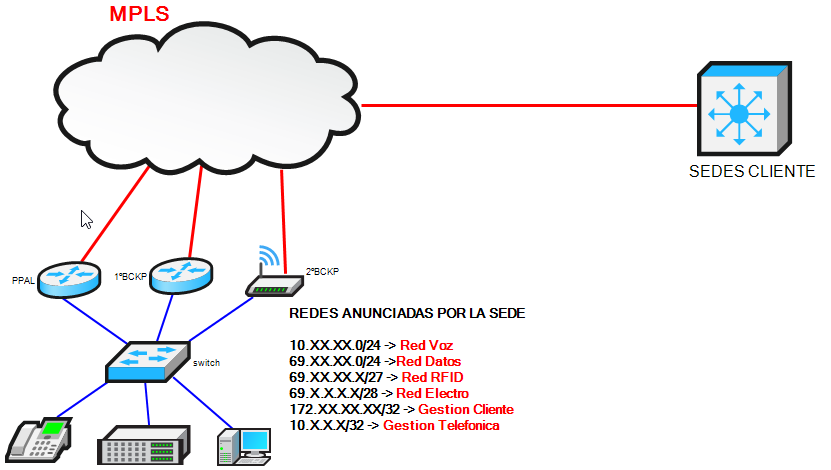

## 17. Comprobaciones previas

Partimos de la premisa de que la configuración está guardada tanto en la memoria del equipo como en los repositorios correspondientes (GestOpe). No es ámbito de este manual entrar al detalle de cómo se gestionan los EDC.

### 17.1. Accesibilidad entre EDCs (ACL 52 / ACL 150)

Para que las pruebas funcionen, hay que poder **acceder al equipo principal desde el equipo de respaldo** (y viceversa). Eso depende de la lista de acceso/filtro VTY: la **ACL 52 en Cisco** y la **ACL 150 en Teldat**. Tienen que estar permitidas las IP de los demás EDC de la sede.

#### Cisco

```text
NEMONICO#sh run | sec access-list 52
access-list 52 permit 10.51.53.4
access-list 52 permit 10.51.53.2
access-list 52 permit 69.51.53.2
access-list 52 permit 69.51.53.4
…
```

Las IP mostradas son las de los demás EDC de la sede en las VLAN de voz y datos.

#### Teldat

```text
NEMONICO Config$feature access-lists
NEMONICO Access Lists config$access-list 150
NEMONICO Extended Access List 150$show config

         description "Filtro de proteccion Telnet, SSH, FTP y NTP"
         …

         entry 100 default
         entry 100 permit
         entry 100 source address 10.51.53.3 255.255.255.255
         entry 100 protocol tcp
;
         entry 110 default
         entry 110 permit
         entry 110 source address 10.51.53.4 255.255.255.255
         entry 110 protocol tcp
;
         entry 120 default
         entry 120 permit
         entry 120 source address 69.51.53.3 255.255.255.255
         entry 120 protocol tcp
;
         entry 130 default
         entry 130 permit
         entry 130 source address 69.51.53.4 255.255.255.255
         entry 130 protocol tcp
;
…
```

#### FortiGate

> En el SERGAS **no** tenemos habilitado el acceso hacia los routers FORTI. No se configura una ACL 150 equivalente.

---

### 17.2. Routing — exportación de rutas

Aquí revisamos las rutas que **publicamos desde los EDC**. Según el servicio:

- **MACROLAN LEGACY**: nos conectamos a los PE de Espiño o Montiño (`NMACESP5` o `NMAMON5`).
- **FUSION / VPN-IP**: usamos XLAN para ejecutar los scripts de Red Fusión.
- **4G/5G**: nos conectamos a los LNS (`srlebep1-309` o `srlemaz1-309`).

#### MacroLAN Legacy

Para ver las rutas que estamos exportando desde los EDC en un acceso MACROLAN, nos conectamos al PE y ejecutamos:

```text
<usuario>@<nemonico_PE>> show route table <VRF_CLIENTE> next-hop <IP_WAN_EDC>

<VRF_CLIENTE>.inet.0: <x> destinations, <x> routes (<x> active, <x> holddown, <x> hidden)
+ = Active Route, - = Last Active, * = Both

<Red_remota_n>      *[<protocolo>/<:d>] 3w0d 02:37:12, MED <x>, localpref <x>, from <reflector_1>
                      AS path: <AS_Cliente> I, validation-state: unverified
                    > to <IP_WAN_EDC> via <if_WAN_PE>.<subif_WAN_PE>, Push 261, Push 792128(top)
                    [<protocolo>/<:d>] 3w0d 02:37:11, MED <x>, localpref <x>, from <reflector_n>
                      AS path: <AS_Cliente> I, validation-state: unverified
                    > to <IP_WAN_EDC> via <if_WAN_PE>.<subif_WAN_PE>, Push 261, Push 792128(top)
```

Ejemplo en PARADELA, CONSULTORIO:

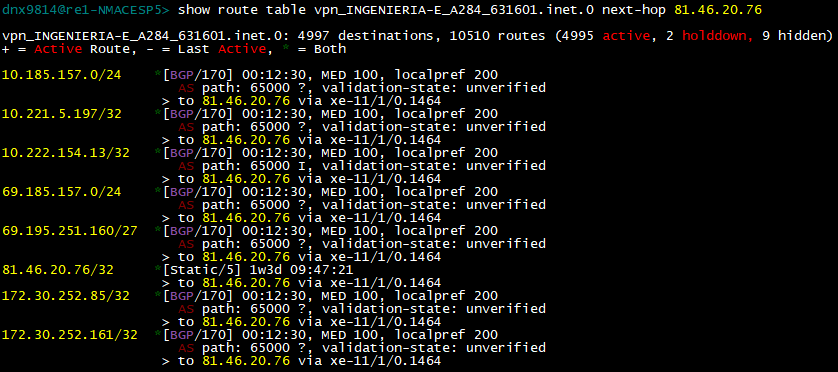

Si queremos ver la exportación de **una ruta concreta**, añadimos la IP al final:

```text
<usuario>@<nemónico_PE>> show route table <VRF_CLIENTE> next-hop <IP_WAN_EDC> <IP_RED>
```

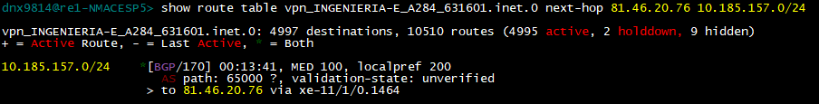

Donde:

- `<usuario>@<nemonico_PE>` — prompt del PE de Red Nuria.
- `<VRF_CLIENTE>` — en MacroLAN y VPN-IP, el nombre de la VRF de cliente (id de cliente + id de VPN + `00` o `01` según el servicio). En DIBA usamos `inet.0`.
- `<IP_WAN_EDC>` — IP WAN del EDC.
- `<Red_remota_n>` — red recibida desde el EDC.
- `<protocolo>` — protocolo de routing.
- `<:d>` — distancia administrativa.
- `<:m>` — métrica.
- `<AS_Cliente>` — Sistema Autónomo configurado en el EDC según el servicio.
- `<if_WAN_PE>.<subif_WAN_PE>` — interfaz física del PE y su subinterfaz lógica.
- `<reflector_1>`, `<reflector_n>` — reflectores de rutas.

#### MacroLAN Fusión / VPN-IP

Para ver la exportación de rutas que nos llega del EDC VPN-IP o MACROLAN FUSIÓN revisamos en XLAN con la ejecución de scripts:

> Acceso a `Scripts\Red Fusion\VpnIP-MacroLan\Routing\RedFusion HL4: BGP: Ver Rutas Recibidas del EDC`

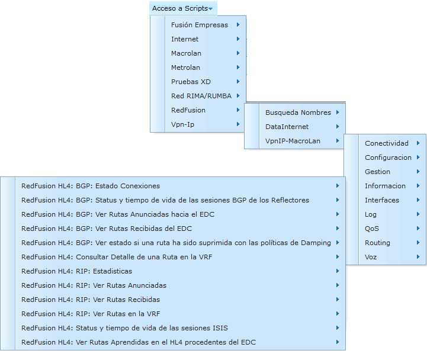
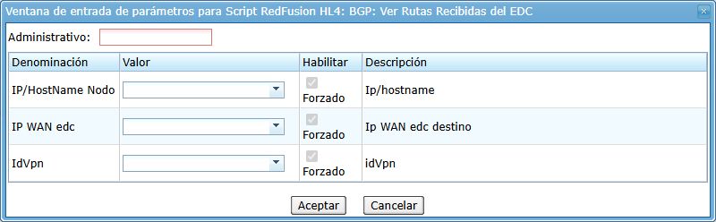

Ejemplo de acceso MACROLAN FUSION de OS TILOS, CONSULTORIO:

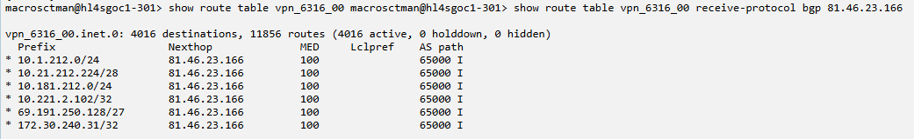

> **¡OJO!** Si el circuito cuelga directamente de un HL5, hay que ejecutar la prueba sobre el HL4 correspondiente. Se puede comprobar en la BDU en **Nodo Red** pulsando sobre el tipo de línea.


---

### 17.3. Routing — importación de rutas

Aquí comprobamos si el **EDC principal** recibe la **ruta señuelo** y si el **EDC de respaldo** recibe correctamente las redes de las sedes remotas, el punto central, etc.

A nivel de servicio, para MacroLAN y VPN-IP (tanto en Principal/Respaldo como en Balanceo) un dato importante es que **se reciba correctamente la ruta señuelo**: es el mecanismo que dispara la conmutación de los protocolos de alta disponibilidad ante caídas de routing (no de acceso).

**Direcciones señuelo:**

| Servicio                            | Ruta señuelo        |
|-------------------------------------|---------------------|
| MACROLAN (FUSION o LEGACY)          | `217.124.116.17/32` |
| VPN-IP                              | `217.124.116.18/32` |
| FORTI (cualquier tipo de línea)     | `217.124.116.25/32` |

#### Prefijos remotos — Cisco

Aunque por "prefijo remoto" entendemos los rangos de red de cliente recibidos vía routing desde el PE, este comando muestra la tabla de rutas completa del EDC, incluidas redes conectadas o locales.

```text
<nemonico>#show ip route
Codes: C - connected, S - static, R - RIP, M - mobile, B - BGP
       D - EIGRP, EX - EIGRP external, O - OSPF, IA - OSPF inter area
       N1 - OSPF NSSA external type 1, N2 - OSPF NSSA external type 2
       E1 - OSPF external type 1, E2 - OSPF external type 2
       i - IS-IS, su - IS-IS summary, L1 - IS-IS level-1, L2 - IS-IS level-2
       ia - IS-IS inter area, * - candidate default, U - per-user static route
       o - ODR, P - periodic downloaded static route

Gateway of last resort is <IP_WAN_PE> network 0.0.0.0

<protocolo>      <Red_remota_n>      [<:d>/<:m>] via <ip_WAN_PE>, <x>d<x>h
[…]
```

#### Prefijos remotos — Teldat

Desde el modo de monitorización (process 3):

```text
<nemonico>+ protocol ip
<nemonico>IP+dump-routing-table
Type                      Dest net/Mask Cost       Age Next hop(s)

 <protocolo>(<x>)[<x>]    <Red_remota_n>  [<:d>/<:m>] 0   <IP_WAN_PE> (<IF_WAN_EDC>.<subIF_WAN_EDC>)
[…]
```

#### Prefijos remotos — FortiGate

Desde el modo CLI:

```text
<nemonico> get router info routing-table all
Codes: K - kernel, C - connected, S - static, R - RIP, B - BGP, O - OSPF, [...]

<protocolo>       <Red_remota_n> [<:d>/<:m>] via <IP_WAN_PE>, <IF_WAN_EDC>
[...]
```

Donde:

- `<IF_WAN_EDC>` — interfaz del FortiGate hacia el PE (física o subinterfaz VLAN: `portX.<vlan>`).
- `<IP_WAN_PE>` — IP WAN del PE (next-hop).

---

### 17.4. Ruta señuelo

Aquí comprobamos en el EDC principal que estamos recibiendo correctamente la ruta señuelo.

#### Cisco

```text
<nemonico>#show ip route <IP_RUTA_SEÑUELO>

<nemonico>#show ip route <Ruta_señuelo>
Routing entry for <Ruta_señuelo>/<mascara_Ruta_señuelo>, supernet
  Known via "bgp <AS_EDC>", distance <:d>, metric <:m>
  Tag <AS_PE>, type external
  Last update from <IP_WAN_PE> 2d04h ago
  Routing Descriptor Blocks:
  * <IP_WAN_PE>, from <IP_WAN_PE>, 2d04h ago
      Route metric is <:m>, traffic share count is 1
      AS Hops 1
      Route tag <AS_PE>
      MPLS label: none
```

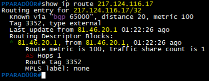

#### Teldat

Desde el modo de monitorización (process 3):

```text
<nemonico>+ protocol ip
<nemonico>IP+ route-given-address  <Ruta_señuelo>
Destination:    <Ruta_señuelo>
Mask:           <mascara_Ruta_señuelo>
Route type:     <protocolo>
Distance:       <:m>
Tag:            0
Next hop(s):    <IP_WAN_PE> (<if_WAN_EDC>.<subIF_WAN_EDC>) Age:
```

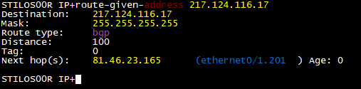

#### FortiGate

Desde el modo CLI:

```text
<nemonico> get router info routing-table details <Ruta_señuelo>

<nemonico># get router info routing-table details <Ruta_señuelo>
Routing table entry for <Red_remota_n>/<mascara_Ruta_señuelo>
  Known via "<protocolo>", distance <:d>, metric <:m>
  * via <IP_WAN_PE> (<IF_WAN_EDC>)
```

---

### 17.5. Estado del protocolo de alta disponibilidad

En los EDC principal y respaldo comprobamos el estado del protocolo de alta disponibilidad (**VRRP / HSRP / TVRP**). El equipo principal actúa como MASTER/ACTIVO (el nombre cambia según protocolo y tecnología). Su rol cambia cuando cambia el estado del **track** asociado a la ruta señuelo, que también revisaremos en el principal.

#### 17.5.1. Track

**Cisco:**

```text
<nemonico>#show track

Track 100
  IP route <Ruta_señuelo> <mascara_Ruta_señuelo> reachability
  Reachability is Up (connected)
    <X> changes, last change 00:00:10
  First-hop interface is <if_WAN_EDC>
  Tracked by:
    VRRP <if_LAN_EDC>.<subif_LAN_EDC> <Id_Grupo_VRRP_n>
```

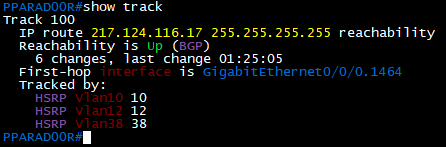

**Teldat:** ya está incluida la funcionalidad dentro del protocolo VRRP/TVRP — el track a la ruta señuelo viene de serie.

En FUSION:

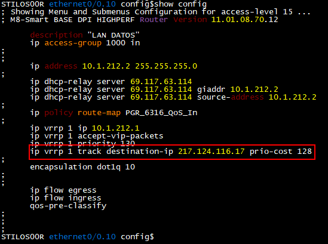

En LEGACY:

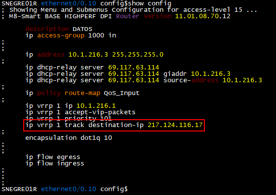

**FortiGate:** el equivalente al track se mira con el health-check del SD-WAN:

```text
<nemonico># diagnose sys sdwan health-check
```

Estado del health-check:

- `state = alive` → enlace operativo (equivalente a Up).
- `state = dead` → enlace caído y excluido.

#### 17.5.2. HSRP (Cisco)

```text
<nemonico>#show standby brief
```

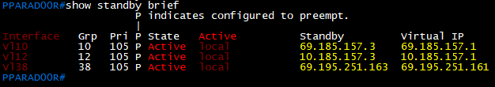

Estados posibles:

- **Active** — EDC actualmente en activo que se agencia con la IP Virtual de la red.
- **Standby** — EDC marcado como secundario en la jerarquía, por debajo del activo.
- **Listen** — EDC marcado como tercero en la jerarquía, por debajo del standby.
- **Speak** — Estado de negociación con el resto de EDC mientras encuentra su rol.

Vista extendida:

```text
<nemonico>#show standby
<if_LAN_EDC>.<subIF_LAN_EDC> - Group <Id_Grupo_VRRP_n>
  State is Active
    1 state change, last state change 1y45w
  Virtual IP address is <IPVIRTUAL_n>
  Active virtual MAC address is 0000.0c07.ac15 (MAC In Use)
    Local virtual MAC address is 0000.0c07.ac15 (v1 default)
  Hello time 3 sec, hold time 10 sec
    Next hello sent in 2.096 secs
  Preemption enabled
  Active router is local
  Standby router is <IP_LAN_EDC>, priority <Prioridad> (expires in 9.168 sec)
  Priority <Prioridad> (configured <Prioridad>)
  Group name is "hsrp-<if_LAN_EDC>.<subIF_LAN_EDC> <Id_Grupo_VRRP_n> (default)
```

#### 17.5.3. TVRP (Teldat)

```text
<nemonico>+ protocol ip
<nemonico>IP+ tvrp
<nemonico> TVRP+list all

              ===== Global TVRP Parameters =====

  TVRP is currently: ENABLED
  TVRP port (UDP):   1985
  Virtual redirects: ENABLED
  Unknown packets:   1
  Authentication Failed packets:   0

                ===== List of TVRP groups =====

 +------------------------------------------------------------+
 |                      TVRP GROUP:  <Id_Grupo_VRRP_n>        |
 +------------------------------------------------------------+
   Virtual IP:  <IPVIRTUAL_n>
   Virtual MAC: 00-00-0c-07-ac-0a
   Current local IP/Interface: <IP_LAN_EDC> <if_LAN_EDC>.<subIF_LAN_EDC>, <Id_Grupo_VRRP_n>
   ACTIVE Router:  <IP_LAN_EDC>
   STANDBY Router: 0.0.0.0
   Hellotime: 3               Holdtime: 10
   TVRP state:   ACTIVE       Previous state:  STANDBY
   Currently  RUNNING         Last event: HELO_EXP
```

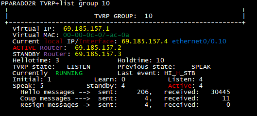

#### 17.5.4. VRRP

**Cisco:**

```text
<nemonico>#show vrrp brief
Interface                    Grp               Pri         Time  Own Pre State Master addr  Group addr
<if_LAN_EDC>.<subIF_LAN_EDC> <Id_Grupo_VRRP_n> <Prioridad> 3589  Y       <rol> <IP_LAN_EDC_BACKUP> <IP_VIRTUAL_GRUPO_VRRP>
```

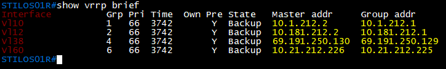

Estados:

- **Master** — EDC activo en el momento, según la prioridad configurada.
- **Backup** — EDC o EDCs por detrás del MASTER. Según la prioridad de cada uno se pondrá como master el que más tenga en cada momento.

Vista extendida:

```text
<nemonico>#show vrrp
<if_LAN_EDC>.<subIF_LAN_EDC>, - Group <Id_Grupo_VRRP_n>
  State is <rol>
  Virtual IP address is <IPVIRTUAL_n>
  Virtual MAC address is 0000.5e00.010a
  Advertisement interval is 1.000 sec
  Preemption enabled
  Priority is <Prioridad> (cfgd <Prioridad>)
    Track object 100 state Up decrement 10
  Master Router is <IP_LAN_EDC_Principal> (local), priority is <Prioridad>)
  Master Advertisement interval is 1.000 sec
  Master Down interval is 3.589 sec
```

**Teldat:**

```text
<nemonico>+ protocol ip
<nemonico>IP+ vrrp
-- VRRP console --

VRRP+list summary
[<if_LAN_EDC>.<subIF_LAN_EDC>, vrId <Id_Grupo_VRRP_n>], <rol>, prio <prioridad>, vIP <IPVIRTUAL_n>

<nemonico> VRRP+list vrid <Id_Grupo_VRRP_n>

Virtual Router [<if_LAN_EDC>.<subIF_LAN_EDC>, vrId <Id_Grupo_VRRP_n>] - State <rol>
  Virtual IP: <IPVIRTUAL_n>, Virtual MAC: 00-00-5e-00-01-01
  Priority <prioridad> (configured <prioridad>), Preemption enabled, Standby delay 0 sec
  Reload delay: 30 seconds
  IP addresses count: 1
  Primary Address: <IP_LAN_EDC>
  Authentication: None
  Master router: <IP_LAN_EDC_Principal> (local router)
  Packets destined for the (not owned) virtual IP are accepted

  Transitions to MASTER     1           Priority Zero Pkts Sent     0
  Advertisements Rcvd       0           Invalid Type Pkts Rcvd      0
  Advertise Interval Errors 0           Address List Errors         0
  Authentication Failures   0           Invalid Auth Type           0
  IP TTL Errors             0           Auth Type Mismatch          0
  Priority Zero Pkts Rcvd   0           Packet Length Errors        0

  Tracking <Ruta_señuelo> priority-cost 10, last check OK
```

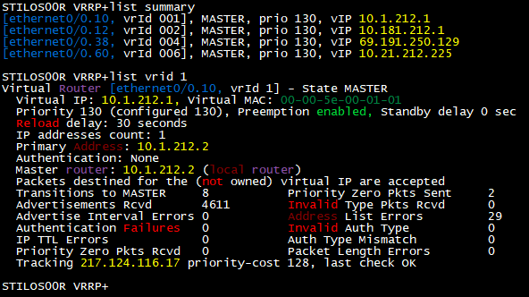

**FortiGate:**

```text
<nemonico># get router info vrrp

Interface: <if_LAN_EDC>, primary IP address: <IP_LAN_EDC>
  VRID: <Id_Grupo_VRRP_n> version: <X>
    vrip: <IPVIRTUAL_n>, priority: <prioridad> (<prioridad_configurada>,<prioridad_decrementada>), state: <rol>
    adv_interval: <X>ms, preempt: <0/1>, ignore_dft: <0/1>
    vrmac: <MAC_virtual>
    vrdst: <Ruta_señuelo>
    vrgrp: <Id_Grupo_VRRP_n>
[...]
```

Estados FortiGate:

- `PRIMARY` → equivalente a MASTER.
- `BACKUP` → equivalente a BACKUP.

---

### 17.6. Respaldos móviles

En el caso de los respaldos móviles, estos accesos se activan **bajo demanda**: sólo están activos en caso de caída del acceso principal. Los equipos son accesibles porque la dirección IP de gestión del respaldo móvil es **anunciada por el equipo principal**.

#### 17.6.1. Deshabilitar el mecanismo de backup (wrr-backup-wan)

Como las líneas móviles en modalidad respaldo funcionan de forma conmutada, antes de ejecutar las pruebas verificamos la conectividad hacia la MPLS sobre LNS. Para ello deshabilitamos el mecanismo de backup en los equipos Teldat con tecnología móvil:

```text
<nemonico>*p 5
<nemonico>Config$ feature wrr-backup-wan
-- WAN Reroute Backup user configuration –
<nemonico>WRR$disable
```

Después de esto, si la configuración del equipo es correcta y hay cobertura, el acceso se loga en la red.

#### 17.6.2. Comprobaciones en el EDC

Estas comprobaciones se hacen **después** de haber desactivado el mecanismo de conmutación.

Desde el EDC verificamos que se establece la sesión BGP contra la IP del LNS:

```text
<nemonico>*p 3
Console Operator
<nemonico>+protocol BGP
<nemonico>BGP+summary
Configuration running
Neighbor        V    AS MsgRcvd MsgSent NumEst        State Time
<neighbor>     4   <AS>     <x>     <x>     <x>     <estado> <x>
[…]
BGP summary, <x> groups, <x> peers.
```

Si es correcto, debe haber una sesión eBGP contra la IP del LNS (`<IP_NeighbourBGP_LNS>` = `10.227.255.255`).

Después comprobamos los anuncios hacia el LNS y que estamos recibiendo las rutas de las delegaciones:

```text
<nemonico>*p 3
Console Operator
<nemonico>+protocol BGP
<nemonico>BGP+ routes
Flags: A active, M multipath, D deleted, N not install, I incomplete
        Proto       Route/Mask      NextHop       Pref  Pref2 Metr  Metr2  ASPath
<flags> <protocolo> <Red_remota_n>  <IP_WAN_EDC>  <:d>     0  <:m>  <:lp>  <AS_1> <AS_n> I
```

Para comprobar las rutas que **anunciamos** al LNS:

```text
<nemonico>*p 3
Console Operator
<nemonico>+protocol BGP
<nemonico>BGP+ routes sent_to_peer <IP_NeighbourBGP_LNS>
```

Sólo deberíamos ver la IP de gestión del EDC y las redes LAN de cliente a anunciar.

Tras esto verificamos que las rutas aprendidas desde el LNS se han instalado en la tabla de rutas del equipo:

```text
<nemonico>*p 3
Console Operator
<nemonico>+protocol ip
<nemonico>IP+ dump-routing-table
```

#### 17.6.3. Comprobaciones en el LNS

La sesión puede establecerse contra cualquiera de los dos LNS (`srlebep1-309` o `srlemaz1-309`). Hay que ejecutar esto en ambos hasta encontrar el que tiene la sesión levantada:

```text
<usuario>@<Nemonico LNS>> show route instance brief | match <Id de vpn>

<Id de vpn>00           vrf

         <Id de vpn>00.inet.0                               269/0/0
```

Con esto tenemos el nombre de la VRF en el LNS (`<Id de vpn>00.inet.0`, que resumimos como `<VRF_CLIENTE>`).

Para saber cuál es el LNS activo en este momento podemos:

**Opción A — mirar la IP WAN en el router** (una vez deshabilitado `wrr-backup-wan`):

```text
<nemonico>*P 3
<nemonico>+protocol ip
<nemonico>IP+ interface-addresses
```

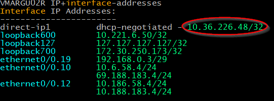

**Opción B — usar la siguiente secuencia en los dos LNS:**

```text
<usuario>@<nemónico_LNS> show route table <VRF_CLIENTE> <IP_Gestión>
```

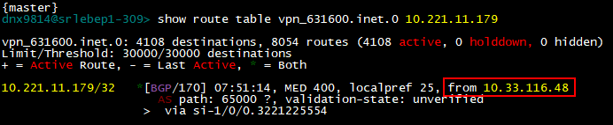

Tras conseguir `<IP_WAN_EDC> vía <if_WAN_PE>.<subif_WAN_PE>` ya tenemos la IP WAN asignada al EDC por la línea móvil y la interfaz lógica asignada. Esa IP del vecino BGP la nombraremos `<IP_WAN_EDC_MOVIL>`.

Secuencia para comprobar qué rutas estamos recibiendo desde el EDC remoto:

```text
<usuario>@<nemónico_LNS> show route table <VRF_CLIENTE> receive-protocol bgp <IP_WAN_EDC_MOVIL>
```

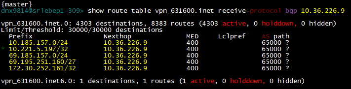

#### 17.6.4. Restaurar el estado del backup móvil

Para devolver el acceso móvil a su estado previo:

```text
<nemonico>*p 5
<nemonico>Config$ feature wrr-backup-wan
-- WAN Reroute Backup user configuration –
<nemonico>WRR$enable
```

> Si durante las comprobaciones el respaldo móvil **no se registra a la red**, probamos primero a reiniciarlo. Si sigue sin levantar (por cobertura o porque no levanta sesión BGP contra ninguno de los LNS), **cancelamos la prueba y abrimos incidencia SAC/GDIA** para revisarlo.

---

## 18. Ejecución por escenario

Para ejecutar las pruebas:

- Tiramos las interfaces secuencialmente para forzar el tráfico al backup.
- Comprobamos por XLAN y por CLI que el tráfico pasa correctamente.
- Al terminar, dejamos los elementos en su situación inicial y verificamos que el servicio funciona por el acceso principal.

Tres escenarios según el número de EDC y la tecnología:

- **Sede con 2 accesos:** nos conectamos desde el Backup al Principal.
- **Sede con 3 accesos (con backup móvil):** nos conectamos a principal y 1º backup por WAN, tiramos las interfaces secuencialmente. Primero principal → tráfico al 1º backup; luego tiramos la WAN del 1º backup → el WRR activa el backup móvil. Para volver a levantar las WAN abrimos SSH desde el backup móvil hacia los otros dos.
- **Sede con FORTI + 5G:** los dos FORTI actúan como uno solo, así que la prueba es como una sede doble. Para forzar tráfico al 5G se tira la **interfaz LAN** del FORTI (nunca la WAN — quedaría inaccesible).

### 18.1. Sede con doble acceso (2 EDCs) TELDAT/CISCO

#### 18.1.1. Conexión al EDC backup

Nos conectamos por gestión al EDC backup y desde él, por LAN, al EDC principal. Programamos un **reinicio controlado** por si perdiésemos el acceso.

**Cisco** — `reload in` y nunca grabar la configuración (así se recupera automáticamente):

```text
<nemonico>#reload in 20
```

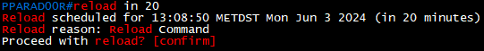

Para cancelar el reinicio programado:

```text
<nemonico>#reload cancel
```

**Teldat** — `set schedule-restart time <hora>:<minuto>`. No es un temporizador: hay que indicar la hora exacta. Verificamos la hora del router primero:

```text
process 3
Router + uptime

Date:    Friday, 08/13/21     Time: 10:05:39
Router uptime: 23h55m50s
```

Programar:

```text
*p 5
Config$set schedule-restart time <hora>:<minuto>
```

Cancelar:

```text
*process 5
Config$s no set schedule-restart time <hora>:<minuto>
```

#### 18.1.2. Procedimiento de aislado del Principal

Antes del aislado lanzamos un **ping continuo** desde `ASSCC01GW` a una IP de cada VLAN de la LAN del centro, para comprobar que el tráfico no se pierde al pasar al backup.

**Cisco — ISR, ISRG2, ISR4K, ISR1K:**

```text
configure terminal
interface <if_WAN_EDC>.<subif_WAN_EDC>
shutdown
```

**Cisco — ASR920:**

```text
conf terminal
interface BDI <IDVLANSERVICIO>
shutdown
```

**Teldat:**

```text
*p 5
Config$network <if_WAN_EDC>.<subif_WAN_EDC>
-- Ethernet Subinterface Configuration --
<if_WAN_EDC>.<subif_WAN_EDC> config$shutdown
```

> **Nota Teldat:** al tirar la interfaz WAN, aunque no perdamos acceso, el usuario de EDOMUS con el que entramos ya no tiene privilegios. Hay que abrir una nueva sesión desde el EDC Backup con el usuario **Local** (`cgpsergas`).

#### 18.1.3. Comprobaciones de tráfico por el Redundante

**a) Alta disponibilidad:** el protocolo HSRP/VRRP debe establecerse en `ACTIVE`/`MASTER`. Comandos en [17.5](#175-estado-del-protocolo-de-alta-disponibilidad).

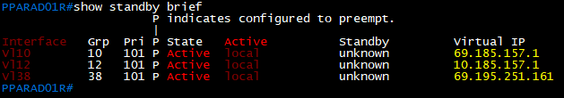

**b) Tabla ARP:** empezamos a recibir entradas en la tabla del equipo:

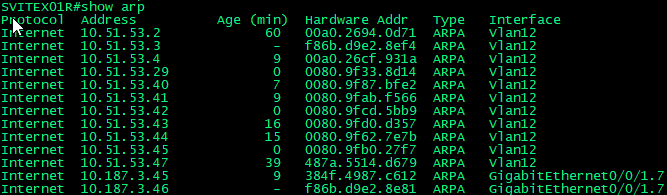

**c) Routing en PE:** desde el PE comprobamos que la ruta preferida se aprende desde la IP WAN del Backup (si es doble MacroLAN) o del HL4 conectado al PE a través de la RED FUSIÓN (si es VPN-IP o MACROLAN FUSIÓN) para las redes del centro:

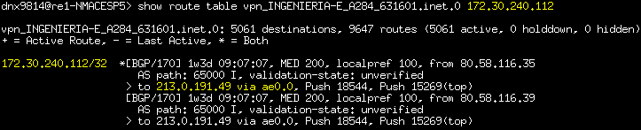

**d) Traceroute y ping desde ASSCC01GW:** comprobamos que el último salto antes del equipo de la sede es la IP WAN del 1º backup:

```text
dnx9814@ASSCCVPN00R> traceroute 10.51.53.29
traceroute to 10.51.53.29 (10.51.53.29), 30 hops max, 40 byte packets
 1  81.46.16.1 (81.46.16.1)  2.775 ms  2.845 ms  2.761 ms
 2  213.0.191.49 (213.0.191.49)  4.363 ms  4.406 ms  4.642 ms
     MPLS Label=15269 CoS=1 TTL=1 S=0
     MPLS Label=18544 CoS=1 TTL=1 S=1
 3  10.187.27.233 (10.187.27.233)  4.442 ms  4.561 ms  5.946 ms
 4  10.187.3.46 (10.187.3.46)  5.768 ms 5.561 ms  4.946 ms
 5  10.51.53.29 ( 10.51.53.29 ) 6.566 ms 6.561 ms  5.946 ms

dnx9814@ASSCCVPN00R> ping 10.51.53.29
PING 10.51.53.29 (10.51.53.29): 56 data bytes
64 bytes from 10.51.53.29: icmp_seq=0 ttl=252 time=5.566 ms
...
--- 172.30.240.112 ping statistics ---
9 packets transmitted, 9 packets received, 0% packet loss
round-trip min/avg/max/stddev = 5.269/5.409/5.566/0.101 ms
```

#### 18.1.4. Vuelta del tráfico al principal

Una vez verificado que el tráfico circula correctamente por el respaldo, cancelamos el reinicio programado en el principal y volvemos a levantar la subinterfaz WAN.

**Cisco — ISR, ISRG2, ISR4K, ISR1K:**

```text
conf terminal
interface <if_WAN_EDC>.<subif_WAN_EDC>
no shutdown
```

**Cisco — ASR920:**

```text
conf terminal
interface BDI <IDVLANSERVICIO>
no shutdown
```

**Teldat:**

```text
*p 5
Config$network <if_WAN_EDC>.<subif_WAN_EDC>
-- Ethernet Subinterface Configuration --
<if_WAN_EDC>.<subif_WAN_EDC> config$no shutdown
```

Repetimos las mismas comprobaciones para asegurarnos de que la sede queda completamente operativa por el EDC principal.

---

### 18.2. Sede con triple acceso (3 EDCs con backup móvil) TELDAT/CISCO

Nos conectamos a principal y 1º backup **por WAN**, ejecutamos un reinicio controlado por si perdemos acceso por algún motivo.

#### 18.2.1. Conexión a los EDC

**Cisco:**

```text
<nemonico>#reload in 20
```

Cancelar: `<nemonico>#reload cancel`.

**Teldat:** mismo `set schedule-restart time <hora>:<minuto>` que en [18.1.1](#1811-conexión-al-edc-backup).

> **Nota Teldat:** al tirar la interfaz WAN, el usuario EDOMUS pierde privilegios. Abrimos una sesión nueva desde el EDC Backup con el usuario Local (`cgpsergas`).

#### 18.2.2. Procedimiento de aislado del Principal

Antes del aislado, ping continuo desde `ASSCC01GW` a una IP de cada VLAN de la LAN del centro.

> Para sedes triple acceso usamos siempre la conexión **WAN** al equipo (no LAN), porque el tráfico de gestión al backup MÓVIL pasa por esos enlaces; si trabajamos por LAN perdemos acceso por consola.

Los comandos de shutdown / no shutdown son los mismos que en [18.1.2](#1812-procedimiento-de-aislado-del-principal) (Cisco ISR/ASR920 y Teldat).

> Al aislar el principal **perdemos la gestión con el 2º Backup 4G** ya que con la sede en estado normal el tráfico de gestión al móvil entra por el equipo principal. El tráfico debe pasar al equipo 1º backup en unos segundos.

#### 18.2.3. Comprobaciones tras aislado del Principal (tráfico por el 1º Redundante)

**a) Alta disponibilidad** — HSRP/VRRP debe ser `ACTIVE`/`MASTER` en el 1º Backup:

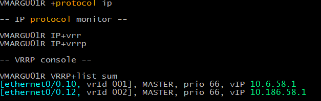

**b) Tabla ARP** — empezamos a recibir entradas:

(Reutilizamos la misma vista que en sede doble — ver [18.1.3](#1813-comprobaciones-de-tráfico-por-el-redundante).)

**c) Routing en PE** — ruta preferida desde la IP WAN del Backup (o del HL4 a través de RED FUSIÓN).

**d) Traceroute y ping desde ASSCC01GW:**

```text
ASSCC01GW#ping 10.6.58.50
Type escape sequence to abort.
Sending 5, 100-byte ICMP Echos to 10.6.58.50, timeout is 2 seconds:
!!!!!
Success rate is 100 percent (5/5), round-trip min/avg/max = 8/8/8 ms

ASSCC01GW#traceroute 10.6.58.50
Type escape sequence to abort.
Tracing the route to 10.6.58.50
VRF info: (vrf in name/id, vrf out name/id)
  1 10.116.1.1 4 msec 0 msec 0 msec
  2 10.116.1.2 0 msec
    10.116.1.3 0 msec 0 msec
  3 asscc2000r-te-0-1-0_9.coms.sergas.local (172.30.9.27) 0 msec 0 msec 4 msec
  4 172.30.3.17 0 msec 0 msec 0 msec
  5 249.red-81-46-23.customer.static.ccgg.telefonica.net (81.46.23.249) 48 msec 16 msec 12 msec
  6  *  *  *
  7 65.red-88-28-112.dynamicip.rima-tde.net (88.28.112.65) [MPLS: Labels 64561/18480 Exp 1] 4 msec 4 msec *
  8  *  *  *
  9 137.red-81-46-23.customer.static.ccgg.telefonica.net (81.46.23.137) 4 msec 8 msec 8 msec
 10 170.red-81-46-23.customer.static.ccgg.telefonica.net (81.46.23.170) 8 msec 4 msec 4 msec
 11 10.6.58.50 36 msec 8 msec 8 msec
```

#### 18.2.4. Procedimiento de aislado del 1º Redundante

Antes del aislado del 1º redundante: **ping continuo desde uno de los NODOS del CST/CPDi** (no desde `ASSCC01GW`, porque con la sede en estado normal el tráfico de gestión del backup móvil entra por el principal, y si éste cae por el 1º backup… al tirar el 1º backup todo el tráfico debe pasar al móvil en lo que tarde en disparar el WRR).

Comandos shutdown / no shutdown iguales que [18.1.2](#1812-procedimiento-de-aislado-del-principal).

#### 18.2.5. Comprobaciones tras aislado del 1º Redundante (tráfico por el 2º Backup 4G)

**a) Alta disponibilidad** — HSRP/VRRP `ACTIVE`/`MASTER`.

**b) Tabla ARP** — comprobamos entradas. Para Teldat:

```text
<nemonico> *process 3
<nemonico> +protocol arp
<nemonico> ARP+dump <if_WAN_EDC>.<subif_WAN_EDC>
```

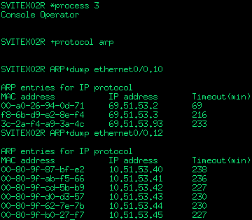

**c) Routing en PE** — las rutas llegan por el 4G (métrica 400 y localpref 25):

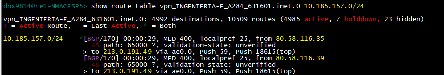

**d) Traceroute desde NODO del CST** — el último salto antes del equipo es la IP WAN del 2º backup:

```text
ASSCC01GW#traceroute 10.6.58.50
...
 10 10.227.255.255 16 msec 20 msec
    78.red-5-205-24.dynamicip.rima-tde.net (5.205.24.78) [MPLS: Labels 18907/61 Exp 1] 16 msec
 11 10.36.226.48 56 msec 64 msec
    10.227.255.255 20 msec
 12 10.36.226.48 68 msec 68 msec 64 msec
 13 10.6.58.50 96 msec 60 msec 60 msec
```

#### 18.2.6. Vuelta del tráfico al principal

Una vez verificado que el tráfico circula correctamente por el 2º Backup:

1. Cancelamos el reinicio programado en el **1º Backup** (conectándonos por LAN desde el 2º Backup) y volvemos a levantar la subinterfaz WAN.
2. Repetimos las comprobaciones para confirmar que la sede queda operativa por el 1º Backup.
3. Hacemos lo mismo con el **equipo principal**: cancelamos su reinicio programado y volvemos a levantar su subinterfaz WAN.

Comandos `no shutdown` iguales que en [18.1.4](#1814-vuelta-del-tráfico-al-principal).

---

### 18.3. Sede con routers FORTI + 5G

Con el fabricante FortiGate el procedimiento cambia: los dos FORTI actúan como uno, así que la prueba es como una sede doble.

#### 18.3.1. Concepto: cómo se fuerza el tráfico al 5G

Para que el router 5G empiece a publicar las redes de cliente, **tiene que dejar de alcanzar la ruta señuelo de FlexWAN**. Para ello el router 5G tiene esta condición configurada:

```text
ASSCC20R NSM config$sho conf

; Showing Menu and Submenus Configuration for access-level 15 ...
; M1Router  4GESW SLOT1 IPSec SNA VoIP T+ 34 12 Version 11.02.03.55.02

      operation 1

; -- NSM Operation configuration --

   description Ping_RUTA_SENUELO_Hub_FlexWan
   !!! Descripción de la prueba (ping de supervisión hacia ruta/hub)

   type echo ipicmp 217.124.116.25
   !!! Tipo de test: ping ICMP hacia la IP destino 217.124.116.25

   frequency 1
   !!! Ejecuta el ping cada 1 segundo (monitorización muy frecuente)

   source-ipaddr 10.181.142.4
   !!! Dirección IP de origen usada para enviar los pings
   !!! Esto fuerza la salida por una interfaz/ruta concreta
```

Aplicada en el route-map:

```text
ASSCC20R Config$feature route-map
-- Route maps user configuration --
ASSCC20R Route map config$route-map "BGPOUT"

ASSCC20R Route map BGPOUT$sho conf
; Showing Menu and Submenus Configuration for access-level 15 ...
; M1Router  4GESW SLOT1 IPSec SNA VoIP T+ 34 12 Version 11.02.03.55.02
; Warning: dynamic configuration is not saved!

         entry 1 default
         entry 1 permit
         entry 1 match ip prefix-list 1
;
         entry 2 default
         entry 2 permit
         entry 2 track nsla-advisor 1
         entry 2 match ip prefix-list 30
```

Esta condición dice a los routers 5G que dejen de publicar las redes de cliente cuando alcancen la ruta señuelo del Forti.

#### 18.3.2. Proceso de aislado del router principal

Para forzar el tráfico al router 5G tiramos la **interfaz LAN** en los routers FORTI. Con eso se cumplen las dos condiciones para que el 5G se establezca como principal:

1. **Máxima prioridad de LAN** (los FORTI ya no tienen LAN operativa).
2. **No alcanzar la ruta señuelo de FlexWAN** (no hay conectividad LAN con los FORTI).

Secuencia FORTI:

```text
serbc-sacee (STS)# config system interface
serbc-sacee (interface) (STS)# edit "a"
serbc-sacee (a) (STS)# set status down
serbc-sacee (a) (STS)# end
```

> **¡OJO!** No tirar la interfaz **WAN** del FORTI: dejaría el router inaccesible.
>
> **¡ATENCIÓN!** No hace falta deshabilitar el `wrr-backup-wan`: aquí no está configurado.

Comprobamos que el router 5G se ha establecido como `MASTER`:

```text
ASSCC20R VRRP+list sum
[ethernet0/0.24, vrId 002], MASTER, prio 99, vIP 69.181.142.1
[ethernet0/0.5, vrId 001], MASTER, prio 99, vIP 10.181.142.1
```

#### 18.3.3. Comprobaciones (último salto = IP WAN del 2º backup)

Igual que en sede triple, desde `ASSCC01GW` confirmamos que el último salto antes del equipo es la IP WAN del 2º backup. Ejemplo:

```text
ASSCC01GW#traceroute 10.6.58.50
...
 10 10.227.255.255 16 msec 20 msec
    78.red-5-205-24.dynamicip.rima-tde.net (5.205.24.78) [MPLS: Labels 18907/61 Exp 1] 16 msec
 11 10.36.226.48 56 msec 64 msec
    10.227.255.255 20 msec
 12 10.36.226.48 68 msec 68 msec 64 msec
 13 10.6.58.50 96 msec 60 msec 60 msec
```

#### 18.3.4. Devolver el tráfico a los FORTI

Volvemos a levantar la interfaz `a` en los FORTI:

```text
serbc-sacee (STS)# config system interface
serbc-sacee (interface) (STS)# edit "a"
serbc-sacee (a) (STS)# set status up
serbc-sacee (a) (STS)# end
```

Repetimos las mismas comprobaciones para confirmar que la sede queda operativa como al inicio.

> **En FORTI no sirve programar un reinicio** ya que la configuración persiste tras reboot.

---

# Parte D — Cierre y FAQ

## 19. Resumen rápido de botones del submódulo

| Botón                 | Dónde aparece                  | Qué hace                                                                |
|-----------------------|--------------------------------|-------------------------------------------------------------------------|
| 🔓 Abrir ciclo YYYY   | Cabecera (si no hay abierto)   | Crea el ciclo del año YYYY y carga los centros.                         |
| 📊 Estadísticas       | Cabecera                       | Subvista con KPIs y gráficos del ciclo.                                 |
| ⬇ Excel               | Cabecera                       | Descarga el listado filtrado.                                           |
| 📅 Programar semanas  | Encima de la tabla             | Reparte los centros de una fase por semanas ISO.                        |
| ✕ (al lado de fecha)  | Celda F. Coordinada            | Borra la fecha coordinada.                                              |
| 📋 Checklist          | Celda F. Realizada             | Abre el checklist Excel del centro en OnlyOffice (pestaña nueva).       |
| Marcar                | Celda F. Realizada             | Marca la prueba como realizada (sólo se habilita tras pulsar Checklist).|
| ✕ (junto a hora)      | Celda F. Realizada (realizada) | Borra la marca de realizada.                                            |

Plantillas de checklist (las mismas que abre el botón 📋 desde el submódulo):

**Sede con 2 EDCs:**


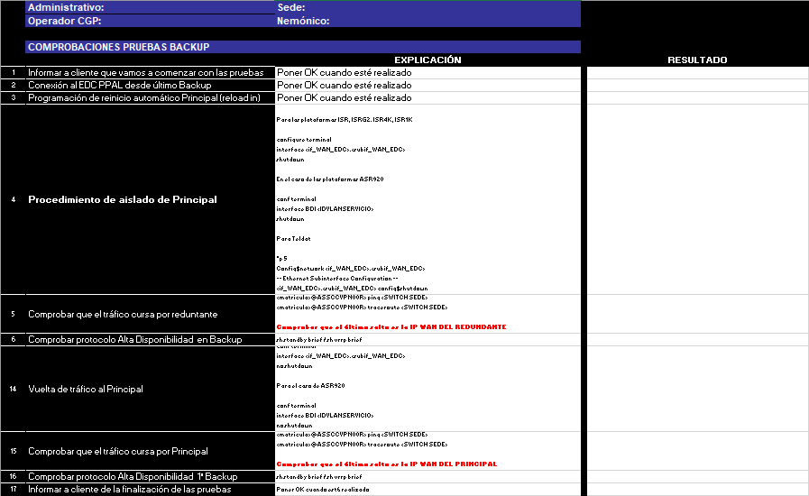

**Sede con 3 EDCs:**


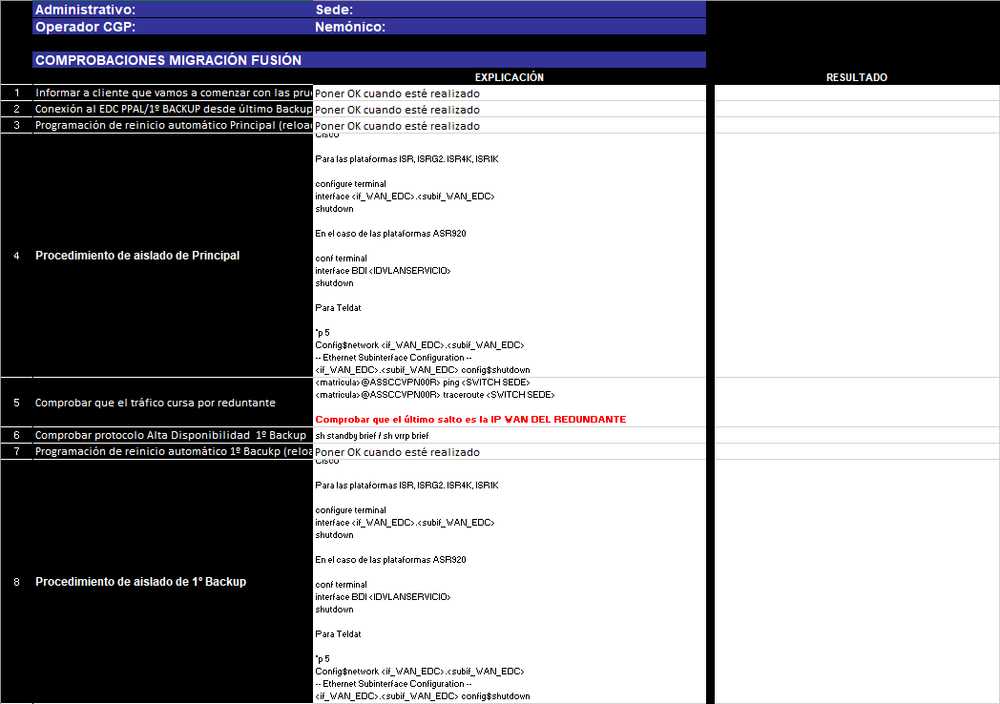
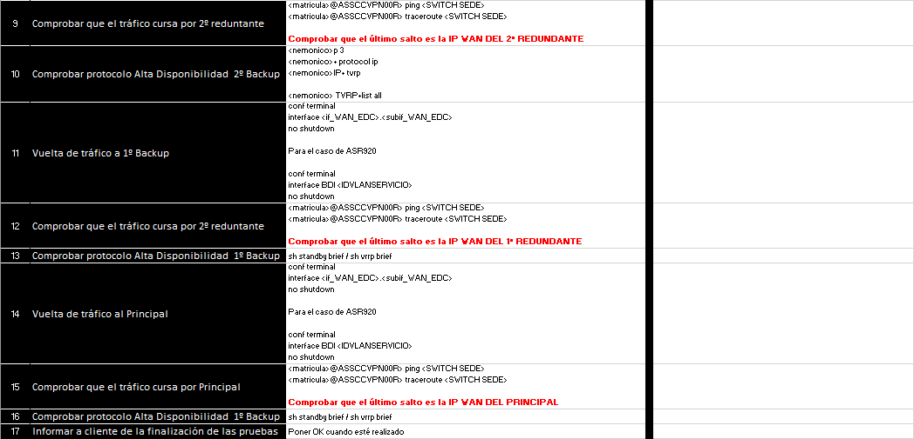

---

## 20. Preguntas frecuentes

### 20.1. Sobre el submódulo BDU

#### ¿Por qué no veo a uno de mis centros en el ciclo?

Probablemente no cumple el filtro: tiene menos de 3 accesos válidos (PRINCIPAL + REDUNDANTE + REDUNDANTE-2 sin contar METROLAN/RTLD/DIBA/FIBRA OSCURA), o está marcado como cerrado en el módulo Centros, o su Horario_id no es 1, 2 o 3.

#### Han abierto un nuevo centro a mitad de año, ¿se añade?

Sí. La página, al cargar, sincroniza el listado: añade los nuevos que cumplan el filtro y elimina los que se hayan cerrado durante el ciclo. La fase de los ya existentes no se toca.

#### Pulso 📋 Checklist y no se abre nada

- Comprobamos que el navegador no haya bloqueado el popup. Si bloquea, lo permitimos para `bdu.sergascge.local` y reintentamos.
- Si sale **"Plantilla maestra no encontrada"**, hay que avisar al CGE: la plantilla `/mnt/documentacion/plantillas/pruebas_backup/checklist.xlsx` no está disponible.
- Si sale **"Carpeta del centro no existe en NAS"**, tampoco existe `/mnt/centros/<id>/`. Lo arreglamos creando el centro en el módulo Centros (lo crea automáticamente al abrir su ficha).

#### Quiero regenerar el checklist desde la plantilla limpia

Hay que borrar a mano `/mnt/centros/<id>/MANTENIMIENTO/Pruebas_Backup/<año>/checklist.xlsx`. La próxima vez que se pulse 📋 Checklist se vuelve a copiar la plantilla maestra.

#### ¿Y si la plantilla cambia a mitad de ciclo?

Los centros que **ya tengan checklist** conservan el suyo (con todo lo rellenado). Los que **aún no lo tengan** cogerán la versión nueva la primera vez que pulsen 📋 Checklist.

#### ¿Puedo borrar una fila del listado?

No directamente. Las altas y bajas se gestionan automáticamente: si un centro ya no cumple el filtro o se marca como cerrado, sale del listado al recargar.

#### Veo un centro de fase 4 que no debería ser crítico

La fase queda **congelada** al abrir el ciclo. Si el centro cambió de criticidad después, en el ciclo en curso seguirá apareciendo en su fase original. En el próximo ciclo del año siguiente se recalculará.

### 20.2. Sobre la ejecución técnica

#### El respaldo móvil no levanta sesión BGP contra el LNS

Probamos primero a **reiniciar el equipo**. Si sigue sin levantar (problema de cobertura o no monta sesión BGP contra ninguno de los dos LNS — `srlebep1-309` o `srlemaz1-309`) **cancelamos la prueba y abrimos incidencia SAC/GDIA**.

#### ¿Puedo tirar la interfaz WAN del FORTI para forzar el tráfico al 5G?

**No.** El FORTI quedaría inaccesible. Hay que tirar la interfaz **LAN** (`config system interface` → `edit "a"` → `set status down`).

#### Tras aislar el principal Teldat, los comandos no me funcionan

Es normal: al tirar la WAN, el usuario EDOMUS con el que estamos conectados pierde privilegios. Hay que abrir una **sesión nueva desde el EDC Backup con el usuario Local `cgpsergas`**.

#### Programé un reinicio Teldat pero no se reinició

`set schedule-restart time` **no es un temporizador**, es hora absoluta. Verifica primero la hora del router (`process 3` → `Router + uptime`) y programa una hora futura.

#### El cliente dice que no quiere probar varias sedes

Registramos la incidencia con responsable de cierre **Cliente** (ver [4.4](#44-si-el-cliente-rechaza-la-prueba)) y adjuntamos en GDIA el correo en el que el cliente declina.

---

## Anexo A — Glosario y leyenda

### A.1. Conceptos generales

La redundancia del tráfico en las sedes se consigue:

- **En subida (sede → MPLS)** gracias a los protocolos de alta disponibilidad **HSRP / VRRP / TVRP**.
- **En bajada (MPLS → sede)** gracias a las métricas y `localpref` que usa BGP para anunciar las redes.

Todos los EDC de una sede están configurados de la misma manera, salvo la **prioridad** con la que anuncian sus redes a la MPLS y a la LAN.

### A.2. Hacia la MPLS (bajada — controla qué línea elige la MPLS para enviarnos tráfico)

Usamos BGP. La RED MPLS tiene preferencias predefinidas según el origen:

- Redes desde la **RED MACROLAN LEGACY** → `localpref 200`.
- Redes desde la **RED FUSIÓN** (VPN-IP o MACROLAN FUSIÓN) → `localpref 100` o `50`.
- Redes desde **MÓVILES** (respaldos 4G) → `localpref 25`.

Da igual la métrica que tengamos: primero se mira `localpref`. Si llegan dos rutas con la misma `localpref`, se mira la métrica para decidir.

### A.3. Hacia la sede (subida — controla qué EDC envía el tráfico)

Usamos los protocolos de alta disponibilidad. Se establece una **IP virtual** que los dispositivos LAN tienen como gateway; el EDC con mayor prioridad se la adjudica y envía el tráfico hacia la MPLS.

### A.4. Reglas de prioridad

| Parámetro    | Cómo se interpreta              |
|--------------|---------------------------------|
| `localpref`  | Cuanto más alto, **más prioridad**. |
| Métrica      | Cuanto más bajo, **más prioridad**. |
| HSRP / VRRP  | Cuanto más alto, **más prioridad**. |

### A.5. Diagrama de referencia


### A.6. Glosario rápido

| Término                  | Significado                                                                                          |
|--------------------------|------------------------------------------------------------------------------------------------------|
| **EDC**                  | Equipo de Cliente (router de la sede).                                                               |
| **PE**                   | Provider Edge (router del operador).                                                                 |
| **HL4 / HL5**            | Niveles jerárquicos de la red Fusión.                                                                |
| **MPLS**                 | Multiprotocol Label Switching.                                                                       |
| **HSRP / VRRP / TVRP**   | Protocolos de alta disponibilidad en LAN. HSRP es propietario Cisco, VRRP estándar, TVRP es de Teldat. |
| **Ruta señuelo**         | Ruta host (`/32`) o agregado RIMA que se monitoriza para saber si el acceso está vivo a nivel routing. |
| **`wrr-backup-wan`**     | "WAN Reroute Backup" en Teldat: mecanismo que mantiene la línea móvil dormida hasta que cae la principal. |
| **LNS**                  | L2TP Network Server (terminador de las líneas móviles). En el SERGAS: `srlebep1-309` y `srlemaz1-309`. |
| **VRF**                  | Virtual Routing and Forwarding.                                                                       |
| **AS**                   | Autonomous System.                                                                                    |
| **localpref / métrica**  | Atributos BGP usados para seleccionar la ruta. Ver [A.4](#a4-reglas-de-prioridad).                    |
| **WRR**                  | WAN Reroute Backup (sinónimo de `wrr-backup-wan`).                                                    |
| **GENTEST**              | Automatismo Telefónica de pruebas no intrusivas en escenarios VPN-IP + Respaldo Móvil + TELDAT + 5G.  |
| **`<nemonico>`**         | Nombre del equipo (placeholder en los comandos).                                                      |

---

## Anexo B — Referencias externas

| Recurso                                                                                    | Para qué                                                                  |
|--------------------------------------------------------------------------------------------|---------------------------------------------------------------------------|
| `PRO_009_Procedimiento_Pruebas_Backup.docx` (corporativo Telefónica)                       | Documento oficial con control de cambios. Este manual es la versión viva del CGE pero el `.docx` sigue siendo la referencia formal. |
| **LOGOS PT**                                                                               | Inventario de elementos y accesos del parque. Comprobación previa a la prueba (sección 5.1). |
| **OMEGA**                                                                                  | Apertura de incidencias. Antes de la prueba, deshabilitar apertura en franja horaria (sección 5.3). |
| **GestOpe**                                                                                | Repositorio de configuraciones de equipos (sección 5.2).                  |
| **XLAN** (`http://srvapp1.cte.sdr.tesa:8080/etxlanweb/`)                                   | Scripts de Red Fusión para ver rutas recibidas del EDC en VPN-IP / MACROLAN FUSIÓN (sección 17.2). |
| **GENTEST**                                                                                | Automatismo para pruebas no intrusivas VPN-IP + Móvil + TELDAT + 5G.      |
| **GDIA / SAC**                                                                             | Sistema de tickets de incidencias y mantenimiento (sección 4).            |
| **Plantilla checklist**: `/mnt/documentacion/plantillas/pruebas_backup/checklist.xlsx`     | Origen del checklist que abre el botón 📋 del submódulo BDU.              |
| **PE MACROLAN Legacy**: `NMACESP5` (Espiño), `NMAMON5` (Montiño)                           | Comprobación de exportación de rutas en MACROLAN Legacy (sección 17.2).   |
| **LNS 4G/5G**: `srlebep1-309`, `srlemaz1-309`                                              | Terminadores de líneas móviles. IP de neighbour BGP: `10.227.255.255` (sección 17.6). |
| **NAS del centro**: `/mnt/centros/<id_centro>/MANTENIMIENTO/Pruebas_Backup/<año>/`         | Donde queda guardado el checklist relleno (sección 13.3).                 |
