# Manual de Usuario: Módulo Tareas

| Campo       | Valor                                                                  |
|-------------|------------------------------------------------------------------------|
| **Módulo**  | Mantenimiento > Tareas                                                 |
| **Submódulos** | Tareas SSH · Licencias OXE/CISCO/SBC/NGN · Ejecuciones Masivas (SEM) |
| **Versión** | 1.6                                                                    |
| **Fecha**   | Abril 2026                                                             |
| **Para**    | Operadores y administradores del CGE SERGAS                            |

---

## Índice

### Parte A — Tareas SSH

1. [Para qué sirve este submódulo](#1-para-qué-sirve-este-submódulo)
2. [Cómo accedemos al submódulo](#2-cómo-accedemos-al-submódulo)
3. [Modos de ejecución: Pasarela vs LAN2LAN](#3-modos-de-ejecución-pasarela-vs-lan2lan)
4. [Patrón común de las tareas SSH](#4-patrón-común-de-las-tareas-ssh)
5. [Config. Planta (datos)](#5-config-planta-datos)
6. [Config. Planta Voz](#6-config-planta-voz)
7. [Gentest Routers 5G](#7-gentest-routers-5g)
8. [Revisión Serial](#8-revisión-serial)
9. [Revisión DIBAs](#9-revisión-dibas)
10. [Validación Logos-PT](#10-validación-logos-pt)
11. [Test DCT Masivo](#11-test-dct-masivo)

### Parte B — Licencias

12. [Para qué sirve Licencias](#12-para-qué-sirve-licencias)
13. [Cómo accedemos a Licencias](#13-cómo-accedemos-a-licencias)
14. [Dashboard principal](#14-dashboard-principal)
15. [Crear y abrir un mes](#15-crear-y-abrir-un-mes)
16. [OXE: recogida automática y manual](#16-oxe-recogida-automática-y-manual)
17. [CISCO: importar CSV de los SSM](#17-cisco-importar-csv-de-los-ssm)
18. [NGN: importar TXT de OMEGA](#18-ngn-importar-txt-de-omega)
19. [SBC: introducción manual de codecs](#19-sbc-introducción-manual-de-codecs)
20. [Capturas de pantalla: cómo conseguirlas](#20-capturas-de-pantalla-cómo-conseguirlas)
21. [Generar el PDF mensual](#21-generar-el-pdf-mensual)
22. [Flujo mensual recomendado](#22-flujo-mensual-recomendado)
23. [Preguntas frecuentes (Licencias)](#23-preguntas-frecuentes-licencias)

### Parte C — Ejecuciones Masivas (SEM)

24. [Qué hace este submódulo](#24-qué-hace-este-submódulo)
25. [Acceso restringido](#25-acceso-restringido)
26. [Flujo en 4 pasos](#26-flujo-en-4-pasos)
27. [Monitor / histórico](#27-monitor--histórico)
28. [Buenas prácticas (SEM)](#28-buenas-prácticas-sem)
29. [Limitaciones conocidas (SEM)](#29-limitaciones-conocidas-sem)
30. [Guía de regex (para extracciones)](#30-guía-de-regex-para-extracciones)
31. [Recetas listas para copiar](#31-recetas-listas-para-copiar)

---

# Parte A — Tareas SSH

## 1. Para qué sirve este submódulo

El submódulo **Tareas SSH** nos permite ejecutar tareas de configuración y validación sobre los equipos de planta de forma remota. Todas las tareas comparten el mismo patrón: ejecutar contra una lista de equipos, ver resultados, exportar Excel, relanzar fallidos y enviar por correo la tabla de resultados.

Las tareas disponibles son:

- **Config. Planta** (routers de datos: Cisco, Teldat, Juniper).
- **Config. Planta Voz** (equipos de voz Cisco/OXE).
- **Gentest Routers 5G** (gentest sobre los routers redundantes 5G).
- **Revisión Serial** (compara el número de serie del equipo con el de la BDU).
- **Revisión DIBAs** (revisión semanal de las 3 DIBAs Juniper).
- **Validación Logos-PT** (compara un CSV de Logos-PT con la BDU).
- **Test DCT Masivo** (envía SMS #016# a los ~405 DCTs).

---

## 2. Cómo accedemos al submódulo

1. Abrimos la **Web BDU** en el navegador.
2. En la barra superior pulsamos **Mantenimiento**.
3. Pulsamos la tarjeta **Tareas** y elegimos la tarea concreta del acordeón.

> **Atajo:** también podemos llegar directamente con `?m=mantenimiento&sub=<nombre_tarea>` añadido al final de la URL (por ejemplo, `?m=mantenimiento&sub=config_planta`).

---

## 3. Modos de ejecución: Pasarela vs LAN2LAN

Desde abril 2026 todas las tareas SSH (excepto **Voz** y **DIBAs**) pueden correr en **dos modos**. Lo elegimos en el selector que aparece sobre los botones de la tarea.

| Modo                     | Cómo conecta                                                                | Credenciales                                  | Velocidad                |
|--------------------------|-----------------------------------------------------------------------------|------------------------------------------------|--------------------------|
| **🚪 Pasarela** (recomendado) | Sale por la pasarela NASQ (`gestibercom4`, 172.24.7.154) usando la **IP de gestión Telefónica** del equipo. Un solo túnel SSH multiplexa N conexiones por SOCKS5. | Usuario LDAP + contraseña + **TOTP de 6 dígitos** (autenticador OATH) | **3-4× más rápido**      |
| **🔌 LAN2LAN** (clásico)      | Conexión directa a la **IP de gestión cliente** del equipo (172.30.x.x o 10.x.x.x) por los túneles IPsec corporativos. | Usuario LDAP + contraseña                       | Más lento por la saturación de IPsec |

### Excepciones (sin selector de modo)

- **Config. Planta Voz**: SIEMPRE en LAN2LAN (los OXE no tienen IP de gestión Telefónica).
- **Revisión DIBAs**: SIEMPRE por Pasarela (las DIBAs solo son alcanzables por la red Telefónica).

> **TOTP**: cuando elegimos **Pasarela**, la ventana de credenciales SSH añade un campo de 6 dígitos para el código del autenticador OATH. El sistema valida que sean exactamente 6 dígitos numéricos antes de lanzar.

---

## 4. Patrón común de las tareas SSH

Las cinco tareas principales (Config. Planta, Config. Planta Voz, Gentest 5G, Revisión Serial y DIBAs) funcionan siguiendo el mismo patrón.

### 4.1. Vistas disponibles

Al entrar en cualquiera de estas tareas, vemos tres pestañas:

- **Equipos válidos**: equipos que cumplen los requisitos (IP correcta, modelo compatible, gestionable, no dado de baja, centro abierto, línea activa).
- **Equipos excluidos**: equipos que no cumplen los requisitos.
- **Histórico**: resultados de ejecuciones anteriores.


### 4.2. Ejecutar una tarea

1. Elegimos el **modo de ejecución** (Pasarela o LAN2LAN) en el selector — salvo Voz y DIBAs.
2. Pulsamos **Ejecutar tarea**.
3. Se abre una ventana pidiendo las **credenciales SSH**:
   - **Usuario** LDAP.
   - **Contraseña** + **Confirmar contraseña** (deben coincidir).
   - **TOTP** (6 dígitos), solo si elegimos modo Pasarela.
4. Pulsamos **Ejecutar**.
5. La tarea arranca en segundo plano. El botón pasa a **"Tarea en curso o en cola"** y se deshabilita.
6. Esperamos a que termine — la página se va actualizando con el botón Refrescar.


> **Importante:** si las contraseñas no coinciden o el TOTP no tiene 6 dígitos, aparece un aviso y no se ejecuta.

> **Nota:** solo puede haber **una tarea en ejecución a la vez** en todo el módulo (mutex global del worker). Si ya hay otra en curso, el botón aparece deshabilitado.

### 4.3. Ver resultados (histórico)

1. Pulsamos **Histórico tareas**.
2. Elegimos un fichero de log en el desplegable (ordenados por fecha, el más reciente primero).
3. Vemos la tabla de resultados por equipo:

| Estado            | Significado                                                       |
|-------------------|-------------------------------------------------------------------|
| **OK**            | La tarea se ejecutó correctamente.                                |
| **FAIL**          | La tarea falló en algún punto.                                    |
| **NO_PING** / **NO_CONNECT** | Equipo inalcanzable (NO_PING en LAN2LAN, NO_CONNECT en Pasarela). |
| **AUTH_FAIL**     | Las credenciales SSH fueron rechazadas.                           |
| **UNKNOWN**       | Estado o modelo desconocido.                                      |
| **DISCREPANCIA**  | El nemónico del log no coincide con el de la BDU.                 |
| **RESET_OK** / **RESET_FAIL** | (solo Gentest 5G) tras reset del celular el BGP levantó / no levantó. |

4. Arriba vemos las **estadísticas**: total, % de éxito, conteos por estado y duración total.
5. Podemos **filtrar** por estado con los botones: TODOS / OK / FAIL / AUTH_FAIL / NO_PING/NO_CONNECT / UNKNOWN / DISCREPANCIA.


### 4.4. Exportar Excel

Pulsamos **📥 Exportar Excel** en la vista de histórico para descargar el log seleccionado en `.xlsx` con coloreado por estado (verde / rojo / naranja).

### 4.5. Relanzar fallidos

1. Pulsamos **Relanzar fallidos**.
2. La tarea se vuelve a ejecutar **solo sobre los equipos** con estado FAIL o AUTH_FAIL en el último log.
3. Nos pide otra vez las credenciales SSH (y TOTP si es Pasarela).

### 4.6. Enviar por correo

- Pulsamos **Mail** y se abre el cliente de correo con el mensaje preparado (asunto con la tarea y la fecha).
- La **tabla copiada al portapapeles solo contiene los equipos con estado distinto de OK** (filtra los fallos), para no enviar tablas gigantes con miles de OK.
- Pegamos la tabla en el cuerpo del correo y enviamos.

---

## 5. Config. Planta (datos)

- **Equipos incluidos:** routers Cisco, Teldat y Juniper gestionables con IP de cliente válida (172.30.x.x o 10.x.x.x) **o** IP Telefónica.
- **Propósito:** verificar y recoger configuraciones de los routers de datos.
- **Histórico:** `/mnt/centros/historico_config_planta/run_*.log`.
- **Tiempo aproximado:** ~7 min en Pasarela, ~28 min en LAN2LAN (parque ~1400 routers).
- **Flujo:** patrón común descrito en [sección 4](#4-patrón-común-de-las-tareas-ssh).

---

## 6. Config. Planta Voz

- **Equipos incluidos:** equipos de voz (Cisco / OXE).
- **Modo:** **siempre LAN2LAN** (sin selector ni TOTP).
- **Propósito:** verificar configuraciones de los equipos de voz.
- **Histórico:** `/mnt/centros/historico_config_voz/run_*.log`.
- **Flujo:** idéntico al patrón común.

---

## 7. Gentest Routers 5G

- **Equipos incluidos:** routers 5G redundantes (Tipolinea = 5G, Servicio = VPN-IP, TipoAcceso = MOVIL, solo Teldat).
- **Propósito:** ejecutar gentest sobre los 5G; si falla, intenta un reset del celular y verifica de nuevo.
- **Estados específicos:** **RESET_OK** (tras reset el BGP levantó) y **RESET_FAIL** (no levantó ni tras reset).
- **Histórico:** `/mnt/centros/historico_gentest/run_*.log`.
- **Tiempo aproximado:** ~15 min Pasarela, ~25 min LAN2LAN.
- **Flujo:** patrón común.

---

## 8. Revisión Serial

- **Equipos incluidos:** los mismos que Config. Planta (routers Cisco, Teldat y Juniper gestionables con IP de cliente válida o IP Telefónica).
- **Propósito:** comparar el número de serie almacenado en la BDU con el real obtenido vía SSH.
- **Histórico:** `/mnt/centros/historico_serial/run_*.log`.
- **Flujo:** patrón común con tres acciones adicionales.

### 8.1. Simular actualización

Pulsamos **Simular actualización** para ver qué cambiaría en la BDU sin aplicar nada. El sistema cruza los seriales del log con los de la BDU y nos muestra:

- **CAMBIO DETECTADO**: serial distinto (se actualizaría).
- **DISCREPANCIA NEMONICO**: el nemónico del log no coincide con el de la BDU (no se actualiza).
- **CONFLICTO SERIAL**: el serial leído ya pertenece a otro equipo (no se actualiza).

### 8.2. Actualizar Seriales BBDD

Si las simulaciones cuadran, pulsamos **Actualizar Seriales BBDD** y los seriales se aplican en la BDU.

### 8.3. Mail Sergas / Mail Satec

Además del **Mail CGP** del patrón común, esta tarea tiene dos botones extra:

- **Mail Sergas** y **Mail Satec** abren un **pop-up** que nos pide adjuntar un fichero descargado previamente desde el módulo de **Consultas** (la consulta de inventario que pide cada destinatario).
- Tras seleccionar el fichero, se prepara el correo correspondiente con la tabla filtrada (sin OK) y se envía al destinatario (SERGAS o Satec).

---

## 9. Revisión DIBAs

Revisión **semanal** del estado de las 3 DIBAs. Nos conectamos a los **2 PEs de Telefónica** (Juniper) **NMACMON5** y **NMACESP5**, donde están las 3 DIBAs. Sustituye al script VBScript heredado de SecureCRT.

- **Modo:** **siempre Pasarela** (los PEs solo son alcanzables por la red Telefónica).
- **Histórico:** `/mnt/centros/historico_dibas/revision_*.txt`.
- **Tiempo aproximado:** ~45 min (1000 pings por DIBA).

### 9.1. Lanzar la revisión

1. Vamos a **Mantenimiento → Tareas → Revisión DIBAs**.
2. Pulsamos **Ejecutar tarea**.
3. Introducimos credenciales LDAP + **TOTP** (siempre Pasarela).
4. Esperamos al resultado.

### 9.2. Las tres vistas

Esta tarea tiene tres pestañas además del histórico:

| Vista                  | Para qué sirve                                                                       |
|------------------------|--------------------------------------------------------------------------------------|
| **Tabla**              | Una tabla por revisión, con 3 filas (una por DIBA) y todas las métricas relevantes. |
| **Métricas**           | 6 gráficas (canvas 2D): RTT, transiciones, RX, TX, loss, bit error.                  |
| **Texto**              | Visor del raw completo del log seleccionado (para diagnóstico fino).                 |

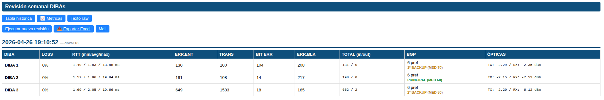

### 9.3. Columnas de la tabla

| Columna       | Significado                                                                          |
|---------------|--------------------------------------------------------------------------------------|
| **LOSS**      | % pérdida de paquetes en la tanda de pings.                                          |
| **RTT**       | tiempo de ida y vuelta (mín / avg / máx) en ms.                                      |
| **ERR.ENT**   | errores de entrada en la interfaz.                                                   |
| **TRANS**     | número de transiciones de la interfaz (UP/DOWN) desde el último reset de contadores.|
| **BIT ERR**   | errores de bit.                                                                      |
| **ERR.BLK**   | errores de bloque.                                                                   |
| **TOTAL**     | tráfico total in/out.                                                                |
| **BGP**       | número de prefijos recibidos + rol (PRINCIPAL / 1º BACKUP / 2º BACKUP).              |
| **ÓPTICAS**   | TX/RX en dBm.                                                                        |

### 9.4. Cálculo automático de roles BGP

El parser extrae el MED representativo de cada DIBA y compara los 3 MED de la revisión:

- Menor MED → **PRINCIPAL** (verde).
- Siguiente → **1º BACKUP** (naranja).
- Siguiente → **2º BACKUP**.
- Si hay empate de MED, las DIBAs comparten rol.

Si los MED cambian, el rol se recalcula automáticamente en la siguiente revisión.

### 9.5. Exportar Excel

Pulsamos **⬇ Excel** para descargar un `.xlsx` con tres hojas (una por DIBA), cabecera azul corporativa y coloreado de LOSS/ROL.

### 9.6. Histórico legacy

Las revisiones anteriores a 2024-11-01 (ejecutadas con SecureCRT) están importadas en `historico_legacy.json` y aparecen en la tabla con la etiqueta **📜 histórico Excel** junto a la fecha.

---

## 10. Validación Logos-PT

Esta tarea es distinta a las anteriores: **no se conecta por SSH**, sino que compara un fichero CSV exportado desde Logos-PT con los datos de la BDU.

### 10.1. Subir el fichero CSV

1. Desde el menú Tareas, seleccionamos **Validación Logos-PT**.
2. Pulsamos **Seleccionar archivo** y elegimos el CSV exportado de Logos-PT (separador `|`).
3. Pulsamos **Comparar**.

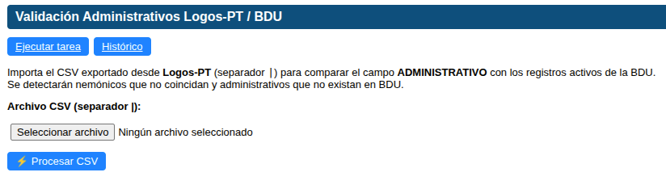

### 10.2. Ver resultados

Tras la comparación vemos dos tablas:

- **Discrepancias**: líneas que existen en ambos sistemas pero con nemónico distinto.
  - Columnas: Centro, Administrativo, Nemónico Logos-PT, Nemónico BDU.
- **No encontrados**: líneas que están en el CSV de Logos-PT pero no se encontraron en la BDU.
  - Columnas: Administrativo, Nemónico Logos-PT.

Cada tabla tiene un botón **Copiar tabla** para llevarla al portapapeles.


### 10.3. Histórico

Pulsamos **Histórico** para ver comparaciones anteriores. Elegimos un fichero del desplegable y se muestran las mismas tablas de discrepancias y no encontrados.

### 10.4. Mail

Tanto en la pantalla de **resultados** como al abrir un log del **histórico**, vemos el botón **📧 Mail** (igual que en las demás tareas).

Cuando lo pulsamos:

- Si **hay discrepancias o administrativos no encontrados**, al pulsar el botón **Mail** se copia al portapapeles las dos tablas combinadas (con encabezados y estilo listo para pegar en Outlook) y se abre el cliente de correo con el asunto preparado (`TAREAS CGP - Validación Logos-PT - DD/MM/YYYY`) y un cuerpo en el que dice **[PEGAR TABLA AQUÍ]** — solo tenemos que pulsar **CTRL+V** ahí.
- Si **no hay discrepancias ni administrativos ausentes**, se abre directamente el correo con un cuerpo que indica que la tarea ha finalizado correctamente, sin tabla que pegar.

### 10.5. Nueva comparación

Pulsamos **Nueva comparación** para volver al formulario y subir otro CSV.

---

## 11. Test DCT Masivo

Esta tarea **NO usa SSH**. Envía el comando **#016#** por SMS a los ~405 DCTs (Dispositivos de Control de Tensión) del parque SERGAS. Cada DCT responde con otro SMS que incluye temperaturas y alarmas. La BDU asocia la respuesta al test pendiente y lo marca como OK.

**Propósito:** verificar semanalmente que todos los DCTs están vivos y responden al polling.

### 11.1. Cómo lo lanzamos

1. Entramos en **Mantenimiento → Tareas → Test DCT**.
2. Pulsamos **Lanzar tarea ahora** en la parte superior.
3. Aparece un prompt pidiendo escribir `MASIVO` como confirmación.
4. Tecleamos **MASIVO** (en mayúsculas, sin acentos).
5. Pulsamos **Aceptar**.

Se encolan los ~405 SMS en `gammu-smsd`. El envío es escalonado en lotes de 20 cada 10 minutos para no saturar la red de Movistar. El proceso tarda **~5 horas** en completar los ~405.

> **Importante:** no hace falta dejar la página abierta. Los SMS salen en segundo plano desde el contenedor `gammu-smsd` del servidor. Podemos cerrar el navegador.

### 11.2. Lotes (histórico)

En el panel principal de Test DCT vemos la tabla de lotes anteriores con columnas:

| Columna                            | Significado                                              |
|------------------------------------|----------------------------------------------------------|
| **Lote**                           | Identificador único (ej. `masivo_20260421_130000`).      |
| **Fecha inicio / fin**             | Cuándo empezó y cuándo terminó el envío.                  |
| **Total / OK / Timeout / Pendientes** | Contadores del lote.                                  |

Pulsamos sobre un lote para ver su detalle.

### 11.3. Detalle de un lote

En el detalle vemos todos los DCTs del lote con su estado individual:

| Estado          | Significado                                                                |
|-----------------|----------------------------------------------------------------------------|
| **✓ OK**        | El DCT respondió al #016#.                                                  |
| **⚠ Timeout**   | Pasaron más de 7 minutos sin respuesta.                                     |
| **⏳ Pendiente** | Esperando respuesta (todavía dentro de la ventana de 7 min).                |
| **✗ Error**     | Fallo al encolar el SMS (raro).                                             |

Podemos filtrar por estado con el desplegable.

### 11.4. Reintentar fallidos

En el detalle del lote, las filas con estado distinto de OK tienen un botón **🔍 Reintentar**. Lo pulsamos para enviar #016# otra vez a ese DCT individual.

### 11.5. Exportar Excel

Dos botones en la cabecera del detalle:

- **⬇ Excel fallidos**: exporta solo los DCTs con estado Timeout.
- **⬇ Excel todos**: exporta los ~405 con todas las columnas.

Cada fila incluye: Centro, AS, Provincia, nº DCT, fecha envío, fecha respuesta, estado, temperatura externa, alarma de corte. Coloreado por estado.

### 11.6. Notas y FAQ

**¿Podemos lanzar dos tareas masivas seguidas?** No tiene sentido — si la anterior aún tiene pendientes se solapan. Esperamos a que la primera termine (~5 h).

**¿Podemos lanzar el test a un único DCT?** Sí, desde **Mantenimiento → Preventivo → DCT**. En el buscador del panel principal escribimos el centro, lo elegimos y aparece el botón **🔍 Lanzar #016#**.

**¿Llega correo al terminar?** No. Test DCT Masivo **no envía correo**. Solo se envía correo automático por los eventos reales de corte o recuperación.

---

# Parte B — Licencias

## 12. Para qué sirve Licencias

El submódulo **Licencias** nos permite hacer el **seguimiento mensual** de las licencias de telefonía del cliente SERGAS. Cada mes registramos y monitorizamos datos de cuatro tipos de equipos y tecnologías:

| Sección | Qué cubre                                                                                        |
|---------|--------------------------------------------------------------------------------------------------|
| **OXE** | Centrales **Alcatel-Lucent**. Datos recogidos automáticamente por SSH (`spadmin` en cada nodo).  |
| **CISCO** | **Cisco Call Manager**. Datos importados desde los CSV que sacamos del **SSM**.               |
| **NGN** | **Red de Nueva Generación de Telefónica**. Importación desde ficheros `.txt` de **OMEGA**.       |
| **SBC** | **Session Border Controllers**. Codecs y su uso introducidos manualmente desde el web del SBC.   |

Además gestionamos:

- **Capturas de pantalla** de los sistemas como evidencia documental.
- **Generación del PDF** mensual de resumen para enviar al cliente.

---

## 13. Cómo accedemos a Licencias

1. Abrimos la **Web BDU** en el navegador.
2. En la barra superior pulsamos **Mantenimiento**.
3. Pulsamos la tarjeta **Tareas** y elegimos **Licencias OXE/CISCO**.

> **Atajo:** también podemos llegar directamente con `?m=mantenimiento&sub=licencias` añadido al final de la URL.

---

## 14. Dashboard principal

Al entrar en Licencias vemos el dashboard con:

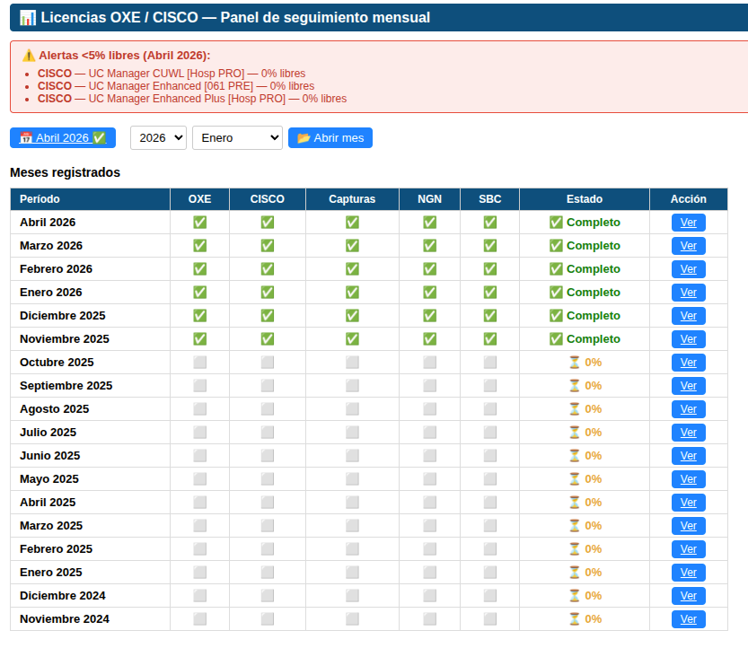

### 14.1. Tabla de meses

Lista de todos los meses registrados con su **progreso** (% completado) y el estado de las 5 secciones: **OXE**, **CISCO**, **Capturas**, **NGN**, **SBC**. Los meses completos aparecen marcados.

### 14.2. Alertas

Si alguna licencia tiene **menos del 5% libre** en el último mes completo, aparece una alerta en rojo en la cabecera del dashboard.

| Color del badge | Significado                              |
|-----------------|------------------------------------------|
| **🟢 Verde**    | Más del 15% libre (situación normal).    |
| **🟠 Naranja**  | Entre 5% y 15% libre (requiere seguimiento). |
| **🔴 Rojo**     | Menos del 5% libre (atención inmediata). |
| **⚪ Gris**     | Sin dato.                                |

### 14.3. Gráficas

Tres gráficas Chart.js de evolución mensual:

- **OXE**: % de licencias IP libres por nodo (los 6 nodos principales).
- **CISCO**: % disponible medio por cluster (`hosp_pro`, `chus`, `c061_pro`).
- **NGN**: picos históricos APV/AUIP.

### 14.4. Acceso rápido

- Botón **Nuevo mes** para crear o abrir el mes actual.
- Selector de **mes histórico** (año + mes) para consultar datos anteriores.

---

## 15. Crear y abrir un mes

1. En el dashboard pulsamos **Nuevo mes** (o seleccionamos un año y mes concreto del histórico).
2. Si el mes no existía, se crea automáticamente.
3. Se abre la vista de **detalle del mes** con la barra de progreso de las 5 secciones:


| Sección    | Descripción                                            |
|------------|--------------------------------------------------------|
| OXE        | Datos de licencias de los 12 nodos Alcatel.            |
| CISCO      | Datos de licencias CISCO por cluster.                  |
| Capturas   | Capturas de pantalla de los sistemas.                  |
| NGN        | Datos de picos NGN.                                    |
| SBC        | Datos de codecs SBC.                                   |

Cada sección tiene un icono que indica si está completada. Pulsamos sobre cada sección para acceder a su formulario.

---

## 16. OXE: recogida automática y manual

### 16.1. Los 12 nodos OXE

El módulo gestiona **12 nodos OXE** del parque SERGAS:

| Nodo                  | RAI / Módulo     |
|-----------------------|------------------|
| Santiago              | 5150085 / 002    |
| Coruña                | 5150086 / 002    |
| Lugo                  | 5270015 / 074    |
| Ourense               | 5320016 / 001    |
| Pontevedra            | 5360062 / 002    |
| Vigo                  | 5360056 / 002    |
| Ferrol                | 5150081 / 001    |
| Barbanza              | 5150083 / 001    |
| H. Cee                | 5150082 / 001    |
| Burela                | 5270018 / 001    |
| Verín                 | 5320015 / 001    |
| 061                   | 5150139 / 001    |

### 16.2. Pasos para recoger datos OXE

1. Vamos a **Licencias → OXE** del mes activo.
2. Pulsamos **Recoger automáticamente**.
3. Introducimos el **usuario SSH** y la **contraseña**.
4. Pulsamos **Iniciar recogida** — la recogida arranca automáticamente.
5. Esperamos a que el sistema muestre los resultados (puede tardar unos **60 segundos**).
6. Revisamos los datos y pulsamos **Guardar** para almacenarlos en la base de datos.

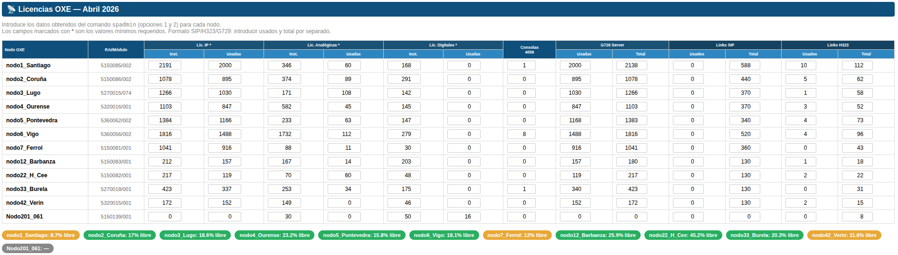

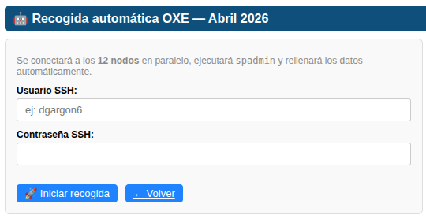

### 16.3. Si la recogida falla en algún nodo

Editamos los datos del nodo manualmente directamente en la tabla de resultados. Hacemos clic en la celda que queremos modificar, cambiamos el valor y guardamos.

### 16.4. Campos por nodo (alta manual)

Si recogemos un nodo a mano, los campos a rellenar son: **IP** (instaladas/usadas), **Analógicas** (instaladas/usadas), **Digitales** (instaladas/usadas), **Consolas 4059**, **G729 Server** (usadas/total), **Links SIP** (usados/total), **Links H323** (usados/total).

---

## 17. CISCO: importar CSV de los SSM

### 17.1. Acción externa: petición a IVR mensual

> ⚠️ **Esta acción se hace fuera de la web BDU.**

Antes de la importación CSV hacemos la **petición mensual a IVR**:

1. Desde el mes activo, pulsamos el **botón habilitado en BDU** para descargar la **plantilla Word** de IVR.

   

2. Adjuntamos esa plantilla al correo a **mantenedor**, indicando el mes correspondiente.

   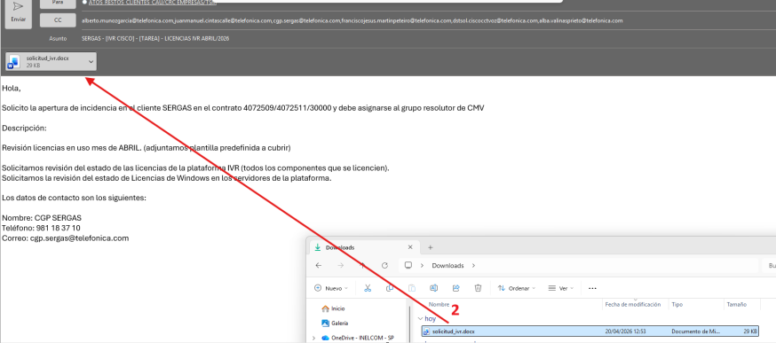

3. Mantenedor nos devuelve el correo con los datos cumplimentados.
4. Esos datos los introducimos al final de la tarea CISCO.

### 17.2. Acción externa: descargar CSV de SSM PRO y PRE

> ⚠️ **Esta acción se hace fuera de la web BDU.**

Recopilamos los CSV de los **SSM** (Smart Software Manager):

| Entorno | URL                       | Notas               |
|---------|---------------------------|---------------------|
| **SSM PRO** | https://172.16.255.79:8443 | Usuario: `admintel` |
| **SSM PRE** | https://172.16.255.82:8443 | Usuario: `admintel` |

En cada SSM:

1. Entramos con `admintel` y la contraseña corporativa.
2. Pulsamos en **Smart Licensing**.

   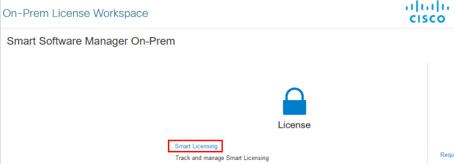

3. En el desplegable de la derecha vamos seleccionando cada cuenta de licencias del cuadro.
4. Para cada cuenta: **Inventory → Licenses** y descargamos el CSV.

   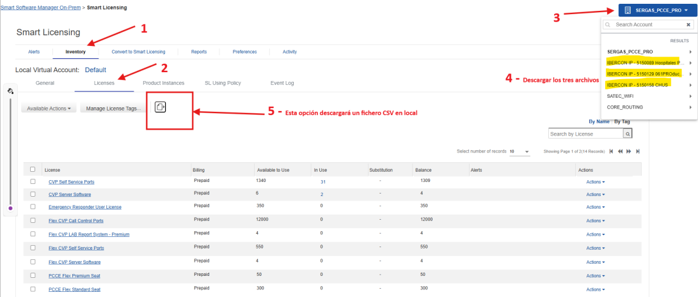

> Algunas cuentas tienen **2 páginas de licencias**: descargamos los CSV de las dos páginas.

### 17.3. Importar los CSV en la web BDU

1. Vamos a **Licencias → CISCO** del mes activo.
2. Pulsamos **Elegir archivos** y elegimos **todos los CSV** de los SSM (PRO y PRE).
3. Pulsamos **Importar CSVs** — el sistema procesa los ficheros y muestra los resultados.
4. Revisamos la tabla resultante y editamos manualmente si es necesario.


### 17.4. Tipos de licencia y clusters

El módulo gestiona **11 tipos de licencia**:

- UC Manager Enhanced Plus
- UC Manager Enhanced
- UC Manager Basic
- UC Manager Essential
- Emergency Responder
- Speech Connect
- SRST
- CUWL
- Telepresence
- Unity Connection Basic Messaging
- Unity Connection Enhanced Messaging

Distribuidos en **5 clusters**: `hosp_pro`, `chus`, `c061_pro`, `c061_pre`, `hosp_pre`.

### 17.5. Alertas de caducidad

| Color   | Significado                                       |
|---------|---------------------------------------------------|
| 🟠 Naranja | La licencia caduca en menos de **90 días**. Planificar renovación. |
| 🔴 Rojo    | La licencia ya ha **caducado**. Acción inmediata requerida.        |

---

## 18. NGN: importar TXT de OMEGA

### 18.1. Acción externa: descargar TXT de OMEGA

> ⚠️ **Esta acción se hace fuera de la web BDU.**

Los indicadores de NGN se descargan de **OMEGA**:

1. Entramos en https://omega.tesa/OMEGA2012/index.php/ con usuario y contraseña de **EDOMUS**.
2. Navegamos a: **Consola Omega → NGN → BT-AUIP → AS-BT**.
3. Ejecutamos la opción **Obtención de estadísticas de ocupación de canales eBTNG**.
4. En el campo **Empresa** escribimos `segasa` y pulsamos **Buscar**.

   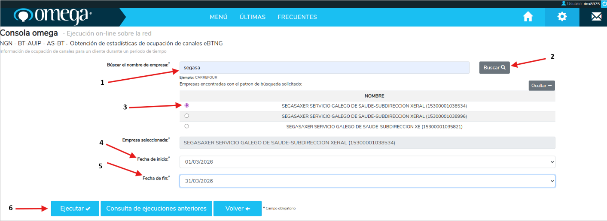

5. Aparecen los **3 administrativos** del SERGAS — exportamos los datos de los tres, **uno a uno**:
   - Marcamos el administrativo.
   - Ponemos las **fechas de inicio y fin** del mes correspondiente.
   - Pulsamos **Ejecutar**.

   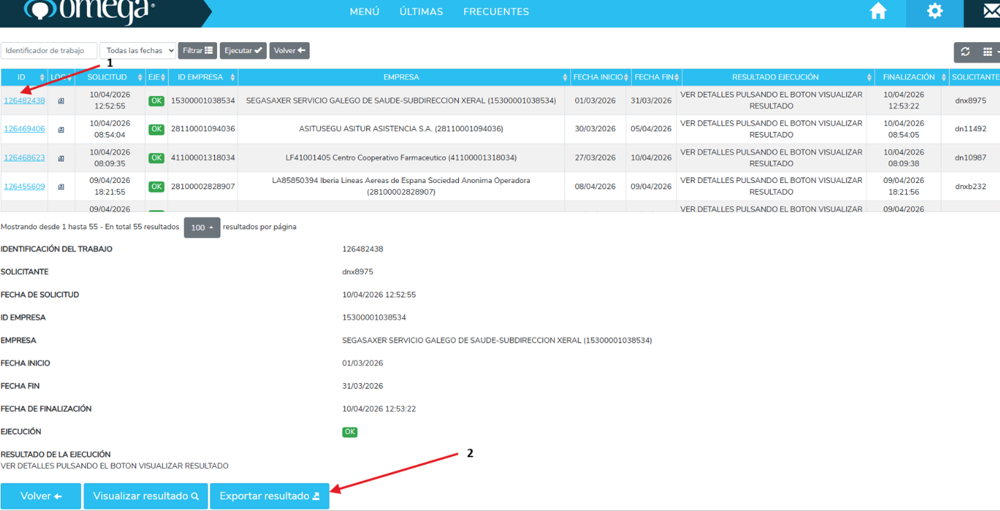

6. Volvemos a la página anterior y vamos a **Consulta de ejecuciones anteriores**.

   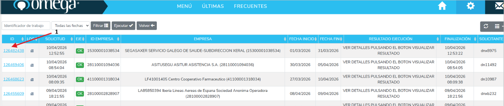

7. Esperamos a que la solicitud aparezca como **OK** y entramos a ella.
8. En **Exportar resultado** descargamos el `.txt`.

   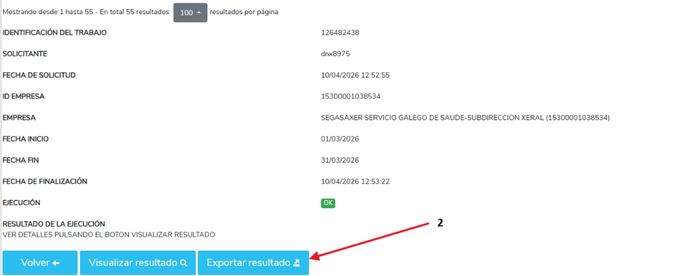

9. El fichero se descarga como `datos_consola.txt`. Lo **renombramos con el administrativo y la fecha** para diferenciar los 3.

### 18.2. Importar los TXT en la web BDU

1. Vamos a **Licencias → NGN** del mes activo.
2. Pulsamos **Seleccionar archivo** y elegimos los **3 TXT**.
3. Pulsamos **Importar** — el sistema procesa y muestra los indicadores.


### 18.3. Gráfica de evolución histórica

Pulsamos **Ver gráfica** para abrir un modal con la evolución mensual SVG de los indicadores NGN.

---

## 19. SBC: introducción manual de codecs

A diferencia de OXE, CISCO y NGN, los datos de los **Session Border Controllers** se introducen manualmente. No hay fichero de importación.

### 19.1. Acción externa: consultar el SBC activo

> ⚠️ **Esta acción se hace fuera de la web BDU.**

Tenemos que entrar al **SBC activo** del CST y del 061:

| SBC      | URLs                                                       |
|----------|------------------------------------------------------------|
| **SBC CST**  | https://172.16.255.199 / https://172.16.255.200            |
| **SBC 061**  | https://172.16.255.50  / https://172.16.255.51             |

Para saber **cuál está activo** simplemente al iniciar sesión nos aparece indicado en la parte de arriba.

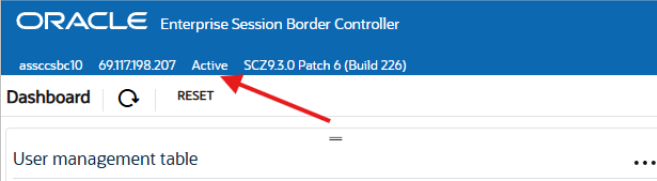

Una vez dentro:

- Vamos a la sección **Xcode load** y obtenemos la gráfica de codecs.
- En el caso del **CST** aparecen 3 sesiones TCM (`00`, `01` y `02`) con su porcentaje **MAXIMUM**.

  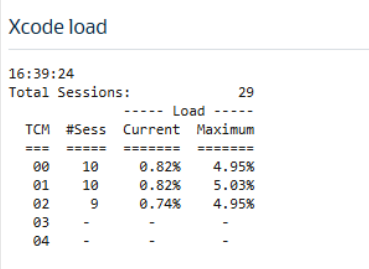

- En el caso del **061** solo hay **una sesión**.

  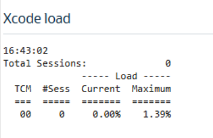

Apuntamos para cada sesión: **hora de la consulta**, **sesiones totales**, **TCM** y **porcentaje máximo de ocupación** (MAXIMUM).

### 19.2. Editar los codecs en la web BDU

1. Vamos a **Licencias → SBC** del mes activo.
2. La tabla muestra todos los codecs con sus valores actuales.
3. Hacemos clic en la celda del valor que queremos modificar.
4. Introducimos el nuevo valor y confirmamos — el sistema guarda automáticamente.
5. El **% de uso se recalcula** automáticamente al guardar.

---

## 20. Capturas de pantalla: cómo conseguirlas

> ⚠️ **Esta sección describe acciones externas a la web BDU.** Las capturas se hacen en el navegador y se suben luego desde la web.

Subimos las capturas como **evidencia documental** del mes.

### 20.1. CUCM (Cisco Call Manager)

Para todos los CUCM el flujo es: **System → Licensing → License Management** y capturar la pantalla.

| CUCM                  | URL                                                  |
|-----------------------|------------------------------------------------------|
| **CUCM CHUS**         | https://10.112.14.10/ccmadmin/                       |
| **CUCM C1**           | https://10.116.1.45/ccmadmin/                        |
| **CUCM C2**           | https://10.162.3.45/ccmadmin/                        |
| **CUCM C3**           | https://10.128.3.44/ccmadmin/                        |
| **CUCM 061 PRO**      | https://10.168.0.36/ccmadmin/                        |
| **CUCM 061 PRE**      | https://10.51.72.23/ccmadmin/                        |

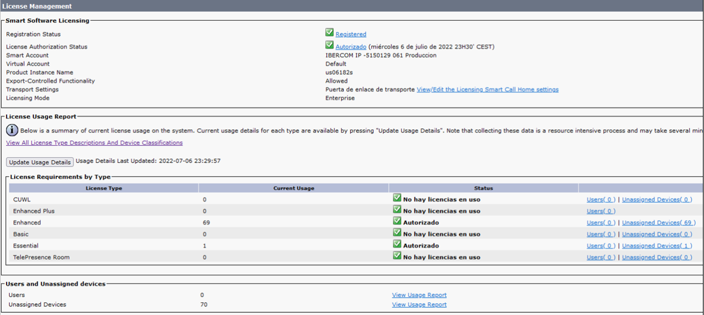

### 20.2. UCCX

| UCCX                  | URL + ruta                                                       |
|-----------------------|------------------------------------------------------------------|
| **UCCX 061 PRO**      | https://us06172s.sergas.local/appadmin/main → **System → License Management** |
| **UCCX 061 PRE**      | https://us06163s.sergas.local/appadmin/main (mismo flujo que PRO).              |

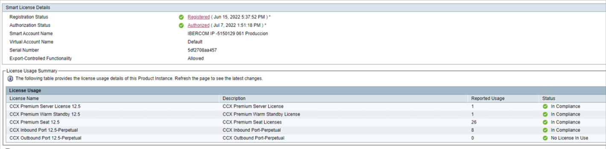

### 20.3. SSM (Smart Software Manager)

| SSM       | URL                              | Cuentas a capturar                        |
|-----------|----------------------------------|-------------------------------------------|
| **SSM PRO** | https://172.16.255.79:8443      | 3 cuentas del desplegable (la primera tiene **2 páginas**, capturamos las dos). |
| **SSM PRE** | https://172.16.255.82:8443      | 2 cuentas del desplegable.                |

Flujo: **Smart Licensing → Inventory → Licenses** y capturamos la página.

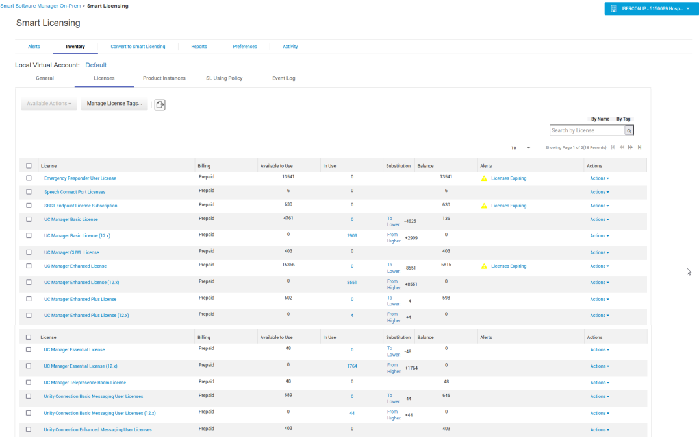

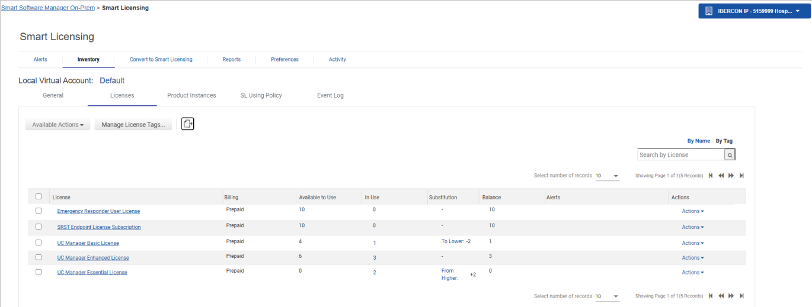

### 20.4. SBC Transcoding

Las capturas del Xcode load del CST y del 061 las sacamos durante la consulta manual de codecs ([sección 19.1](#191-acción-externa-consultar-el-sbc-activo)).

### 20.5. EOM

1. Vamos a https://172.16.255.194/me/#callviewer.
2. Pulsamos **Calls** en el menú izquierdo.
3. En la gráfica de llamadas marcamos **30 días**.
4. Capturamos la gráfica de los últimos 30 días.

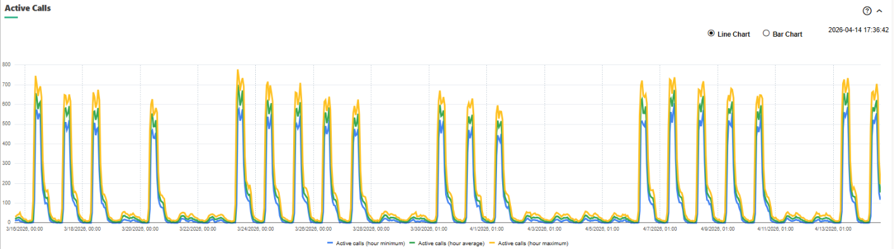

### 20.6. Subir capturas en la web BDU

1. Vamos a **Licencias → Capturas** del mes activo.
2. Seleccionamos el nodo al que pertenece la captura.
3. Pulsamos **Subir** y elegimos el fichero.
4. La captura aparece automáticamente en la galería.


### 20.7. Ver y borrar capturas

- **Ver a tamaño completo:** hacemos clic en cualquier miniatura. Navegamos entre capturas con las flechas laterales y cerramos con **Escape** o haciendo clic fuera.
- **Borrar:** pulsamos el botón de eliminar junto a la captura y confirmamos.

---

## 21. Generar el PDF mensual

Al finalizar el mes generamos un PDF con todos los datos (OXE, CISCO, NGN, SBC y capturas), pensado para archivar y enviar al cliente.

1. Desde el dashboard o desde la vista detalle del mes, pulsamos **Generar PDF**.
2. Aparece una barra de progreso mientras el sistema genera el documento.
3. Cuando llega al 100%, aparece el botón **Descargar PDF**.
4. Pulsamos **Descargar** para guardar el PDF.


> **La generación puede tardar entre 10 y 60 segundos** según el volumen de datos y capturas del mes. No es necesario quedarse en la pantalla.

---

## 22. Flujo mensual recomendado

1. **Crear el mes** actual desde el dashboard.
2. **Petición a IVR** mensual: descargar plantilla Word desde BDU y enviarla a mantenedor ([sección 17.1](#171-acción-externa-petición-a-ivr-mensual)).
3. **Recoger datos OXE** automáticamente por SSH ([sección 16.2](#162-pasos-para-recoger-datos-oxe)).
4. **Importar CSVs CISCO** descargados de SSM PRO y PRE ([sección 17.3](#173-importar-los-csv-en-la-web-bdu)).
5. **Importar TXT NGN** descargados de OMEGA ([sección 18.2](#182-importar-los-txt-en-la-web-bdu)).
6. **Rellenar codecs SBC** consultando los SBC activos del CST y del 061 ([sección 19](#19-sbc-introducción-manual-de-codecs)).
7. **Subir capturas** de CUCM, UCCX, SSM, SBC y EOM ([sección 20](#20-capturas-de-pantalla-cómo-conseguirlas)).
8. **Generar el PDF** del mes y descargarlo.
9. Revisar el PDF y enviarlo al cliente cuando los datos de mantenedor lleguen.

---

## 23. Preguntas frecuentes (Licencias)

**¿Podemos modificar datos de meses anteriores?**
Sí. Los meses cerrados se pueden consultar pero para modificarlos hay que reabrirlos primero. Consultamos con el coordinador antes de modificar datos históricos.

**El % de uso aparece en gris, ¿qué significa?**
Significa que **no hay datos de uso** para ese nodo en ese mes. Puede ser que la recogida OXE no se haya ejecutado todavía o que fallase para ese nodo específico.

**El CSV CISCO da error al importar.**
Verificamos que el fichero es el **CSV original del SSM sin modificaciones**.

**¿Dónde se guardan las capturas?**
En el **NAS del CGE**, organizadas por año, mes y nodo.

---

# Parte C — Ejecuciones Masivas (SEM)

## 24. Qué hace este submódulo

Permite enviar **comandos arbitrarios** vía SSH a un conjunto **dinámico** de equipos de planta (Cisco / Teldat / Fortinet / Juniper) y, opcionalmente, **extraer valores concretos** de la salida (potencia óptica, SIM Card ID, versión IOS, etc.) que quedan disponibles en una tabla exportable a CSV / Excel.

Casos de uso típicos:

- Cambiar el usuario/contraseña local en todos los routers de un área sanitaria.
- Añadir una ACE a una ACL estándar en todos los Teldat M2 de la planta.
- Recolectar la potencia óptica del SFP+ de los Cisco 5G.
- Recolectar el SIM Card ID de los Teldat 5G por provincia.

Sustituye a la antigua **"SEM"** en SecureCRT (VBS), pero **full-web** y **escalable**: filtros sobre la BDU, sin subir ficheros por SSH al servidor.

---

## 25. Acceso restringido

Esta herramienta es muy potente y un comando inocuo mal escrito puede tirar la planta. Por eso el acceso está **restringido a miembros del grupo AD "Admins. del dominio"**.

Si no pertenecemos a ese grupo, al pulsar la entrada del menú vemos:

> ⛔ **Esta herramienta es muy potente y está restringida a administradores del dominio SERGASCGE.**

Si creemos que deberíamos tener acceso, contactamos con el equipo de administración del CGE SERGAS.

---

## 26. Flujo en 4 pasos

> **Mantenimiento → Tareas → 🚀 Ejecuciones Masivas**

### Paso 1 — Seleccionar equipos

Bloque *① Selección de equipos*. Hay **dos modos** (excluyentes):

#### A) Por filtros (lo habitual)

Tres grupos de filtros:

| Grupo | Filtros |
|---|---|
| **Equipo** | Marca, Modelo, Tipo equipo, VLANs activas (10/12/37/38/39/40/60) |
| **Centro** | Búsqueda libre por nombre/IdCliente, Área Sanitaria, Provincia, FlexWAN (5G), Crítica |
| **Línea**  | Tipo línea (datos/voz), Función, Tipo acceso |

Cada filtro multi-valor es un desplegable con casillas (mantenemos pulsado para elegir varios).

#### B) Por lista de nemónicos

Pegamos los nemónicos uno por línea en el textarea **"O por lista de nemónicos"**. Si rellenamos esto, los filtros de arriba **se ignoran**. Líneas vacías y `#comentarios` se ignoran.

Si alguno no se encuentra (no existe, dado de baja, centro cerrado, no gestionable), aparece listado en un panel **"⚠️ N nemónicos no encontrados"** sobre la tabla de resultados.

#### Búsqueda y resultados

Al pulsar **🔍 Buscar equipos** aparece la tabla *② Equipos seleccionados* con el detalle (Centro, Nemónico, Marca/Modelo, IPs, Área, Provincia).

> Filtros forzados (siempre activos en ambos modos): equipo gestionable, no dado de baja, centro abierto y línea activa.

### Paso 2 — Escribir los comandos

Bloque *③ Comandos a ejecutar*. **Cuatro cajas** (2×2), una por familia:

- **Cisco** — comandos IOS/IOS-XE. Botón **"Insertar Enter"** que añade `(enter)` (responde a `[confirm]`).
- **Teldat** — comandos del CLI Teldat. Dos botones:
  - **"Insertar Ctrl+P"** → añade `(ctrlp)` (vuelve al menú raíz `*`).
  - **"Insertar Enter"** → añade `(enter)` (responde a `(Yes/No)` con un Enter).
- **Fortinet** — comandos del CLI FortiGate. **Solo funciona en modo Pasarela**.
- **Juniper** — comandos Junos. Funciona en LAN2LAN o Pasarela.

Solo es obligatorio rellenar **una** caja: las familias que no tengan comandos se saltan automáticamente.

Convenciones:

- Líneas vacías o que empiezan por `#` se ignoran.
- **No hace falta** escribir el cierre (`exit`, `logout`, etc.) — el sistema lo añade automáticamente.
- En Cisco se ejecuta `terminal length 0` automáticamente al inicio para evitar paginación.

#### Manejo de prompts interactivos

Cuando un comando en Cisco dispara `[confirm]`, o un comando Teldat dispara `(Yes/No)`, el SEM **no se queda colgado**. Ejemplos:

```
# Cisco — borrar usuario que pide [confirm]:
no username admin
(enter)

# Teldat — algún comando que pregunta (Yes/No):
algun_comando
Yes
```

### Paso 3 — Definir extracciones (opcional)

Bloque *④ Extracciones*. Solo si queremos **sacar un valor concreto** de la salida de un comando y que aparezca como **columna** en la tabla del Monitor y la exportación CSV/Excel.

Cada fila tiene 4 campos:

| Campo | Significado | Ejemplo |
|---|---|---|
| Comando origen | El comando exacto cuya salida se examina | `show hw-module subslot 0/0 transceiver 13 status` |
| Buscar línea con | Subcadena que debe contener la línea (filtro) | `Rx optical power` |
| Regex (opcional) | Expresión regular para sacar el valor | `-?\d+\.\d+` |
| Etiqueta (columna) | Nombre de la columna | `Rx_dBm` |

**Cómo encajan los 4 campos:**

1. El sistema busca el bloque de salida del **Comando origen**.
2. Filtra la **primera línea** que contenga la cadena de **Buscar línea con** (subcadena literal, no regex).
3. Aplica la **Regex** sobre esa línea y devuelve el primer valor que matchea.
4. Lo guarda en una columna llamada **Etiqueta**.

Si dejamos **Regex** vacía, devuelve la línea filtrada limpia. Si dejamos **Buscar línea con** vacío, aplica la regex sobre toda la salida del comando.

Pulsamos **+ Añadir extracción** para más filas. La **✕** quita la fila.

> 📖 Si no controlamos regex, miramos la **[sección 30](#30-guía-de-regex-para-extracciones)**.

### Paso 4 — Lanzar

Bloque *⑤ Lanzamiento*. Solo aparece tras buscar equipos.

| Campo | Significado |
|---|---|
| **Modo** | **LAN2LAN** (IP cliente, sin TOTP) o **Pasarela** (IP Telefónica + TOTP). |
| **Usuario EDOMUS/SERGAS** | Nuestro usuario LDAP. |
| **Password** | Nuestra password LDAP. |
| **TOTP** | Solo en modo Pasarela: 6 dígitos. |

Pulsamos **🚀 Lanzar ejecución**. La pantalla salta automáticamente al **Monitor**.

---

## 27. Monitor / histórico

> **Mantenimiento → Tareas → 📊 Monitor Ejecuciones**

- **Selector "Run"** — ordenado por fecha, el más reciente arriba.
- **🔄 Refrescar** — recarga la página.
- **📥 CSV** — descarga del log en CSV (separador `;`, BOM UTF-8).
- **📊 Excel** — descarga XLSX. Las columnas de extracción están **forzadas a tipo texto** para evitar que Excel convierta SIMs / IMEIs a notación científica.

La tabla muestra: Centro, IP, Modelo, Host, Estado, [Extracciones], y un botón **RAW** por equipo para ver la salida cruda completa del SSH.

### Estados posibles

| Estado | Significado |
|---|---|
| `OK` | Sesión completa, todos los comandos correctos. |
| `ERROR` | Algún comando devolvió error. La fila incluye `ERR=...`. La sesión se aborta y **el resto de comandos NO se ejecutan**. |
| `AUTH_FAIL` | Credenciales rechazadas. |
| `NO_PING` / `NO_CONNECT` | Equipo inalcanzable. |
| `UNKNOWN_MODEL` | Banner SSH no encaja con ningún modelo soportado. |
| `NO_CMDS` | No se proporcionó fichero de comandos para esa familia. |
| `PASARELA_REQUIRED` | Equipo requiere modo Pasarela y se lanzó en LAN2LAN. |
| `TIMEOUT` | El equipo no respondió en el tiempo esperado a un comando. |

---

## 28. Buenas prácticas (SEM)

- **Probar siempre con una lista pequeña** antes de lanzar sobre toda la planta.
- **Empezar con comandos de solo lectura** (`show ...`, `configuration`...) para verificar la sintaxis.
- Si un comando falla **en el primer equipo**, cancelamos mentalmente y revisamos el log.
- Si vamos a cambiar configuración, **incluimos los comandos de salvado** al final (`save yes`, `confirm-cfg`, `wr mem`...).
- **No hace falta `exit`/`logout`** al final.

---

## 29. Limitaciones conocidas (SEM)

- **Una tarea a la vez** — el worker tiene mutex global con el resto de tareas SSH del módulo.
- **Sin auto-refresh** del monitor — pulsamos F5 o el botón Refrescar.
- **Sin botón Cancelar** — si nos equivocamos, esperamos a que acabe.
- **Fortinet solo por Pasarela** — los Fortinet no son alcanzables por LAN2LAN.

---

## 30. Guía de regex (para extracciones)

Una **regex** (expresión regular) es un patrón que describe texto. El SEM usa el motor **PCRE** (Perl-compatible) a través de `grep -oP`.

### 30.1. Símbolos básicos

| Símbolo | Significa | Ejemplo |
|---|---|---|
| `\d` | Un dígito (0-9) | `\d` matchea `7` |
| `\d+` | Uno o más dígitos | `\d+` matchea `2026` |
| `\d{N}` | Exactamente N dígitos | `\d{19}` matchea `8934075700093511035` |
| `\d{N,M}` | Entre N y M dígitos | `\d{1,3}` matchea `1`, `12` o `123` |
| `\.` | Un punto literal | `\.` matchea `.` |
| `\s` | Un espacio (incluye tab) | `\s+` |
| `\S` | Un carácter NO-espacio | `\S+` |
| `[abc]` | Cualquiera de a, b o c | `[YN]` |
| `[a-z]` | Cualquier letra minúscula | `[A-Z0-9]` |
| `?` | El anterior es opcional | `-?\d+` |
| `+` | Uno o más del anterior | `\d+` |
| `*` | Cero o más | `\s*` |
| `\|` | O lógico | `up\|down` |
| `^` | Inicio de línea | `^%` |
| `$` | Final de línea | `\S+$` |
| `(...)` | Grupo (no influye en el match con `-oP`) | |

### 30.2. Recetas frecuentes

| Si queremos extraer... | Regex | Ejemplo de línea | Saca |
|---|---|---|---|
| Una IP | `\d+\.\d+\.\d+\.\d+` | ` ip address 10.7.45.3 255.255...` | `10.7.45.3` |
| Una IP/CIDR | `\d+\.\d+\.\d+\.\d+/\d+` | `loopback600  10.221.21.72/32` | `10.221.21.72/32` |
| IP y máscara | `\d+\.\d+\.\d+\.\d+\s+\d+\.\d+\.\d+\.\d+` | ` ip address 10.7.45.3 255.255.255.0` | `10.7.45.3 255.255.255.0` |
| Una MAC | `([0-9a-f]{2}[:.-]){5}[0-9a-f]{2}` | `address is 0011.22aa.bbcc` | `0011.22aa.bbcc` |
| Un decimal con signo | `-?\d+\.\d+` | ` Rx optical power = -6.4 dBm` | `-6.4` |
| Un entero | `\d+` | `CPU temperature: 61 C` | `61` |
| Un SIM (19 dígitos) | `\d{19}` | `SIM Card ID = 8934075700093511035` | `8934075700093511035` |
| Un IMEI (15 dígitos) | `\d{15}` | `IMEI: 351234567890123` | `351234567890123` |
| Lo último de la línea | `\S+$` | `SIM Card ID = 8934...` | `8934...` |
| Hostname (alfanumérico+.-_) | `[A-Za-z0-9._-]+` | `Hostname: FFONMA00R` | el primer "palabra" |
| Un porcentaje | `\d+\s*%` | `Memory used: 45 %` | `45 %` |
| Una versión X.Y.Z.W | `\d+(\.\d+){3}` | `Software release: 11.02.01.20` | `11.02.01.20` |
| Estado up/down | `up\|down` | `Status: up` | `up` |

### 30.3. Trucos útiles

- `LINE_MATCH` es **subcadena literal**, no regex.
- Si dudamos qué línea coge, pulsamos el botón **RAW** del Monitor en un equipo concreto.
- Caracteres que hay que **escapar con `\`** en regex: `. + * ? ( ) [ ] { } | \ ^ $`.
- En Cisco las salidas vienen con `\r` ocultos al final. El SEM ya los limpia antes de aplicar la regex.
- Si la regex no matchea nada, la celda queda **vacía** (no es un error).

---

## 31. Recetas listas para copiar

### 31.1. Sacar potencia óptica del SFP+ (Cisco)

**Comandos Cisco:**
```
show hw-module subslot 0/0 transceiver 13 status
```

**Extracciones:**

| CMD origen | Buscar línea con | Regex | Etiqueta |
|---|---|---|---|
| `show hw-module subslot 0/0 transceiver 13 status` | `Tx optical power` | `-?\d+\.\d+` | `Tx_dBm` |
| `show hw-module subslot 0/0 transceiver 13 status` | `Rx optical power` | `-?\d+\.\d+` | `Rx_dBm` |
| `show hw-module subslot 0/0 transceiver 13 status` | `Module temperature` | `\d+\.\d+` | `Modulo_Temp_C` |

### 31.2. Sacar SIM Card ID (Teldat 5G)

**Comandos Teldat:**
```
p 3
network cellular1/0
sim-info
```

**Extracciones:**

| CMD origen | Buscar línea con | Regex | Etiqueta |
|---|---|---|---|
| `sim-info` | `SIM Card ID` | `\d{19}` | `ICC` |
| `sim-info` | `IMEI` | `\d{15}` | `IMEI` |
| `sim-info` | `IMSI` | `\d{15}` | `IMSI` |

### 31.3. Sacar IPs de las VLANs estándar (Teldat)

**Comandos Teldat:**
```
p 3
protocol ip
interface-addresses
```

**Extracciones (una por VLAN):**

| CMD origen | Buscar línea con | Regex | Etiqueta |
|---|---|---|---|
| `interface-addresses` | `ethernet0/0.10` | `\d+\.\d+\.\d+\.\d+/\d+` | `Vlan10` |
| `interface-addresses` | `ethernet0/0.12` | `\d+\.\d+\.\d+\.\d+/\d+` | `Vlan12` |
| `interface-addresses` | `ethernet0/0.37` | `\d+\.\d+\.\d+\.\d+/\d+` | `Vlan37` |
| `interface-addresses` | `ethernet0/0.38` | `\d+\.\d+\.\d+\.\d+/\d+` | `Vlan38` |
| `interface-addresses` | `ethernet0/0.39` | `\d+\.\d+\.\d+\.\d+/\d+` | `Vlan39` |
| `interface-addresses` | `ethernet0/0.60` | `\d+\.\d+\.\d+\.\d+/\d+` | `Vlan60` |

### 31.4. Sacar IPs de las BDIs (Cisco) — sin error si la VLAN no existe

`show ip interface BDI<N>` da `% Invalid input` si la BDI no existe → aborta la sesión. La alternativa robusta usa `section`, que devuelve vacío sin error.

**Comandos Cisco:**
```
sh running | section interface BDI10
sh running | section interface BDI12
sh running | section interface BDI37
sh running | section interface BDI38
sh running | section interface BDI39
sh running | section interface BDI60
```

**Extracciones:**

| CMD origen | Buscar línea con | Regex | Etiqueta |
|---|---|---|---|
| `sh running \| section interface BDI10` | `ip address` | `\d+\.\d+\.\d+\.\d+\s+\d+\.\d+\.\d+\.\d+` | `Vlan10` |
| ... (idem 12/37/38/39/60) | | | |

### 31.5. Cambiar usuario local + verificar (Teldat)

**Comandos Teldat** (necesita salvar):
```
p 5
no user antiguo
user nuevo password CONTRASENA_NUEVA
save yes
end
p 4
confirm-cfg
sh config | include hash-password
```

### 31.6. Borrar usuario local con [confirm] (Cisco)

**Comandos Cisco:**
```
configure terminal
no username antiguo
(enter)
end
write memory
```

El `(enter)` (botón "Insertar Enter") responde al `[confirm]`.

### 31.7. Inventario de versión IOS (Cisco)

**Comandos Cisco:**
```
show version | include uptime|Software release|System
```

**Extracciones:**

| CMD origen | Buscar línea con | Regex | Etiqueta |
|---|---|---|---|
| `show version \| include uptime\|Software release\|System` | `uptime is` | `\d+\s+(years?\|weeks?\|days?\|hours?)[^,]+` | `Uptime` |
| `show version \| include uptime\|Software release\|System` | `Software release` | `\d+(\.\d+){3,4}` | `IOS_Version` |

### 31.8. Inventario Fortinet (FortiGate, solo Pasarela)

**Comandos Fortinet:**
```
get system status
```

**Extracciones:**

| CMD origen | Buscar línea con | Regex | Etiqueta |
|---|---|---|---|
| `get system status` | `Version:` | `FortiGate-\S+` | `Modelo` |
| `get system status` | `Version:` | `v\d+\.\d+\.\d+,build\d+` | `Firmware` |
| `get system status` | `Serial-Number:` | `\S+$` | `SerialNumber` |
| `get system status` | `Cluster uptime:` | `\d+\s+days` | `Uptime_dias` |

### 31.9. Inventario Juniper (Junos)

**Comandos Juniper:**
```
show version
show interfaces terse | match "Local"
```

**Extracciones:**

| CMD origen | Buscar línea con | Regex | Etiqueta |
|---|---|---|---|
| `show version` | `Hostname:` | `\S+$` | `Host` |
| `show version` | `Model:` | `\S+$` | `Modelo` |
| `show version` | `Junos:` | `\S+$` | `Junos_Version` |

---

*Manual para operadores y administradores CGE SERGAS. Versión 1.6 — Abril 2026.*
