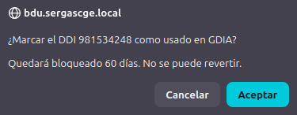

# Manual de Usuario: Módulo DDIs GDIA

| Campo       | Valor                              |
|-------------|------------------------------------|
| **Módulo**  | Mantenimiento > DDIs GDIA          |
| **Versión** | 1.6                                |
| **Fecha**   | Abril 2026                         |
| **Para**    | Operadores CGE SERGAS              |

---

## Índice

1. [Para qué sirve este módulo](#1-para-qué-sirve-este-módulo)
2. [Cómo accedemos al módulo](#2-cómo-accedemos-al-módulo)
3. [Buscar un centro](#3-buscar-un-centro)
4. [La pantalla de DDIs](#4-la-pantalla-de-ddis)
5. [Marcar un DDI como usado](#5-marcar-un-ddi-como-usado)
6. [Historial de usos del centro](#6-historial-de-usos-del-centro)
7. [Resumen del flujo habitual](#7-resumen-del-flujo-habitual)

---

## 1. Para qué sirve este módulo

El módulo **DDIs GDIA** nos permite gestionar los **DDI (Direct Dial-In)** de voz que usamos al abrir un GDIA. Para cada centro tenemos:

- **DDIs libres**: disponibles para marcarlos como usados.
- **DDIs bloqueados**: ya se han usado en los últimos **60 días** y no se pueden volver a marcar hasta que cumpla la cuarentena.

Cuando marcamos un DDI como usado, queda registrado el operador que lo asignó y la fecha, y el DDI pasa a bloqueado durante 60 días.

> **Por qué los 60 días:** evita que reutilicemos un DDI demasiado pronto y se mezcle con peticiones anteriores en los sistemas de Telefónica.

---

## 2. Cómo accedemos al módulo

1. Abrimos la **Web BDU** en el navegador.
2. En la barra superior pulsamos **Mantenimiento**.
3. Pulsamos la tarjeta **Incidencias** y, en el acordeón, elegimos **DDIs GDIA**.

> **Atajo:** también podemos llegar directamente con `?m=mantenimiento&sub=ddi` añadido al final de la URL.

---

## 3. Buscar un centro

En la parte superior de la pantalla tenemos el buscador con autocompletado:

1. Escribimos al menos **2 letras** del nombre del centro en el campo **Centro**.
2. Aparece un desplegable con las sugerencias coincidentes (hasta 20 resultados).
3. Pulsamos sobre el centro deseado para fijarlo.
4. Pulsamos **Ver DDIs**.

> **Si pulsamos "Ver DDIs" sin haber elegido un centro del desplegable**, la aplicación nos avisa con *"Selecciona un centro de la lista antes de continuar"*. Es necesario fijar el centro pinchando una sugerencia para que cargue.

---

## 4. La pantalla de DDIs

Una vez cargados los DDIs del centro vemos la información organizada en cuatro zonas: barra de información, filtro, tabla y paginador.

### 4.1. Barra de información

Encima de la tabla aparece:

- **Nombre del centro** seleccionado.
- Contadores: `N DDIs · N libres · N bloqueados`.

### 4.2. Filtro

El cuadro **Filtrar por número DDI…** permite acotar la tabla en tiempo real conforme escribimos. Filtra por número de línea (la búsqueda no distingue mayúsculas).

### 4.3. Tabla de DDIs

Cinco columnas:

| Columna          | Contenido                                                                |
|------------------|--------------------------------------------------------------------------|
| **Número DDI**   | Número de teléfono del DDI.                                              |
| **Estado**       | 🟢 Libre **o** 🔴 Bloqueado · *N días* (los días que faltan para liberar).|
| **Fecha de uso** | Última fecha en que se marcó como usado (formato `DD/MM/AAAA HH:MM`).    |
| **Operador**     | Operador que lo marcó la última vez.                                     |
| (acción)         | Botón **Usar** si está libre · guion `—` si está bloqueado.              |

Las filas libres se distinguen visualmente de las bloqueadas (fondo distinto) para identificarlas de un vistazo.

### 4.4. Paginación

Si hay más DDIs de los que caben en una página, debajo de la tabla aparece el paginador:

- **30 DDIs por página**.
- Botones `«` · `‹ Anterior` · *números de página* · `Siguiente ›` · `»`.
- A la derecha se muestra *"Página N de M · Mostrando X–Y de Z"*.

Al cambiar de página la tabla hace un *scroll* suave para que sigamos viendo el inicio de la lista sin tener que desplazarnos a mano.

---

## 5. Marcar un DDI como usado

Cuando necesitamos un DDI para abrir un GDIA, seguimos estos pasos:

1. Localizamos un DDI **libre** (estado 🟢) en la tabla. Si tenemos muchos, podemos ayudarnos del filtro.
2. Pulsamos el botón **Usar** de su fila.
3. Confirmamos el aviso emergente:

   > *"¿Marcar el DDI N como usado en GDIA? Quedará bloqueado 60 días. No se puede revertir."*

   

4. Si aceptamos:
   - Se registra el uso con **nuestro usuario** (el de la sesión LDAP) y la **fecha y hora actual**.
   - El DDI pasa a 🔴 **Bloqueado · 60 días**.
   - La tabla y los contadores se actualizan automáticamente.
5. Usamos ese número DDI al abrir el GDIA.

> **Importante:**
> - El DDI quedará bloqueado durante 60 días naturales y **no se puede liberar antes**.
> - Si intentamos marcar un DDI que ya está bloqueado (por ejemplo, porque la pantalla está desactualizada), la aplicación nos avisa con *"Este DDI ya está bloqueado"*.
> - Al pulsar **Usar** se hace una sola comprobación de seguridad en el servidor; no se puede saltar la cuarentena editando la URL.

---

## 6. Historial de usos del centro

Debajo de la tabla principal mostramos el **historial** de usos del centro: las últimas 200 marcas, ordenadas de la más reciente a la más antigua.

| Columna             | Contenido                                                                 |
|---------------------|---------------------------------------------------------------------------|
| **Número DDI**      | Número marcado.                                                           |
| **Operador**        | Quién lo marcó.                                                           |
| **Fecha de uso**    | Cuándo se marcó.                                                          |
| **Estado bloqueo**  | *N días restantes* (si aún está dentro de los 60 días) o *Liberado*.       |

> **Nota:** el historial muestra **todos los usos**, no solo el más reciente de cada DDI. Si un DDI se ha marcado varias veces a lo largo del tiempo, las veremos como filas separadas.

Cuando un DDI recién marcado pasa a bloqueado, lo vemos en la tabla principal como 🔴 y también en el historial como una entrada nueva con los días restantes:

---

## 7. Resumen del flujo habitual

Para una nueva incorporación, el día a día con DDIs GDIA suele ser:

1. **Necesitamos un DDI** para abrir un GDIA del centro X.
2. **Buscamos el centro** en el campo de búsqueda y pulsamos **Ver DDIs** ([sección 3](#3-buscar-un-centro)).
3. **Elegimos un DDI libre** de la tabla, ayudándonos del filtro si hay muchos ([sección 4.3](#43-tabla-de-ddis)).
4. **Pulsamos Usar** y confirmamos ([sección 5](#5-marcar-un-ddi-como-usado)).
5. **Usamos ese número** al cumplimentar el GDIA en el sistema correspondiente.
6. Si más adelante necesitamos comprobar quién usó qué DDI y cuándo, consultamos el [historial del centro](#6-historial-de-usos-del-centro).

---

*Manual para operadores CGE SERGAS. Versión 1.6 — Abril 2026.*
