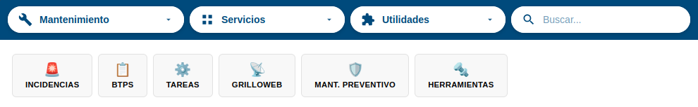

# Manual de Usuario: Módulo Mantenimiento

| Campo       | Valor                    |
|-------------|--------------------------|
| **Módulo**  | Mantenimiento            |
| **Versión** | 1.5                      |
| **Fecha**   | Abril 2026               |
| **Para**    | Operadores CGE SERGAS    |

---

## 1. Descripción general

El módulo **Mantenimiento** es el punto central desde el que se accede a todas las herramientas de gestión y mantenimiento del CGE SERGAS. Desde aquí puedes gestionar BTPs, incidencias, tareas de configuración, licencias, KPIs, Nagios, informes y mucho más.

---

## 2. Cómo funciona el menú de navegación

Al entrar en Mantenimiento verás una fila horizontal de **5 tarjetas** (categorías). Cada tarjeta agrupa un conjunto de herramientas relacionadas.

### Pasos para navegar

1. **Pulsa sobre una tarjeta** de la categoría que necesites.
2. Se desplegará un **acordeón** debajo con los botones de acceso a cada herramienta.
3. Pulsa el botón de la herramienta que quieras usar.
4. Si pulsas de nuevo la misma tarjeta, el acordeón se cierra.
5. Si pulsas otra tarjeta distinta, se cierra la anterior y se abre la nueva.

> **Nota:** La tarjeta activa (la que tienes abierta o la que corresponde a la página en la que estás) aparece resaltada en azul.

---

## 3. Categorías y submódulos disponibles

### 3.1. BTPs (Boletines de Trabajo Planificado)

Gestión completa de los BTPs de Telefónica.

| Herramienta         | Descripción                                                        |
|---------------------|--------------------------------------------------------------------|
| Importación BTPs    | Importar ficheros Excel de BTPs (completo o del día)               |
| Consulta Estado     | Buscar BTPs por estado, cambiar estado, paginar, exportar          |
| Consulta N.º BTP    | Buscar un BTP concreto por número, editar, copiar tabla y enviar   |
| BTP Manual          | Crear un BTP de forma manual rellenando un formulario              |
| BTPs Pendientes     | Ver BTPs autorizados que aún no se han informado al cliente        |
| Revisión diaria     | Enviar correo con la plantilla de revisión diaria de BTPs          |

### 3.2. Tareas

Tareas de configuración y validación de equipos de planta.

| Herramienta             | Descripción                                                    |
|-------------------------|----------------------------------------------------------------|
| Config. Planta          | Ejecutar tarea SSH de configuración en routers de datos        |
| Config. Planta Voz      | Ejecutar tarea SSH de configuración en equipos de voz          |
| Gentest Routers 5G      | Ejecutar gentest en routers 5G                                 |
| Revisión Serial         | Comprobar números de serie de equipos vía SSH                  |
| Validación Logos-PT     | Comparar datos de Logos-PT con los de la BDU                   |
| Licencias OXE/CISCO     | Gestión mensual de licencias OXE, CISCO, NGN y SBC             |

### 3.3. Incidencias

Gestión de incidencias de red y herramientas asociadas.

| Herramienta         | Descripción                                                        |
|---------------------|--------------------------------------------------------------------|
| Incidencias         | Crear, editar, cerrar y gestionar incidencias de red               |
| DDIs GDIA           | Consultar y asignar DDIs de voz para GDIA                          |
| Nagios              | Ver estado de hosts monitorizados en Nagios                        |
| Planta Nagios       | Dar de alta o baja equipos en la monitorización Nagios             |
| Informes CGP        | Generar informes diarios y semanales (CGP, internos, SERGAS)       |

### 3.4. Herramientas

Indicadores y métricas de cumplimiento.

| Herramienta         | Descripción                                                        |
|---------------------|--------------------------------------------------------------------|
| KPIs Inelcom        | Dashboard de KPIs SLA del contrato Inelcom                        |
| KPIs Nubodata       | Dashboard de KPIs SLA del contrato Nubodata                       |

### 3.5. Grilloweb

Seguimiento de incidencias de Telefónica.

| Herramienta         | Descripción                                                        |
|---------------------|--------------------------------------------------------------------|
| Seguimiento INC     | Buscar, suscribirse y hacer seguimiento de INC en Grilloweb       |

---

## 4. Consejos de uso

- Cada submódulo tiene su propio **manual detallado** con instrucciones paso a paso.
- Si no encuentras una herramienta, revisa las 5 tarjetas del menú: puede estar en otra categoría.
- El botón morado "Revisión diaria" en BTPs abre directamente tu cliente de correo con una plantilla preparada.

---

*Manual para operadores CGE SERGAS. Versión 1.5 — Abril 2026.*
