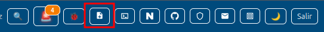
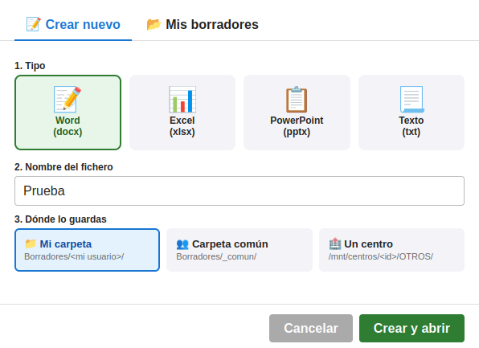
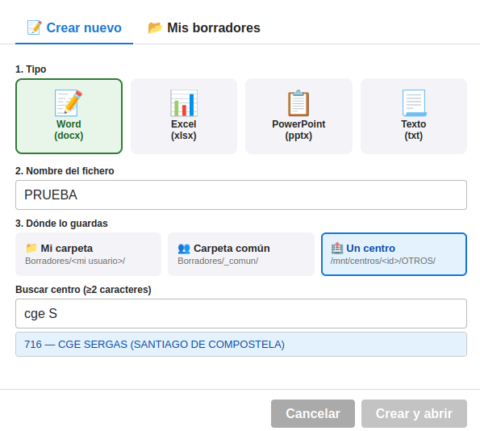
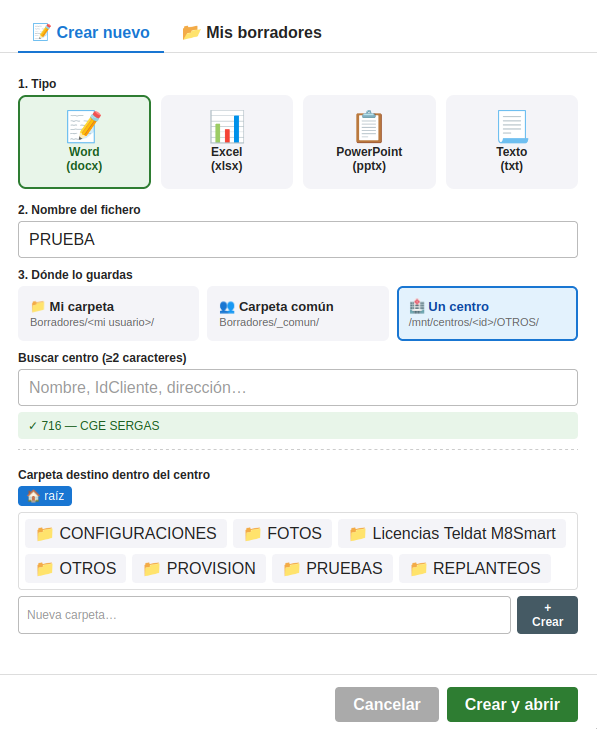
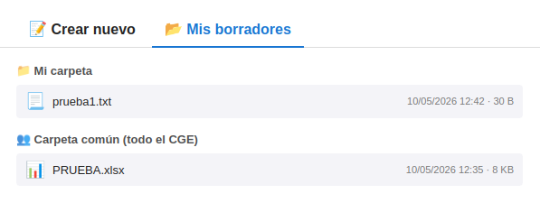

# Manual de Usuario: Documentos online (OnlyOffice)

| Campo       | Valor                          |
|-------------|--------------------------------|
| **Función** | Crear y abrir documentos office desde la cabecera de BDU |
| **Versión** | 1.0                            |
| **Fecha**   | Mayo 2026                      |
| **Para**    | Operadores CGE SERGAS          |

---

## Índice

1. [Para qué sirve esto](#1-para-qué-sirve-esto)
2. [Cómo accedemos](#2-cómo-accedemos)
3. [Crear un documento nuevo](#3-crear-un-documento-nuevo)
4. [Guardar el documento dentro de un centro](#4-guardar-el-documento-dentro-de-un-centro)
5. [Recuperar nuestros borradores](#5-recuperar-nuestros-borradores)
6. [Edición colaborativa entre operadores](#6-edición-colaborativa-entre-operadores)
7. [Resumen rápido](#7-resumen-rápido)

---

## 1. Para qué sirve esto

Desde la cabecera de BDU podemos **crear documentos Word, Excel, PowerPoint o de texto plano desde cero** sin necesidad de tener Office instalado en el equipo. Los documentos se editan en el navegador (motor OnlyOffice) y se guardan automáticamente en una carpeta del NAS.

Tres ubicaciones de destino disponibles:

- **📁 Mi carpeta** — privada para cada operador (`/mnt/documentacion/borradores/<usuario>/`).
- **👥 Carpeta común** — visible para todos los operadores del CGE.
- **🏥 Un centro concreto** — dentro del árbol de carpetas del centro (con buscador y explorador para elegir o crear la carpeta exacta).

---

## 2. Cómo accedemos

En la cabecera de BDU, junto a los iconos de SSH (`>_`), Nagios, Gitea, Vault y MailPiler, encontramos un icono nuevo de **documento con un signo más** (📄+).

1. Pulsamos el icono.
2. Se abre la ventana **"Documentos"** con dos pestañas:
   - **📝 Crear nuevo** (donde aterrizamos por defecto).
   - **📂 Mis borradores**.

---

## 3. Crear un documento nuevo

En la pestaña **📝 Crear nuevo** rellenamos tres bloques:

### 3.1. Elegir el tipo

Pulsamos uno de los cuatro botones:

| Botón | Tipo de fichero | Para qué |
|---|---|---|
| **📝 Word** | `.docx` | Borradores, informes en texto |
| **📊 Excel** | `.xlsx` | Listas, cálculos, tablas |
| **📋 PowerPoint** | `.pptx` | Presentaciones |
| **📃 Texto** | `.txt` | Notas rápidas, configs Cisco/Teldat manuales |

El botón elegido queda marcado en verde.

### 3.2. Poner el nombre

Escribimos el nombre del fichero **sin extensión** (la añade BDU según el tipo). Caracteres permitidos: letras (con tildes y ñ), números, espacios, guiones, paréntesis.

Ejemplo: `notas_turno_mañana_2026-05-12`.

### 3.3. Elegir dónde se guarda

Pulsamos uno de los tres destinos:

- **📁 Mi carpeta**: solo lo vemos nosotros desde la pestaña *Mis borradores*. Útil para borradores personales o trabajo en curso que aún no está listo para compartir.
- **👥 Carpeta común**: lo ven todos los operadores. Útil para dejar a un compañero de turno un documento que está revisando.
- **🏥 Un centro**: el documento se guarda dentro del árbol de carpetas del centro elegido (igual que si lo subiéramos por *Centros → Documentación*).

### 3.4. Crear y abrir

Pulsamos el botón verde **Crear y abrir** abajo a la derecha. Se abre **una pestaña nueva del navegador** con el editor OnlyOffice mostrando el documento en blanco. A partir de aquí escribimos como en Word/Excel/PowerPoint.

> **Importante:** los cambios se guardan automáticamente al cerrar la pestaña del editor, o en cualquier momento desde el menú **Archivo → Guardar** del propio editor. No hace falta hacer nada manualmente al terminar.

---

## 4. Guardar el documento dentro de un centro

Cuando elegimos el destino **🏥 Un centro**, aparecen herramientas extra para localizar la carpeta exacta dentro del centro.

### 4.1. Buscar el centro

1. Aparece un campo **"Buscar centro"**. Escribimos al menos 2 caracteres del nombre del centro, su IdCliente o su dirección.
2. BDU muestra una lista desplegable con coincidencias. Pulsamos la que queramos.
3. El centro elegido queda confirmado con un mensaje verde **"✓ \<id\> — \<nombre\>"**.

### 4.2. Navegar por las carpetas del centro

Justo debajo del centro elegido aparece el **explorador de carpetas** del centro:

- **Migas de pan (breadcrumb)** en la parte superior: muestran dónde estamos. Empezamos en `🏠 raíz`. Pulsamos cualquier segmento para volver a ese nivel.
- **Subcarpetas**: listadas como botones con el icono 📁. Pulsamos una para entrar dentro.
- **Crear nueva carpeta**: en la fila inferior tenemos un campo de texto y un botón **+ Crear**. Escribimos el nombre, pulsamos *Crear*, y BDU crea la carpeta y nos lleva automáticamente dentro de ella.

### 4.3. Confirmar y crear

Cuando estemos en la carpeta donde queremos dejar el documento, pulsamos **Crear y abrir** abajo a la derecha. El fichero aterriza exactamente en esa carpeta y se abre el editor.

> **Nota:** si pulsamos *Crear y abrir* sin haber navegado, el documento se guarda en la **raíz** de la carpeta del centro.

> **¿Y si el centro no tiene carpetas?** Si es la primera vez que se accede a la documentación del centro, BDU crea automáticamente la estructura clásica (CONFIGURACIONES, FOTOS, MANTENIMIENTO, PROVISION, REPLANTEOS, OTROS) — la misma que vemos en *Centros → Documentación*.

---

## 5. Recuperar nuestros borradores

Para volver a abrir un documento que creamos antes en *Mi carpeta* o en *Carpeta común*:

1. Pulsamos el icono de cabecera (📄+).
2. En la ventana, pulsamos la pestaña **📂 Mis borradores**.
3. Aparecen dos secciones:
   - **📁 Mi carpeta**: documentos que solo vemos nosotros.
   - **👥 Carpeta común (todo el CGE)**: documentos comunes a todo el equipo.
4. Cada documento muestra: icono según tipo, nombre, fecha de modificación y tamaño. Los más recientes salen arriba.
5. Pulsamos cualquiera y se abre en pestaña nueva con OnlyOffice listo para seguir editándolo.

> **Nota:** si guardamos un documento en un **centro**, no aparece en *Mis borradores*; lo encontramos desde *Centros → \<centro\> → Documentación* en la carpeta donde lo dejamos.

---

## 6. Edición colaborativa entre operadores

Si dos operadores abrimos el **mismo documento** a la vez (por ejemplo, uno de la carpeta común), OnlyOffice nos junta en una sesión colaborativa estilo Google Docs:

- Vemos los cursores de los demás en tiempo real.
- Lo que cada uno escribe aparece al instante en la pantalla del otro.
- Cuando ambos cerramos la pestaña, se guarda **una sola versión consolidada** con los cambios de los dos. No hay riesgo de que el último que cierre pise el trabajo del otro.

Esto es especialmente útil para borradores comunes que se redactan entre varios al cambio de turno.

---

## 7. Resumen rápido

| Acción | Cómo |
|---|---|
| Abrir el creador de documentos | Icono **📄+** en la cabecera |
| Crear un Word/Excel/PowerPoint/Texto en blanco | Pestaña **Crear nuevo** → tipo + nombre + destino + **Crear y abrir** |
| Guardar dentro de un centro en una carpeta concreta | Destino **🏥 Un centro** → buscar centro → navegar/crear carpeta → **Crear y abrir** |
| Volver a abrir un borrador propio | Pestaña **📂 Mis borradores** → click en el documento |
| Cerrar y guardar | Cerrar la pestaña del editor (guardado automático) |
| Editar a la vez con un compañero | Que abra el mismo documento — los cambios se mezclan en tiempo real |

---

*Manual para operadores CGE SERGAS. Versión 1.0 — Mayo 2026.*
