# Manual de Usuario: Módulo Plantillas

| Campo       | Valor                                |
|-------------|--------------------------------------|
| **Módulo**  | Plantillas (dentro de Mantenimiento) |
| **Versión** | 2.1                                  |
| **Fecha**   | Abril 2026                           |
| **Para**    | Operadores CGE SERGAS                |

---

## Índice

1. [Para qué sirve este módulo](#1-para-qué-sirve-este-módulo)
2. [Cómo accedemos al módulo](#2-cómo-accedemos-al-módulo)
3. [La pantalla principal](#3-la-pantalla-principal)
4. [Submódulo Completa](#4-submódulo-completa)
5. [Submódulo Modificaciones](#5-submódulo-modificaciones)
6. [Submódulo Traductor](#6-submódulo-traductor)
7. [Submódulo Migración red 69→10 (TEMPORAL)](#7-submódulo-migración-red-6910-temporal)
8. [Histórico](#8-histórico)
9. [Dudas frecuentes](#9-dudas-frecuentes)

---

## 1. Para qué sirve este módulo

El módulo **Plantillas** genera configuraciones de router (Cisco y Teldat) a partir de formularios web. Sustituye los antiguos ficheros Excel con macros (`.xltm`) y los programas Python que se usaban para las mismas tareas.

Con Plantillas podemos:

- Generar la **configuración completa** de un router Teldat para un centro nuevo (con todos sus bloques: ACLs, QoS, BGP, syslog, SNMP, etc.).
- **Dar de alta una VLAN** nueva en un router existente (Cisco o Teldat).
- **Traducir ACLs** entre Cisco y Teldat (en ambos sentidos), renumerar entries Teldat o crear comandos para habilitar / deshabilitar ACLs en interfaces.
- Generar los comandos de la **migración temporal de red 69→10** que se está aplicando a los routers del cliente.

Cada configuración generada se **guarda automáticamente** en `/mnt/centros/plantillas/<nemónico>/` para que cualquier operador pueda consultarla más tarde.

---

## 2. Cómo accedemos al módulo

1. Abrimos la **Web BDU** en el navegador.
2. En la barra superior pulsamos **Mantenimiento**.
3. Buscamos y pulsamos la tarjeta **Plantillas**.

> **Atajo:** también podemos llegar directamente con `?m=plantillas` añadido al final de la URL de BDU.

---

## 3. La pantalla principal

Al entrar en Plantillas vemos **4 tarjetas** (categorías) y un botón **📂 Histórico** arriba a la derecha.

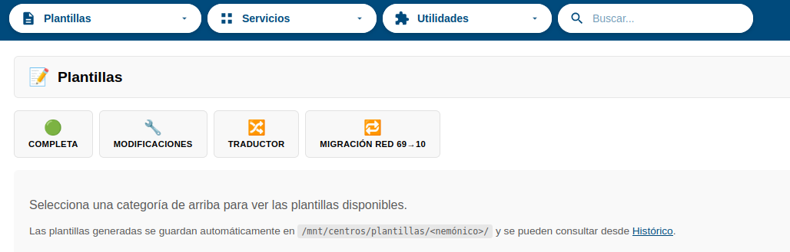

| Tarjeta | Para qué sirve |
|---|---|
| 🟢 **Completa** | Generar la configuración completa de un router Teldat (centro nuevo). |
| 🔧 **Modificaciones** | Dar de alta una VLAN nueva en Cisco o Teldat. |
| 🔀 **Traductor** | Traducir ACLs Cisco ⇄ Teldat, renumerar y habilitar/deshabilitar ACLs. |
| 🔁 **Migración red 69→10** | **TEMPORAL.** Generar los comandos de migración de direccionamiento. |

Al pulsar una tarjeta se abre un **acordeón** debajo con las opciones disponibles. Pulsamos la opción que necesitemos para entrar al formulario correspondiente.

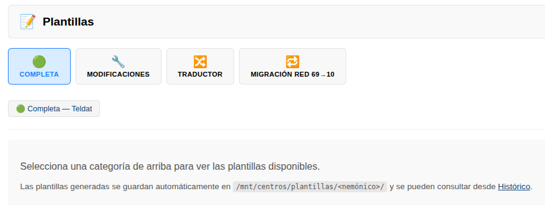

El botón **📂 Histórico** lleva al listado de todas las plantillas generadas hasta la fecha (ver [sección 8](#8-histórico)).

---

## 4. Submódulo Completa

### 4.1. Cuándo lo usamos

Cuando hay que dar de alta un **centro nuevo** (o reemplazar el equipo Teldat de un centro existente) y necesitamos la configuración completa lista para pegar en el router.

El submódulo elige automáticamente la plantilla correcta en función de la **sede** y el **rol** que indiquemos:

| Sede               | Rol Principal o 1º Backup | Rol 2º Backup     |
|--------------------|---------------------------|-------------------|
| FULL MACROLAN      | Plantilla MACROLAN        | Plantilla 5G      |
| MACROLAN+VPN-IP    | Plantilla MACROLAN        | Plantilla 5G      |
| FULL VPN-IP        | Plantilla DOBLE VPN       | Plantilla 5G      |

### 4.2. Rellenar el formulario

El formulario tiene unos 35 campos agrupados en bloques. Los marcados con `*` son obligatorios. Algunos campos solo aparecen cuando tienen sentido (por ejemplo, los datos de las loopbacks 5G solo se piden si el rol es Principal o 1º Backup).

**Campos principales:**

| Bloque         | Campos                                                                                              |
|----------------|-----------------------------------------------------------------------------------------------------|
| Identificación | Nemónico (con autocompletado), Rol, Sede, Servicio, Modelo EDC                                      |
| WAN            | Interfaz, VLAN WAN, IP WAN EDC, IP WAN HL4 (calculada), Autonegociación                             |
| Loopbacks 5G   | IP Loopback 600, IP Loopback 700, Loopbacks del otro EDC                                            |
| VLANs          | Por cada VLAN (Datos, Voz, RFID, Electro, MESI, Retinómetro, WIFI): activar Sí/No, IP de red, Máscara, DHCP-relay |

**Autocompletados que ahorran trabajo:**

- Al seleccionar el **Nemónico**, se rellenan automáticamente la IP de gestión telefónica, la IP de gestión cliente y el flow port.
- Al introducir la **IP de red** de cada VLAN, se calculan las IPs de VRRP, Principal, 1º Backup y 2º Backup según las reglas estándar.
- Al introducir la **IP WAN**, se calcula la **IP WAN HL4** (siempre IP WAN − 1).

### 4.3. ACL FILTRO_LAN_SEDE: el modal

La ACL del cliente (`FILTRO_LAN_SEDE` en Cisco / `access-list 1000` en Teldat) **es obligatoria**. Aparece como un campo especial con un badge de estado y un botón para abrir un popup donde la pegamos.

**Pasos:**

1. Pulsamos **🧾 Añadir ACL**. Se abre un modal con dos cuadros de texto.
2. En el cuadro de la izquierda **pegamos la ACL del cliente** (puede ser Cisco o Teldat, da igual).
3. Pulsamos **🔄 Previsualizar**. El sistema:
   - Detecta el formato automáticamente.
   - Si es Cisco, la traduce a Teldat.
   - Si es Teldat, la normaliza.
   - **Siempre** garantiza que empieza por `access-list 1000` y termina por `exit` (lo que necesita el router al pegarla).
4. Vemos el resultado en el cuadro de la derecha + un aviso verde indicando cuántas ACEs se han procesado.
5. Si todo es correcto, pulsamos **✅ Aceptar**. El badge cambia a verde con `✅ ACL cargada` y el botón pasa a `✏️ Editar ACL`.

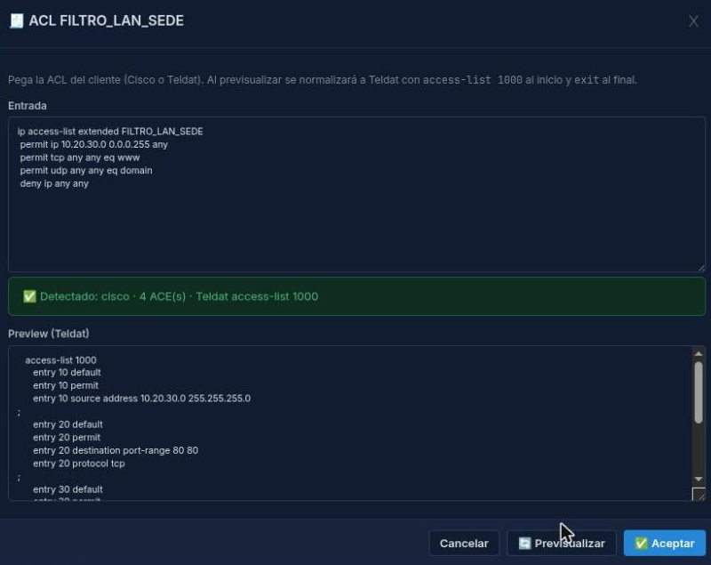

> **Importante:** mientras la ACL no esté cargada, el botón **Generar configuración** no funcionará y aparecerá un aviso.

> Si nos equivocamos y queremos pegar otra, pulsamos **✏️ Editar ACL**: el modal se abre con la última cargada para corregirla sin tener que volver a pegar todo.

### 4.4. Generar y guardar

Cuando todos los campos obligatorios estén rellenos y la ACL cargada:

1. Pulsamos **⚙️ Generar configuración**.
2. Aparece la configuración completa en un cuadro de texto.
3. Pulsamos **📋 Copiar** para copiarla al portapapeles.
4. La configuración se **guarda automáticamente** en `/mnt/centros/plantillas/<nemónico>/`. Podemos consultarla luego desde el [Histórico](#8-histórico).

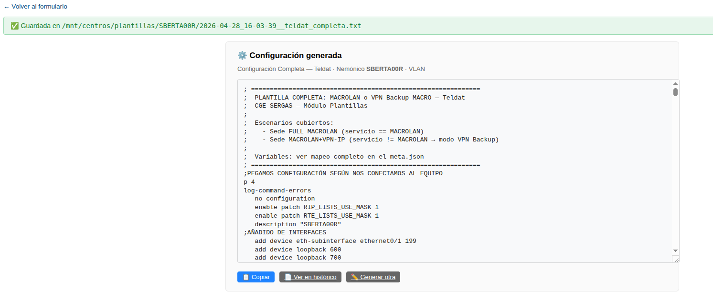

---

## 5. Submódulo Modificaciones

Para añadir una VLAN nueva a un router que **ya está en producción**. Hay dos plantillas, una para Cisco y otra para Teldat. Funcionan de forma muy parecida.

### 5.1. Alta VLAN Cisco

Pulsamos **🔵 Alta VLAN — Cisco** en el acordeón de Modificaciones.

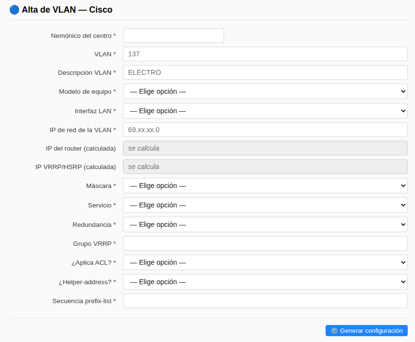

**Campos clave:**

- **Nemónico** (con autocompletado).
- **VLAN** (número).
- **Descripción**, **IP de red**, **Máscara**.
- **¿Aplica ACL?** y **Número de ACL**.
- **Helper-address** (DHCP-relay) si aplica.

Tras rellenar, pulsamos **⚙️ Generar configuración** y copiamos el resultado al router.

### 5.2. Alta VLAN Teldat

Pulsamos **🟣 Alta VLAN — Teldat**. La estructura es similar a Cisco, pero con campos extra propios de Teldat: **Sede**, **Servicio**, **Redundancia** y **Secuencia prefix-list**.

**Tipo de sede `FLEXWAN`:**

Si seleccionamos sede = **FLEXWAN**, el formulario simplifica los campos:

- **Servicio** se oculta (siempre es 5G).
- **Redundancia** se oculta (siempre es 2º BACKUP).

El sistema rellena ambos automáticamente al generar y la plantilla emite los bloques específicos de FLEXWAN (priority 99, `report master-chg nsla-filter 2`, sin BGP export).

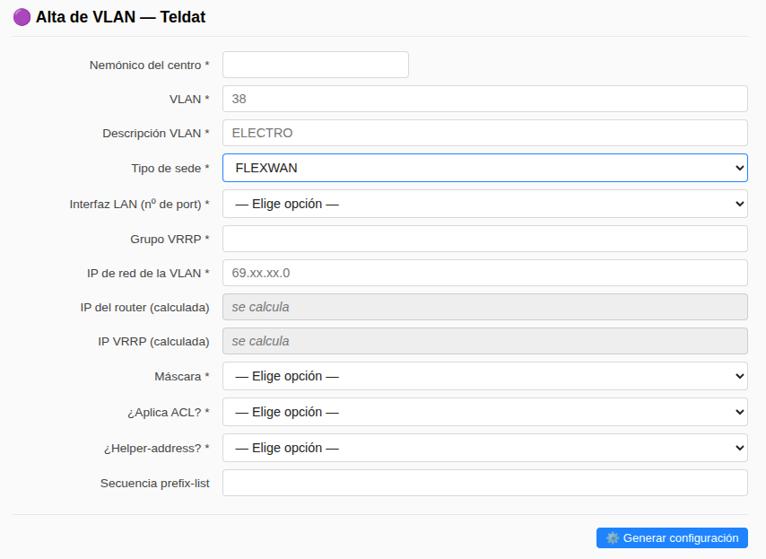

### 5.3. VLANs estándar (autorrelleno)

Cuando tecleamos una de las **VLANs estándar** del SERGAS, el formulario rellena automáticamente varios campos para ahorrar trabajo y evitar errores:

| VLAN | Descripción  | ACL | Grupo VRRP | Sec. prefix-list |
|------|--------------|-----|------------|------------------|
| 37   | RFID         | 137 | 3          | 3                |
| 38   | ELECTRO      | 138 | 4          | 4                |
| 39   | MESI         | 139 | 7          | 7                |
| 40   | RETINOMETRO  | 140 | 5          | 5                |
| 60   | WIFI         | 160 | 6          | 6                |

Solo tenemos que rellenar el resto (nemónico, IP de red, máscara…). En Cisco solo se rellena descripción + ACL; el grupo VRRP y la secuencia prefix-list son específicos de Teldat.

> **Nota:** si el campo **Sede** todavía no está elegido, la **Secuencia prefix-list** está oculta y se rellenará automáticamente cuando elijamos la sede.

---

## 6. Submódulo Traductor

Útil cuando necesitamos trabajar con ACLs sueltas: traducir, renumerar o generar comandos de habilitar / deshabilitar.

### 6.1. Traductor Cisco ⇄ Teldat / Renumerar

Pulsamos **🔀 Traductor Cisco ⇄ Teldat / Renumerar** en el acordeón de Traductor.

Vemos dos cuadros de texto grandes (entrada a la izquierda, resultado a la derecha) y los siguientes botones:

| Botón                      | Qué hace                                                                                          |
|----------------------------|---------------------------------------------------------------------------------------------------|
| 🔄 **Traducir**            | Detecta automáticamente si pegamos Cisco o Teldat y traduce al otro formato.                      |
| **Crear no entry**         | Genera comandos `no entry N` para borrar entries de una ACL Teldat. Acepta también un número N → genera N/10 entries. |
| **Renumerar entries**      | Renumera todas las entries Teldat de 10 en 10.                                                    |
| 🧹 **Limpiar**             | Vacía el cuadro de entrada.                                                                       |

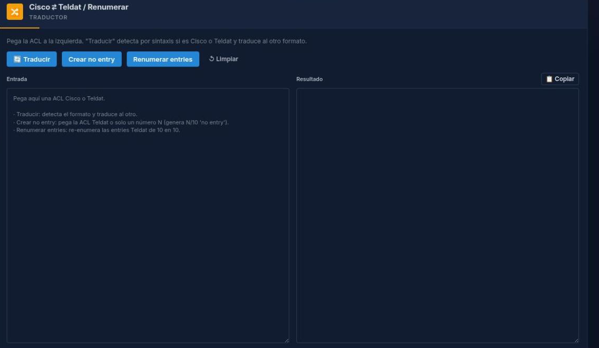

**Pasos típicos:**

1. **Pegamos** la ACL en el cuadro izquierdo.
2. Pulsamos el botón que toca (normalmente **🔄 Traducir**).
3. Miramos el resultado en el cuadro derecho. Bajo el texto verde vemos cuántas ACEs se han procesado y, si hay algo no entendido, un panel **⚠️ Avisos** con las líneas problemáticas.
4. Pulsamos **📋 Copiar** para llevarnos el resultado al portapapeles.
5. Si nos equivocamos, pulsamos **🧹 Limpiar** para vaciar el cuadro de entrada.

> **Cómo se traducen los puertos:** el traductor saca con número (por ejemplo `eq 137`) cuando el nombre Cisco es ambiguo (`netbios-*`, `pop2`, `ident`, `cmd`…) y con nombre cuando es universal (`www`, `domain`, `ftp`, `telnet`, `ntp`, `snmp`, `bgp`, `https`, `syslog`, `tacacs`, etc.).

> **ACLs nombradas Cisco ↔ numeradas Teldat:** si la ACL Cisco tiene el nombre `FILTRO_LAN_SEDE`, en Teldat sale como `access-list 1000`. Si es un nombre que el sistema no conoce, sale como `access-list xxx` (lo rellenamos a mano). El catálogo de mapeos es ampliable.

### 6.2. Habilitar / Deshabilitar ACL

Pulsamos **🔛 Habilitar / Deshabilitar ACL**.

Esta pantalla genera los comandos para **aplicar o quitar una ACL** sobre las interfaces de un router. Pegamos un fragmento del `running-config` con las interfaces afectadas y el sistema saca los comandos correspondientes.

Acepta los 3 formatos típicos:

- **Teldat:** `network ethernet0/1.10 / ip access-group 110 in`
- **Cisco running-config:** `interface GigabitEthernet0/0.10 / ip access-group 110 in`
- **Cisco show ip access-list:** `Inbound access list is 110`

Tiene 2 botones: **Habilitar ACL** y **Deshabilitar ACL** (este último añade `no ` delante de cada `access-group`).

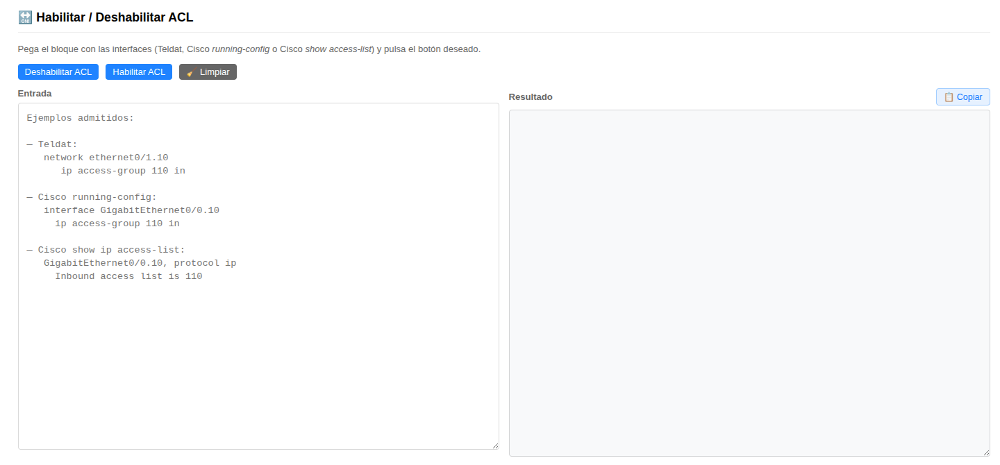

---

## 7. Submódulo Migración red 69→10 (TEMPORAL)

> **🟡 Submódulo TEMPORAL.** Esta opción solo está disponible mientras dure la migración del direccionamiento de red 69.x → 10.x del cliente. Cuando la migración termine, esta tarjeta y todo su contenido se eliminarán de la aplicación.

### 7.1. Cuándo lo usamos

Cuando hay que **migrar un centro** del direccionamiento antiguo (69.x.x.x) al nuevo (10.x.x.x). El submódulo genera los **3 bloques de comandos** que pegamos en el router en distintas fases:

1. **Preparativos:** se añaden las IPs nuevas como secundarias y se actualizan las ACLs y prefix-lists para permitir tráfico desde las nuevas subredes. La conectividad antigua sigue funcionando.
2. **Migración:** se cambia la IP primaria del equipo a la red nueva, dejando la antigua como secundaria en VRRP. Es el corte controlado.
3. **Eliminación:** se borran las IPs antiguas y las entries obsoletas, una vez que la migración se ha dado por buena.

### 7.2. Rellenar el formulario

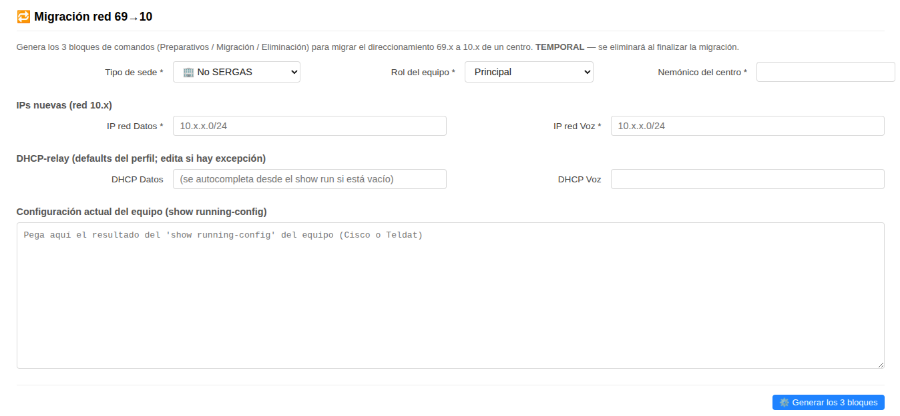

**Bloques del formulario:**

| Bloque                  | Campos                                                                                                                       |
|-------------------------|------------------------------------------------------------------------------------------------------------------------------|
| Perfil del centro       | **Tipo de sede** (No SERGAS / Centros de Salud), **Rol del equipo** (Principal / Redundante / Equipo 4G), **Nemónico**       |
| IPs nuevas              | IP red Datos, IP red Voz, IP red Electro (solo Centros de Salud) — todas en formato `10.x.x.0/24`                            |
| DHCP-relay              | DHCP Datos y DHCP Voz. En Centros de Salud vienen con valores por defecto que solo cambiamos si hay excepción. En No SERGAS se autocompletan desde el `show running-config` que peguemos. |
| Configuración actual    | Pegamos aquí el `show running-config` completo del equipo.                                                                   |

**Detección automática:**

El sistema detecta el **fabricante** (Cisco / Teldat) y el **modelo** (C1111 / ASR / Teldat) leyendo el show running-config. No tenemos que indicarlo.

> **Nota:** el rol **Equipo 4G** solo está soportado en equipos Teldat (porque en Cisco el equipo 4G no existe en SERGAS).

### 7.3. Los 3 bloques de salida

Tras pulsar **⚙️ Generar los 3 bloques** aparecen 3 cuadros de texto, cada uno con su botón **📋 Copiar**:

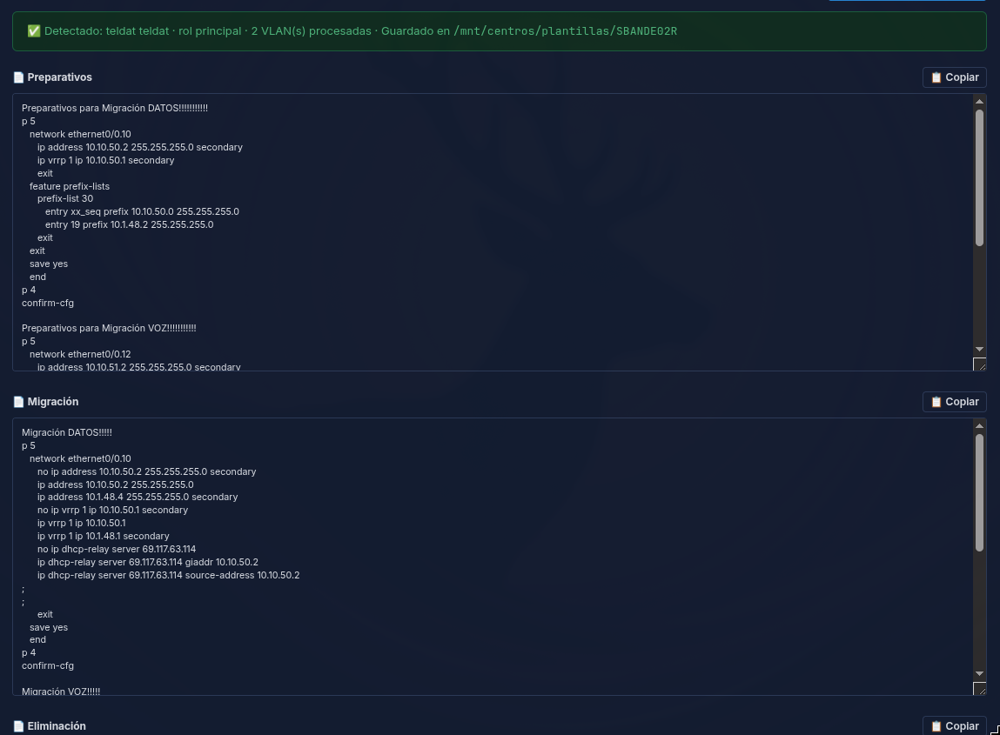

Bajo el aviso verde vemos:

- **Detectado:** fabricante y modelo del equipo.
- **Nº de VLANs procesadas.**
- **Ruta de guardado** en el histórico.

> **Avisos:** si el sistema no encuentra alguna entry en la ACL 150 (porque ese centro no tiene 4G todavía, por ejemplo), simplemente omite las líneas correspondientes en lugar de meter placeholders. La plantilla queda lista para pegar al router sin tener que tocar nada a mano.

> **Importante:** los 3 bloques **no se pegan a la vez**. Cada bloque corresponde a una fase distinta de la migración (Preparativos → Migración → Eliminación) y debe aplicarse en orden con la ventana de tiempo acordada con el cliente.

---

## 8. Histórico

Pulsamos el botón **📂 Histórico** arriba a la derecha del panel principal para ver todas las plantillas generadas hasta la fecha.

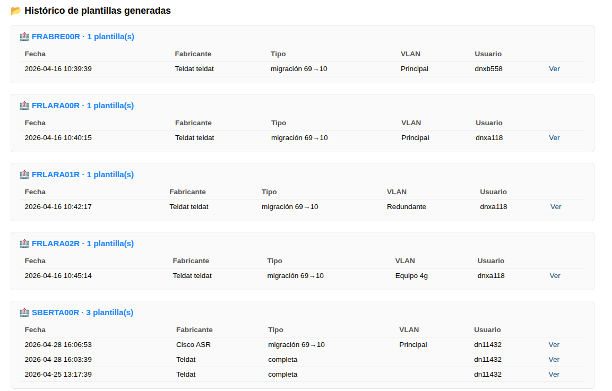

Las plantillas se agrupan **por nemónico** (un grupo por centro). Por cada plantilla guardada se muestra:

| Columna       | Significado                                       |
|---------------|---------------------------------------------------|
| Fecha         | Cuándo se generó.                                 |
| Fabricante    | Cisco / Teldat (con modelo si aplica).            |
| Tipo          | Alta VLAN / Completa / Migración 69→10.           |
| VLAN          | Número de VLAN o rol (en Migración).              |
| Usuario       | Operador que la generó.                           |

Pulsamos **Ver** en cualquier fila para abrir la configuración completa en pantalla. Hay un botón **📋 Copiar** para volver a llevarla al portapapeles.

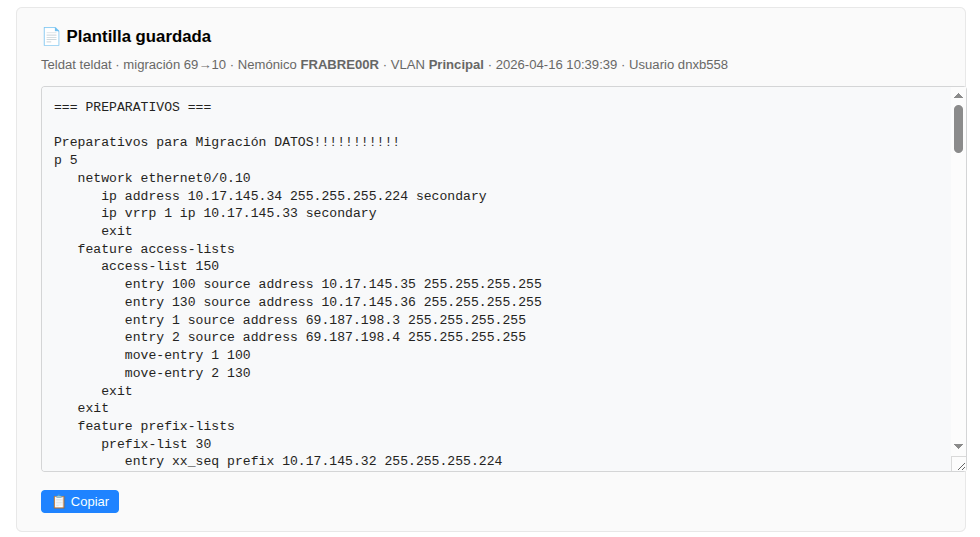

> **Dónde se guarda físicamente:** en el NAS, en `/mnt/centros/plantillas/<nemónico>/`. Cada plantilla genera dos ficheros: el `.txt` con la configuración y un `.meta.json` con los datos de quién, cuándo, qué tipo y qué parámetros se usaron.

---

## 9. Dudas frecuentes

### ¿Por qué algunos campos del formulario aparecen y desaparecen?

El módulo usa **visibilidad condicional**: los campos solo aparecen cuando tienen sentido según lo que ya hayamos elegido. Por ejemplo, el campo **Servicio** solo se muestra cuando la sede es FULL MACROLAN o MACROLAN+VPN-IP; el campo **Loopback 600 del otro EDC** solo aparece en sedes FULL VPN-IP cuando el rol no es 2º Backup. Esto evita rellenar datos que no aplican.

---

### Pegamos una ACL Cisco en el modal de FILTRO_LAN_SEDE pero el resultado sale con `access-list xxx`. ¿Por qué?

El nombre Cisco que hemos pegado no está en el catálogo de mapeos. Tenemos dos opciones:

1. Cambiar `xxx` por el número Teldat correcto a mano antes de pegar al router.
2. Pedir al equipo técnico que añada el mapeo al catálogo `acls_nombre_a_numero.txt` (una línea `NOMBRE|NUMERO` y queda mapeado para todos en ambos sentidos).

---

### La migración 69→10 me dice que detectó Cisco pero el equipo tiene 4G. ¿Qué hacemos?

El rol **Equipo 4G** solo está soportado en Teldat, porque en SERGAS los equipos 4G son siempre Teldat. Si el sistema detecta Cisco con rol 4G, dará error. Revisamos que el `show running-config` que pegamos corresponde realmente al equipo 4G del centro.

---

### Generamos una plantilla pero olvidamos copiarla. ¿La podemos recuperar?

Sí, todas las plantillas generadas se guardan automáticamente en el histórico. Entramos en **📂 Histórico**, buscamos el nemónico del centro y pulsamos **Ver** sobre la plantilla concreta. El botón **📋 Copiar** la lleva al portapapeles otra vez.

---

### En el histórico aparece una plantilla con el campo "Fabricante" o "Tipo" en blanco. ¿Por qué?

Las plantillas generadas antes de abril 2026 con el submódulo de Migración red 69→10 no guardaron esos campos en el sidecar. Las nuevas sí los rellenan correctamente. Si necesitamos recuperar una antigua, abrimos el `.txt` directamente desde **Ver** y vemos la configuración completa.

---

### Ponemos el rol de FLEXWAN en Alta VLAN Teldat pero no nos deja elegir el servicio. ¿Es un error?

No es un error, es **lo correcto**. En FLEXWAN el servicio es siempre 5G y el rol siempre 2º BACKUP, así que el formulario los oculta y los rellena él. Solo tenemos que indicar la sede y el resto de campos comunes.

---

*Manual para operadores CGE SERGAS. Versión 2.1 — Junio 2026.*
