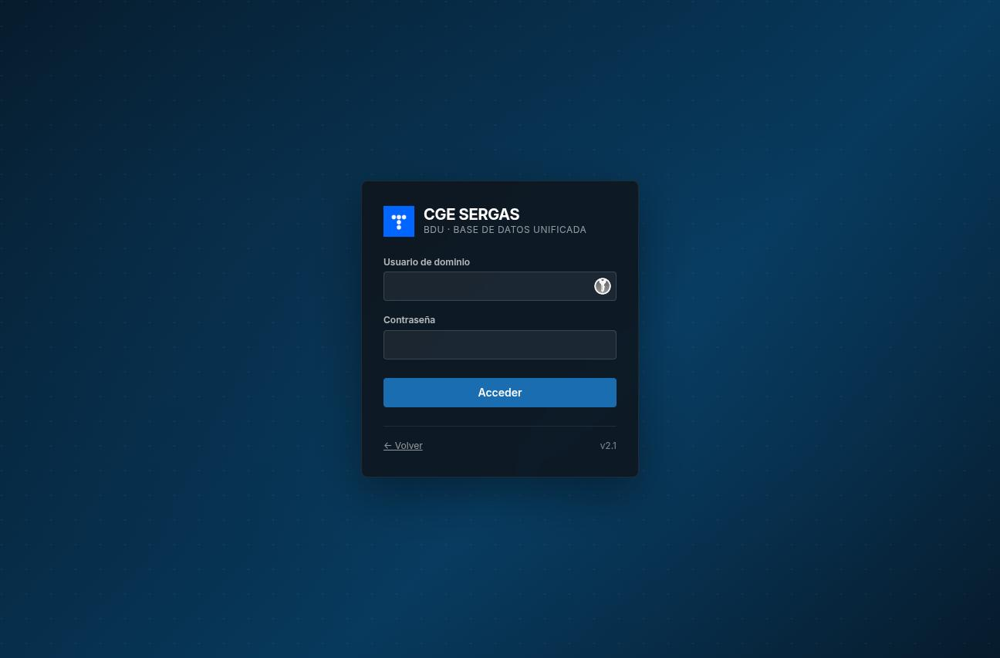
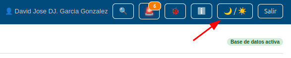
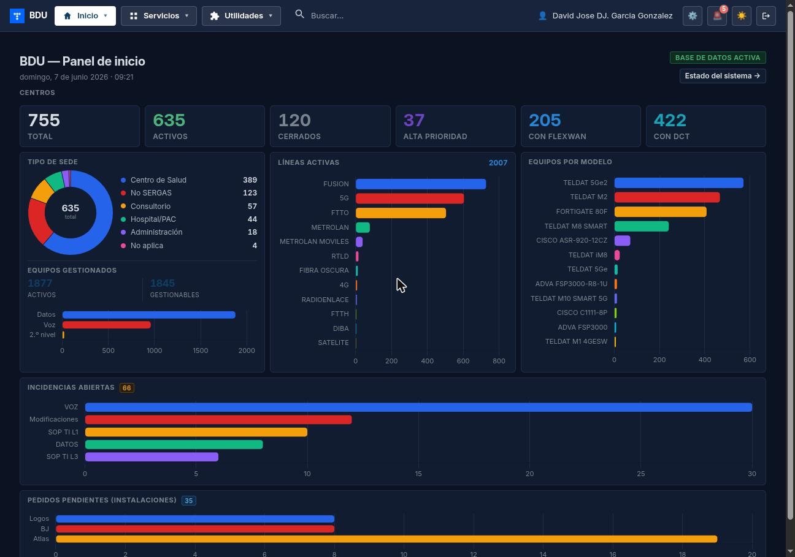
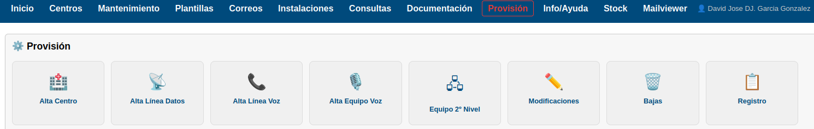
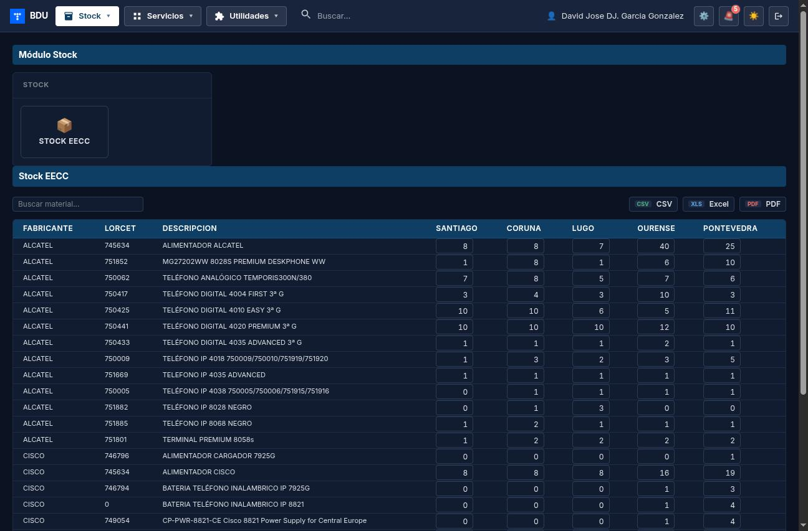
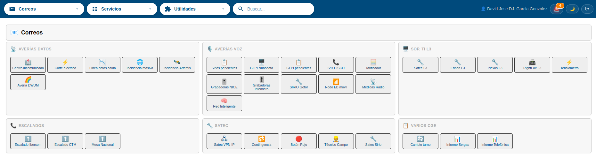
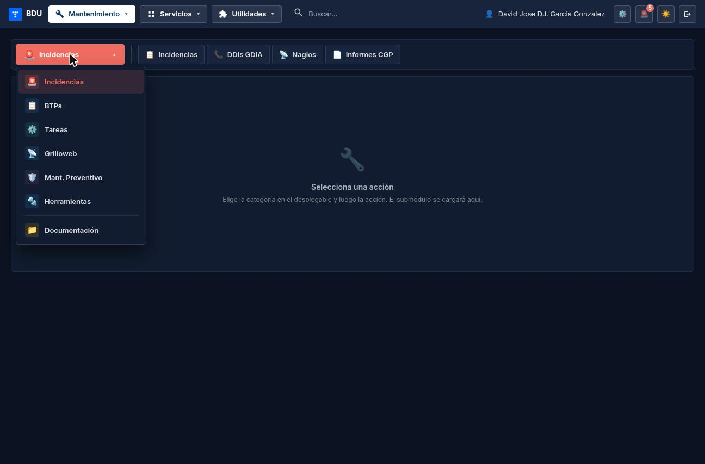
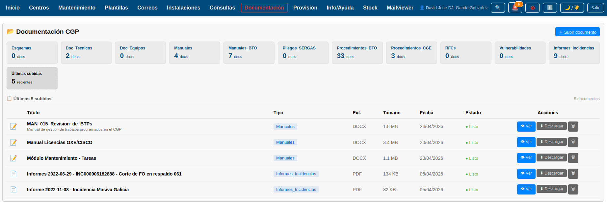

# BDU — Manual de Usuario Global

| | |
|---|---|
| **Aplicación** | BDU (Base de Datos Unificada) |
| **Versión** | 1.6 |
| **Fecha** | Abril 2026 |
| **Para** | Operadores CGE SERGAS |

---

## Índice

1. [Introducción](#1-introducción)
2. [Navegación general](#2-navegación-general)
3. [Módulos](#3-módulos)
4. [Funciones comunes](#4-funciones-comunes)
5. [Preguntas frecuentes](#5-preguntas-frecuentes)
6. [Funcionalidades transversales (sin manual propio)](#6-funcionalidades-transversales-sin-manual-propio)
7. [Referencia de manuales](#7-referencia-de-manuales)

---

## 1. Introducción

### 1.1. Qué es BDU

BDU (Base de Datos Unificada) es la aplicación web interna del Centro de Gestión (CGE) de Telefónica para el cliente SERGAS (Servicio Gallego de Salud). Permite gestionar de forma integral toda la infraestructura de red: centros sanitarios, líneas de datos y voz, equipos de comunicaciones, incidencias, provisiones, informes, documentación y herramientas operativas del día a día.

En resumen, BDU es la herramienta principal de trabajo de los operadores del CGE para:

- Consultar información de centros sanitarios y su infraestructura de red.
- Dar de alta, modificar o dar de baja elementos de red (líneas, equipos, centros).
- Gestionar incidencias y boletines de trabajo programado (BTPs).
- Generar correos operativos estandarizados.
- Consultar y exportar datos en diferentes formatos.
- Controlar el stock de equipos en almacenes.
- Acceder a documentación interna y enlaces útiles.
- Monitorizar el estado de la infraestructura en tiempo real.

### 1.2. Para quién es este manual

Este manual está dirigido a los **operadores del CGE SERGAS** que utilizan BDU en su trabajo diario. No se requieren conocimientos técnicos avanzados para seguir las instrucciones.

Cada módulo de BDU tiene su propio manual detallado con instrucciones paso a paso. Este documento ofrece una **visión global** de la aplicación y sirve como punto de partida para familiarizarse con todas las funcionalidades disponibles.

### 1.3. Cómo acceder

**URL de acceso:**

| Entorno | URL |
|---|---|
| Producción (PRO)    | `https://bdu.sergascge.local`     |
| Preproducción (PRE) | `https://pre.bdu.sergascge.local` |

> **Nota:** la URL de preproducción solo se utiliza para pruebas. El trabajo diario se realiza siempre en la URL de producción.

**Pasos para acceder:**

1. Abrimos el navegador web e introducimos la URL de producción.
2. Aparece la portada pública con el logotipo del CGE SERGAS y un botón **ACCEDER**.
3. Pulsamos **ACCEDER**.
4. Introducimos las credenciales del dominio (usuario y contraseña de red, las mismas que usamos para iniciar sesión en el ordenador).
5. Pulsamos **Entrar**.



**Información importante sobre el acceso:**

- La autenticación se realiza contra el directorio LDAP del dominio `sergascge.local`.
- Tras **3 intentos fallidos** de contraseña, la cuenta se bloquea durante **5 minutos**.
- La sesión expira automáticamente tras **30 minutos de inactividad**. Si esto ocurre, se redirige a la pantalla de login con un aviso de sesión expirada.

---

## 2. Navegación general

Una vez autenticados, la interfaz de BDU se compone de los siguientes elementos:


### 2.1. Menú superior (barra de navegación)

En la parte superior de la pantalla se encuentra la barra de navegación, organizada en cuatro chips principales (acordeones desplegables) a la izquierda y unos botones de utilidad a la derecha:

```
[🏠 Módulo activo ▾]  [▦ Servicios ▾]  [🧩 Utilidades ▾]  [🔍 Buscar...]   ...   🚨  🌙  ⎋
```

**Comportamiento general de los acordeones:**

- Por defecto solo vemos el chip activo de cada acordeón.
- Pulsamos un chip para desplegarlo hacia abajo en un panel con los elementos disponibles.
- Pulsamos un elemento del panel y nos lleva a su destino, cerrando el panel.
- Para cerrar sin elegir: clic fuera del panel o tecla **Esc**.
- Solo un acordeón puede estar abierto a la vez. Si abrimos otro, el anterior se cierra automáticamente.

#### Módulos (chip izquierdo)

Muestra el módulo en el que estamos. Al desplegar aparecen los demás módulos disponibles:

**Inicio** · **Centros** · **Mantenimiento** · **Plantillas** · **Correos** · **Instalaciones** · **Consultas** · **Documentación** · **Provisión** · **Info/Ayuda** · **Stock**

#### Servicios

Acceso a las plataformas externas integradas con BDU. Al pulsarlas se abren en una pestaña nueva:

- **Nagios** — panel NagiosTV de monitorización de la infraestructura.
- **MailPiler** — archivado y búsqueda de correo histórico CGE.
- **Vaultwarden** — gestor de contraseñas corporativo.
- **Gitea** — repositorio interno de código y documentación de BDU.

> **Nota:** las plataformas externas requieren credenciales propias. La primera vez que accedemos en el navegador puede aparecer un popup pidiendo usuario y contraseña.

#### Utilidades

Atajos a herramientas integradas en BDU:

- **Nuevo documento** — abre el modal para crear un Word/Excel/PowerPoint/Texto colaborativo en OnlyOffice.
- **Terminal SSH** — abre un popup con un cliente SSH en el navegador para conectar a cualquier equipo de la red interna sin tener que usar PuTTY. Ver el manual [`WebSSH2/manual_webssh2.md`](WebSSH2/manual_webssh2.md).
- **Esquema BDU** — diagrama técnico de la arquitectura y módulos.
- **Reportar** — formulario de feedback para comunicar fallos o sugerencias sobre la propia aplicación BDU. **No** se usa para incidencias de red.

#### Buscador global

Cuarto chip a la derecha del cluster, con icono de lupa y un campo de texto integrado.

- Tecleamos el término a buscar (mínimo 2 caracteres).
- Pulsamos **Enter** y se abre el modal de búsqueda global con los resultados ya cargados.

### 2.2. Avisos entre turnos

A la derecha de la barra disponemos del icono **🚨**:

- Muestra una pastilla con el número de avisos pendientes para nuestro turno.
- Al pulsarlo se abre el panel de avisos.
- El color del icono indica la urgencia (moderado / importante / urgente).

### 2.3. Modo oscuro

Botón con icono **🌙 / ☀️**:

- Pulsamos la luna para activar el **modo oscuro** (fondo oscuro, texto claro).
- Pulsamos el sol para volver al **modo claro** (fondo blanco, texto oscuro).
- La preferencia se guarda automáticamente en el navegador: al volver a entrar, se mantiene el último modo seleccionado.



### 2.4. Cerrar sesión

Para cerrar la sesión de forma segura:

1. Pulsamos el icono de **puerta con flecha** en el extremo derecho de la barra superior.
2. Volvemos a la portada pública.

> **Importante:** si simplemente cerramos el navegador sin cerrar sesión, esta expira automáticamente a los 30 minutos.

---

## 3. Módulos

A continuación se describe brevemente cada módulo. Para instrucciones detalladas, consultamos el manual específico de cada uno (ver [sección 7. Referencia de manuales](#7-referencia-de-manuales)).

---

### 3.1. Inicio

**Panel de control con KPIs y estado de la infraestructura.**

Al entrar en BDU, el módulo Inicio muestra un panel con la visión global del estado de la plataforma:

- **KPIs de centros:** total, activos, cerrados, alta prioridad, FlexWAN, DCT.
- **Gráficos:** tipo de sede, líneas activas por tipo, equipos gestionados, equipos por modelo (top 12).
- **Incidencias:** resumen de incidencias abiertas clasificadas por tipo.
- **Pedidos pendientes:** estado de instalaciones en curso.
- **Infraestructura:** estado de los servidores Proxmox, NAS y base de datos.

Los datos se actualizan automáticamente cada 2 minutos. Este módulo es solo de lectura.



---

### 3.2. Centros

**Buscador y ficha completa de centros de salud.**

El módulo Centros nos permite buscar cualquier centro sanitario del SERGAS y ver toda su información de red:

- **Buscador inteligente** con autocompletado: busca por nombre del centro, dirección, IdCliente, número de línea, administrativo o nemónico de equipo.
- **Ficha del centro** con datos generales, comentarios editables y estado Nagios en tiempo real.
- **Líneas de datos** con detalle completo (línea, equipo, VLANs).
- **Líneas de voz**.
- **Equipos de voz** con imagen del modelo.
- **Equipos de segundo nivel** con imagen del modelo.
- **Documentación del centro** almacenada en el NAS (subida de archivos, carpetas, visor integrado y apertura inline de documentos Office en OnlyOffice).


---

### 3.3. Provisión

**Altas, bajas y modificaciones de elementos de red.**

El módulo Provisión nos permite gestionar el ciclo de vida de la infraestructura:

- **Altas:** centro nuevo, línea de datos con equipo, línea de voz, equipo de voz, equipo de segundo nivel.
- **Modificaciones:** edición campo a campo de cualquier elemento existente.
- **Bajas:** eliminación de elementos individuales o cierre completo de un centro.
- **Registro:** todas las acciones quedan registradas con usuario, fecha y detalle.

**Acceso con contraseña adicional:** al entrar en Provisión, se solicita una contraseña adicional además de la sesión LDAP. Esta contraseña es compartida por el equipo y protege las operaciones de modificación de datos.



---

### 3.4. Instalaciones

**Gestión de instalaciones LOGOS, BJ, ATLAS y proyectos de red.**

Organizado en pestañas:

- **LOGOS (datos):** pedidos de instalaciones de datos importados vía CSV. Activos e histórico.
- **BJ (voz):** pedidos de instalaciones de voz con autocompletado de centro. Integración con tuberías Indico.
- **ATLAS:** órdenes importadas desde ficheros Excel. Cruces automáticos con LOGOS y datos de centros.
- **Calendario:** vista mensual y semanal de instalaciones programadas. Exportación para impresión y copia para Outlook.
- **Proyectos:** estadísticas agregadas de proyectos del CGE. Los proyectos activos tienen **manual propio** (ver más abajo).

Proyectos activos con manual independiente:

- **Dispositivos de Control de Tensión (DCT)** — instalación física de tensiómetros: `manual_dct_proyecto.md`.
- **Unificación FILTRO_LAN_SEDE** — limpieza y unificación de ACLs por centro: `manual_unificacion_acls.md`.


---

### 3.5. Consultas

**Consultas predefinidas con exportación CSV/PDF/Excel.**

Conjunto de consultas preparadas sobre los datos de BDU:

- Centros con Dispositivo de Tensión.
- Líneas Activas con EDC.
- Mantenimiento Equipos Satec.
- Líneas Datos / Líneas Voz.
- Equipos Voz / Equipos 2.º Nivel.
- Diversificación.
- Circuitos por Nodo.
- Control de Cambios (con modo editor para edición inline).

**Características:** resultados filtrables, paginación 50/página, ordenación por columnas, exportación a CSV/PDF/Excel y vista de **estadísticas** con KPIs y gráficas (donut + barras).


---

### 3.6. Stock

**Control de stock de equipos de comunicaciones.**

- **Stock EECC:** stock clasificado por empresa colaboradora, con cantidades editables inline por delegación.
- **Stock Almacén:** stock clasificado por ubicación física (en desarrollo).
- Exportación a CSV, Excel y PDF.



---

### 3.7. Correos

**Generador de correos con plantillas predefinidas.**

Las plantillas garantizan que la información se envía siempre con el formato correcto.

**Categorías de plantillas:**

- **Averías Datos:** centro incomunicado, corte eléctrico, línea caída, masiva, Artemis, DWDM.
- **Averías Voz:** Sirios, GLPI, IVR, tarificador, grabadoras NICE/Infomicro, SIRIO Gotor, nodo EB, medidas radio, red inteligente.
- **Soporte TI L3:** Satec, Ednon, Plexus, RightFax, tensiómetro.
- **Escalados:** Ibercom, CTM, Mesa Nacional.
- **Satec:** VPN-IP, contingencia, botón rojo, técnico campo, SIRIO.
- **Varios CGE:** cambio turno, informe Sergas, informe Telefónica.

Muchas plantillas permiten **crear automáticamente una incidencia** en BDU tras enviar el correo.



---

### 3.8. Mantenimiento

**BTPs, tareas automatizadas, incidencias, KPIs, Nagios, informes, Grilloweb, DDIs, DCT preventivo.**

Cada submódulo tiene **manual propio** (ver [sección 7. Referencia de manuales](#7-referencia-de-manuales)). Resumen:

- **BTPs** — gestión de Boletines de Trabajo Programado (correos diarios TE_Grillo / Control de Cambios / Trabajos Programados Red, SAFI, reporte a SERGAS, turnos).
- **Tareas (SSH + Licencias + SEM)** — Config Planta, Config Voz, Gentest 5G, Revisión Serial, DIBAs, Logos-PT, Test DCT Masivo + gestión mensual de licencias OXE/CISCO/SBC/NGN + Ejecuciones Masivas (SEM).
- **Incidencias** — gestión completa con vista sidebar + detalle, edición masiva, vista cerradas paginada con histórico.
- **DDIs GDIA** — gestión de DDIs (números marcación directa) para incidencias GDIA.
- **Nagios** — panel hosts caídos, creación de incidencias en lote, planta Nagios.
- **Informes** — generación asíncrona de informes Excel/PDF y CSV SERGAS.
- **KPIs Inelcom / Nubodata / CGE** — dashboards de SLA y volumen/tendencias.
- **Preventivo / DCT** — operativa diaria de los Dispositivos de Control de Tensión (SMS, alertas, tests).
- **Grilloweb** — seguimiento de incidencias de Telefónica.

> **Nota:** el acceso a los módulos de KPIs (Inelcom, Nubodata, CGE) y a Ejecuciones Masivas (SEM) está restringido a determinados usuarios según su grupo en el directorio.



---

### 3.9. Plantillas

**Generador de configuraciones de router (Cisco y Teldat) desde formularios web.** Sustituye los antiguos Excel con macros y los programas Python heredados. Cuatro submódulos:

- **Completa** — configuración completa de un router Teldat para un centro nuevo (la plantilla se elige automáticamente según sede y rol).
- **Modificaciones** — alta de una VLAN nueva en Cisco o Teldat (incluye sede `FLEXWAN` en Teldat).
- **Traductor** — traducir ACLs Cisco ⇄ Teldat, renumerar entries Teldat, habilitar/deshabilitar ACLs en interfaces.
- **Migración red 69→10** — **TEMPORAL.** Genera los 3 bloques de comandos (Preparativos / Migración / Eliminación) para migrar el direccionamiento del cliente.

Cada configuración generada se guarda automáticamente en `/mnt/centros/plantillas/<nemonico>/` para auditoría.

---

### 3.10. Documentación

**Repositorio de documentos con visor y editor online integrados.**

- **Subida de ficheros** en cualquier formato (Word, Excel, PowerPoint, etc.).
- **Conversión automática a PDF** en segundo plano (para los originales no-PDF).
- **Visor online (icono 👁)**: PDFs originales se ven en visor interno; documentos Office (docx/xlsx/pptx) se abren en pestaña nueva con OnlyOffice en modo solo lectura.
- **Editor online (icono ✏️ verde)**: documentos Office se editan en pestaña nueva con OnlyOffice y los cambios se guardan directamente sobre el fichero al cerrar la pestaña. Edición colaborativa: si dos personas abren el mismo fichero a la vez ven los cambios en tiempo real.
- **Descarga del original** siempre disponible.
- **Filtros por tipo** y rango de fechas.



---

### 3.11. Info / Ayuda

**Enlaces útiles, contactos de escalado, tabla NAT/LAN2LAN.**

Tres secciones:

- **NAT LAN2LAN** — tabla de registros NAT con tarjetas de rangos y barras de uso. Estado automático según el campo IP outside. Filtros, exportación Excel/PDF.
- **Escalados / Directorio** — directorio de contactos organizados por secciones. Búsqueda global. Exportación.
- **Enlaces de Interés** — catálogo de enlaces útiles organizados por categorías con colores personalizables.

> **Nota:** las tres secciones tienen **modo editor** protegido con contraseña adicional para modificar los datos. Solo de consulta no requiere contraseña.


---

### 3.12. Archivado de correo (MailPiler)

El antiguo módulo Mailviewer del Web BDU se ha retirado y sustituido por **MailPiler**, una aplicación dedicada al archivado y búsqueda de correo.

Para acceder pulsamos el icono del **sobre** ✉️ en la barra superior de BDU (junto a los botones de Nagios, Gitea y Vaultwarden). Se abre en una pestaña nueva sobre `https://piler.bdu.sergascge.local/`.

Mejoras frente al Mailviewer antiguo:

- **Imágenes y firmas** de los correos se muestran tal cual fueron enviadas.
- **Adjuntos descargables** uno a uno (PDF, Word, Excel...) con miniatura por tipo.
- **Búsqueda dentro del contenido de los adjuntos** (PDF, Word, Excel) además del cuerpo.
- **Login con la cuenta de SERGAS** habitual.
- **Visibilidad por buzón:** cada operador ve los correos de los buzones a los que pertenece.

El manual histórico del antiguo Mailviewer queda archivado en [`historico/mailviewer/`](historico/mailviewer/).

---

## 4. Funciones comunes

Las siguientes funcionalidades están disponibles en varios módulos de BDU.

### 4.1. Buscadores y autocompletados

Muchos módulos incluyen campos de búsqueda con **autocompletado**: al escribir las primeras letras, aparece una lista de sugerencias que podemos seleccionar con el ratón o con las flechas del teclado.

**Dónde se encuentran:**

- **Centros:** buscador principal (busca por nombre, dirección, IdCliente, número de línea, administrativo, nemónico).
- **Instalaciones BJ:** autocompletado de centro al crear un pedido.
- **Provisión:** autocompletado en los formularios de alta y modificación.
- **Correos:** autocompletado de centro en las plantillas que lo requieren.

**Cómo usar el autocompletado:**

1. Escribimos al menos 2-3 caracteres en el campo de búsqueda.
2. Esperamos a que aparezca la lista de sugerencias.
3. Seleccionamos la opción deseada pulsando sobre ella o usando las flechas y Enter.

### 4.2. Modo oscuro / modo claro

El modo oscuro está disponible en **toda la aplicación** y en **todos los módulos**. Se activa y desactiva desde el botón en la barra superior (ver [sección 2.2](#22-modo-oscuro)).

La preferencia se guarda en el navegador, por lo que se mantiene entre sesiones. Al cambiar de módulo, el modo seleccionado se conserva.

### 4.3. Exportar datos (CSV, PDF, Excel)

Varios módulos permiten exportar los datos mostrados en pantalla. Los formatos disponibles dependen del módulo:

| Formato         | Descripción                                       | Disponible en                                    |
|-----------------|---------------------------------------------------|--------------------------------------------------|
| **CSV**         | Fichero de texto separado por comas (abre en Excel). | Consultas, Instalaciones, Stock, Mantenimiento.  |
| **PDF**         | Documento PDF listo para imprimir.                | Consultas, Stock, KPIs, Informes, Info/Ayuda.    |
| **Excel (XLSX)**| Hoja de cálculo Excel.                            | Consultas, Stock, KPIs, Informes, Info/Ayuda, Tareas. |

**Cómo exportar:**

1. Realizamos la consulta o abrimos la vista deseada.
2. Localizamos los botones de exportación (normalmente en la parte superior de la tabla).
3. Pulsamos el botón del formato deseado.
4. El fichero se descarga automáticamente.

### 4.4. Copiar tablas al portapapeles

En el módulo **Correos**, la función principal es copiar una tabla formateada al portapapeles para pegarla directamente en un correo electrónico.

**Cómo funciona:**

1. Rellenamos los datos de la plantilla.
2. Pulsamos el botón de copiar/enviar.
3. La tabla se copia al portapapeles.
4. Abrimos el cliente de correo (se abre automáticamente con el asunto predefinido).
5. Pegamos la tabla en el cuerpo del correo (Ctrl+V).

### 4.5. Reportar incidencias de la aplicación (feedback)

Si detectamos un error en la aplicación BDU o queremos sugerir una mejora:

1. Pulsamos el icono de feedback (insecto) en la barra superior.
2. Describimos el problema o la sugerencia con el mayor detalle posible.
3. Indicamos en qué módulo encontramos el problema y qué estábamos haciendo.
4. Enviamos el reporte.

> **Importante:** este botón es para reportar problemas de la **herramienta BDU**, no para gestionar incidencias de red (para eso usamos el módulo Mantenimiento → Incidencias).

---

## 5. Preguntas frecuentes

### ¿Por qué me pide contraseña en Provisión si ya estoy logueado?

El módulo Provisión permite modificar datos críticos de la infraestructura de red (altas, bajas, modificaciones). Por seguridad, requiere una **contraseña adicional** compartida por el equipo, independiente de la contraseña de red.

Esta doble autenticación protege contra modificaciones accidentales y garantiza que solo personal autorizado realice cambios en la base de datos.

La misma contraseña adicional se utiliza también para:

- El modo editor en **Control de Cambios** (Consultas).
- El modo editor en **Info/Ayuda**.

Si no la conocemos, consultamos con el responsable del equipo.

### ¿Cómo cambio el modo oscuro?

Pulsamos el botón con el icono de luna/sol en la barra superior derecha. El cambio es inmediato y se aplica a toda la aplicación. La preferencia se guarda automáticamente en el navegador.

### ¿Por qué al buscar en Consultas recarga la página?

Actualmente, el módulo Consultas realiza la búsqueda recargando la página completa. Es un comportamiento conocido. En futuras versiones está previsto que la búsqueda se realice sin recargar la página, actualizando solo la tabla de resultados.

### ¿Dónde están los manuales de cada módulo?

Cada módulo tiene su propio manual detallado. Ver la tabla completa en la [sección 7. Referencia de manuales](#7-referencia-de-manuales).

### La sesión ha expirado y he perdido lo que estaba haciendo, ¿qué pasó?

La sesión de BDU expira automáticamente tras **30 minutos de inactividad** (sin hacer ninguna acción en la aplicación). Al expirar, se redirige a la pantalla de login con un aviso.

Para evitarlo, basta con interactuar periódicamente con la aplicación (cambiar de módulo, realizar una consulta, etc.).

### ¿Qué hago si me aparece un error o la página no carga correctamente?

1. Probamos a recargar la página (F5 o Ctrl+R).
2. Si el error persiste, cerramos sesión y volvemos a entrar.
3. Si sigue sin funcionar, reportamos el problema con el botón de feedback (insecto) indicando qué módulo y qué acción estábamos realizando.
4. Si la aplicación está completamente inaccesible, contactamos con el administrador del sistema.

---

## 6. Funcionalidades transversales (sin manual propio)

Además de los módulos principales, BDU dispone de dos utilidades transversales que aparecen integradas en la cabecera y no tienen un manual dedicado:

- **Avisos entre turnos:** sistema de mensajes que los operadores se dejan al cambio de turno. Permite listar los avisos pendientes, crear nuevos y marcarlos como resueltos. Útil para registrar tareas en curso, incidencias abiertas o cualquier información que el siguiente turno deba conocer.
- **Buscador global:** caja de búsqueda en la barra superior que consulta simultáneamente centros, líneas, equipos, BTPs e incidencias. Requiere al menos 2 caracteres y muestra hasta 15 resultados por categoría. Al pulsar un resultado se navega directamente al elemento.
- **Terminal SSH web (`>_`):** cliente SSH integrado en el navegador para conectar a cualquier equipo de la red interna SERGAS. Funciona desde el icono `>_` de la cabecera (cualquier IP) y desde los iconos 🖧 que aparecen junto a equipos en el módulo Centros (host preseleccionado). Tiene manual propio: [`WebSSH2/manual_webssh2.md`](WebSSH2/manual_webssh2.md).
- **Visor y editor ofimático online (OnlyOffice):** desde mayo 2026, en cualquier listado de BDU que muestre ficheros Office (docx/xlsx/pptx/...), un icono de ojo **👁** abre el documento en modo solo lectura y un icono de lápiz **✏️** lo abre en modo edición, ambos en pestaña nueva. Los cambios al editar se guardan directamente sobre el fichero original al cerrar la pestaña. Funciona en *Documentación*, *Centros → Documentación del centro* (las cards con la flecha **↗**) y *Mantenimiento → Informes*.
- **Crear documentos online desde la cabecera:** icono **📄+** en la cabecera junto a SSH/Nagios/Gitea/Vault/MailPiler. Abre la ventana **Documentos** con dos pestañas — *Crear nuevo* (Word/Excel/PowerPoint/Texto, eligiendo destino: mi carpeta, común, o un centro concreto con explorador de carpetas y opción de crear nueva) y *Mis borradores* (lista los documentos creados anteriormente para reabrir). Manual: [`OnlyOffice/manual_documentos_online.md`](OnlyOffice/manual_documentos_online.md).

---

## 7. Referencia de manuales

Cada módulo dispone de un manual detallado con instrucciones paso a paso. Todos los manuales están en este repositorio bajo la carpeta correspondiente:

### Módulos principales

| Módulo            | Ruta del manual                                    |
|-------------------|----------------------------------------------------|
| Inicio            | `Inicio/manual_inicio_v2.md`                       |
| Centros           | `Centros/manual_centros_v2.md`                     |
| Provisión         | `provision/manual_provision_v2.md`                 |
| Instalaciones     | `Instalaciones/manual_instalaciones_v2.md`         |
| Consultas         | `Consultas/manual_consultas_v2.md`                 |
| Stock             | `Stock/manual_stock_v2.md`                         |
| Correos           | `Correos/manual_correos_v2.md`                     |
| Mantenimiento (general) | `Mantenimiento/manual_mantenimiento_v2.md`   |
| Plantillas        | `Plantillas/manual_plantillas.md`                  |
| Documentación     | `Documentacion/manual_documentacion_v2.md`         |
| Información / Ayuda | `Informacion/manual_informacion_v2.md`           |

### Submódulos de Mantenimiento (con manual propio)

| Submódulo                              | Ruta del manual                                                            |
|----------------------------------------|----------------------------------------------------------------------------|
| BTPs                                   | `Mantenimiento/BTPs/manual_btps_v2.md`                                     |
| Grilloweb                              | `Mantenimiento/Grilloweb/manual_grilloweb_v2.md`                           |
| Incidencias                            | `Mantenimiento/Incidencias/manual_incidencias_v2.md`                       |
| Informes                               | `Mantenimiento/Informes/manual_informes_v2.md`                             |
| Nagios                                 | `Mantenimiento/Nagios/manual_nagios_v2.md`                                 |
| Tareas (SSH + Licencias + SEM)         | `Mantenimiento/Tareas/manual_tareas_v2.md`                                 |
| DDIs GDIA                              | `Mantenimiento/ddis/manual_ddi_v2.md`                                      |
| KPIs Inelcom                           | `Mantenimiento/Herramientas/Kpis/manual_kpis_v2.md`                        |
| KPIs Nubodata                          | `Mantenimiento/Herramientas/Kpis/manual_kpis_nubodata_v2.md`               |
| KPIs CGE                               | `Mantenimiento/Herramientas/Kpis/manual_kpis_cge_v2.md`                    |
| KPIs GDIA                              | `Mantenimiento/Herramientas/Kpis/manual_kpis_gdia_v2.md`                   |
| Preventivo / DCT (operativa diaria)    | `Mantenimiento/Preventivo/DCT/manual_dct_v2.md`                            |

### Proyectos activos de Instalaciones (con manual propio)

| Proyecto                                          | Ruta del manual                                |
|---------------------------------------------------|------------------------------------------------|
| Dispositivos de Control de Tensión (instalación)  | `Instalaciones/manual_dct_proyecto.md`         |
| Unificación FILTRO_LAN_SEDE                       | `Instalaciones/manual_unificacion_acls.md`     |

### Funcionalidades transversales (con manual propio)

| Funcionalidad                                     | Ruta del manual                                |
|---------------------------------------------------|------------------------------------------------|
| Terminal SSH web (popup en el navegador)          | `WebSSH2/manual_webssh2.md`                    |
| Documentos online (crear y reabrir desde cabecera) | `OnlyOffice/manual_documentos_online.md`      |

> **Nota:** los manuales de los proyectos activos se separan deliberadamente del manual general del módulo Instalaciones para que, cuando un proyecto se cierre, su documentación pueda archivarse sin afectar al manual general.

---

*Manual generado en abril 2026. Versión 1.6 de BDU.*
