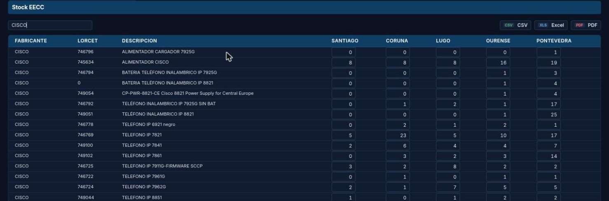
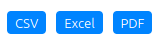

# Manual de Usuario: Módulo Stock

| Campo       | Valor                              |
|-------------|------------------------------------|
| **Módulo**  | Stock                              |
| **Versión** | 1.6                                |
| **Fecha**   | Abril 2026                         |
| **Para**    | Operadores CGE SERGAS              |

---

## Índice

1. [Para qué sirve este módulo](#1-para-qué-sirve-este-módulo)
2. [Cómo accedemos al módulo](#2-cómo-accedemos-al-módulo)
3. [Stock EECC](#3-stock-eecc)
4. [Stock Almacén](#4-stock-almacén)
5. [Consejos de uso](#5-consejos-de-uso)

---

## 1. Para qué sirve este módulo

El módulo **Stock** nos permite gestionar el inventario de material de red del CGE. Tiene dos vistas:

- **Stock EECC**: equipos en empresas colaboradoras, repartidos por delegación.
- **Stock Almacén**: inventario del almacén central.

Las cantidades son **editables directamente en la tabla** y los cambios se guardan **automáticamente** sin pulsar ningún botón.

---

## 2. Cómo accedemos al módulo

1. Abrimos la **Web BDU** en el navegador.
2. En la barra superior pulsamos **Stock**.
3. Vemos los dos botones de navegación:
   - **Stock EECC**.
   - **Stock Almacén**.
4. Pulsamos el botón de la vista que necesitemos.

> **Atajo:** también podemos llegar directamente con `?m=stock&s=stock_eecc` o `?m=stock&s=stock_almacen` añadidos al final de la URL.

---

## 3. Stock EECC

### 3.1. Ver la tabla de stock

La tabla muestra todos los equipos con las siguientes columnas:

| Columna       | Descripción                                | Editable |
|---------------|--------------------------------------------|----------|
| Fabricante    | Fabricante del equipo.                     | No       |
| LORCET        | Código LORCET del equipo.                  | No       |
| Descripción   | Descripción del equipo.                    | No       |
| Santiago      | Cantidad en la delegación de Santiago.     | **Sí**   |
| Coruña        | Cantidad en la delegación de Coruña.       | **Sí**   |
| Lugo          | Cantidad en la delegación de Lugo.         | **Sí**   |
| Ourense       | Cantidad en la delegación de Ourense.      | **Sí**   |
| Pontevedra    | Cantidad en la delegación de Pontevedra.   | **Sí**   |

### 3.2. Buscar equipos

1. Usamos el **campo de búsqueda** en la barra superior.
2. Escribimos cualquier texto (fabricante, descripción, LORCET, etc.).
3. La tabla se filtra en **tiempo real** mientras escribimos, mostrando solo las filas que coinciden.

### 3.3. Modificar cantidades

1. Localizamos el equipo en la tabla.
2. Pulsamos sobre el **campo numérico** de la delegación que queramos modificar.
3. Escribimos el **nuevo valor**.
4. Pulsamos fuera del campo o pasamos al siguiente con **Tab**.
5. El cambio se **guarda automáticamente** en la base de datos.

> **Nota:** no hay botón de guardar. Los cambios se envían automáticamente al modificar el valor (al perder el foco del campo).

### 3.4. Exportar stock

En la barra superior tenemos botones para exportar la tabla:

| Formato   | Descripción                                                |
|-----------|------------------------------------------------------------|
| **CSV**   | Fichero de texto separado por comas (abrir con Excel).     |
| **Excel** | Fichero `.xlsx` nativo de Excel.                           |
| **PDF**   | Documento PDF en formato apaisado (A4 landscape).          |

1. Pulsamos el botón del formato deseado.
2. Se descarga automáticamente el fichero con todos los datos de la tabla.

---

## 4. Stock Almacén

La vista de Stock Almacén funciona de forma similar a Stock EECC:

- Muestra los equipos del **almacén central**.
- Los campos **Cantidad** y **Stock Mínimo** son editables inline.
- Los cambios se guardan automáticamente.

> **Nota:** esta vista está actualmente **en desarrollo**. Si al pulsar **Stock Almacén** no aparece contenido, consultamos con el equipo técnico.

---

## 5. Consejos de uso

- **Para actualizar stock rápidamente**: usamos **Tab** para saltar de un campo numérico al siguiente sin necesidad de usar el ratón.
- **Para buscar un equipo concreto**: escribimos parte del nombre del fabricante o la descripción en el buscador.
- **Para tener una copia de seguridad**: exportamos a Excel **antes** de hacer cambios importantes.

---

*Manual para operadores CGE SERGAS. Versión 1.6 — Abril 2026.*
