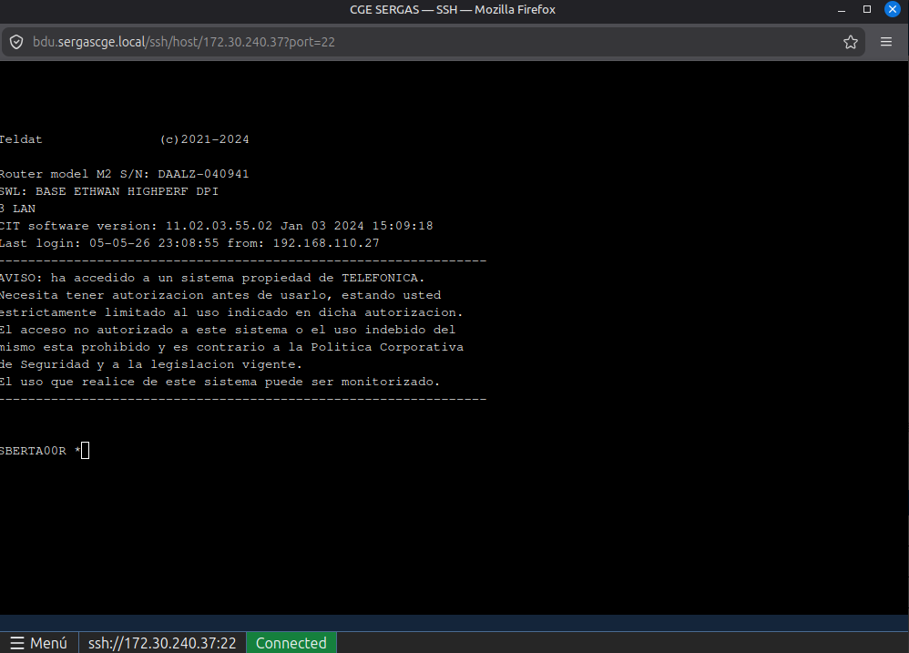
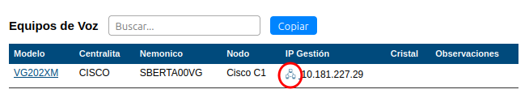
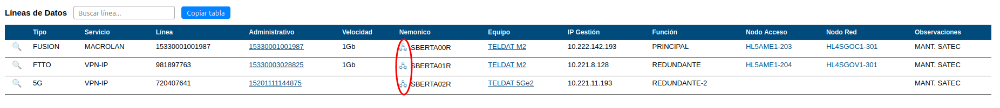
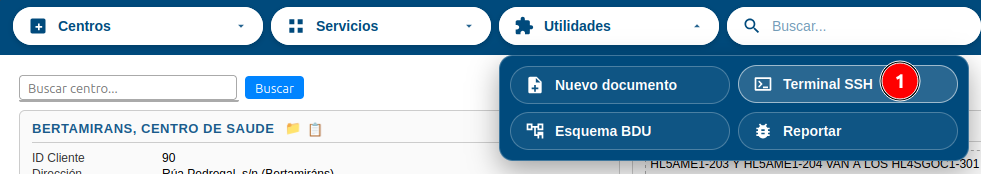

# Manual de Usuario: Terminal SSH web

| Campo       | Valor                          |
|-------------|--------------------------------|
| **Funcionalidad** | Terminal SSH web (webssh2)  |
| **Versión** | 1.0                            |
| **Fecha**   | Mayo 2026                      |
| **Para**    | Operadores CGE SERGAS          |

---

## Índice

1. [Qué es la terminal SSH web](#1-qué-es-la-terminal-ssh-web)
2. [Cómo accedemos](#2-cómo-accedemos)
3. [Conectar a un equipo desde Centros](#3-conectar-a-un-equipo-desde-centros)
4. [Conectar a cualquier equipo desde la cabecera](#4-conectar-a-cualquier-equipo-desde-la-cabecera)
5. [Trabajar dentro de la terminal](#5-trabajar-dentro-de-la-terminal)
6. [Cerrar la sesión SSH](#6-cerrar-la-sesión-ssh)
7. [Preguntas frecuentes](#7-preguntas-frecuentes)

---

## 1. Qué es la terminal SSH web

La terminal SSH web nos permite conectar por SSH a cualquier equipo de la red interna SERGAS **desde el propio navegador**, sin tener que abrir PuTTY ni preparar túneles. Sustituye al antiguo lanzador `bdussh://` que requería un script en el ordenador del operador y solo funcionaba en Windows.

Ventajas:

- Funciona en **cualquier navegador** (Linux, Mac, Windows).
- No hace falta tener PuTTY ni configurar nada en el ordenador.
- No hace falta tener una "pasarela" abierta en otra ventana.
- Cada sesión queda registrada con el usuario CGE que la abre.

---

## 2. Cómo accedemos

Hay dos puntos de entrada a la terminal SSH:

- **Desde el módulo Centros**: pulsando el icono 🖧 que aparece junto a un equipo (lo más común — el host destino se rellena automáticamente).
- **Desde la cabecera global**: pulsando el icono `>_` siempre visible arriba (para conectar a cualquier equipo aunque no esté en la BDU, o para entrar rápido sin pasar por Centros).

Las dos opciones abren un **popup nuevo** con la pantalla de conexión SSH del CGE SERGAS.

---

## 3. Conectar a un equipo desde Centros

Esta es la forma más rápida cuando ya estamos consultando un centro.

### 3.1. Equipos de Voz

1. Entramos a **Centros** y buscamos el centro que queremos.
2. En la ficha del centro pulsamos la pestaña **Equipos de Voz**.
3. Cada equipo con IP de gestión muestra un icono 🖧 a la izquierda de la IP.
4. Pulsamos el icono.
5. Se abre el popup de conexión con el host **ya prerellenado**.
6. Tecleamos **Usuario** y **Contraseña** del equipo.
7. Pulsamos **Conectar**.

### 3.2. Líneas de Datos

1. En la ficha del centro pulsamos la pestaña **Líneas de Datos**.
2. Cada línea con nemónico de cliente muestra un icono 🖧 a la izquierda del nemónico.
3. Pulsamos el icono.
4. El popup se abre con el equipo prerellenado.
5. Tecleamos credenciales y pulsamos **Conectar**.

> **Nota:** los **Equipos de 2.º nivel** no tienen icono SSH desde la BDU. Solo son alcanzables a través de la pasarela del CGE con TOTP, y la terminal web no soporta ese flujo. Para esos equipos seguimos usando los métodos habituales fuera de BDU.

---

## 4. Conectar a cualquier equipo desde la cabecera

Útil cuando queremos abrir SSH a un equipo que no está en la BDU, o cuando preferimos no entrar a Centros.

1. En la cabecera de BDU (la barra superior de iconos, junto a Nagios/Git/Vaultwarden) pulsamos el icono **`>_`** ("Terminal SSH web").
2. Se abre un popup con el formulario en blanco.
3. Tecleamos manualmente el **Host** (IP del equipo, en formato `10.x.x.x`, `172.16-31.x.x` o `192.168.x.x`).
4. Tecleamos **Usuario** y **Contraseña**.
5. Pulsamos **Conectar**.

> **Importante:** la terminal web **solo permite IPs internas del SERGAS** (rangos privados RFC1918). No se puede conectar a IPs públicas de internet.

---

## 5. Trabajar dentro de la terminal

Una vez conectados, la terminal web funciona como cualquier cliente SSH:

- **Tecleamos comandos** y pulsamos Enter como en PuTTY.
- **Pegar texto**: usamos `Ctrl+Shift+V` (o el menú Pegar del navegador).
- **Copiar texto**: seleccionamos con el ratón y se copia automáticamente al portapapeles.
- **Redimensionar la ventana**: arrastramos la esquina del popup. La terminal se ajusta automáticamente al tamaño nuevo.
- **Texto en colores y caracteres especiales** (acentos, ñ, símbolos de cisco/teldat) se muestran correctamente.

La sesión SSH se mantiene viva mientras el popup esté abierto y haya tráfico. Si dejamos la ventana inactiva mucho tiempo, el equipo destino puede cerrar la conexión por inactividad (depende de la configuración del propio equipo, no de BDU).

---

## 6. Cerrar la sesión SSH

Tres formas de cerrar la sesión:

1. Tecleamos **`exit`** dentro de la terminal y pulsamos Enter (recomendado: cierra limpiamente la sesión SSH en el equipo).
2. Cerramos el popup pulsando la **❌** del navegador.
3. Cerramos toda la pestaña/ventana de BDU (cierra todas las terminales abiertas a la vez).

> **Buenas prácticas:** al terminar el trabajo, cerrar la sesión con `exit`. Así el equipo destino libera recursos inmediatamente.

---

## 7. Preguntas frecuentes

### ¿Por qué me pide credenciales cada vez que abro un equipo, aunque haya conectado al mismo hace un momento?

Por seguridad. Cada apertura del terminal arranca con el formulario vacío y las credenciales nunca se quedan guardadas en el navegador. Esto evita que las credenciales de un equipo de Datos se prueben sin querer contra un equipo de Voz (que tiene credenciales distintas) y se acumulen intentos fallidos en el equipo real.

### ¿Por qué me dice "host not allowed" o similar al teclear una IP pública?

La terminal web solo está autorizada a conectar a IPs internas de la red SERGAS (rangos `10.0.0.0/8`, `172.16.0.0/12`, `192.168.0.0/16`). No se puede usar como cliente SSH a internet abierto. Si necesitamos conectar a un host externo, hay que usar otros medios.

### ¿Por qué el icono SSH no aparece para los Equipos de 2.º Nivel?

Los Equipos de 2.º Nivel solo son alcanzables a través de la pasarela del CGE que requiere TOTP. La terminal web actual no enruta por esa pasarela. Para conectar a esos equipos seguimos usando los procedimientos habituales fuera de BDU.

### ¿Qué pasa si cierro la pestaña principal de BDU mientras tengo terminales SSH abiertas?

Los popups de SSH se cierran también, porque dependen del navegador. Antes de cerrar BDU, conviene teclear `exit` en cada terminal o cerrar los popups uno a uno.

### Me aparece "Disconnected: connect_error" justo al pulsar Conectar.

Si pasa de forma persistente, hay un fallo de configuración en el servidor BDU (probablemente el módulo Apache de WebSocket no está activo). Reportamos el problema con el botón de feedback (insecto) en la cabecera de BDU.

---

*Manual generado en mayo 2026. Versión 1.0 de la terminal SSH web.*
