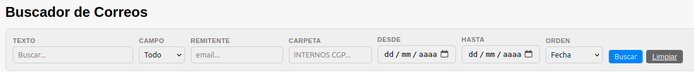
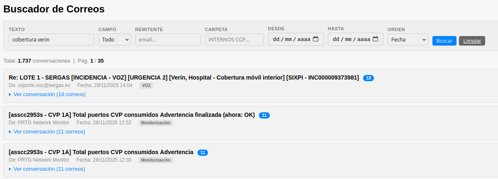
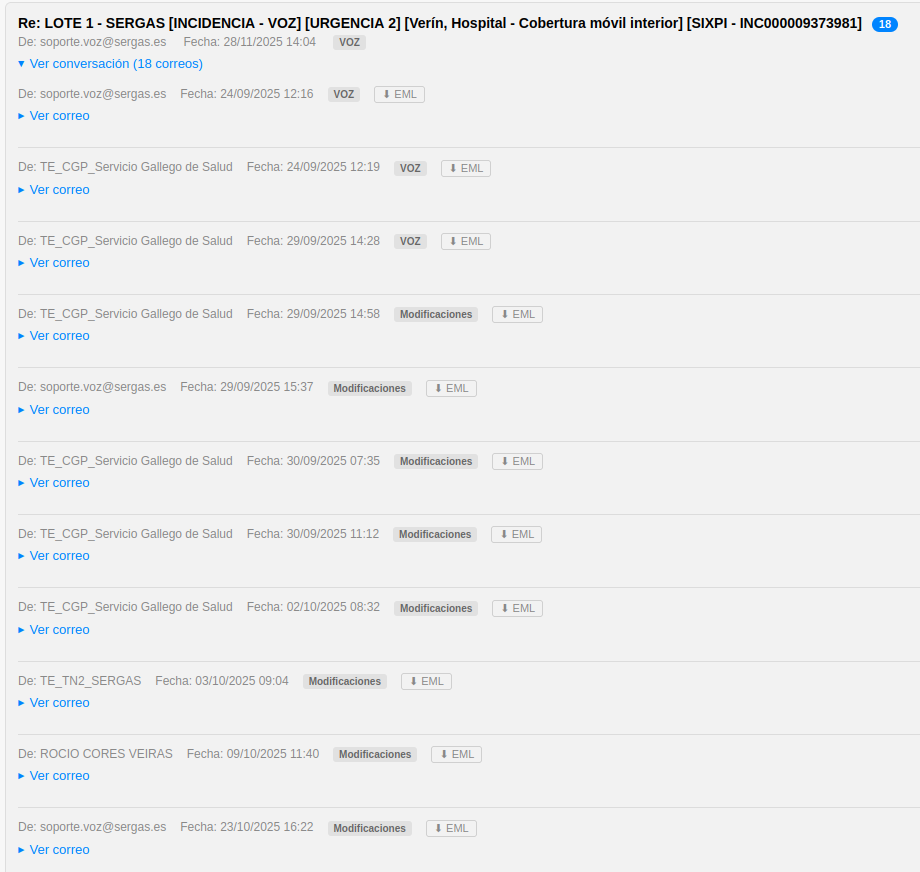
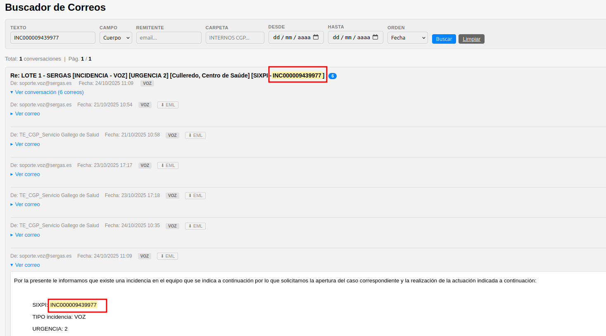
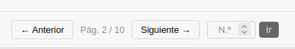

# Manual de Usuario: Módulo Visor de Correos

| Campo       | Valor                              |
|-------------|------------------------------------|
| **Módulo**  | Visor de Correos (MailViewer)      |
| **Versión** | 2.1                                |
| **Fecha**   | Abril 2026                         |
| **Para**    | Operadores CGE SERGAS              |

---

## Índice

1. [Para qué sirve este módulo](#1-para-qué-sirve-este-módulo)
2. [Buscar correos](#2-buscar-correos)
3. [Ver conversaciones](#3-ver-conversaciones)
4. [Ver el cuerpo de un correo](#4-ver-el-cuerpo-de-un-correo)
5. [Descargar correos como fichero .eml](#5-descargar-correos-como-fichero-eml)
6. [Navegación por páginas](#6-navegación-por-páginas)
7. [Consejos de uso](#7-consejos-de-uso)

---

## 1. Para qué sirve este módulo

El **Visor de Correos** nos permite buscar y consultar los correos electrónicos almacenados en el sistema. Los correos se agrupan automáticamente por **conversación** (mismo asunto) para facilitar el seguimiento de hilos. Podemos buscar por texto, remitente, carpeta y rango de fechas, y descargar correos como fichero `.eml`.

---

## 2. Buscar correos

Al entrar en el Visor de Correos vemos un formulario de búsqueda con los siguientes campos:

| Campo         | Descripción                                                      |
|---------------|------------------------------------------------------------------|
| **Texto**     | Texto libre a buscar en los correos.                             |
| **Campo**     | Dónde buscar: Todo, Asunto o Cuerpo.                             |
| **Remitente** | Filtrar por dirección del remitente.                             |
| **Carpeta**   | Filtrar por carpeta del buzón.                                   |
| **Desde**     | Fecha de inicio del rango.                                       |
| **Hasta**     | Fecha de fin del rango.                                          |
| **Orden**     | Ordenar por: Fecha, Remitente o Asunto.                          |

### 2.1. Realizar una búsqueda

1. Rellenamos los campos que necesitemos (no es obligatorio rellenar todos).
2. Pulsamos **Buscar**.
3. Se muestran los resultados agrupados por conversación.

### 2.2. Limpiar filtros

Pulsamos **Limpiar** para borrar todos los campos y volver al estado inicial.

> **Nota:** sin filtros se muestran los **500 correos más recientes**. Con filtros se pueden mostrar hasta 10.000 resultados.

---

## 3. Ver conversaciones

Los resultados se muestran como una lista de conversaciones. Cada conversación muestra:

- **Asunto** del correo (con las palabras buscadas resaltadas en amarillo).
- **Badge** con el número de correos en la conversación (si hay más de uno).
- **Remitente**, **fecha** y **carpeta**.
- Enlace para **descargar** el correo en formato EML.

### 3.1. Ver un hilo de conversación

Si una conversación tiene **varios correos** (badge con número > 1):

1. Pulsamos **"Ver conversación (N correos)"**.
2. Se despliega la lista con todos los correos del hilo, ordenados cronológicamente.
3. Para cada correo vemos: remitente, fecha, carpeta y enlace EML.
4. Pulsamos de nuevo el título para cerrar el hilo.

---

## 4. Ver el cuerpo de un correo

### 4.1. Correo individual (un solo correo en la conversación)

1. Pulsamos **"Ver correo"**.
2. Se despliega el cuerpo del correo directamente.

### 4.2. Correo dentro de un hilo

1. Expandimos la conversación.
2. En cada correo del hilo pulsamos **"Ver correo"**.
3. Se carga el cuerpo de ese correo individual.
4. Si el término de búsqueda está presente, aparece **resaltado en amarillo**.

> **Nota:** los cuerpos de los correos se cargan bajo demanda para optimizar la velocidad. La primera vez puede tardar un momento.

---

## 5. Descargar correos como fichero .eml

1. Junto a cada correo vemos un enlace **EML** (icono o texto).
2. Pulsamos sobre él.
3. Se descarga un fichero `.eml` con el correo completo.
4. Podemos abrir el fichero `.eml` con Outlook u otro cliente de correo.

---

## 6. Navegación por páginas

- Los resultados se paginan de **50 conversaciones por página**.
- En la parte inferior vemos:
  - Botones **Anterior** y **Siguiente**.
  - Información de la página actual.
  - Un campo para **ir directamente** a un número de página concreto.

---

## 7. Consejos de uso

- **Para buscar un correo concreto:** usamos el campo *Texto* + Campo *Asunto* para afinar la búsqueda.
- **Para ver todos los correos de una persona:** usamos el campo *Remitente*.
- **Para acotar por fechas:** rellenamos *Desde* y *Hasta*.
- **Si hay demasiados resultados** (más de 10.000), el sistema avisa. Añadimos más filtros para acotar.

---

*Manual para operadores CGE SERGAS. Versión 2.1 — Junio 2026.*
