# Manual de Usuario: Módulo Provisión

| Campo       | Valor                          |
|-------------|--------------------------------|
| **Módulo**  | Provisión                      |
| **Versión** | 2.1                            |
| **Fecha**   | Junio 2026                     |
| **Para**    | Operadores CGE SERGAS          |

---

## Índice

1. [Acceder al módulo Provisión](#1-acceder-al-módulo-provisión)
2. [Menú de opciones](#2-menú-de-opciones)
3. [Alta de centro](#3-alta-de-centro)
4. [Alta de línea de datos](#4-alta-de-línea-de-datos)
5. [Alta de línea de voz](#5-alta-de-línea-de-voz)
6. [Alta de equipo de voz](#6-alta-de-equipo-de-voz)
7. [Alta de equipo de 2.º nivel](#7-alta-de-equipo-de-2º-nivel)
8. [Modificaciones](#8-modificaciones)
9. [Bajas](#9-bajas)
10. [Registro de acciones](#10-registro-de-acciones)

---

## 1. Acceder al módulo Provisión

El módulo Provisión requiere una **contraseña adicional** además de la sesión normal de BDU.

1. Abrimos la **Web BDU** en el navegador.
2. En el menú lateral pulsamos **Provisión**.
3. Aparece una pantalla de login.
4. Introducimos la contraseña de Provisión y pulsamos **Entrar**.
5. Si es correcta, accedemos al menú principal.

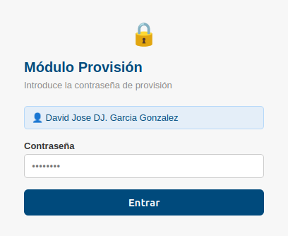

> **Atención:** si introducimos la contraseña incorrecta **3 veces seguidas**, el acceso queda **bloqueado durante 5 minutos**.

Para **cerrar sesión** de Provisión pulsamos el botón de logout en la parte superior.

---

## 2. Menú de opciones

Una vez dentro vemos un menú con tarjetas para cada opción disponible:

| Opción                    | Descripción                                                           |
|---------------------------|------------------------------------------------------------------------|
| **Alta centro**           | Dar de alta un centro nuevo.                                          |
| **Alta línea datos**      | Dar de alta una línea de datos (con o sin equipo asociado).           |
| **Alta línea voz**        | Dar de alta una línea de voz.                                         |
| **Alta equipo voz**       | Dar de alta un equipo de voz.                                         |
| **Alta equipo 2.º nivel** | Dar de alta un EDC de segundo nivel.                                  |
| **Modificaciones**        | Buscar y modificar registros existentes / añadir equipo a una línea.  |
| **Bajas**                 | Dar de baja elementos individuales o cerrar un centro completo.       |
| **Registro de acciones**  | Ver el historial de operaciones realizadas.                           |

Pulsamos la tarjeta que necesitemos. También podemos usar la **barra de pestañas** en la parte superior para cambiar entre opciones sin volver al menú.

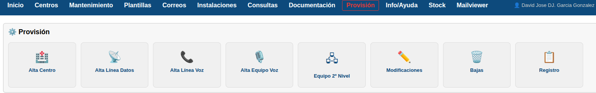

---

## 3. Alta de centro

1. Pulsamos **Alta centro**.
2. Rellenamos el formulario con los datos del nuevo centro.

### 3.1. Datos básicos (columna izquierda)

| Campo              | Descripción                                       | Obligatorio |
|--------------------|---------------------------------------------------|-------------|
| **Nombre**         | Nombre del centro (se convierte a mayúsculas).    | Sí          |
| **Dirección**      | Dirección postal.                                 | No          |
| **Código Postal**  | 5 dígitos.                                        | No          |
| **Población**      | Nombre de la población.                           | No          |
| **Provincia**      | A Coruña, Lugo, Ourense o Pontevedra.             | No          |
| **Horario Centro** | Horario del centro (máx. 15 caracteres).          | No          |
| **Centralita**     | CISCO u OXE.                                      | No          |
| **ID Cliente**     | Código de cliente (máx. 8 dígitos).               | No          |

### 3.2. RAI y Módulos (columna izquierda)

| Campo          | Formato     |
|----------------|-------------|
| RAI CISCO      | 8 dígitos   |
| Módulo CISCO   | 4 dígitos   |
| RAI OXE        | 8 dígitos   |
| Módulo OXE     | 4 dígitos   |
| RAI NGN        | 8 dígitos   |
| Módulo NGN     | 4 dígitos   |

### 3.3. Configuración (columna derecha)

| Campo                  | Descripción                                            |
|------------------------|--------------------------------------------------------|
| **Horario**            | Tipo de horario (seleccionar de la lista).             |
| **Tipo de Sede**       | Clasificación de la sede (seleccionar de la lista).    |
| **Switch**             | Fabricante del switch (seleccionar de la lista).       |
| **Coordenadas**        | Latitud y longitud (opcionales).                       |
| **Crítica**            | Marcar si es sede crítica.                             |
| **FlexWAN**            | Marcar si tiene FlexWAN.                               |

### 3.4. Datos del tensiómetro (DCT)

| Campo          | Descripción                          |
|----------------|--------------------------------------|
| **DCT**        | Marcar si tiene tensiómetro.         |
| **Extensión**  | 6 dígitos.                           |
| **ICC**        | Hasta 30 dígitos.                    |
| **N. Largo**   | 9 dígitos.                           |

### 3.5. Comentarios

Campo de texto libre para observaciones del centro.

### 3.6. Guardar

1. Revisamos todos los datos.
2. Pulsamos **Guardar**.
3. El sistema pide **confirmación** antes de guardar.
4. Si todo es correcto, vemos un mensaje de éxito con el nombre y el ID del nuevo centro.

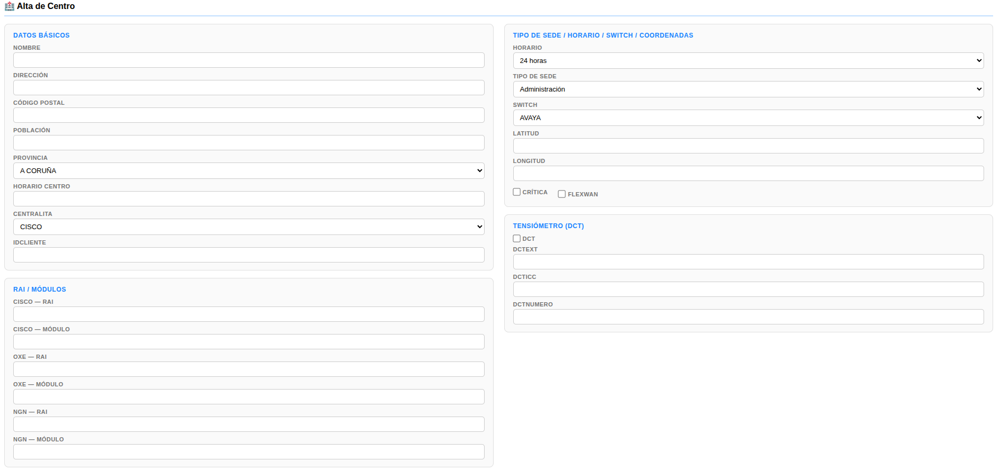

> **Nota:** si intentamos dar de alta un centro con un **Nombre** o un **ID Cliente** que ya existe, el sistema muestra un error de duplicado.

---

## 4. Alta de línea de datos

1. Pulsamos **Alta línea datos**.
2. Lo primero que elegimos es si la línea tendrá equipo asociado:
   - **Sin equipo** — solo se crea la línea.
   - **Con equipo** — se crea la línea **y** un equipo de datos en una misma operación.

### 4.1. Datos de la línea

| Campo              | Descripción                                            | Obligatorio |
|--------------------|--------------------------------------------------------|-------------|
| **Centro**         | Buscar y seleccionar el centro (autocompletado).       | Sí          |
| **Tipo de línea**  | Seleccionar de la lista.                               | Sí          |
| **Administrativo** | Número administrativo (máx. 14 dígitos).               | No          |
| **Número línea**   | Número de la línea (máx. 14 dígitos).                  | No          |
| **VRF**            | Seleccionar de la lista.                               | No          |
| **Observaciones**  | Texto libre.                                           | No          |
| **OLT**            | Nombre del OLT.                                        | No          |
| **Nodo N1 / N2**   | Nodos de acceso y red con interfaces e IPs.            | No          |
| **Tipo acceso**    | Seleccionar de la lista.                               | No          |
| **Función**        | Principal, Redundante, etc. (seleccionar).             | No          |
| **Velocidad**      | Seleccionar de la lista.                               | No          |
| **Servicio**       | Seleccionar de la lista.                               | No          |

### 4.2. Datos del equipo (solo si elegimos "Con equipo")

Al seleccionar **Con equipo** aparecen campos adicionales:

| Campo                    | Descripción                                            | Obligatorio |
|--------------------------|--------------------------------------------------------|-------------|
| **Nemónico Telefónica**  | Nombre del equipo en Telefónica (mayúsculas).          | Sí          |
| **Nemónico Cliente**     | Nombre del equipo en cliente (mayúsculas).             | Sí          |
| **IP Gestión Telefónica**| IP de gestión de Telefónica.                           | No          |
| **IP Gestión Cliente**   | IP de gestión del cliente.                             | No          |
| **Red WAN**              | Formato `IP/máscara` (ej. `10.0.0.0/30`).              | No          |
| **Routing WAN**          | BGP o RIP.                                             | No          |
| **Número de Serie**      | Número de serie del equipo.                            | No          |
| **Gestionable**          | Marcar si el equipo es gestionable.                    | No          |
| **Routing LAN**          | BGP, OSPF o RIP.                                       | No          |
| **Modelo**               | Seleccionar modelo del catálogo.                       | Sí          |

### 4.3. VLANs

Para cada VLAN disponible, marcamos la casilla para activarla y escribimos la red LAN asociada:

| VLAN | Nombre        | Campo de red           |
|------|---------------|------------------------|
| 10   | Datos         | Red LAN Datos          |
| 12   | Voz           | Red LAN Voz            |
| 37   | RFID          | Red LAN RFID           |
| 39   | MESI          | Red LAN MESI           |
| 38   | Electro       | Red LAN Electro        |
| 40   | Retinómetro   | Red LAN Retinómetro    |
| 60   | Ecógrafo      | Red LAN Ecógrafo       |

Marcamos la casilla de la VLAN para habilitar el campo de red.

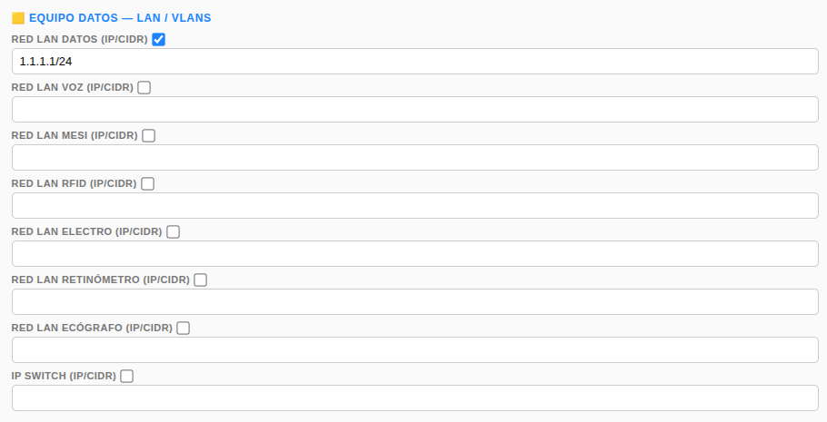

### 4.4. Switch Cliente

- Marcamos la casilla **Switch Cliente** si el centro tiene un switch del cliente.
- Introducimos la **IP del switch** en el campo habilitado.

### 4.5. Guardar

1. Revisamos los datos y pulsamos **Guardar**.
2. El sistema pide confirmación.
3. Si elegimos *Con equipo*, se crean tanto el equipo como la línea en una **única operación** (transacción).

---

## 5. Alta de línea de voz

1. Pulsamos **Alta línea voz**.
2. Rellenamos el formulario:

| Campo              | Descripción                                       | Obligatorio |
|--------------------|---------------------------------------------------|-------------|
| **Centro**         | Buscar y seleccionar (autocompletado).            | Sí          |
| **Tipo de línea**  | Seleccionar de la lista.                          | Sí          |
| **Administrativo** | Número administrativo (máx. 14 dígitos).          | No          |
| **Número línea**   | Número de la línea (máx. 9 dígitos).              | No          |
| **Servicio**       | Seleccionar de la lista.                          | Sí          |
| **Observaciones**  | Texto libre.                                      | No          |

3. Pulsamos **Guardar** y confirmamos.

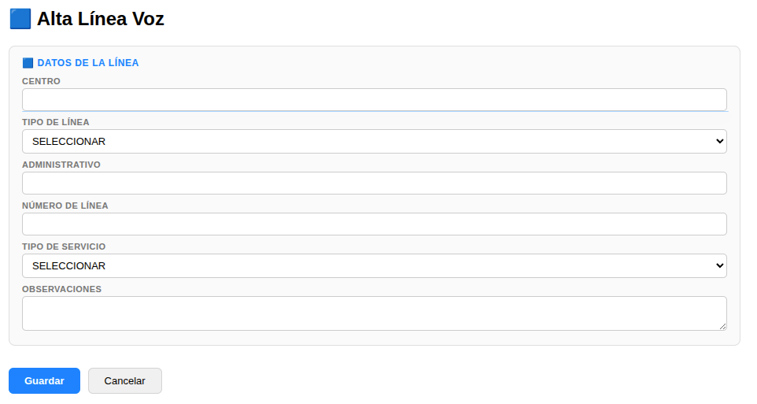

---

## 6. Alta de equipo de voz

1. Pulsamos **Alta equipo voz**.
2. Rellenamos el formulario:

| Campo              | Descripción                                       | Obligatorio |
|--------------------|---------------------------------------------------|-------------|
| **Centro**         | Buscar y seleccionar (autocompletado).            | Sí          |
| **Nemónico**       | Nombre del equipo.                                | Sí          |
| **Centralita**     | Tipo de centralita (seleccionar).                 | Sí          |
| **IP Gestión**     | IP del equipo.                                    | Sí          |
| **Tipo equipo**    | Modelo del equipo (seleccionar del catálogo).     | Sí          |
| **Nodo**           | Tipo de nodo (seleccionar).                       | Sí          |
| **Cristal**        | Información del cristal.                          | No          |
| **Observaciones**  | Texto libre.                                      | No          |

3. Pulsamos **Guardar** y confirmamos.

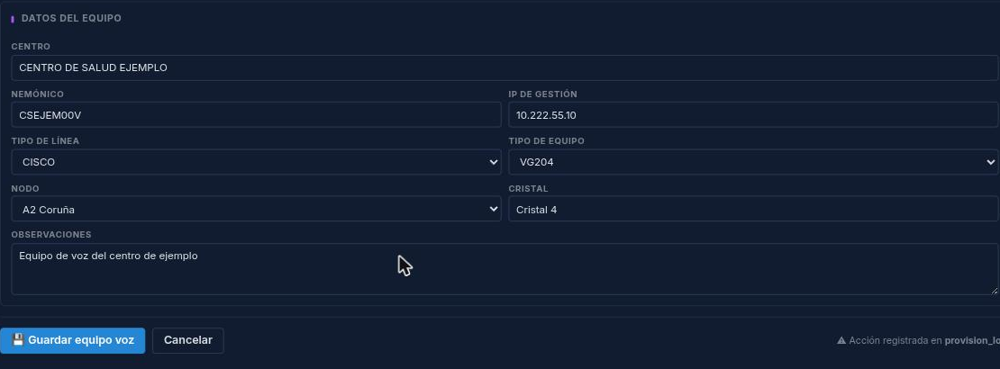

> **Nota:** si el **Nemónico** o la **IP de gestión** ya existen, el sistema muestra un error de duplicado.

---

## 7. Alta de equipo de 2.º nivel

1. Pulsamos **Alta equipo 2.º nivel**.
2. Rellenamos el formulario:

| Campo                          | Descripción                                                | Obligatorio |
|--------------------------------|------------------------------------------------------------|-------------|
| **Centro**                     | Buscar y seleccionar (autocompletado).                     | Sí          |
| **Nemónico Telefónica**        | Nombre del equipo en Telefónica.                           | Sí          |
| **Nemónico Cliente**           | Nombre del equipo en cliente.                              | Sí          |
| **Equipo (modelo)**            | Seleccionar modelo del catálogo.                           | No          |
| **IP Gestión**                 | IP del equipo.                                             | Sí          |
| **Equipo 1.er Nivel**          | Nemónico del equipo principal (con sugerencias).           | No          |
| **Administrativo 1.er Nivel**  | Número administrativo de la línea (con sugerencias).       | No          |
| **Observaciones**              | Texto libre.                                               | No          |

3. Al escribir en **Equipo 1.er Nivel** aparecen sugerencias de equipos existentes.
4. Pulsamos **Guardar** y confirmamos.

---

## 8. Modificaciones

El módulo de Modificaciones permite **buscar cualquier registro** de la base de datos y editar sus campos, además de **añadir un equipo a una línea** existente.

### 8.1. Modificar un registro existente

#### Paso 1 — Seleccionar la tabla

1. Pulsamos **Modificaciones**.
2. Seleccionamos la tabla donde queremos buscar:
   - Centros
   - Líneas de datos
   - Equipos de datos
   - Equipos de voz
   - Equipos de 2.º nivel

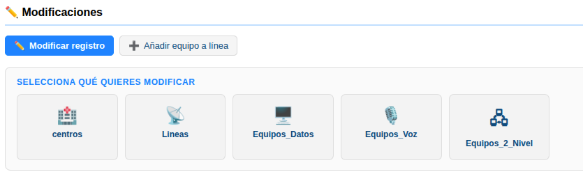

#### Paso 2 — Buscar el registro

1. Escribimos en el campo de búsqueda (mínimo 2 caracteres).
2. Aparecen sugerencias con los registros que coinciden.
3. Pulsamos sobre el registro que buscamos.

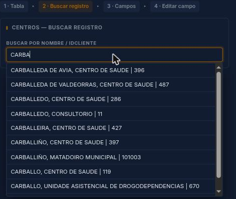

#### Paso 3 — Ver los campos del registro

Vemos una tabla con todos los campos del registro y sus valores actuales. Cada campo tiene un enlace **Editar** a la derecha.

#### Paso 4 — Editar un campo

1. Pulsamos **Editar** junto al campo que queramos modificar.
2. Según el tipo de campo:
   - **Campo de texto** → input para escribir el nuevo valor.
   - **Lista desplegable** → si el campo es una referencia (tipo de línea, modelo, etc.), aparece un desplegable con las opciones.
   - **Casilla** → si el valor actual es 0/1 aparece una casilla de verificación.
   - **Centro** → si el campo es un centro, aparece el buscador con autocompletado.
3. Introducimos el nuevo valor.
4. Pulsamos **Guardar**.
5. El sistema pide confirmación antes de guardar el cambio.

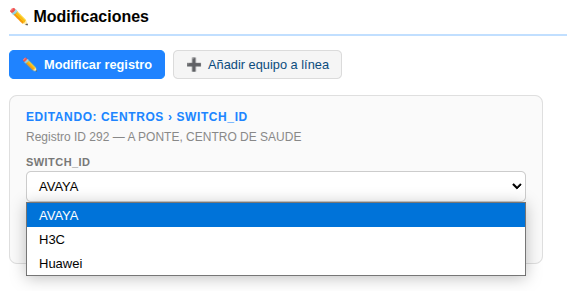

> **Nota:** algunos campos no se pueden editar (ID, estado de baja, cerrado). Esos no muestran el enlace **Editar**.

### 8.2. Añadir equipo a una línea

Esta opción permite asociar un equipo de datos nuevo a una línea **que no tiene equipo**.

1. En Modificaciones, seleccionamos la pestaña **"Añadir equipo a línea"**.
2. Buscamos la línea por número o administrativo.
3. Seleccionamos la línea de las sugerencias.
4. Aparece un formulario con los campos del equipo (idéntico al de alta de línea con equipo).
5. Rellenamos los datos del equipo: nemónicos, IPs, modelo, VLANs, etc.
6. Pulsamos **Guardar** y confirmamos.

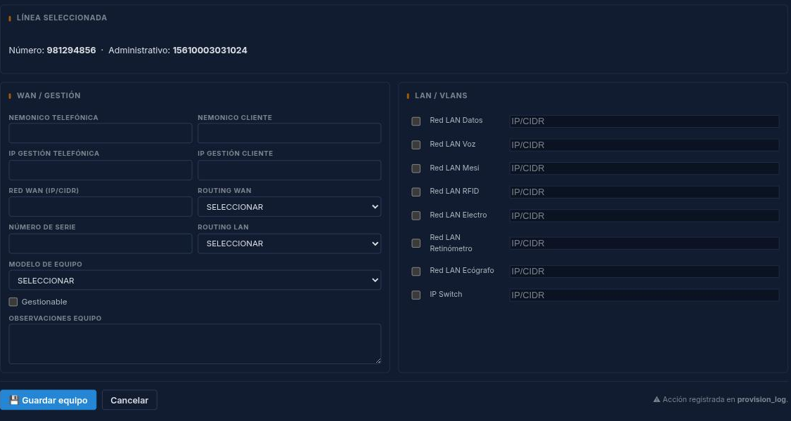

---

## 9. Bajas

### 9.1. Baja individual de un elemento

1. Pulsamos **Bajas**.
2. Buscamos y seleccionamos el centro (autocompletado).
3. Vemos todos los elementos activos del centro agrupados por tipo:
   - Líneas de datos
   - Líneas de voz
   - Equipos de voz
   - Equipos de 2.º nivel
   - Equipos de datos
4. Junto a cada elemento hay un botón **Dar de baja**.
5. Pulsamos **Dar de baja** del elemento que queramos desactivar.
6. El sistema pide confirmación.
7. Tras confirmar, el elemento se marca como dado de baja (no se elimina, solo se desactiva).

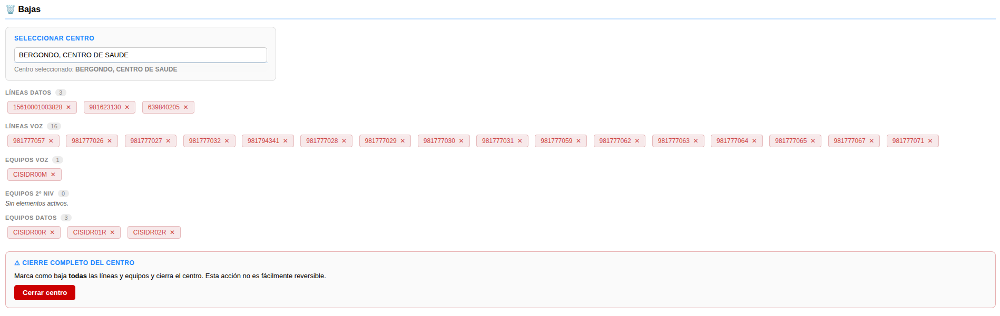

### 9.2. Cerrar un centro completo

Si necesitamos cerrar un centro entero (dar de baja el centro y todos sus elementos):

1. En la vista de bajas del centro buscamos el botón **Cerrar centro** (al final).
2. Pulsamos **Cerrar centro**.
3. El sistema pide **doble confirmación** (es una acción que afecta a todo el centro).
4. Confirmamos las dos veces.
5. Se realiza el cierre completo:
   - El centro se marca como **Cerrado**.
   - Todas las **líneas de datos** se dan de baja.
   - Todas las **líneas de voz** se dan de baja.
   - Todos los **equipos de voz** se dan de baja.
   - Todos los **equipos de 2.º nivel** se dan de baja.
   - Todos los **equipos de datos** se dan de baja.

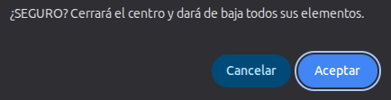

> **Importante:** el cierre completo de un centro es una operación sensible. Nos aseguramos de que realmente queremos cerrar el centro y todos sus elementos antes de confirmar.

> **Nota:** todas las operaciones de baja y cierre quedan registradas en el **Registro de acciones** con el nombre del usuario y la fecha (ver [sección 10](#10-registro-de-acciones)).

---

## 10. Registro de acciones

Toda operación de Provisión (alta, modificación, baja, cierre) queda registrada en `provision_log` con el usuario y la fecha.

1. Pulsamos **Registro de acciones**.
2. Vemos un listado de hasta 500 operaciones, ordenado por fecha descendente.
3. Podemos filtrar por:
   - **Usuario** (selector con los usuarios distintos que han usado Provisión).
   - **Fecha** (input de fecha).
4. Pulsamos **Filtrar** para aplicar los filtros, o **Limpiar filtros** para volver al listado completo.

---

## 11. Resumen rápido

| Acción                            | Cómo hacerlo                                                |
|-----------------------------------|-------------------------------------------------------------|
| Acceder a Provisión               | Contraseña de Provisión.                                    |
| Alta de centro                    | Rellenar formulario + Guardar.                              |
| Alta de línea datos sin equipo    | Seleccionar "Sin equipo" + rellenar + Guardar.              |
| Alta de línea datos con equipo    | Seleccionar "Con equipo" + rellenar línea y equipo.         |
| Activar VLAN                      | Marcar casilla de la VLAN + escribir la red.                |
| Modificar un campo                | Modificaciones → tabla → buscar → Editar campo.             |
| Añadir equipo a línea             | Modificaciones → pestaña "Añadir equipo" → buscar línea.    |
| Baja individual                   | Bajas → centro → botón "Dar de baja" del elemento.          |
| Cerrar centro completo            | Bajas → centro → botón "Cerrar centro" + doble confirmación.|
| Cerrar sesión Provisión           | Botón de logout.                                            |

---

*Manual para operadores CGE SERGAS. Versión 2.1 — Junio 2026.*
